# 3.8.1 Configuración de la base de datos relacional

Inicie sesión en Adobe Journey Optimizer en [https://experience.adobe.com](https://experience.adobe.com). Haga clic en **Journey Optimizer**.

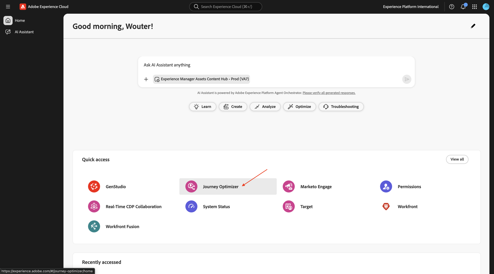

Se le redirigirá a la vista **Inicio** en Journey Optimizer. Primero, asegúrese de que está usando la zona protegida correcta. La zona protegida que se va a usar se llama `--aepSandboxName--`.

## 3.8.1.1 configuración de esquema basado en relaciones

Un esquema basado en relaciones es la definición formal del modelo de datos basado en modelos.

Especifica lo siguiente:

- El conjunto de tablas
- Las columnas de cada tabla
- Las restricciones
- Las relaciones entre tablas

La organización de esquemas o tablas en un modelo de datos basado en modelos consiste en estructurar los datos en varias tablas. Asegúrese de que cada tabla almacene un tipo de entidad/esquemas.

Al ingerir datos en para utilizarlos con Adobe Journey Optimizer Orchestrated Campaigns, están disponibles las siguientes fuentes:

- Amazon S3
- Almacenamiento en la nube de Google
- SFTP
- Snowflake
- Google BigQuery
- Zona de aterrizaje de datos
- Azure Databricks
- Carga de archivo local

El primer paso de este ejercicio es la configuración de los esquemas XDM basados en relaciones. En el menú de la izquierda, desplácese hacia abajo hasta **Administración de datos** y seleccione **Esquemas**. Haga clic en **+ Crear esquema**.

Seleccione **Relacional**.

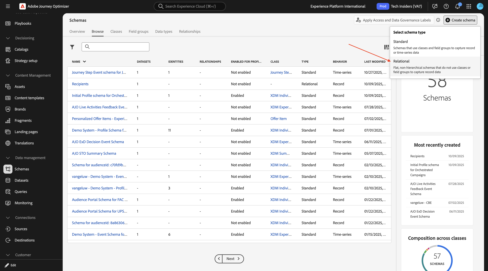

Seleccione **Cargar archivo DDL** y haga clic en **Elegir archivos**.

Descargue el archivo [citisignal_ddl_tables_only.sql](./assets/citisignal_ddl_tables_only.sql) en su escritorio.

Seleccione el archivo **`citisignal_ddl_tables_only.sql`** y haga clic en **abrir**.

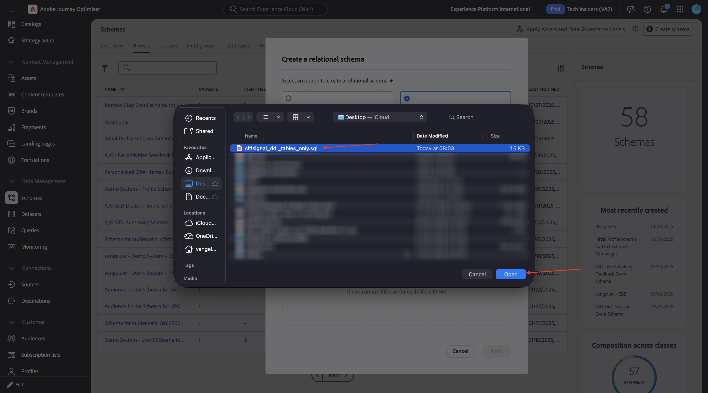

Entonces debería ver esto. Haga clic en **Next**.

### Identidad

Algunos de los esquemas contienen identificadores personales y esos campos deben marcarse como **Identidad**, y debe seleccionar el **Espacio de nombres** que se aplica a ese tipo de identidad específico.

**`citisignal_accounts`**

Para este esquema, vaya al campo **account_id** y establezca el tipo de **identidad** en **Sistema de demostración - CRMID**.

**`citisignal_recipients`**

Para este esquema, vaya al campo **account_id** y establezca el tipo de **Identidad** en **Sistema de demostración - CRMID**; luego vaya al campo **correo electrónico** y establezca el tipo de **Identidad** en **Correo electrónico**.

### Versiones

Para realizar un seguimiento de las actualizaciones de los datos que se incorporarán en estos esquemas, se requiere establecer un campo que se utilice para realizar un seguimiento de la versión de los datos cargados. El campo que se usa para esto en todos estos esquemas es el campo **lastmodified**, que contiene una marca de tiempo de los datos cargados.

Ahora necesita marcar la casilla de verificación de **Control de versiones** para el campo **lastmodified** en cada uno de estos esquemas.

**`citisignal_products`**

Marque la casilla de verificación de **versiones** para el campo **última modificación**.

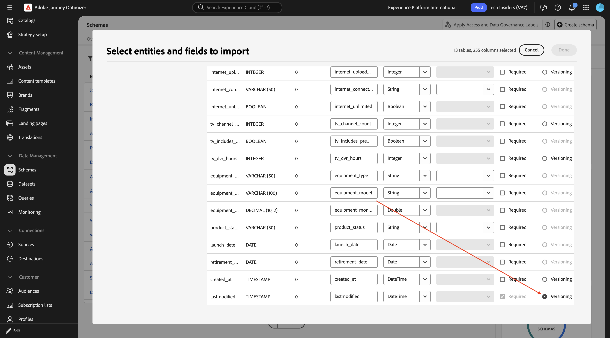

**`citisignal_product_bundles`**

Marque la casilla de verificación de **versiones** para el campo **última modificación**.

**`citisignal_product_relationships`**

Marque la casilla de verificación de **versiones** para el campo **última modificación**.

**`citisignal_accounts`**

Marque la casilla de verificación de **versiones** para el campo **última modificación**.

**`citisignal_recipients`**

Marque la casilla de verificación de **versiones** para el campo **última modificación**.

**`citisignal_mobile_subscriptions`**

Marque la casilla de verificación de **versiones** para el campo **última modificación**.

**`citisignal_internet_subscriptions`**

Marque la casilla de verificación de **versiones** para el campo **última modificación**.

**`citisignal_tv_subscriptions`**

Marque la casilla de verificación de **versiones** para el campo **última modificación**.

**`citisignal_equipment_subscriptions`**

Marque la casilla de verificación de **versiones** para el campo **última modificación**.

**`citisignal_mobile_usage_summary`**

Marque la casilla de verificación de **versiones** para el campo **última modificación**.

**`citisignal_internet_usage_summary`**

Marque la casilla de verificación de **versiones** para el campo **última modificación**.

**`citisignal_offers`**

Marque la casilla de verificación de **versiones** para el campo **última modificación**.

**`citisignal_offer_eligibility`**

Marque la casilla de verificación de **versiones** para el campo **última modificación**.

### Nombre del esquema

Al ingerir estos esquemas con fines de habilitación en una zona protegida compartida, es necesario cambiar el nombre de cada esquema para que sea único en esa zona protegida específica. El motivo para realizar este cambio es evitar conflictos de nomenclatura de esquemas.

Para este laboratorio, debe agregar el LDAP delante de cada nombre de esquema, lo que significa que cada nombre de esquema debe tener este prefijo: `--aepUserLdap--_`

**`citisignal_products`**

Cambie el nombre de su esquema a `--aepUserLdap--_ citisignal_products`.

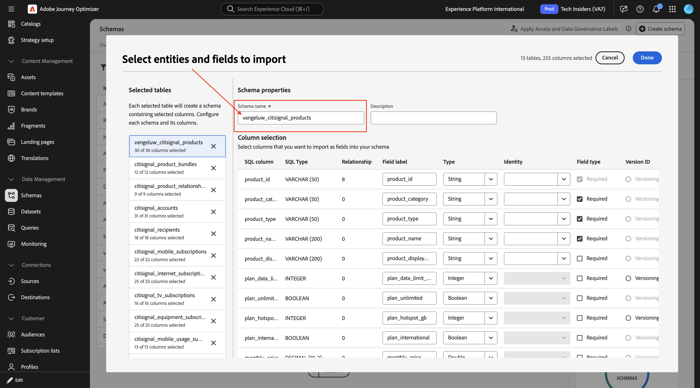

**`citisignal_product_bundles`**

Cambie el nombre de su esquema a `--aepUserLdap--_ citisignal_product_bundles`.

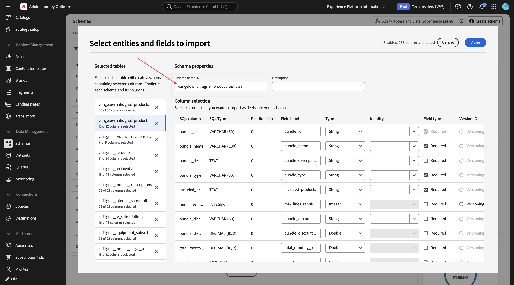

**`citisignal_product_relationships`**

Cambie el nombre de su esquema a `--aepUserLdap--_ citisignal_product_relationships`.

**`citisignal_accounts`**

Cambie el nombre de su esquema a `--aepUserLdap--_ citisignal_accounts`.

**`citisignal_recipients`**

Cambie el nombre de su esquema a `--aepUserLdap--_ citisignal_recipients`.

**`citisignal_mobile_subscriptions`**

Cambie el nombre de su esquema a `--aepUserLdap--_ citisignal_mobile_subscriptions`.

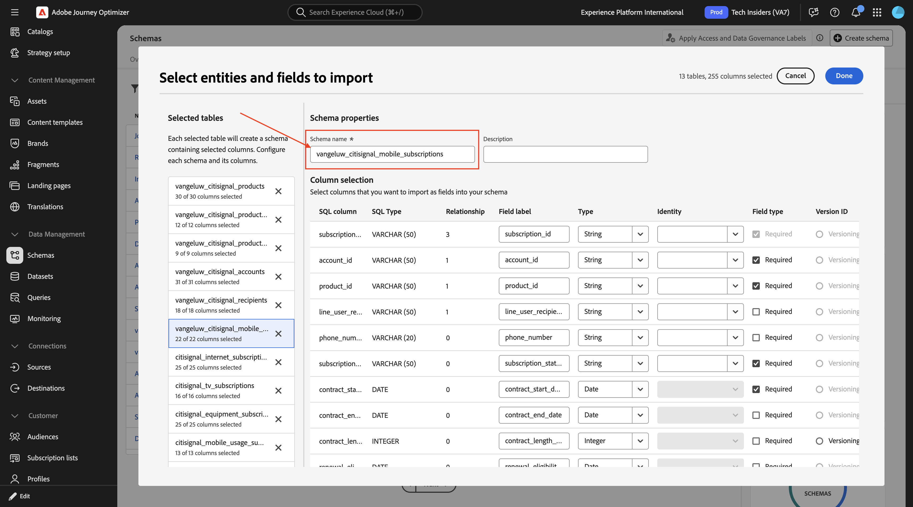

**`citisignal_internet_subscriptions`**

Cambie el nombre de su esquema a `--aepUserLdap--_ citisignal_internet_subscriptions`.

**`citisignal_tv_subscriptions`**

Cambie el nombre de su esquema a `--aepUserLdap--_ citisignal_internet_subscriptions`.

**`citisignal_equipment_subscriptions`**

Cambie el nombre de su esquema a `--aepUserLdap--_ citisignal_equipment_subscriptions`.

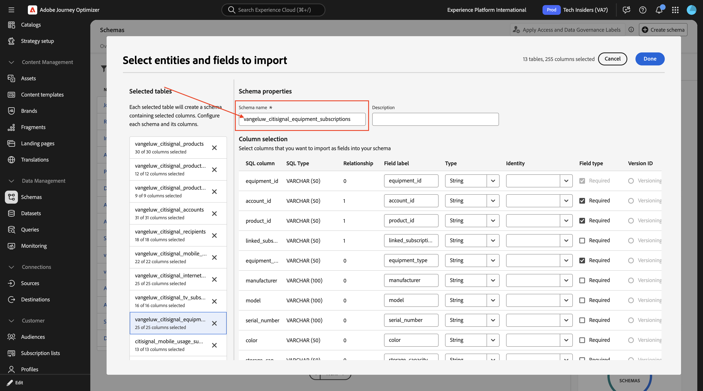

**`citisignal_mobile_usage_summary`**

Cambie el nombre de su esquema a `--aepUserLdap--_ citisignal_mobile_usage_summary`.

**`citisignal_internet_usage_summary`**

Cambie el nombre de su esquema a `--aepUserLdap--_ citisignal_internet_usage_summary`.

**`citisignal_offers`**

Cambie el nombre de su esquema a `--aepUserLdap--_ citisignal_offers`.

**`citisignal_offer_eligibility`**

Cambie el nombre de su esquema a `--aepUserLdap--_ citisignal_offer_eligibility`.

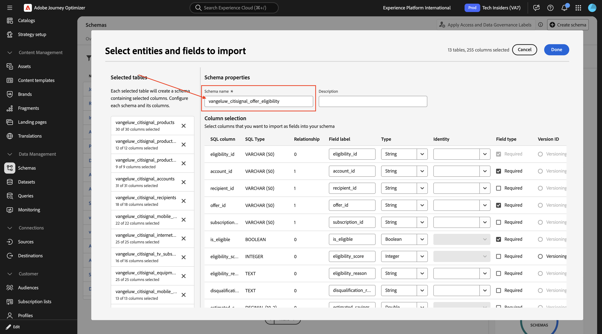

Los esquemas están listos para guardarse. Haga clic en **Finalizado**.

Entonces debería ver esto. Haga clic en **Guardar**.

Haga clic en **Abrir trabajos**.

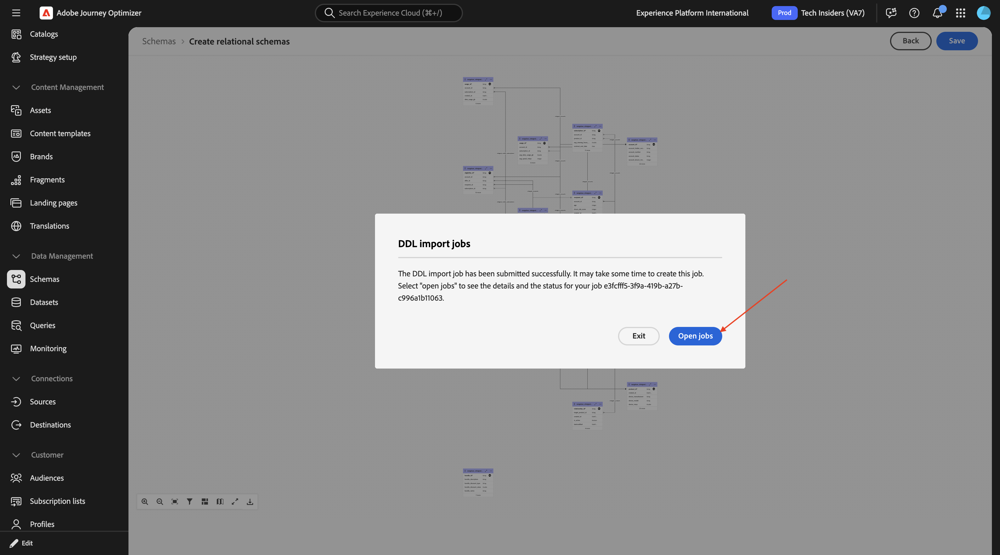

Entonces debería ver esto. Debe esperar hasta que el trabajo se complete correctamente antes de continuar con el siguiente paso.

Una vez que el trabajo se haya completado correctamente, puede continuar con el siguiente paso. Esto puede tardar de 5 a 10 minutos.

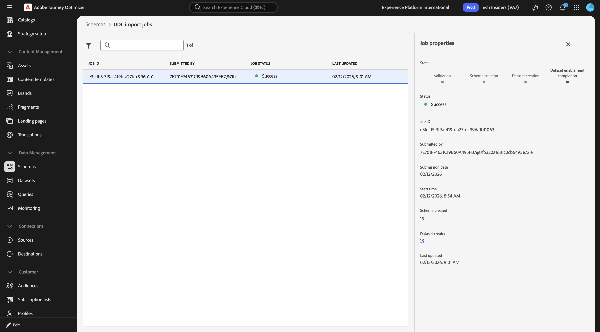

Ahora que los esquemas XDM relacionales están configurados y con los datos que se están ingiriendo, puede empezar a utilizar esos datos para crear la campaña orquestada en el siguiente ejercicio.

## 3.8.1.2 Ingesta de datos

Ir a **Conjuntos de datos**. A continuación, debería ver un conjunto de datos creado para cada esquema que haya creado.

Descargue el archivo [data.zip](./assets/data.zip) en su escritorio y descomprímalo.

Abra la carpeta **data**. Debería ver un archivo CSV para cada uno de los esquemas creados. Ahora debe cargar esos datos en cada conjunto de datos correspondiente. Para este laboratorio, lo hará cargando un archivo local en cada conjunto de datos.

**`vangeluw_citisignal_products`**

Vaya a **Orígenes**, busque `local` y haga clic en **Agregar datos** en **Carga de archivos locales**.

Habilite la opción para **Habilitar la captura de datos modificados**.

Seleccione el conjunto de datos `vangeluw_citisignal_products`.

Haga clic en **Next**.

Haga clic en **Elegir archivos**. Seleccione el archivo **`citisignal_products.csv`** y haga clic en **abrir**.

Haga clic en **Siguiente**

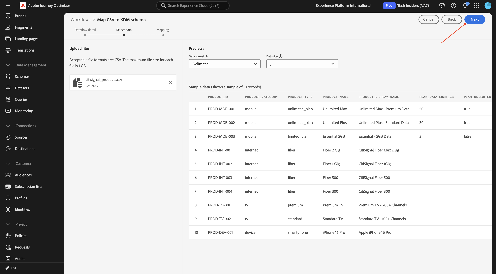

Haga clic en **Finalizar**.

Después de un par de minutos, puede ver los datos que se están ingiriendo en el conjunto de datos.

**`vangeluw_citisignal_product_bundles`**

Vaya a **Orígenes**, busque `local` y haga clic en **Agregar datos** en **Carga de archivos locales**.

Habilite la opción para **Habilitar la captura de datos modificados**.

Seleccione el conjunto de datos `vangeluw_citisignal_product_bundles`.

Haga clic en **Next**.

Haga clic en **Elegir archivos**. Seleccione el archivo **`citisignal_product_bundles.csv`** y haga clic en **abrir**.

Haga clic en **Siguiente**

Haga clic en **Finalizar**.

Después de un par de minutos, puede ver los datos que se están ingiriendo en el conjunto de datos.

**`vangeluw_citisignal_product_relationships`**

Vaya a **Orígenes**, busque `local` y haga clic en **Agregar datos** en **Carga de archivos locales**.

Habilite la opción para **Habilitar la captura de datos modificados**.

Seleccione el conjunto de datos `vangeluw_citisignal_product_relationships`.

Haga clic en **Next**.

Haga clic en **Elegir archivos**. Seleccione el archivo **`citisignal_product_relationships.csv`** y haga clic en **abrir**.

Haga clic en **Siguiente**

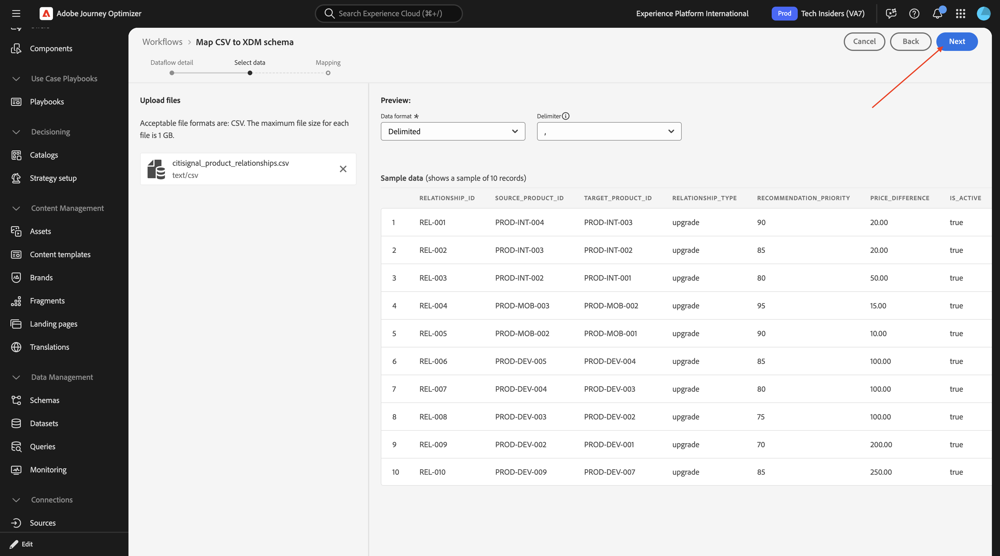

Haga clic en **Finalizar**.

Después de un par de minutos, puede ver los datos que se están ingiriendo en el conjunto de datos.

**`vangeluw_citisignal_accounts`**

Vaya a **Orígenes**, busque `local` y haga clic en **Agregar datos** en **Carga de archivos locales**.

Habilite la opción para **Habilitar la captura de datos modificados**.

Seleccione el conjunto de datos `vangeluw_citisignal_accounts`.

Haga clic en **Next**.

Haga clic en **Elegir archivos**. Seleccione el archivo **`citisignal_accounts.csv`** y haga clic en **abrir**.

Haga clic en **Siguiente**

Haga clic en **Finalizar**.

Después de un par de minutos, puede ver los datos que se están ingiriendo en el conjunto de datos.

**`vangeluw_citisignal_recipients`**

Vaya a **Orígenes**, busque `local` y haga clic en **Agregar datos** en **Carga de archivos locales**.

Habilite la opción para **Habilitar la captura de datos modificados**.

Seleccione el conjunto de datos `vangeluw_citisignal_recipients`.

Haga clic en **Next**.

Haga clic en **Elegir archivos**. Seleccione el archivo **`citisignal_recipients.csv`** y haga clic en **abrir**.

Haga clic en **Siguiente**

Haga clic en **Finalizar**.

Después de un par de minutos, puede ver los datos que se están ingiriendo en el conjunto de datos.

**`vangeluw_citisignal_mobile_subscriptions`**

Vaya a **Orígenes**, busque `local` y haga clic en **Agregar datos** en **Carga de archivos locales**.

Habilite la opción para **Habilitar la captura de datos modificados**.

Seleccione el conjunto de datos `vangeluw_citisignal_mobile_subscriptions`.

Haga clic en **Next**.

Haga clic en **Elegir archivos**. Seleccione el archivo **`citisignal_mobile_subscriptions.csv`** y haga clic en **abrir**.

Haga clic en **Siguiente**

Haga clic en **Finalizar**.

Después de un par de minutos, puede ver los datos que se están ingiriendo en el conjunto de datos.

**`vangeluw_citisignal_internet_subscriptions`**

Vaya a **Orígenes**, busque `local` y haga clic en **Agregar datos** en **Carga de archivos locales**.

Habilite la opción para **Habilitar la captura de datos modificados**.

Seleccione el conjunto de datos `vangeluw_citisignal_internet_subscriptions`.

Haga clic en **Next**.

Haga clic en **Elegir archivos**. Seleccione el archivo **`citisignal_internet_subscriptions.csv`** y haga clic en **abrir**.

Haga clic en **Siguiente**

Haga clic en **Finalizar**.

Después de un par de minutos, puede ver los datos que se están ingiriendo en el conjunto de datos.

**`vangeluw_citisignal_tv_subscriptions`**

Vaya a **Orígenes**, busque `local` y haga clic en **Agregar datos** en **Carga de archivos locales**.

Habilite la opción para **Habilitar la captura de datos modificados**.

Seleccione el conjunto de datos `vangeluw_citisignal_tv_subscriptions`.

Haga clic en **Next**.

Haga clic en **Elegir archivos**. Seleccione el archivo **`citisignal_tv_subscriptions.csv`** y haga clic en **abrir**.

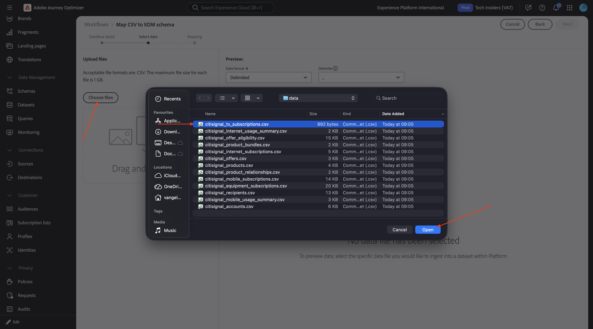

Haga clic en **Siguiente**

Haga clic en **Finalizar**.

Después de un par de minutos, puede ver los datos que se están ingiriendo en el conjunto de datos.

**`vangeluw_citisignal_equipment_subscriptions`**

Vaya a **Orígenes**, busque `local` y haga clic en **Agregar datos** en **Carga de archivos locales**.

Habilite la opción para **Habilitar la captura de datos modificados**.

Seleccione el conjunto de datos `vangeluw_citisignal_equipment_subscriptions`.

Haga clic en **Next**.

Haga clic en **Elegir archivos**. Seleccione el archivo **`citisignal_equipment_subscriptions.csv`** y haga clic en **abrir**.

Haga clic en **Siguiente**

Haga clic en **Finalizar**.

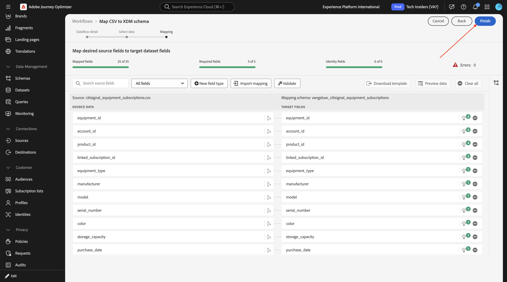

Después de un par de minutos, puede ver los datos que se están ingiriendo en el conjunto de datos.

**`vangeluw_citisignal_mobile_usage_summary`**

Vaya a **Orígenes**, busque `local` y haga clic en **Agregar datos** en **Carga de archivos locales**.

Habilite la opción para **Habilitar la captura de datos modificados**.

Seleccione el conjunto de datos `vangeluw_citisignal_mobile_usage_summary`.

Haga clic en **Next**.

Haga clic en **Elegir archivos**. Seleccione el archivo **`citisignal_mobile_usage_summary.csv`** y haga clic en **abrir**.

Haga clic en **Siguiente**

Haga clic en **Finalizar**.

Después de un par de minutos, puede ver los datos que se están ingiriendo en el conjunto de datos.

**`vangeluw_citisignal_internet_usage_summary`**

Vaya a **Orígenes**, busque `local` y haga clic en **Agregar datos** en **Carga de archivos locales**.

Habilite la opción para **Habilitar la captura de datos modificados**.

Seleccione el conjunto de datos `vangeluw_citisignal_internet_usage_summary`.

Haga clic en **Next**.

Haga clic en **Elegir archivos**. Seleccione el archivo **`citisignal_internet_usage_summary.csv`** y haga clic en **abrir**.

Haga clic en **Siguiente**

Haga clic en **Finalizar**.

Después de un par de minutos, puede ver los datos que se están ingiriendo en el conjunto de datos.

**`vangeluw_citisignal_offers`**

Vaya a **Orígenes**, busque `local` y haga clic en **Agregar datos** en **Carga de archivos locales**.

Habilite la opción para **Habilitar la captura de datos modificados**.

Seleccione el conjunto de datos `vangeluw_citisignal_offers`.

Haga clic en **Next**.

Haga clic en **Elegir archivos**. Seleccione el archivo **`citisignal_offers.csv`** y haga clic en **abrir**.

Haga clic en **Siguiente**

Haga clic en **Finalizar**.

Después de un par de minutos, puede ver los datos que se están ingiriendo en el conjunto de datos.

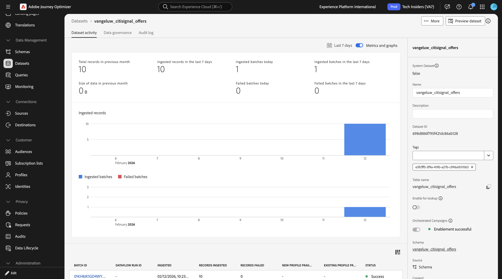

**`vangeluw_citisignal_offer_eligibility`**

Vaya a **Orígenes**, busque `local` y haga clic en **Agregar datos** en **Carga de archivos locales**.

Habilite la opción para **Habilitar la captura de datos modificados**.

Seleccione el conjunto de datos `vangeluw_citisignal_offer_eligibility`.

Haga clic en **Next**.

Haga clic en **Elegir archivos**. Seleccione el archivo **`citisignal_offer_eligibility.csv`** y haga clic en **abrir**.

Haga clic en **Siguiente**

Haga clic en **Finalizar**.

Después de un par de minutos, puede ver los datos que se están ingiriendo en el conjunto de datos.

Ahora se han introducido todos los datos.

## Dimension de destino de perfil 3.8.1.3

Con las campañas orquestadas, puede diseñar y entregar comunicaciones dirigidas en el nivel de entidad, aprovechando las capacidades de esquema relacional de Adobe Experience Platform. Experience Platform utiliza esquemas para describir la estructura de los datos de una manera uniforme y reutilizable. Cuando se incorporan datos en Experience Platform, se estructuran según un esquema XDM.

Aunque la segmentación para Campañas orquestadas funciona principalmente en esquemas relacionales, la entrega de mensajes real siempre se produce en el nivel de Perfil.

Al configurar el direccionamiento, se definen dos aspectos clave:

- Esquemas objetivo: Especifique qué esquemas relacionales son aptos para la segmentación. De forma predeterminada, se utiliza el esquema denominado Recipient, pero puede configurar alternativas como Visitors, Customers, etc.

- Vinculación de perfil: el sistema debe comprender cómo se asigna el esquema de destino al esquema de perfil. Esto se logra a través de un campo de identidad compartido, que existe tanto en el esquema de destinatario como en el esquema de perfil y se configura como un área de nombres de identidad.

Ahora debe configurar las dimensiones de destino del perfil. Vaya a **Administración** > **Configuración** y haga clic en **Administrar** en **Dimension de destino de perfil**.

Entonces debería ver esto. Haga clic en **Crear**.

Para el **esquema**, seleccione `--aepUserLdap--_citisignal_accounts`. Para el **valor de identidad**, seleccione **account_id**.

Haga clic en **Guardar**.

Vuelva a hacer clic en **Crear**.

Para el **esquema**, seleccione `--aepUserLdap--_citisignal_recipients`. Para el **valor de identidad**, seleccione **account_id**.

Haga clic en **Guardar**.

Vuelva a hacer clic en **Crear**.

Para el **esquema**, seleccione `--aepUserLdap--_citisignal_recipients`. Para el **valor de identidad**, seleccione **correo electrónico**.

Haga clic en **Guardar**.

Entonces deberías tener esto.

En el siguiente ejercicio, empezará a utilizar esos datos como parte de una campaña orquestada.

## Pasos siguientes

Vaya a [Crear su campaña orquestada](./ex2.md){target="_blank"}

Volver a [Adobe Journey Optimizer: campañas orquestadas](./ajocampaigns.md){target="_blank"}

Volver a [Todos los módulos](./../../../../overview.md){target="_blank"}
