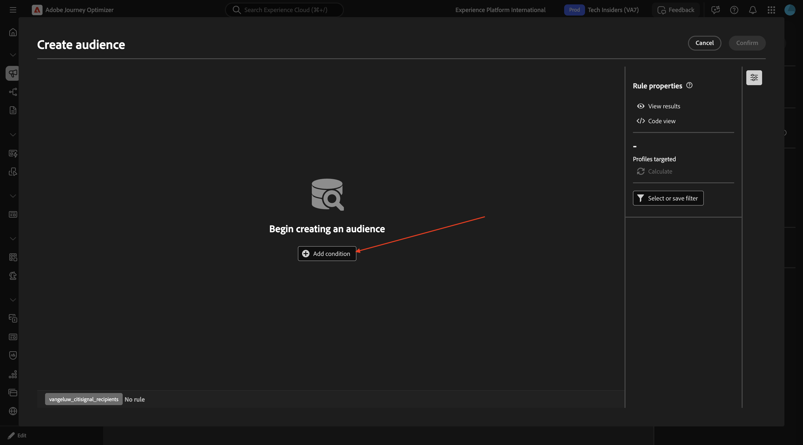
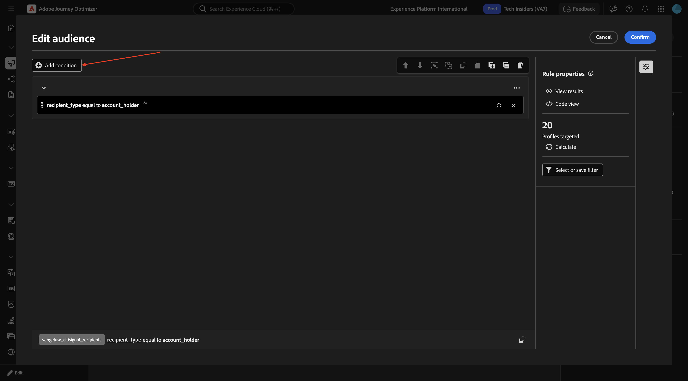
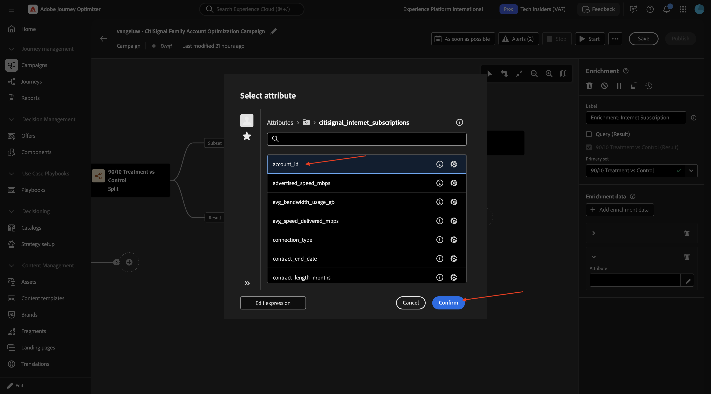
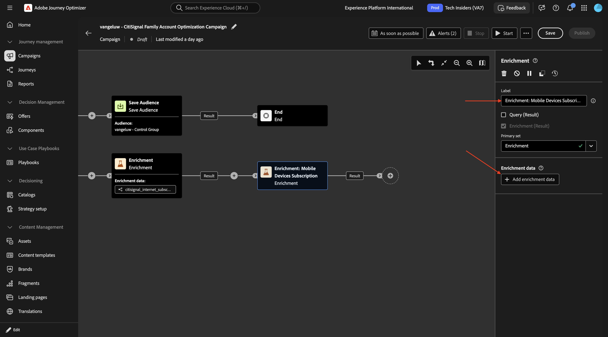
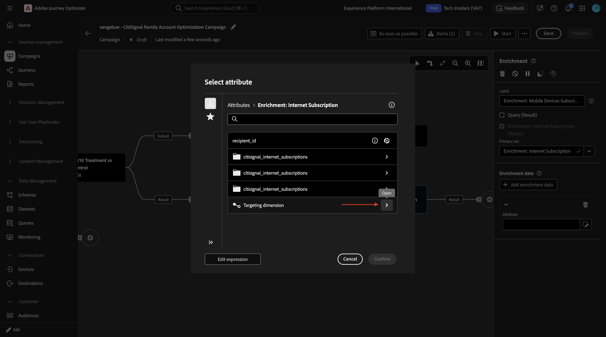
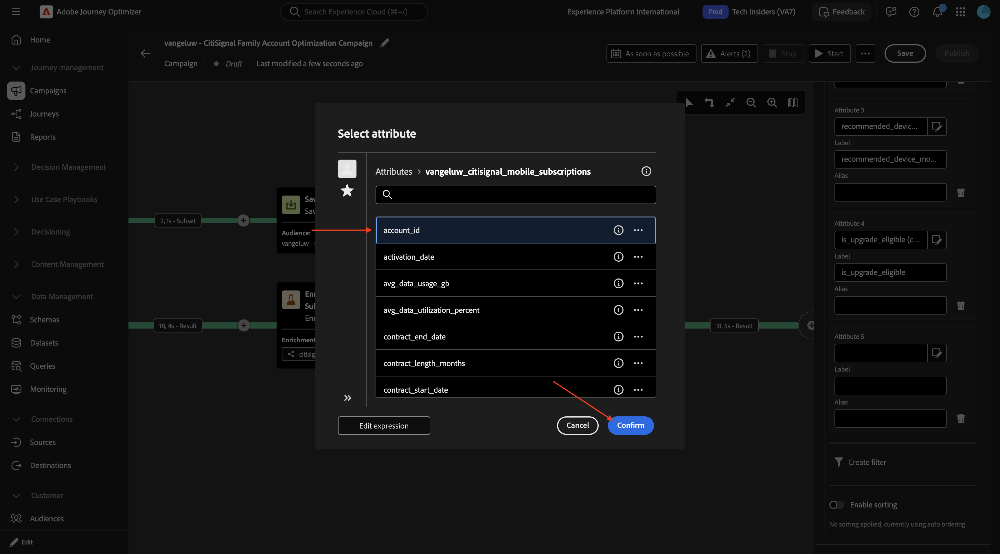
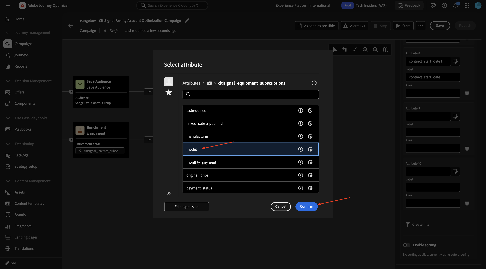
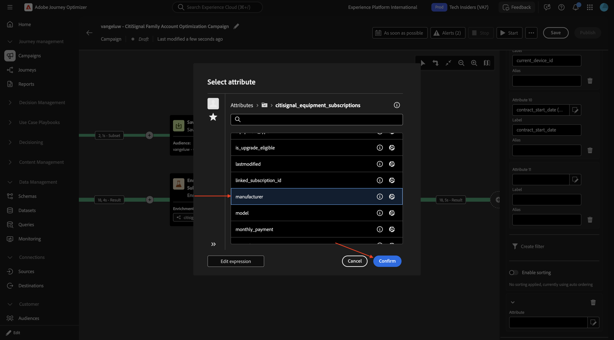

# 3.8.2 Creación de una campaña orquestada

## 3.8.2.1 Crear su campaña orquestada

Ir a **Campañas**. Haga clic en **Crear campaña**.

Seleccione **Orquestación - Marketing** y haga clic en **Confirmar**.

Escriba el nombre de la campaña: `--aepUserLdap-- - CitiSignal Family Account Optimization Campaign` y haga clic en **Guardar**.

Entonces debería ver esto. Haga clic en el icono **+**.

Seleccione **Bifurcación**.

### Generar audiencia 1

Haga clic en el icono **+** y, a continuación, seleccione **Generar audiencia**.

Haga clic para abrir la carpeta de **Dimensión de segmentación**.

Seleccione **`--aepUserLdap--_citisignal_recipients`** y haga clic en **Confirmar**.

Haga clic en **Crear audiencia**.

Haga clic en **Agregar condición**.

Seleccione **recipient_type** y haga clic en **Confirmar**.

Escriba **`account_holder`** en el campo **Valor** y haga clic en **Calcular**.

Debería ver un número de **perfiles segmentados**. Haga clic en algún lugar del área gris como se indica.

Haga clic en **Agregar condición**.

Profundizar hasta **`citisignal_accounts`**.

Seleccione **`account_status`** y haga clic en **Confirmar**.

Escriba **`active`** en el campo **Valor**. A continuación, haga clic en algún lugar del área gris como se indica.

Haga clic en **Agregar condición**.

Profundizar hasta **`citisignal_mobile_subscriptions`**.

Seleccione **`subscription_id`** y haga clic en **Confirmar**.

Habilite el conmutador para **datos agregados**. A continuación, seleccione lo siguiente:

- **Función de agregado**: **Recuento**
- **Operador**: **mayor o igual que**
- **Valor**: **1**

Haga clic en **Confirmar**.

Entonces debería ver esto. Haga clic en **Confirmar**.

### Generar audiencia 2

Haga clic en el icono **+** en el siguiente nodo de la otra ruta.

Seleccione **Generar audiencia**.

Haga clic para abrir la carpeta de **Dimensión de segmentación**.

Seleccione **`--aepUserLdap--_mobile_subscriptions`** y haga clic en **Confirmar**.

Haga clic en **Crear audiencia**.

Haga clic en **Agregar condición**.

Seleccione **subscription_status** y haga clic en **Confirmar**.

Escriba **`active`** en el campo **Valor**. A continuación, haga clic en **Agregar condición**.

Seleccione **`is_upgrade_eligible`** y haga clic en **Confirmar**.

Establecer **Value** en **true**

Haga clic en **Calcular** para ver una estimación de los perfiles aptos para esta audiencia. A continuación, haga clic en **Confirmar**

### División

Haga clic en el icono **+** y luego seleccione **Dividir**.

Cambie el campo **Label** a **90/10 Treatment vs Control**. Haga clic para abrir el objeto **Subconjunto**.

Habilite el conmutador para **Habilitar límite** y establezca el **Tamaño límite** en **10 por ciento**.

Haga clic en **Agregar segmento** y verá que se agrega el objeto **Result**.

Haga clic en **Guardar**.

### Guardar público

Haga clic en el icono **+** y luego seleccione **Guardar audiencia**.

Establezca el campo **Etiqueta de audiencia** en **`--aepUserLdap-- - Control Group`**. Haga clic en **Agregar asignación de audiencia**.

Desglose hasta **dimensión de segmentación**.

Seleccione **`account_id`** y haga clic en **Confirmar**.

### Enrichment: Suscripción a Internet

Haga clic en el icono **+**.

Seleccione **Enriquecimiento**.

Entonces debería ver esto. Haga clic en **Añadir datos de enriquecimiento**.

Profundizar hasta **`Targeting dimension`**.

Profundizar hasta **`citisignal_accounts`**.

Profundizar hasta **`citisignal_internet_subscriptions`**.

Seleccione **`account_id`** y haga clic en **Confirmar**.

Entonces debería ver esto. Haga clic en **Agregar atributo**.

Seleccione **`subscription_status`** y haga clic en **Confirmar**.

Haga clic en **Agregar atributo**.

Seleccione **`connection_type`** y haga clic en **Confirmar**.

Haga clic en **Agregar atributo**.

Seleccione **`service_city`** y haga clic en **Confirmar**.

Haga clic en **Agregar atributo**.

Seleccione **`avg_dowload_usage_gb`** y haga clic en **Confirmar**.

Haga clic en **Agregar atributo**.

Seleccione **`data_cap_gb`** y haga clic en **Confirmar**.

Haga clic en **Agregar atributo**.

Seleccione **`advertised_speed_mbps`** y haga clic en **Confirmar**.

Haga clic en **Agregar atributo**.

Seleccione **`monthly_recurring_charge`** y haga clic en **Confirmar**.

Haga clic en **Guardar**.

Desplácese hacia arriba y cambie el campo **Label** a `Enrichment: Internet Subscription`.

### Enrichment: suscripción a dispositivos móviles

Haga clic en el icono **+** en el siguiente nodo y seleccione **Enriquecimiento**.

Cambie el campo **Label** a `Enrichment: Mobile Devices Subscription` y haga clic en **Agregar datos de enriquecimiento**.

Profundizar hasta **Dimensión de segmentación**.

Profundizar hasta **`citisignal_mobile_subscriptions`**.

Seleccione **`account_id`** y haga clic en **Confirmar**.

Haga clic en **Agregar atributo**.

Seleccione **`subscription_id`** y haga clic en **Confirmar**.

Haga clic en **Agregar atributo**.

Seleccione **`phone_number`** y haga clic en **Confirmar**.

Haga clic en **Agregar atributo**.

Seleccione **`renewal_eligibility_date`** y haga clic en **Confirmar**.

Haga clic en **Agregar atributo**.

Seleccione **`line_user_recipient_id`** y haga clic en **Confirmar**.

Haga clic en **Agregar atributo**.

Seleccione **`is_upgrade_eligible`** y haga clic en **Confirmar**.

Haga clic en **Agregar atributo**.

Seleccione **`current_device_id`** y haga clic en **Confirmar**.

Haga clic en **Agregar atributo**.

Seleccione **`contract_start_date`** y haga clic en **Confirmar**.

Haga clic en **Agregar atributo**.

Profundizar hasta **`citisignal_equipment_subscriptions`**.

Seleccione **`model`** y haga clic en **Confirmar**.

Haga clic en **Agregar atributo**.

Profundizar hasta **`citisignal_equipment_subscriptions`**.

Seleccione **`manufacturer`** y haga clic en **Confirmar**.

Haga clic en **Agregar atributo**.

Profundizar hasta **`citisignal_equipment_subscriptions`**.

Seleccione **`device_age_months`** y haga clic en **Confirmar**.

Haga clic en **Agregar atributo**.

Profundizar hasta **`citisignal_equipment_subscriptions`**.

Seleccione **`is_upgrade_eligible`** y haga clic en **Confirmar**.

Haga clic en **Agregar atributo**.

Profundizar hasta **`citisignal_equipment_subscriptions`**.

Seleccione **`recommended_upgrade_product_id`** y haga clic en **Confirmar**.

Haga clic en **Agregar atributo**.

Profundizar hasta **`citisignal_equipment_subscriptions`**.

Seleccione **`monthly_payment`** y haga clic en **Confirmar**.

Haga clic en **Agregar atributo**.

Profundizar hasta **`citisignal_equipment_subscriptions`**.

Habilite el modificador para **Habilitar ordenación**. Haga clic en el icono **Edit**.

Seleccione **`phone_number`** y haga clic en **Confirmar**.

Entonces deberías tener esto.

Entonces deberías tener esto. Haga clic en **Guardar**.

## Pasos siguientes

Volver a [Adobe Journey Optimizer: campañas orquestadas](./ajocampaigns.md){target="_blank"}

Volver a [Todos los módulos](./../../../../overview.md){target="_blank"}
