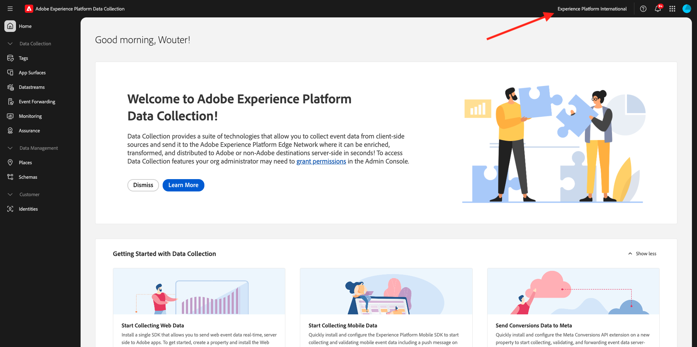

# 1.1.1 Explicación de la recopilación de datos de Adobe Experience Platform

## Contexto

Las marcas utilizan la recopilación de datos de Adobe Experience Platform para una serie de casos de uso. Es un sistema Tag Management de próxima generación (TMS) que ofrece a los clientes una alternativa sencilla para implementar y gestionar todas las soluciones de análisis, marketing y publicidad necesarias para potenciar las importantes experiencias del cliente. La recopilación de datos de Adobe Experience Platform no supone ningún coste adicional y está disponible para cualquier cliente de Adobe Experience Cloud. Una marca podría utilizar la recopilación de datos de Adobe Experience Platform para lo siguiente:

- Implemente aplicaciones de Adobe Experience Cloud y de Adobe Experience Platform.
- Administre los diferentes requisitos de las diferentes partes de la organización proporcionando a cada una de ellas su propia **propiedad** que debe administrar.
- Permitir la administración de ciclos de vida y pruebas.
- Inserte etiquetas personalizadas de JavaScript y de terceros, todas administradas en un solo lugar.

## Exploración de la IU

Vaya a [Recopilación de datos de Adobe Experience Platform](https://experience.adobe.com/#/data-collection/). Asegúrese de que está usando el entorno correcto, que debería ser `--aepImsOrgName--`.

>[!NOTE]
>
>Este tutorial se ha documentado con el entorno **Experience Platform International**. Es probable que el nombre de su entorno sea diferente, por lo que siempre que vea el nombre **Experience Platform International** en una captura de pantalla, debe reemplazarlo por el nombre de su propio entorno, que debería ser `--aepImsOrgName--`.

Ir a **Etiquetas**. Ahora está viendo la vista **[!UICONTROL Propiedades]**. Las propiedades enumeradas aquí son para la administración de tutoriales. Estas propiedades representan:

- Propiedades de aplicación y web
- Diferentes sitios web que sirven a los clientes de diferentes maneras. Por ejemplo, el comercio minorista de Luma tendría una propiedad, mientras que los viajes de Luma tendrían otra.
- Heredado y sitios web actuales
- Un diseño específico de Adobe Analytics común a varios sitios web diferentes
- Páginas de intranet internas junto con sitios externos

Ahora, eche un vistazo al carril izquierdo.

- **[!UICONTROL Etiquetas]** ofrece una descripción general de todas las propiedades del lado del cliente
- **[!UICONTROL Superficies de la aplicación]** ofrece una descripción general de todas las configuraciones de la aplicación para habilitar las notificaciones push (que se usa/habilita en combinación con Project Sierra)
- **[!UICONTROL Las secuencias de datos]** se explorarán en el [próximo ejercicio](./ex2.md)
- **[!UICONTROL Reenvío de eventos]** proporciona una descripción general de todas las propiedades del lado del servidor que se exploran en [Módulo 2.5 - Conexiones de Real-Time CDP: Reenvío de eventos](./../../../../modules/delivery-activation/rtcdp-b2c/rtcdpb2c-5/aep-data-collection-ssf.md)
- **[!UICONTROL Supervisión]** proporciona información general sobre el tráfico de eventos entrantes y salientes a través del reenvío de eventos
- **[!UICONTROL Assurance]** proporciona acceso para depurar una implementación mediante Adobe Debugger
- **[!UICONTROL Places]** proporciona acceso para administrar puntos de interés a los que se puede acceder para la personalización basada en la ubicación en aplicaciones móviles
- **[!UICONTROL Esquemas]** proporciona acceso al editor de esquemas de Adobe Experience Platform
- **[!UICONTROL Identidades]** proporciona acceso a la configuración de Identity Graph de Adobe Experience Platform

## Más información

La recopilación de datos de Adobe Experience Platform es una herramienta muy avanzada con un ámbito que va más allá del tutorial de Adobe Experience Platform. Es posible que las organizaciones no utilicen la recopilación de datos de Adobe Experience Platform para sus funciones de administración de etiquetas y que, en su lugar, utilicen soluciones de administración de etiquetas que no sean de Adobe para insertar código y administrar etiquetas. Adobe y Adobe Professional Services admiten el uso de una solución de administración de etiquetas que no sea de Adobe.
A continuación se incluye información adicional para aquellos interesados en comprender mejor la recopilación de datos de Adobe Experience Platform.

- [Guía del usuario de recopilación de datos de Adobe Experience Platform](https://experienceleague.adobe.com/docs/experience-platform/tags/home.html?lang=es)
- [Tutorial de implementación de Adobe Experience Cloud con el SDK web](https://experienceleague.adobe.com/docs/platform-learn/implement-web-sdk/overview.html?lang=es)
- [Configurar permisos de usuario](https://experienceleague.adobe.com/docs/experience-platform/tags/admin/user-permissions.html)
- [Documentación de API](https://developer.adobelaunch.com/api/)

## Pasos siguientes

Vaya a [1.1.2 Edge Network, Datastreams y Recopilación de datos del servidor](./ex2.md){target="_blank"}

Volver a la [configuración de la recopilación de datos de Adobe Experience Platform y la extensión de etiquetas de Web SDK](./data-ingestion-launch-web-sdk.md){target="_blank"}

Volver a [Todos los módulos](./../../../../overview.md){target="_blank"}
