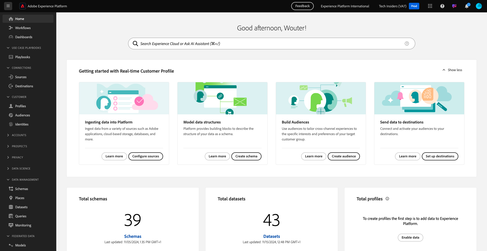
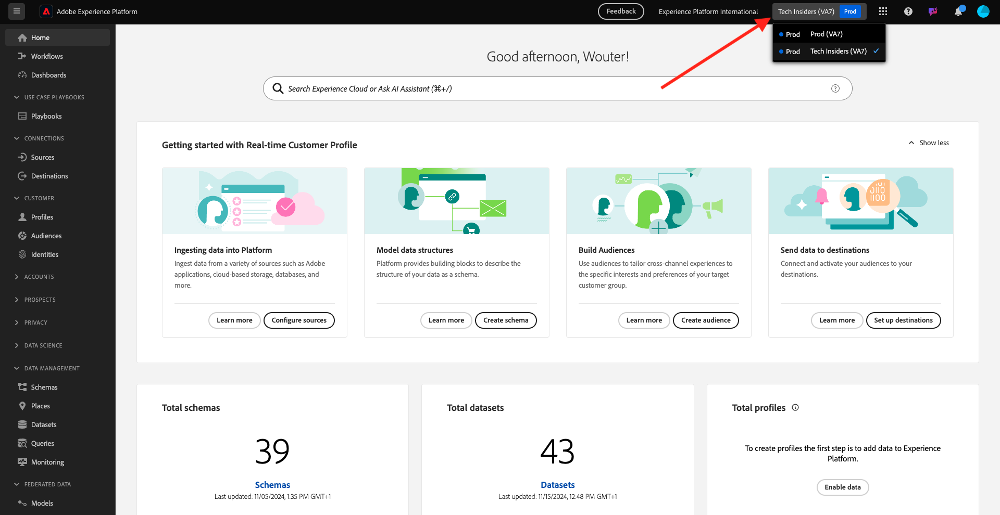
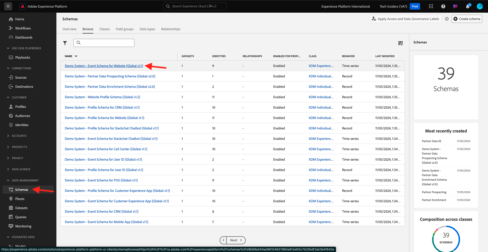

# 1.1.7 Requisitos de esquema XDM en Adobe Experience Platform

Para garantizar que Web SDK pueda introducir datos en Adobe Experience Platform, se necesita que una mezcla XDM específica forme parte del esquema XDM en Adobe Experience Platform.

Vaya a [https://experience.adobe.com/platform](https://experience.adobe.com/platform) e inicie sesión.

Después de iniciar sesión, selecciona la zona protegida adecuada haciendo clic en el texto **Producción** en la línea azul de la parte superior de la pantalla. Seleccione la zona protegida `--aepSandboxName--`.

Después de seleccionar la zona protegida, verá que la pantalla cambia y ahora está en ella.

En el menú de la izquierda, vaya a **Esquemas** y abra el esquema **Sistema de demostración: esquema de eventos para el sitio web (Global v1.1)**.

En ese esquema, verá que se ha agregado el grupo de campos **AEP Web SDK ExperienceEvent**. Este grupo de campos añade todos los campos mínimos requeridos al esquema. Cada esquema de evento de experiencia de Adobe Experience Platform que Web SDK utilizará siempre requerirá que ese grupo de campos forme parte del esquema.

En [Módulo 1.2 Ingesta de datos](./../dc1.2/data-ingestion.md) aprenderá a agregar grupos de campos a los esquemas.

Paso siguiente:

## Pasos siguientes

Volver a la [configuración de la recopilación de datos de Adobe Experience Platform y la extensión de etiquetas de Web SDK](./data-ingestion-launch-web-sdk.md){target="_blank"}

Volver a [Todos los módulos](./../../../../overview.md){target="_blank"}
