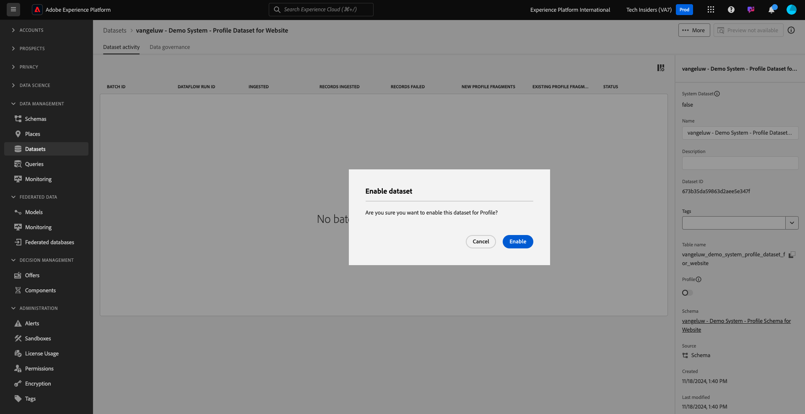

# 1.2.3 Configuración de conjuntos de datos

En este ejercicio, configurará conjuntos de datos para capturar y almacenar información de perfil y comportamiento del cliente. Todos los conjuntos de datos que cree en esta interfaz utilizarán uno de los esquemas creados en el paso anterior.

## Contexto

Después de definir cuál es la respuesta a las preguntas **¿Quién es este cliente?** y **¿Qué hace este cliente?** debería tener el aspecto siguiente: ahora necesita crear un contenedor que utilice esa información para recibir y validar los datos enviados a Adobe Experience Platform.

## Crear conjuntos de datos

Ahora necesita crear 2 conjuntos de datos:

- 1 conjunto de datos para capturar la información que responde a **¿Quién es este cliente?** - pregunta.
- 1 conjunto de datos para capturar la información que responde a **¿Qué hace este cliente?** - pregunta.

Inicie sesión en Adobe Experience Platform desde esta dirección URL: [https://experience.adobe.com/platform](https://experience.adobe.com/platform).

Después de iniciar sesión, llegará a la página principal de Adobe Experience Platform.

Antes de continuar, debe seleccionar una **[!UICONTROL zona protegida]**. La zona protegida que se va a seleccionar se denomina ``--aepSandboxName--``. Después de seleccionar la [!UICONTROL zona protegida] adecuada, verá el cambio en la pantalla y ahora se encuentra en la [!UICONTROL zona protegida] dedicada.

En Adobe Experience Platform, haga clic en **[!UICONTROL Conjuntos de datos]** en el menú de la izquierda de la pantalla.  A continuación, verá esto:

Empecemos creando el conjunto de datos para capturar la información de registro del sitio web.

Debe crear un nuevo conjunto de datos. Para crear un nuevo conjunto de datos, haga clic en el botón **[!UICONTROL + Crear conjunto de datos]**.

Debe definir un conjunto de datos a partir del esquema que definió en el paso anterior. Haga clic en la opción **[!UICONTROL Crear conjunto de datos a partir del esquema]** -.

En la siguiente pantalla, debe seleccionar el esquema que creó en 1, `--aepUserLdap-- - Demo System - Profile Schema for Website`.

Haga clic en **Next**.

Vamos a darle un nombre a su conjunto de datos.

Como nombre del conjunto de datos, utilice el siguiente:

`--aepUserLdap-- - Demo System - Profile Dataset for Website`

Haga clic en **Finalizar**.

Ahora verá lo siguiente:

Volver a la descripción general de [!UICONTROL Conjuntos de datos]. Ahora verá el conjunto de datos que ha creado en la ventana emergente de información general.

A continuación, configurará un segundo conjunto de datos para capturar las interacciones con el sitio web.

Haga clic en **[!UICONTROL + Crear conjunto de datos]**.

Debe definir un conjunto de datos a partir del esquema que definió en el paso anterior. Haga clic en la opción **[!UICONTROL Crear conjunto de datos a partir del esquema]** -.

En la siguiente pantalla, debe seleccionar el esquema que creó anteriormente, `--aepUserLdap-- - Demo System - Event Schema for Website`.

Haga clic en **Next**.

Vamos a darle un nombre a su conjunto de datos.

Como nombre del conjunto de datos, utilice este:

`--aepUserLdap-- - Demo System - Event Dataset for Website`

Haga clic en **Finalizar**.

A continuación, verá esto:

Vuelva a la pantalla de información general de [!UICONTROL Conjuntos de datos].

Ahora debe permitir que los conjuntos de datos formen parte del Perfil del cliente en tiempo real de Adobe Experience Platform.

Abra el conjunto de datos `--aepUserLdap-- - Demo System - Profile Dataset for Website` haciendo clic en él.

Busque el icono de alternancia [!UICONTROL Perfil] a la derecha de la pantalla.
Haga clic en la opción [!UICONTROL Perfil] para habilitar este conjunto de datos para [!UICONTROL Perfil].

Haga clic en **[!UICONTROL Habilitar]**.

El conjunto de datos está habilitado para [!UICONTROL Perfil].

Vuelva a la información general de los conjuntos de datos y abra el conjunto de datos `--aepUserLdap-- - Demo System - Event Dataset` para el sitio web al hacer clic en él.

Busque el icono de alternancia [!UICONTROL Perfil] a la derecha de la pantalla. Haga clic en la opción [!UICONTROL Perfil] para habilitar [!UICONTROL Perfil].

Haga clic en **[!UICONTROL Habilitar]**.

El conjunto de datos está habilitado para [!UICONTROL Perfil].

## Pasos siguientes

Ir a [1.2.4 Ingesta de datos de fuentes sin conexión](./ex4.md){target="_blank"}

Volver a [Ingesta de datos](./data-ingestion.md){target="_blank"}

Volver a [Todos los módulos](./../../../../overview.md){target="_blank"}
