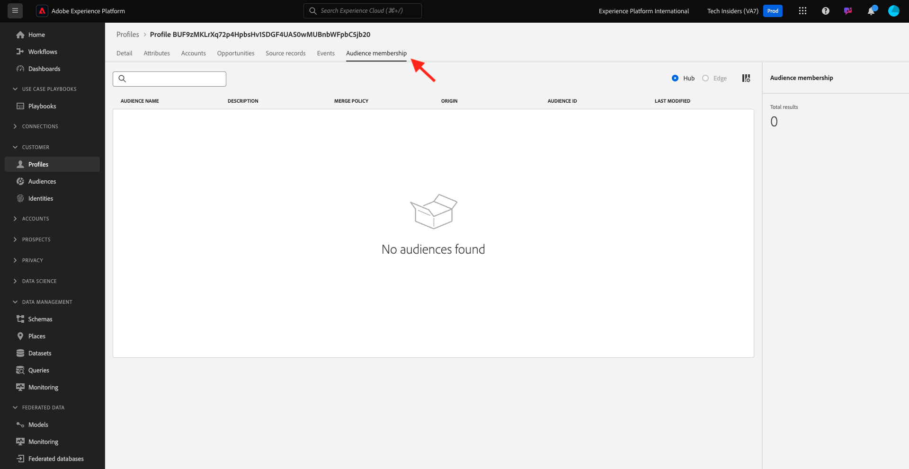

# 2.1.2 Visualizar su propio perfil del cliente en tiempo real: interfaz de usuario

En este ejercicio, iniciará sesión en Adobe Experience Platform y verá su propio perfil de cliente en tiempo real en la interfaz de usuario.

## Contexto

En el Perfil del cliente en tiempo real, todos los datos de perfil se muestran junto con los datos de evento, así como las suscripciones a segmentos existentes. Los datos mostrados pueden proceder de cualquier lugar, desde aplicaciones de Adobe y soluciones externas. Esta es la vista más potente de Adobe Experience Platform, el verdadero sistema de registro de experiencias.

## Uso de la vista de perfil del cliente en Adobe Experience Platform

Ir a [Adobe Experience Platform](https://experience.adobe.com/platform). Después de iniciar sesión, llegará a la página principal de Adobe Experience Platform.

Antes de continuar, debe seleccionar una **zona protegida**. La zona protegida que se va a seleccionar se denomina ``--aepSandboxName--``. Después de seleccionar la [!UICONTROL zona protegida] adecuada, verá el cambio en la pantalla y ahora se encuentra en la [!UICONTROL zona protegida] dedicada.

En el menú de la izquierda, ve a **Perfiles** y a **Examinar**.

En el panel Visor de perfiles del sitio web, puede encontrar varias identidades. Cada identidad está vinculada a un área de nombres.

En el panel Visor de perfiles, puede ver estas combinaciones de ID y áreas de nombres:

| Identidad | Área de nombres |
|:-------------:| :---------------:|
| Experience Cloud ID (ECID) | 79943948563923140522865572770524243489 |
| Experience Cloud ID (ECID) | 70559351147248820114888181867542007989 |
| ID de correo electrónico | woutervangeluwe+18112024-01@gmail.com |
| Identificador de número de móvil | +32473622044+18112024-01 |

Con Adobe Experience Platform, todos los ID son igualmente importantes. Anteriormente, el ECID era el ID más importante en el contexto de Adobe y todos los demás ID estaban vinculados al ECID en una relación jerárquica. Con Adobe Experience Platform, este ya no es el caso, y cada ID puede considerarse un identificador principal.

Normalmente, el identificador principal depende del contexto. Si le pregunta a su centro de llamadas, **¿Cuál es el ID más importante?** es probable que respondan, **el número de teléfono!** Pero si le pregunta a su equipo de CRM, responderán: **la dirección de correo electrónico!** Adobe Experience Platform comprende esta complejidad y la administra por usted. Cada aplicación, ya sea una aplicación de Adobe o una aplicación que no sea de Adobe, hablará con Adobe Experience Platform haciendo referencia al ID que consideran principal. Y simplemente funciona.

Para el campo **Área de nombres de identidad**, seleccione **Correo electrónico** y para el campo **Valor de identidad**, escriba la dirección de correo electrónico que utilizó para registrarse en el ejercicio anterior. Haga clic en **Ver**. A continuación, verá su perfil en la lista. Haga clic en **ID de perfil** para abrir el perfil.

Ahora verá una descripción general de un par de **Atributos de perfil** importantes de su perfil de cliente. Para ver todos los atributos de perfil disponibles para su perfil, haga clic en **Atributos**.

A continuación, verá una lista completa de todos los atributos.

Vaya a **Eventos**, donde podrá ver las entradas de todos los eventos de experiencia vinculados a su perfil.

Finalmente, vaya a la opción de menú **Suscripción a audiencias**. Aquí encontrará todas las audiencias aptas para este cliente. La lista puede estar vacía actualmente, pero eso cambiará en los siguientes módulos.

Ahora que ha aprendido a ver el perfil en tiempo real de cualquier cliente utilizando la interfaz de usuario de Adobe Experience Platform, hagamos lo mismo a través de las API utilizando Postman y Adobe I/O para consultar las API de Adobe Experience Platform.

## Pasos siguientes

Vaya a [2.1.3 y visualice su propio perfil de cliente en tiempo real: API](./ex3.md){target="_blank"}

Volver a [Perfil del cliente en tiempo real](./real-time-customer-profile.md){target="_blank"}

Volver a [Todos los módulos](./../../../../overview.md){target="_blank"}
