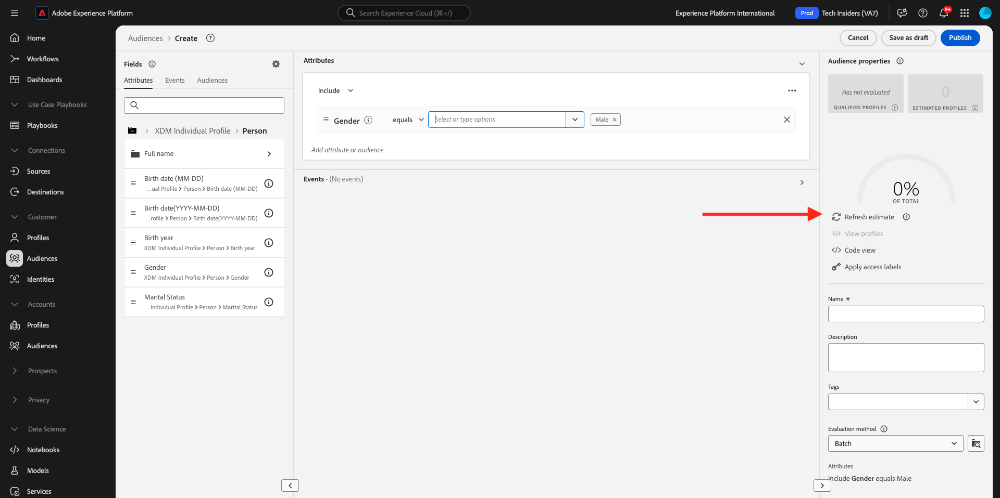
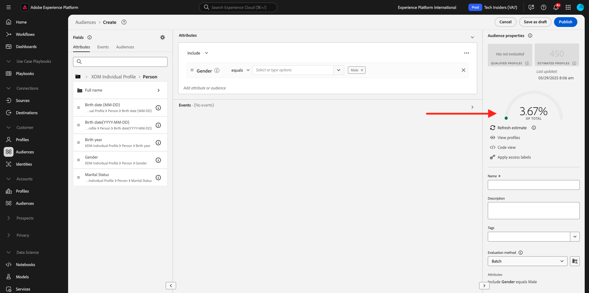
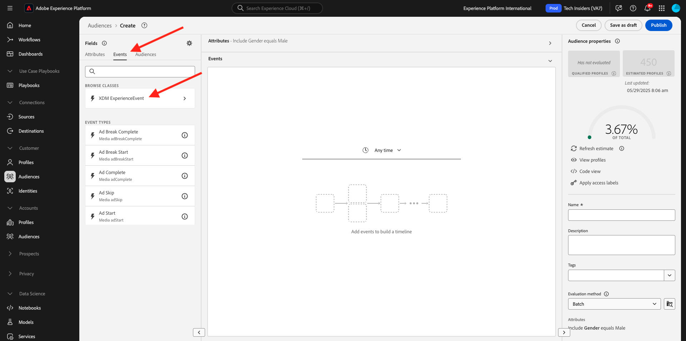
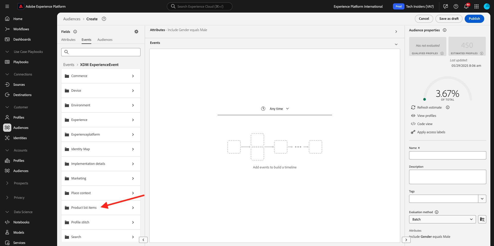
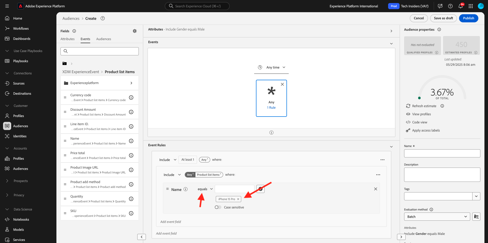
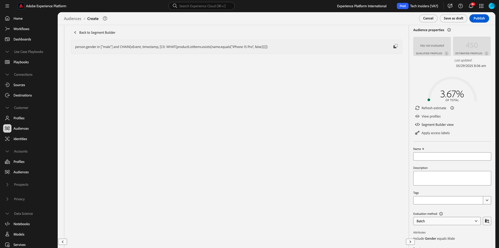

# 2.1.4 Crear una audiencia: IU

En este ejercicio, creará una audiencia utilizando el Generador de audiencias de Adobe Experience Platform.

Ir a [Adobe Experience Platform](https://experience.adobe.com/platform). Después de iniciar sesión, llegará a la página principal de Adobe Experience Platform.


Antes de continuar, debe seleccionar una **zona protegida**. La zona protegida que se va a seleccionar se denomina ``--aepSandboxName--``. Después de seleccionar la [!UICONTROL zona protegida] adecuada, verá el cambio en la pantalla y ahora se encuentra en la [!UICONTROL zona protegida] dedicada.


En el menú de la izquierda, ve a **Audiencias**. En esta página, puede ver una descripción general de todas las audiencias existentes. Haga clic en el botón **+ Crear audiencia** para comenzar a crear una audiencia nueva.


Seleccione **Generar regla** y haga clic en **Crear**.


Una vez que esté en el nuevo generador de audiencias, verá inmediatamente la opción de menú **Atributos** y la referencia de **Perfil individual XDM**.


Dado que XDM es el lenguaje que potencia el negocio de la experiencia, XDM también es la base del generador de audiencias. Todos los datos que se incorporen en Platform deben asignarse a XDM y, como tales, todos los datos pasan a formar parte del mismo modelo de datos independientemente de dónde provengan. Esto le ofrece una gran ventaja a la hora de crear audiencias, ya que desde esta interfaz de usuario del generador de audiencias puede combinar datos de cualquier origen en el mismo flujo de trabajo. Las audiencias creadas en el generador de audiencias se pueden enviar a soluciones como Adobe Target, Adobe Campaign y Adobe Audience Manager para su activación.

Vamos a crear una audiencia que incluya todos los clientes **hombres**.

Para llegar al atributo de género, debe comprender y conocer XDM.

El sexo es un atributo de la persona, que se puede encontrar en Atributos. Para llegar allí, empezarás haciendo clic en **Perfil particular de XDM**. Entonces verá esto... En la ventana **XDM Individual Profile**, seleccione **Person**.


Entonces verá esto... En **Persona**, puedes encontrar el atributo **Género**. Arrastre el atributo Gender al generador de audiencias.


Ahora puede elegir el género específico de las opciones rellenadas previamente. En este caso, vamos a elegir **Hombre**.


Después de seleccionar **Hombre**, puedes obtener una estimación de la población de la audiencia presionando el botón **Actualizar estimación**. Esto resulta muy útil para un usuario empresarial, ya que puede ver el impacto de ciertos atributos en el tamaño de audiencia resultante.



A continuación, verá una estimación como la siguiente:



A continuación, debería refinar un poco su audiencia. Debe crear una audiencia de todos los clientes hombres que hayan visto el producto **iPhone 15 Pro**.

Para crear esta audiencia, debe añadir un Evento de experiencia. Puede encontrar todos los eventos de experiencias haciendo clic en el icono **Eventos** en la barra de menús de **Campos**. A continuación, verá el nodo **XDM ExperienceEvents** de nivel superior. Haga clic en **ExperienceEvent de XDM**.



Vaya a **Elementos de lista de productos**.



Seleccione **Name** y arrastre y suelte el objeto **Name** del menú de la izquierda en el lienzo del generador de audiencias en la sección **Events**.


A continuación, verá esto:


El parámetro de comparación debe ser **igual a** y en el campo de entrada, escriba **iPhone 15 Pro**.



Cada vez que añada un elemento al generador de audiencias, puede hacer clic en el botón **Actualizar estimación** para obtener una nueva estimación de la población de su audiencia.

Hasta ahora, solo ha utilizado la interfaz de usuario de para crear su audiencia, pero también hay una opción de código para crear una audiencia.

Al crear una audiencia, está creando una consulta de Profile Query Language (PQL). Para visualizar el código PQL, haga clic en el conmutador **Vista de código** en la esquina superior derecha del generador de audiencias.



Ahora puede ver la instrucción completa de PQL:

```sql
person.gender in ["male"] and CHAIN(xEvent, timestamp, [C0: WHAT(productListItems.exists(name.equals("iPhone 15 Pro", false)))])
```

También puede obtener una vista previa de una muestra de los perfiles de clientes que forman parte de esta audiencia, haciendo clic en **Ver perfiles**.


Finalmente, vamos a darle un nombre a su audiencia,
establezca el **método de evaluación** en **Transmisión** y haga clic en **Publicar**.

Como convención de nombres, utilice:

- `--aepUserLdap-- - Male customers with interest in iPhone 15 Pro`


Se le redirigirá a la página de información general de Audience Manager.


## Pasos siguientes

Vaya a [2.1.5 Vea su perfil de cliente en tiempo real en acción en el centro de llamadas](./ex5.md){target="_blank"}

Volver a [Perfil del cliente en tiempo real](./real-time-customer-profile.md){target="_blank"}

Volver a [Todos los módulos](./../../../../overview.md){target="_blank"}
