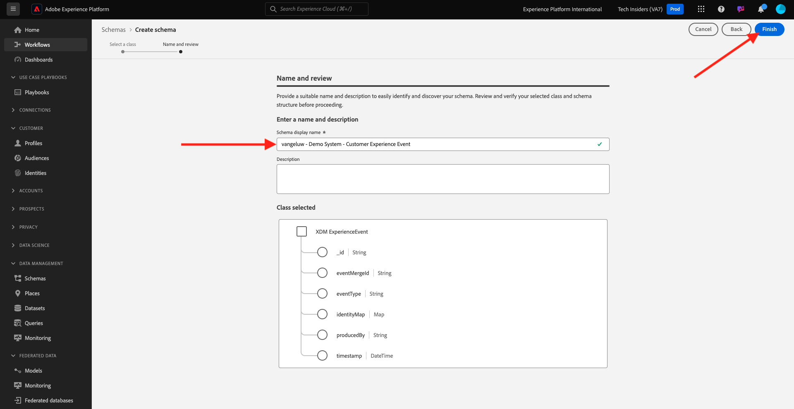

# 2.2.1 AI del cliente: preparación de datos (ingesta)

Para que los servicios inteligentes descubran datos de sus eventos de marketing, los datos deben enriquecerse semánticamente y mantenerse en una estructura estándar. Los servicios inteligentes aprovechan los esquemas XDM (Experience Data Model) de Adobe para conseguirlo.
En concreto, todos los conjuntos de datos que se utilizan en Intelligent Services deben cumplir con el esquema XDM **Evento de experiencia del consumidor**.

## Crear esquema

En este ejercicio, creará un esquema que contiene el mixin **Evento de experiencia del consumidor**, que requiere el servicio inteligente **inteligencia artificial aplicada al cliente**.

Inicie sesión en Adobe Experience Platform desde esta dirección URL: [https://experience.adobe.com/platform](https://experience.adobe.com/platform).

Después de iniciar sesión, llegará a la página principal de Adobe Experience Platform.

Antes de continuar, debe seleccionar una **zona protegida**. La zona protegida que se va a seleccionar se denomina ``--aepSandboxName--``. Después de seleccionar la zona protegida adecuada, verá que la pantalla cambia y ahora está en la zona protegida dedicada.

En el menú de la izquierda, haz clic en **Esquemas** y ve a **Examinar**. Haga clic en **Crear esquema**.

En la ventana emergente, selecciona **Manual** y haz clic en **Seleccionar**.

A continuación, seleccione **Evento de experiencia** y haga clic en **Siguiente**.

Debe proporcionar un nombre para el esquema ahora. Como nombre de nuestro esquema, use esto: `--aepUserLdap-- - Demo System - Customer Experience Event` y haga clic en **Finalizar**.

Entonces verá esto... Haga clic en **+ Agregar** en Grupos de campos.

Busque y seleccione los **grupos de campos** siguientes para agregarlos a este esquema:

- Evento de experiencia del consumidor

- IdentityMap

Haga clic en **Agregar grupos de campos**.

Entonces verá esto... A continuación, seleccione el nombre del esquema. Ahora debería habilitar su esquema para **Perfil**, haciendo clic en la opción **Perfil**.

Entonces verá esto... Marque la casilla de verificación de **Los datos de este esquema contendrán una identidad principal en el campo identityMap.**. Haga clic en **Habilitar**.

Ahora debería tener esto. Haga clic en **Guardar** para guardar el esquema.

## Crear conjunto de datos

En el menú de la izquierda, haga clic en **Conjuntos de datos** y vaya a **Examinar**. Haga clic en **Crear conjunto de datos**.

Haga clic en **Crear conjunto de datos a partir del esquema**.

En la siguiente pantalla, seleccione el conjunto de datos que creó en el ejercicio anterior, que se llama `--aepUserLdap-- - Demo System - Customer Experience Event`. Haga clic en **Next**.

Como nombre para su conjunto de datos, utilice `--aepUserLdap-- - Demo System - Customer Experience Event Dataset`. Haga clic en **Finalizar**.

Se ha creado el conjunto de datos. Habilite la opción **Perfil**.

Haga clic en **Habilitar**.

Ahora debería tener esto:

Ya está listo para empezar a ingerir datos de evento de experiencias del consumidor y empezar a utilizar el servicio de inteligencia artificial aplicada al cliente.

## Descargar datos de prueba de Experience Event

Una vez configurados el **esquema** y el **conjunto de datos**, ya puede ingerir datos de evento de experiencia. Dado que la inteligencia artificial aplicada al cliente requiere tiene requisitos de datos específicos, deberá ingerir datos preparados de forma externa.

Los datos preparados para los eventos de experiencia de este ejercicio deben cumplir con los requisitos y el esquema del [grupo de campos XDM de evento de experiencia del consumidor](https://github.com/adobe/xdm/blob/797cf4930d5a80799a095256302675b1362c9a15/docs/reference/context/experienceevent-consumer.schema.md).

Descargue el archivo zip con datos de demostración desde esta ubicación: [https://tech-insiders.s3.us-west-2.amazonaws.com/CUSTOM-CAI-EVENTS-WEB.zip](https://tech-insiders.s3.us-west-2.amazonaws.com/CUSTOM-CAI-EVENTS-WEB.zip).

Ahora ha descargado un archivo denominado **CUSTOM-CAI-EVENTS-WEB.zip**. Coloque el archivo en el escritorio del equipo y descomprímalo, tras lo cual verá una carpeta llamada **CUSTOM-CAI-EVENTS-WEB**.

En esa carpeta, encontrará varios archivos json secuenciados, que todos deben ingerirse en el siguiente ejercicio.

## Ingesta de datos de prueba de Evento de experiencia

En Adobe Experience Platform, vaya a **Conjuntos de datos** y abra su conjunto de datos, que se llama **[!UICONTROL ldap - Sistema de demostración - Conjunto de datos de evento de experiencia del cliente]**.

En su conjunto de datos, haga clic en **Elegir archivos** para agregar datos.

En la ventana emergente, selecciona los archivos **WEBSITE-EE-1.json** hasta **WEBSITE-EE-5.json** y haz clic en **Abrir**.

Repita este proceso de ingesta para los archivos **WEBSITE-EE-6.json** y **WEBSITE-EE-7.json**.

Verá los datos que se están importando y se creará un nuevo lote con el estado **Cargando**. No se aleje de esta página hasta que se haya cargado el archivo.

Una vez que se haya cargado el archivo, verá que el estado del lote cambia de **Cargando** a **Procesando**.

La ingesta y el procesamiento de los datos pueden tardar entre 10 y 20 minutos.

Una vez que la ingesta de datos se haya realizado correctamente, el estado del lote de las diversas cargas cambiará a **Correcto**.

## Pasos siguientes

Vaya a [2.2.2 Inteligencia artificial aplicada al cliente - Crear una instancia nueva (Configurar)](./ex2.md){target="_blank"}

Volver a [Servicios inteligentes](./intelligent-services.md){target="_blank"}

Volver a [Todos los módulos](./../../../../overview.md){target="_blank"}
