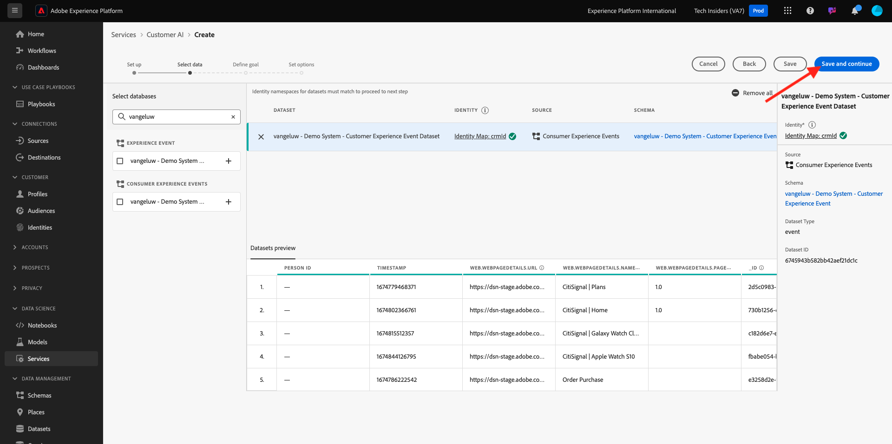
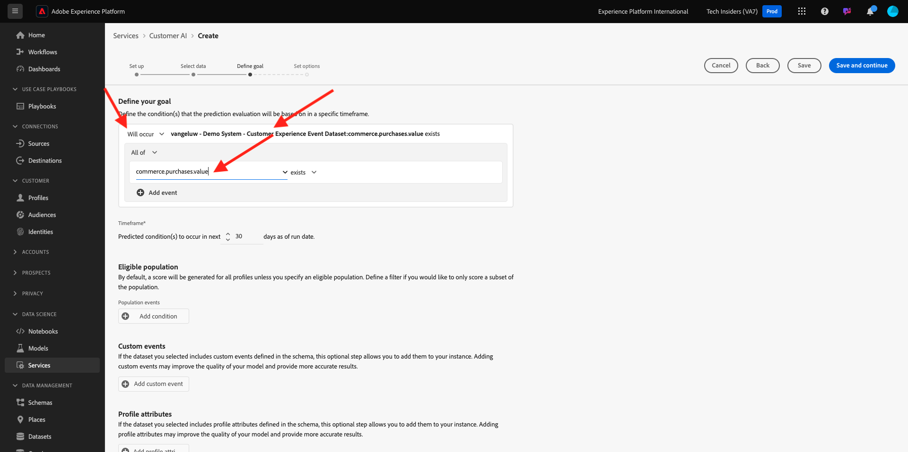

# 2.2.2 Inteligencia artificial aplicada al cliente: crear una nueva instancia (configurar)

La inteligencia artificial aplicada al cliente funciona analizando los datos de evento de experiencia del consumidor existentes para predecir puntuaciones de pérdida o tendencia de conversión. La creación de una nueva instancia de inteligencia artificial aplicada al cliente permite a los especialistas en marketing definir objetivos y medidas.

## Configuración de una nueva instancia de Customer AI

En Adobe Experience Platform, haga clic en **Servicios** en el menú de la izquierda. Aparece el explorador **Services** y muestra todos los servicios disponibles a su disposición. En la tarjeta de inteligencia artificial aplicada al cliente, haga clic en **Abrir**.

Haga clic en **Crear instancia**.

Entonces verá esto...

Introduzca los detalles necesarios para la instancia de inteligencia artificial aplicada al cliente:

- Nombre: use `--aepUserLdap-- Product Purchase Propensity`
- Descripción: uso: **Predecir la probabilidad de que los clientes compren un producto**
- Tipo de tendencia: seleccionar **Conversión**

Haz clic en **Guardar y continuar**.

Entonces verá esto... Seleccione el conjunto de datos que creó en el ejercicio anterior, que se llama `--aepUserLdap-- - Demo System - Customer Experience Event Dataset`. Haga clic en **Agregar**.

Entonces verá esto... debe definir el campo **Identidad**. Haga clic en **Ninguno**.

En la ventana emergente, seleccione **Mapa de identidad (identityMap)** y, a continuación, seleccione el área de nombres **Sistema de demostración - CRMID (crmId)**. A continuación, haga clic en **Guardar**.

Haz clic en **Guardar y continuar**.

Seleccione **Se producirá** en su conjunto de datos específico y defina el campo **commerce.purchases.value** como la variable de destino.

A continuación, configure la programación para que se ejecute **Semanalmente** y establezca la hora lo más cerca posible de la hora actual. Asegúrese de que la opción **Habilitar puntuaciones para el perfil** esté habilitada. Haz clic en **Guardar y continuar**.

Después de configurar la instancia, puede verla en la lista de servicios de inteligencia artificial aplicada al cliente y también puede obtener una vista previa del resumen de los detalles de configuración y ejecución haciendo clic en la fila Instancia de inteligencia artificial aplicada al cliente. El panel de resumen también mostrará los detalles del error en caso de que se encuentren errores.

>[!NOTE]
>
>Puede modificar cualquier definición o atributo siempre que el estado de la instancia de inteligencia artificial aplicada al cliente sea **Esperando formación** o **Error**

Una vez que el modelo se haya ejecutado, verá esto.

## Pasos siguientes

Vaya a [2.2.3 Inteligencia artificial aplicada al cliente - Panel de puntuación y segmentación (Predecir y tomar medidas)](./ex3.md){target="_blank"}

Volver a [Servicios inteligentes](./intelligent-services.md){target="_blank"}

Volver a [Todos los módulos](./../../../../overview.md){target="_blank"}
