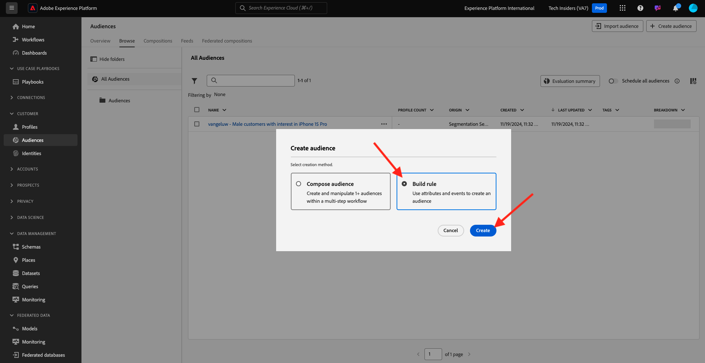

# 2.3.1 Crear una audiencia

En este ejercicio, creará una audiencia utilizando el generador de audiencias de Adobe Experience Platform.

## Contexto

La respuesta a los intereses de un cliente debe ser en tiempo real. Una de las formas de responder al comportamiento del cliente en tiempo real es mediante el uso de una audiencia, con la condición de que la audiencia cumpla los requisitos en tiempo real. En este ejercicio, debe crear una audiencia que tenga en cuenta la actividad real en el sitio web que hemos estado utilizando.

## Identifique el comportamiento al que desee reaccionar

Vaya a [https://dsn.adobe.com](https://dsn.adobe.com). Después de iniciar sesión con su Adobe ID, verá esto. Haga clic en los 3 puntos **...** del proyecto del sitio web y, a continuación, haga clic en **Ejecutar** para abrirlo.

A continuación, verá cómo se abre el sitio web de demostración. Seleccione la URL y cópiela en el portapapeles.

Abra una nueva ventana del explorador de incógnito.

Pegue la dirección URL del sitio web de demostración, que copió en el paso anterior. Luego se le pedirá que inicie sesión con su Adobe ID.

Seleccione el tipo de cuenta y complete el proceso de inicio de sesión.

Luego verá el sitio web cargado en una ventana de incógnito del explorador. Para cada ejercicio, deberá utilizar una ventana nueva del explorador de incógnito para cargar la URL del sitio web de demostración.

En este ejemplo, desea responder a un cliente específico que ve un producto específico.
En la página de inicio de **Citi Signal**, ve a **Teléfonos y dispositivos** y haz clic en el producto **Galaxy S24**.

Así que cuando alguien visite la página de productos del **Galaxy S24**, querrá poder tomar medidas. Lo primero que debe hacer para realizar una acción es definir una audiencia.

## Creación de la audiencia

Ir a [Adobe Experience Platform](https://experience.adobe.com/platform). Después de iniciar sesión, llegará a la página principal de Adobe Experience Platform.

Antes de continuar, debe seleccionar una **zona protegida**. La zona protegida que se va a seleccionar se denomina ``--aepSandboxName--``. Después de seleccionar la [!UICONTROL zona protegida] adecuada, verá el cambio en la pantalla y ahora se encuentra en la [!UICONTROL zona protegida] dedicada.

En el menú de la izquierda, ve a **Audiencias** y luego a **Examinar**, donde podrás ver una descripción general de todas las audiencias existentes. Haga clic en el botón **Crear audiencia** para comenzar a crear una audiencia nueva.

Seleccione **Generar regla** y haga clic en **Crear**.

Como se mencionó anteriormente, debe generar una audiencia de todos los clientes que han visto el producto **Galaxy S24**.

Para crear esta audiencia, debe añadir un evento. Puede encontrar todos los eventos haciendo clic en el icono **Eventos** en la barra de menús de **Audiencias**.

A continuación, verá el nodo **XDM ExperienceEvent** de nivel superior.

Para encontrar clientes que han visitado el producto **Galaxy S24**, haga clic en **XDM ExperienceEvent**.

Desplácese hacia abajo hasta **Elementos de lista de productos** y haga clic en él.

Seleccione **Name** y arrastre y suelte el objeto **Name** del menú izquierdo de **Elementos de lista de productos** en el lienzo del generador de audiencias en la sección **Eventos**.

El parámetro de comparación debe ser **igual a** y en el campo de entrada, escriba `Galaxy S24`.

Las **reglas de eventos** deben tener un aspecto similar al siguiente. Cada vez que añada un elemento al generador de audiencias, puede hacer clic en el botón **Actualizar estimación** para obtener una nueva estimación de la población de su audiencia.

Asigne un nombre a la audiencia y establezca el **Método de evaluación** en **Edge**.

Como convención de nombres, utilice:

- `--aepUserLdap-- - Interest in Galaxy S24`

A continuación, haga clic en el botón **Publicar** para guardar la audiencia.

A continuación, se le redirigirá a la página de información general de audiencia.

## Pasos siguientes

Vaya a [2.3.2 y revise cómo configurar el destino DV360 mediante Destinos](./ex2.md){target="_blank"}

Volver a [CDP en tiempo real: cree una audiencia y tome medidas](./real-time-cdp-build-a-segment-take-action.md){target="_blank"}

Volver a [Todos los módulos](./../../../../overview.md){target="_blank"}
