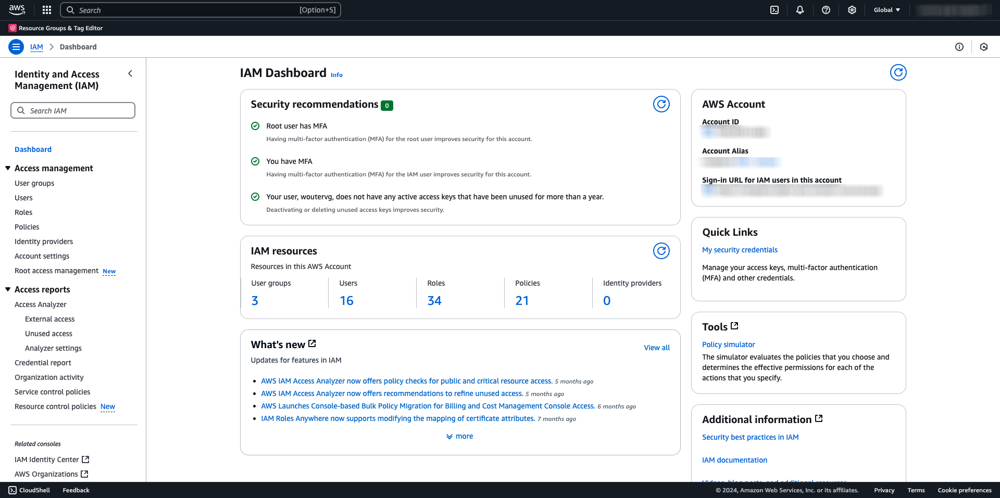
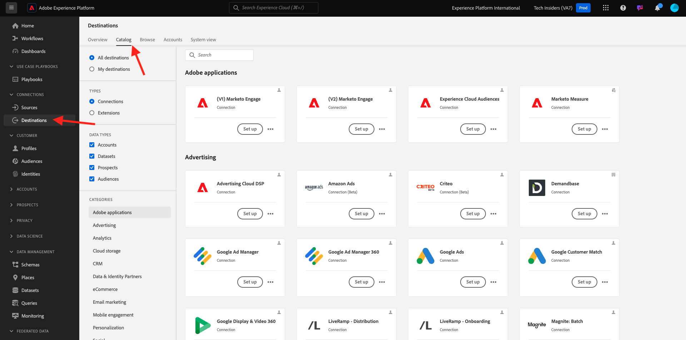

# 2.3.4 Tomar medidas: enviar a su audiencia a un destino S3

Adobe Experience Platform también tiene la capacidad de compartir audiencias con destinos de marketing de correo electrónico como Salesforce Marketing Cloud, Oracle Eloqua, Oracle Responsys y Adobe Campaign.

Puede utilizar FTP o SFTP como parte de los destinos específicos para cada uno de estos destinos de marketing de correo electrónico, o puede utilizar AWS S3 para intercambiar listas de clientes entre Adobe Experience Platform y estos destinos de marketing de correo electrónico.

En este módulo, configurará un destino de este tipo utilizando un contenedor de AWS S3.

## Cree su compartimento de S3

Vaya a [https://console.aws.amazon.com](https://console.aws.amazon.com) e inicie sesión.

>[!NOTE]
>
>Si todavía no tiene una cuenta de AWS, cree una nueva cuenta de AWS con su dirección de correo electrónico personal.

Después de iniciar sesión, se le redirigirá a **AWS Management Console**.

En la barra de búsqueda, busque **s3**. Haga clic en el primer resultado de búsqueda: **S3 - Almacenamiento escalable en la nube**.

Luego verá la página principal de **Amazon S3**. Haga clic en **Crear cubo**.

En la pantalla **Crear cubo**, use el nombre `aepmodulertcdp--aepUserLdap--`

Mantenga el resto de configuraciones predeterminadas tal cual. Desplácese hacia abajo y haga clic en **Crear cubo**.

A continuación, verá que se está creando su contenedor y se redirigirá a la página principal de Amazon S3.

## Definición de permisos para acceder al compartimento de S3

El siguiente paso es configurar el acceso a su S3 bucket.

Para ello, vaya a [https://console.aws.amazon.com/iam/home](https://console.aws.amazon.com/iam/home).

El acceso a los recursos de AWS está controlado por Identity and Access Management (IAM) de Amazon.

Ahora verá esta página.

En el menú de la izquierda, haga clic en **Usuarios**. Luego verá la pantalla **Usuarios**. Haga clic en **Crear usuario**.

A continuación, configure el usuario:

- Nombre de usuario: use `s3_--aepUserLdap--_rtcdp`

Haga clic en **Next**.

Entonces verá esta pantalla de permisos. Haga clic en **Adjuntar directivas directamente**.

Escriba el término de búsqueda **s3** para ver todas las directivas de S3 relacionadas. Seleccione la directiva **AmazonS3FullAccess**. Desplácese hacia abajo y haga clic en **Siguiente**.

Revise la configuración. Haga clic en **Crear usuario**.

Entonces verá esto... Haga clic en **Ver usuario**.

Haga clic en **Credenciales de seguridad** y luego haga clic en **Crear clave de acceso**.

Seleccione **Aplicación que se ejecuta fuera de AWS**. Desplácese hacia abajo y haga clic en **Siguiente**.

Haga clic en **Crear clave de acceso**

Entonces verá esto... Haz clic en **Mostrar** para ver tu clave de acceso secreta:

Tu **clave secreta de acceso** se está mostrando.

>[!IMPORTANT]
>
>Almacene sus credenciales en un archivo de texto en su equipo.
>
> - Id. de clave de acceso: ...
> - Clave de acceso secreta: ...
>
> Una vez que hagas clic en **Listo**, nunca volverás a ver tus credenciales.

Haga clic en **Finalizado**.

Ahora ha creado correctamente un contenedor de AWS S3 y ha creado un usuario con permisos para acceder a este contenedor.

## Configuración del destino en Adobe Experience Platform

Ir a [Adobe Experience Platform](https://experience.adobe.com/platform). Después de iniciar sesión, llegará a la página principal de Adobe Experience Platform.

Antes de continuar, debe seleccionar una **zona protegida**. La zona protegida que se va a seleccionar se denomina ``--aepSandboxName--``. Después de seleccionar la [!UICONTROL zona protegida] adecuada, verá el cambio en la pantalla y ahora se encuentra en la [!UICONTROL zona protegida] dedicada.

En el menú de la izquierda, ve a **Destinos** y luego ve a **Catálogo**. Verá el **Catálogo de destinos**.

Haga clic en **Almacenamiento en la nube** y, a continuación, haga clic en el botón **Configurar** (o en **Activar audiencias**, según su entorno) en la tarjeta **Amazon S3**.

Seleccione **Clave de acceso** como Tipo de cuenta. Utilice las credenciales de S3 que se le proporcionaron en el paso anterior:

| Identificador de clave de acceso | Clave de acceso secreta |
|:-----------------------:| :-----------------------:|
| AKIA..... | 7Icm..... |

Haga clic en **Conectar con destino**.

A continuación, verá una confirmación visual de que este destino está conectado.

Debe proporcionar los detalles del compartimento S3 para que Adobe Experience Platform pueda conectarse al compartimento S3.

Como convención de nombres, utilice la siguiente información:

| Identificador de clave de acceso | Clave de acceso secreta |
|:-----------------------:| :-----------------------:|
| Nombre | `AWS - S3 - --aepUserLdap--` |
| Descripción | `AWS - S3 - --aepUserLdap--` |
| Nombre del cubo | `aepmodulertcdp--aepUserLdap--` |
| Ruta de carpeta | /now |

Seleccionar **audiencias**.

Para **Tipo de archivo**, seleccione **CSV** y deje la configuración predeterminada sin cambios.

Desplácese hacia abajo. Para **Formato de compresión**, seleccione **Ninguno**. Haga clic en **Next**.

Ahora, de forma opcional, puede adjuntar una política de gobernanza de datos a su nuevo destino. Haga clic en **Next**.

En la lista de audiencias, busque la audiencia que creó en el ejercicio anterior `--aepUserLdap-- - Interest in Galaxy S24` y selecciónela. Haga clic en **Next**.

Entonces verá esto... Si lo desea, puede editar la programación y el nombre de archivo haciendo clic en el icono **lápiz**. Haga clic en **Next**.

Ahora puede seleccionar atributos de perfil para la exportación a AWS S3. Haga clic en **Agregar nuevo campo** y asegúrese de que el campo `--aepTenantId--.identification.core.ecid` se agrega y marca como **Clave de deduplicación**.

De forma opcional, puede añadir tantos otros atributos de perfil como sea necesario.

Una vez que haya agregado todos los campos, haga clic en **Siguiente**.

Revise la configuración. Haga clic en **Finalizar** para finalizar la configuración.

A continuación, volverá a la pantalla Activación de destino y verá cómo se agrega la audiencia a este destino.

Si desea agregar más exportaciones de audiencia, puede hacer clic en **Activar audiencias** para reiniciar el proceso y agregar más audiencias.

## Pasos siguientes

Ir a [2.3.5 Realizar acción: enviar la audiencia a Adobe Target](./ex5.md){target="_blank"}

Volver a [CDP en tiempo real: cree una audiencia y tome medidas](./real-time-cdp-build-a-segment-take-action.md){target="_blank"}

Volver a [Todos los módulos](./../../../../overview.md){target="_blank"}
