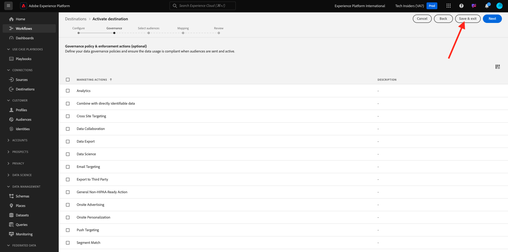

# 2.4.3 Configuración del destino de Azure Event Hub en Adobe Experience Platform

## Identificar los parámetros de conexión de Azure necesarios

Para configurar un destino de centro de eventos en Adobe Experience Platform, necesita lo siguiente:

- Área de nombres de Event Hubs
- Centro de eventos
- Nombre de clave SAS de Azure
- Clave SAS de Azure

El espacio de nombres EventHub y EventHub se definieron en el ejercicio anterior: [Configurar Event Hub en Azure](./ex2.md)

### Área de nombres de Event Hubs

Para buscar la información anterior en Azure Portal, vaya a [https://portal.azure.com/#home](https://portal.azure.com/#home). Asegúrese de que está utilizando la cuenta de Azure correcta.

Haga clic en **Todos los recursos** en su portal de Azure:

Busque su **Área de nombres de centros de eventos** en la lista y haga clic en ella.

El nombre de **Event Hubs Namespace** ya está claramente visible. Debe ser similar a `--aepUserLdap---aep-enablement`.

### Centro de eventos

En la página **Área de nombres de los centros de eventos**, haga clic en **Entidades > Centros de eventos** para obtener una lista de los centros de eventos definidos en el Área de nombres de los centros de eventos. Si ha seguido las convenciones de nomenclatura utilizadas en el ejercicio anterior, encontrará un centro de eventos denominado `--aepUserLdap---aep-enablement-event-hub`. Tome nota de ello, lo necesitará en el próximo ejercicio.

### Nombre de clave SAS

En su página **Área de nombres de los centros de eventos**, haga clic en **Configuración > Políticas de acceso compartido**. Verá una lista de directivas de acceso compartido. La clave SAS que estamos buscando es **RootManageSharedAccessKey**, que es el nombre de clave **SAS. ¡Anótalo!

### Valor de clave SAS

A continuación, haga clic en **RootManageSharedAccessKey** para obtener el valor de la clave SAS. Y presione el icono **Copiar al portapapeles** para copiar la **clave principal**, en este caso `pqb1jEC0KLazwZzIf2gTHGr75Z+PdkYgv+AEhObbQEY=`.

### Resumen de valores de destino

En este punto debería haber identificado todos los valores necesarios para definir el destino de Azure Event Hub en Adobe Experience Platform Real-time CDP.

| Nombre de atributo de destino | Valor de atributo de destino | Valor de ejemplo |
|---|---|---|
| sasKeyName | Nombre de clave SAS | RootManageSharedAccessKey |
| sasKey | Valor de clave SAS | pqb1jEC0KLazwZzIf2gTHGr75Z+PdkYgv+AEhObbQEY= |
| namespace | Área de nombres de Event Hubs | `--aepUserLdap---aep-enablement` |
| eventHubName | Centro de eventos | `--aepUserLdap---aep-enablement-event-hub` |

## Crear un destino de Azure Event Hub en Adobe Experience Platform

Inicie sesión en Adobe Experience Platform desde esta dirección URL: [https://experience.adobe.com/platform](https://experience.adobe.com/platform).

Después de iniciar sesión, llegará a la página principal de Adobe Experience Platform.

Antes de continuar, debe seleccionar una **zona protegida**. La zona protegida que se va a seleccionar se denomina ``--aepSandboxName--``. Después de seleccionar la zona protegida adecuada, verá que la pantalla cambia y ahora está en la zona protegida dedicada.

Vaya a **Destinos** y luego a **Catálogo**. Seleccione **Cloud Storage**, vaya a **Azure Event Hubs** y haga clic en **Configurar**.

Seleccione **Autenticación estándar**. Rellene los detalles de conexión que ha recopilado en el ejercicio anterior. A continuación, haga clic en **Conectar con destino**.

Si las credenciales son correctas, verá una confirmación: **Conectado**.

Ahora necesita escribir el nombre y la descripción con el formato `--aepUserLdap---aep-enablement`. Escriba **eventHubName** (consulte el ejercicio anterior, tiene este aspecto: `--aepUserLdap---aep-enablement-event-hub`) y haga clic en **Siguiente**.

Si lo desea, puede seleccionar una Política de control de datos. Haga clic en **Guardar y salir**.

El destino se habrá creado y estará disponible en Adobe Experience Platform.

## Pasos siguientes

Ir a [2.4.4 Crear una audiencia](./ex4.md){target="_blank"}

Volver a [Real-Time CDP: Audience Activation a Microsoft Azure Event Hub](./segment-activation-microsoft-azure-eventhub.md){target="_blank"}

Volver a [Todos los módulos](./../../../../overview.md){target="_blank"}
