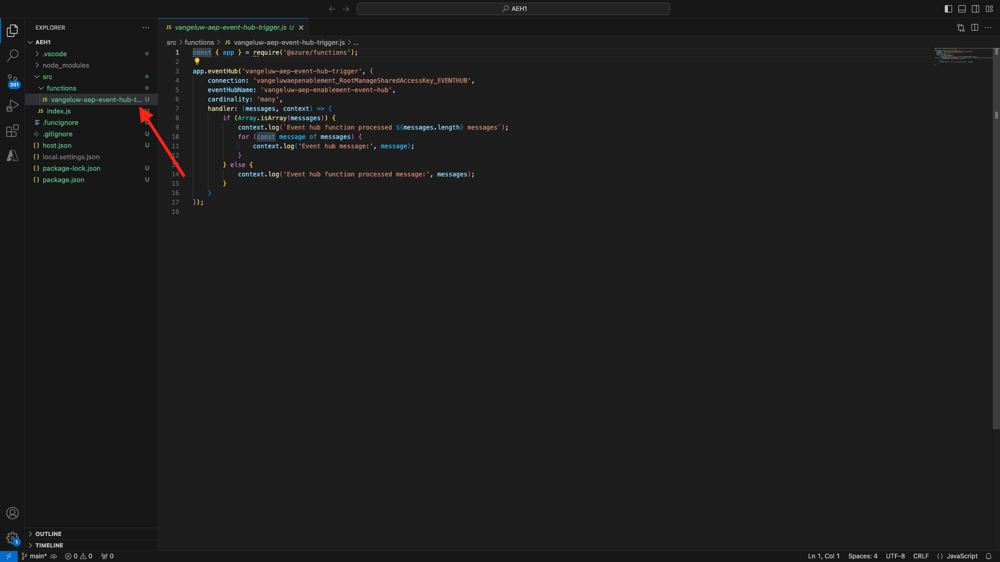

# 2.4.6 Crear su proyecto de Microsoft Azure

## Familiarizarse con las funciones de Azure Event Hub

Las funciones de Azure le permiten ejecutar pequeños fragmentos de código (llamados **funciones**) sin tener que preocuparse por la infraestructura de la aplicación. Con Azure Functions, la infraestructura en la nube proporciona todos los servidores actualizados que necesita para mantener su aplicación ejecutándose a escala.
Una función está **desencadenada** por un tipo de evento específico. Los déclencheur admitidos son responder a cambios en los datos, responder a mensajes (por ejemplo, Event Hubs), ejecutarse en una programación o como resultado de una solicitud HTTP.
Azure Functions es un servicio de computación sin servidor que le permite ejecutar código activado por eventos sin tener que aprovisionar ni administrar explícitamente la infraestructura.
Azure Event Hubs se integra con Azure Functions para una arquitectura sin servidor.
## Abra Código de Visual Studio e inicie sesión en Azure

Visual Studio Code facilita la tarea de...
- definir y enlazar funciones de Azure a Event Hubs- probar localmente- implementar en Azure- ejecución de función de registro remoto
### Abrir código de Visual Studio

### Iniciar sesión en Azure

Cuando inicia sesión con su cuenta de Azure utilizada para registrarse en el ejercicio anterior, Visual Studio Code le permitirá encontrar y enlazar todos los recursos de Event Hub.
Abra Visual Studio Code y haga clic en el icono **Azure**.
A continuación, seleccione **Iniciar sesión en Azure**:

Se le redirigirá a su explorador para iniciar sesión. Recuerde seleccionar la cuenta de Azure que utilizó para registrarse.
Cuando vea la siguiente pantalla en el explorador, iniciará sesión con Visual Code Studio:

Vuelva a Visual Code Studio (verá el nombre de su suscripción de Azure, por ejemplo **suscripción de Azure 1**):

## Crear un proyecto de Azure

Haga clic en **Crear proyecto de función...**:

Seleccione o cree una carpeta local de su elección para guardar el proyecto y haga clic en **Seleccionar**:

A continuación, se abrirá el asistente para la creación de proyectos. Haga clic en **Javascript** como idioma para su proyecto:

Luego seleccione **Modelo v4**.

Seleccione **déclencheur de Azure Event Hub** como primera plantilla de función del proyecto:

Escriba un nombre para la función, use el siguiente formato `--aepUserLdap---aep-event-hub-trigger` y presione Intro:

Seleccione **Crear nueva configuración de aplicación local**:

Haga clic aquí para seleccionar el área de nombres del centro de eventos que creó anteriormente, que se denomina `--aepUserLdap---aep-enablement`.

A continuación, haga clic para seleccionar el centro de eventos que creó anteriormente, que se llama `--aepUserLdap---aep-enablement-event-hub`.

Haga clic para seleccionar **RootManageSharedAccessKey** como directiva de Event Hub:

Seleccione **Agregar al espacio de trabajo** sobre cómo abrir el proyecto:

Entonces puedes recibir un mensaje como este. En ese caso, haga clic en **Sí, confío en los autores**.

Una vez creado el proyecto, abra el archivo `--aepUserLdap---aep-event-hub-trigger.js` en el editor:

La carga útil enviada por Adobe Experience Platform a su centro de eventos tendrá este aspecto:
```json
{
  "identityMap": {
    "ecid": [
      {
        "id": "36281682065771928820739672071812090802"
      }
    ]
  },
  "segmentMembership": {
    "ups": {
      "94db5aed-b90e-478d-9637-9b0fad5bba11": {
        "createdAt": 1732129904025,
        "lastQualificationTime": "2024-11-21T07:33:52Z",
        "mappingCreatedAt": 1732130611000,
        "mappingUpdatedAt": 1732130611000,
        "name": "vangeluw - Interest in Plans",
        "status": "realized",
        "updatedAt": 1732129904025
      }
    }
  }
}
```

Actualice el código en `--aepUserLdap---aep-event-hub-trigger.js` de su código de Visual Studio con el código siguiente. Este código se ejecutará cada vez que Real-time CDP envíe las cualificaciones de audiencia a su destino de centro de eventos. En este ejemplo, el código trata solo de mostrar la carga útil entrante, pero se puede imaginar cualquier tipo de función adicional para procesar cualificaciones de audiencia en tiempo real y utilizarlas más adelante en el ecosistema de canalización de datos.
La línea 11 del archivo `--aepUserLdap---aep-event-hub-trigger.js` muestra actualmente lo siguiente:
```javascript
context.log('Event hub message:', message);
```

Cambie la línea 11 de `--aepUserLdap---aep-event-hub-trigger.js` para que tenga el siguiente aspecto:
```javascript
context.log('Event hub message:', JSON.stringify(message));
```

La carga útil total debe ser así:
```javascript
const { app } = require('@azure/functions');

app.eventHub('--aepUserLdap---aep-event-hub-trigger', {
    connection: '--aepUserLdap--aepenablement_RootManageSharedAccessKey_EVENTHUB',
    eventHubName: '--aepUserLdap---aep-enablement-event-hub',
    cardinality: 'many',
    handler: (messages, context) => {
        if (Array.isArray(messages)) {
            context.log(`Event hub function processed ${messages.length} messages`);
            for (const message of messages) {
                context.log('Event hub message:', message);
            }
        } else {
            context.log('Event hub function processed message:', messages);
        }
    }
});
```


El resultado debería ser similar al siguiente:

## Ejecutar proyecto de Azure

Ahora es el momento de ejecutar su proyecto. En esta fase no implementaremos el proyecto en Azure. Lo ejecutaremos localmente en modo de depuración. Seleccione el icono Ejecutar y haga clic en la flecha verde.

La primera vez que ejecute el proyecto en modo de depuración, tendrá que adjuntar una cuenta de almacenamiento de Azure y hacer clic en **Seleccionar cuenta de almacenamiento**.

y, a continuación, seleccione la cuenta de almacenamiento que creó anteriormente, que se denomina `--aepUserLdap--aepstorage`.

El proyecto ya está en funcionamiento y se está mostrando para eventos en el centro de eventos. En el siguiente ejercicio demostrará el comportamiento en el sitio web de demostración de CitiSignal, que le cualificará para recibir audiencias. Como resultado, recibirá una carga útil de calificación de audiencia en el terminal de su función de déclencheur del centro de eventos.

## Detener proyecto de Azure

Para detener el proyecto, ve al menú **CALL STACK** en VSC, haz clic en la flecha del proyecto en ejecución y luego haz clic en **Detener**.

## Pasos siguientes

Ir a [2.4.7 escenario de extremo a extremo](./ex7.md){target="_blank"}
Volver a [Real-Time CDP: Audience Activation a Microsoft Azure Event Hub](./segment-activation-microsoft-azure-eventhub.md){target="_blank"}
Volver a [Todos los módulos](./../../../../overview.md){target="_blank"}
