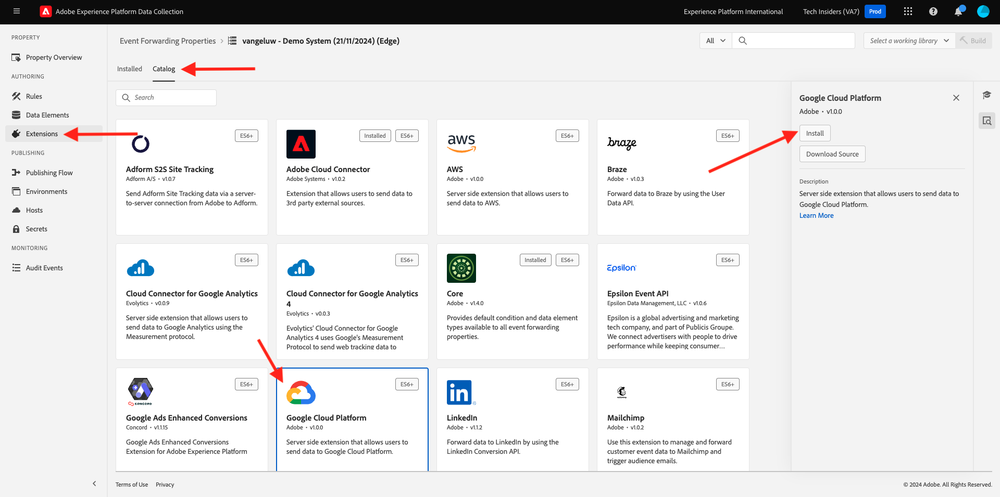

# 2.5.4 Reenviar eventos a GCP Pub/Sub

>[!NOTE]
>
>Para este ejercicio, necesita acceder a un entorno de Google Cloud Platform. Si todavía no tiene acceso a GCP, cree una nueva cuenta con su dirección de correo electrónico personal.

## Cree su Pub/Subtema de Google Cloud

Vaya a [https://console.cloud.google.com/](https://console.cloud.google.com/). En la barra de búsqueda, escriba `pub/sub`. Haga clic en el resultado de búsqueda **Pub/Sub - Global real-time messaging**.

Entonces verá esto... Haga clic en **CREAR TEMA**.

Entonces verá esto... Para el identificador de tema, use `--aepUserLdap---event-forwarding`. Haga clic en **Crear**.

Se creará el tema. Haga clic en **ID de suscripción** del tema.

Entonces verá esto... Copie el **nombre del tema** en el portapapeles y guárdelo, tal como lo necesitará en los próximos ejercicios.

Ahora vamos al reenvío de eventos de recopilación de datos de Adobe Experience Platform para actualizar la propiedad de reenvío de eventos y comenzar a reenviar eventos a Pub/Sub.

## Actualice la propiedad del reenvío de eventos: Secrets

Los **secretos** de las propiedades de reenvío de eventos se usan para almacenar credenciales que se usarán para autenticarse en las API externas. En este ejemplo, debe configurar un secreto para almacenar el token OAuth de Google Cloud Platform, que se utilizará para autenticar al utilizar Pub/Sub para transmitir datos hacia GCP.

Vaya a [https://experience.adobe.com/#/data-collection/](https://experience.adobe.com/#/data-collection/) y luego a **Secretos**. Haga clic en **Crear nuevo secreto**.

Entonces verá esto... Siga estas instrucciones:

- Nombre: use `--aepUserLdap---gcp-secret`
- Entorno de destino: seleccionar **Desarrollo**
- Tipo: **Google OAuth 2**
- Marque la casilla de verificación de **Pub/Sub**

Haga clic en **Crear secreto**.

Después de hacer clic en **Crear secreto**, verá una ventana emergente para configurar la autenticación entre el secreto de la propiedad de reenvío de eventos y Google. Haga clic en **Crear y autorizar secreto `--aepUserLdap---gcp-secret` con Google**.

Haga clic en para seleccionar su cuenta de Google.

Haga clic en **Continuar**.

>[!NOTE]
>
>El mensaje emergente puede variar. Autorice o permita el acceso solicitado para continuar con el ejercicio.

Después de autenticarse correctamente, verá esto.

El secreto se ha configurado correctamente y se puede utilizar en un elemento de datos.

## Actualice la propiedad de reenvío de eventos: elemento de datos

Para utilizar el secreto en la propiedad de reenvío de eventos, debe crear un elemento de datos que almacene el valor del secreto.

Vaya a [https://experience.adobe.com/#/data-collection/](https://experience.adobe.com/#/data-collection/) y luego a **Reenvío de eventos**. Busque la propiedad Reenvío de eventos y haga clic en ella para abrirla.

En el menú de la izquierda, vaya a **Elementos de datos**. Haga clic en **Agregar elemento de datos**.

Configure el elemento de datos de esta manera:

- Nombre: **Secreto de GCP**
- Extensión: **Core**
- Tipo de elemento de datos: **Secreto**
- Secreto de desarrollo: seleccione el secreto que creó, que se llama `--aepUserLdap---gcp-secret`

Haga clic en **Guardar**.

## Actualice la propiedad de reenvío de eventos: Extensión

Con el Secreto y el Elemento de datos configurados, ahora puede configurar la extensión para Google Cloud Platform en la propiedad Reenvío de eventos.

Vaya a [https://experience.adobe.com/#/data-collection/](https://experience.adobe.com/#/data-collection/), vaya a **Reenvío de eventos** y abra su propiedad de Reenvío de eventos.

A continuación, vaya a **Extensions**, para **Catalog**. Haga clic en la extensión **Google Cloud Platform** y luego en **Instalar**.

Entonces verá esto... Haga clic en el icono Elemento de datos.

Seleccione el elemento de datos que creó en el ejercicio anterior, que se llama **Secreto GCP**. Haga clic en **Seleccionar**.

Entonces verá esto... Haga clic en **Guardar**.

## Actualizar la propiedad de reenvío de eventos: Actualizar una regla

Ahora que la extensión de Google Cloud Platform está configurada, puede definir una regla para comenzar a reenviar datos de evento a su tema de publicación/subtema. Para ello, deberá actualizar la regla **Todas las páginas** que creó en uno de los ejercicios anteriores.

En el menú de la izquierda, ve a **Reglas**. En el ejercicio anterior creó la regla **Todas las páginas**. Haga clic en esa regla para abrirla.

Entonces vas a hacer esto. Haga clic en el icono **+** debajo de **Acciones** para agregar una acción nueva.

Entonces verá esto... Realice la siguiente selección:

- Seleccione la **extensión**: **Google Cloud Platform**.
- Seleccione **Tipo de acción**: **Enviar datos a Cloud Pub/Sub**.

Esto debería darle este **Nombre**: **Google Cloud Platform - Enviar datos a Cloud Pub/Sub**. Ahora debería ver esto:

Ahora debe configurar el tema Pub/Sub que creó anteriormente.

Puede encontrar el **nombre del tema** aquí, cópielo.

Pegue **Topic name** en la configuración de regla. A continuación, haga clic en el icono Elemento de datos junto al campo **Datos (obligatorios)**.

Seleccione **Evento XDM** y haga clic en **Seleccionar**.

Entonces verá esto... Haga clic en **Conservar cambios**.

Haga clic en **Guardar**.

Entonces verá esto...

## Publicación de los cambios

La configuración ha finalizado. Vaya a **Flujo de publicación** para publicar los cambios. Abra la biblioteca de desarrollo **Main** haciendo clic en **Editar** como se indica.

Haga clic en el botón **Agregar todos los recursos modificados**, tras lo cual verá que la regla y el elemento de datos aparecen en esta biblioteca. A continuación, haga clic en **Guardar y generar para desarrollo**. Los cambios se están implementando.

Después de un par de minutos, verá que la implementación está completa y lista para probarse.

## Pruebe la configuración

Vaya a [https://dsn.adobe.com](https://dsn.adobe.com). Después de iniciar sesión con su Adobe ID, verá esto. Haga clic en los 3 puntos **...** del proyecto del sitio web y, a continuación, haga clic en **Ejecutar** para abrirlo.

A continuación, verá cómo se abre el sitio web de demostración. Seleccione la URL y cópiela en el portapapeles.

Abra una nueva ventana del explorador de incógnito.

Pegue la dirección URL del sitio web de demostración, que copió en el paso anterior. Luego se le pedirá que inicie sesión con su Adobe ID.

Seleccione el tipo de cuenta y complete el proceso de inicio de sesión.

Luego verá el sitio web cargado en una ventana de incógnito del explorador. Para cada ejercicio, deberá utilizar una ventana nueva del explorador de incógnito para cargar la URL del sitio web de demostración.

Cambie la vista a su Google Cloud Pub/Sub y vaya a **MESSAGES**. Haz clic en **EXTRAER** y después de unos segundos verás algunos mensajes en la lista. Haga clic en un mensaje para visualizar su contenido.

Ahora puede ver la carga útil XDM del evento en Google Pub/Sub. Ahora ha enviado correctamente los datos recopilados por la recopilación de datos de Adobe Experience Platform, en tiempo real, a un extremo Pub/Sub de Google Cloud. A partir de ahí, esos datos se pueden utilizar en cualquier aplicación de Google Cloud Platform, como BigQuery para almacenamiento y creación de informes o para casos de uso de aprendizaje automático.

## Pasos siguientes

Ir a [2.5.5 Reenviar eventos a AWS Kinesis y AWS S3](./ex5.md){target="_blank"}

Volver a [Conexiones de Real-Time CDP: reenvío de eventos](./aep-data-collection-ssf.md){target="_blank"}

Volver a [Todos los módulos](./../../../../overview.md){target="_blank"}
