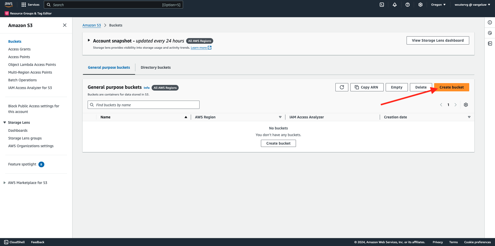
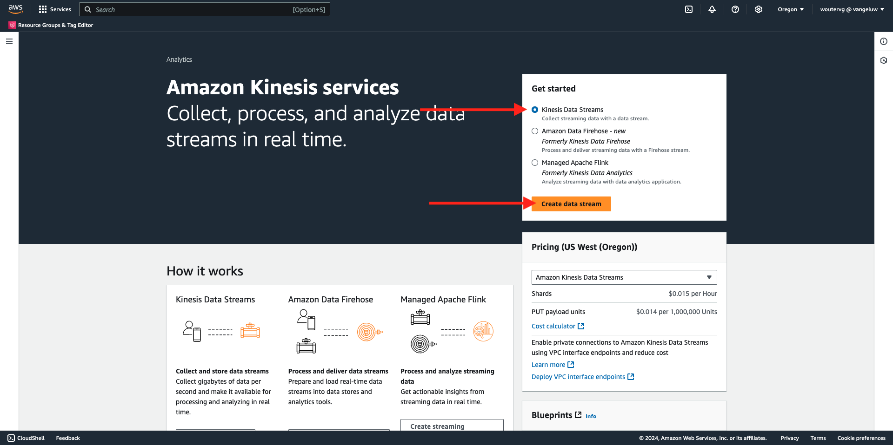
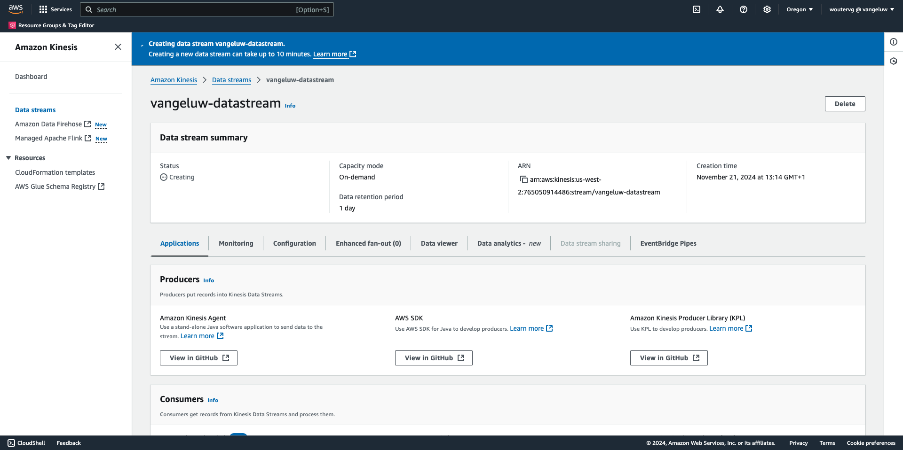
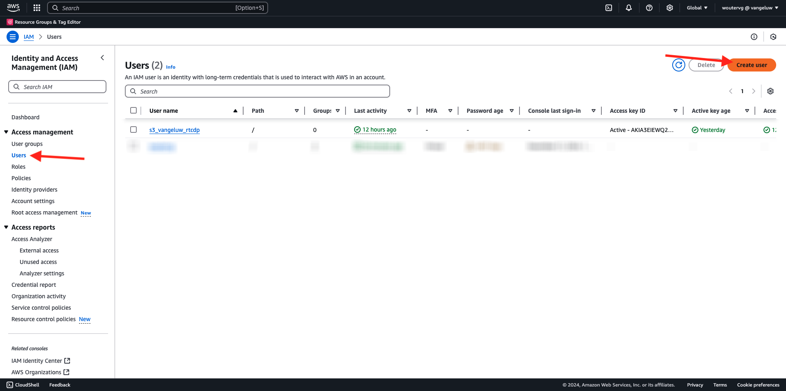
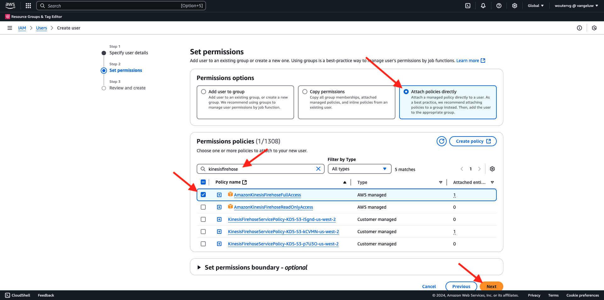
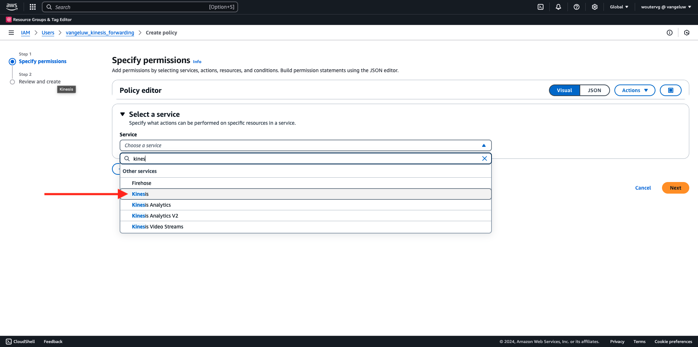
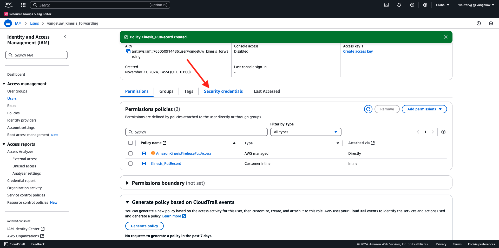
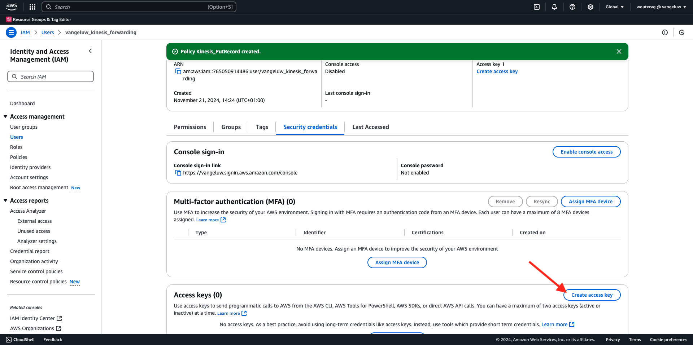
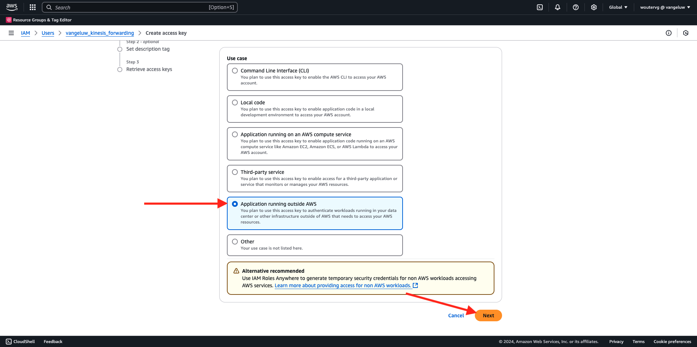

# 2.5.5 Reenviar eventos a AWS Kinesis y AWS S3

>[!IMPORTANT]
>
>La finalización de este ejercicio es opcional y conlleva un coste utilizar AWS Kinesis. Aunque AWS proporciona una cuenta de nivel gratuita que le permite probar y configurar muchos servicios sin coste, AWS Kinesis no forma parte de esa cuenta de nivel gratuita. Por lo tanto, para implementar y probar este ejercicio, será necesario un coste para utilizar AWS Kinesis.

## Es bueno saber

Adobe Experience Platform admite varios servicios de Amazon como destino.
Kinesis y S3 son [destinos de exportación de perfiles](https://experienceleague.adobe.com/docs/experience-platform/destinations/destination-types.html?lang=en) y se pueden usar como parte de Real-Time CDP de Adobe Experience Platform.
Puede incorporar fácilmente eventos de segmentos de alto valor y atributos de perfil asociados a sus sistemas de elección.

En este ejercicio, aprenderá a configurar su propio flujo de Amazon Kinesis para transmitir datos de evento procedentes del ecosistema de Adobe Experience Platform Edge a un destino de almacenamiento en la nube, como Amazon S3. Esto resulta útil en caso de que desee recopilar eventos de experiencia de propiedades web y móviles e insertarlos en el conjunto de datos para su análisis e informes operativos. Por lo general, los conjuntos de datos consumen datos por lotes con grandes importaciones diarias de archivos, y no exponen puntos finales http públicos que podrían utilizarse junto con el reenvío de eventos.

La compatibilidad con los casos de uso anteriores implica que los datos transmitidos deben almacenarse en búfer o colocarse en cola antes de escribirse en un archivo. Se debe tener cuidado de no abrir el archivo para tener acceso de escritura en varios procesos. Delegar esta tarea en un sistema dedicado es ideal para escalar bien mientras se garantiza un gran nivel de servicio, aquí es donde Kinesis viene al rescate.

Amazon Kinesis Data Streams se centra en la ingesta y el almacenamiento de flujos de datos. Kinesis Data Firefox se centra en entregar flujos de datos a destinos seleccionados, como bloques de S3.

Como parte de este ejercicio, usted...

- Realizar una configuración básica de un flujo de datos de Kinesis
- Cree un flujo de entrega de Firefox y utilice el compartimento S3 como destino
- Configure la puerta de enlace de la API de Amazon como extremo de la API REST para recibir los datos de evento
- Reenviar datos de evento sin procesar del Edge de Adobe a su flujo Kinesis

## Configuración del compartimento de AWS S3

Vaya a [https://console.aws.amazon.com](https://console.aws.amazon.com) e inicie sesión con su cuenta de Amazon.

Después de iniciar sesión, se le redirigirá a **AWS Management Console**.

En el menú **Buscar servicios**, busque **s3**. Haga clic en el primer resultado de búsqueda: **S3 - Almacenamiento escalable en la nube**.

Luego verá la página principal de **Amazon S3**. Haga clic en **Crear cubo**.

En la pantalla **Crear cubo**, debe configurar dos cosas:

- Nombre: use el nombre `eventforwarding---aepUserLdap--`.

Mantenga el resto de configuraciones predeterminadas tal cual. Desplácese hacia abajo y haga clic en **Crear cubo**.

A continuación, verá que se está creando su contenedor y se redirigirá a la página principal de Amazon S3.

## Configuración del flujo de datos de AWS Kinesis

En el menú **Buscar servicios**, busque **kinesis**. Haga clic en el primer resultado de búsqueda: **Kinesis - Trabajar con datos de flujo en tiempo real**.

Seleccione **Flujos de datos Kinesis**. Haga clic en **Crear flujo de datos**.

Para el **nombre de secuencia de datos**, use `--aepUserLdap---datastream`.

No es necesario cambiar ninguna de las otras opciones de configuración. Desplácese hacia abajo y haga clic en **Crear flujo de datos**.

Entonces verá esto... Una vez que el flujo de datos se haya creado correctamente, puede pasar al siguiente ejercicio.

## Configuración del flujo de entrega de AWS Firefox

En el menú **Buscar servicios**, busque **kinesis**. Haga clic en **Fuego de datos Kinesis**.

Haga clic en **Crear flujo de Firefox**.

Para **Source**, seleccione **Amazon Kinesis Data Streams**. Para **Destino**, seleccione **Amazon S3**. Haga clic en **Examinar** para seleccionar el flujo de datos.

Seleccione el flujo de datos. Haga clic en **Elegir**.

Entonces verá esto... Recuerde el **nombre de secuencia de Firefox**, ya que lo necesitará más adelante.

Desplácese hacia abajo hasta que vea **Configuración de destino**. Haga clic en **Examinar** para seleccionar el espacio de S3.

Seleccione su compartimento de S3 y haga clic en **Elegir**.

Entonces verás algo como esto. Actualice la siguiente configuración:

- Nuevo delimitador de línea: establecer en **Habilitado**
- Partición dinámica: establecer en **No habilitado**

Desplácese un poco más hacia abajo y haga clic en **Crear flujo de Firefox**

Después de un par de minutos, se creará el flujo de Firefox y se activará **Active**.

## Crear usuario de IAM

En el menú izquierdo de AWS IAM, haga clic en **Usuarios**. Luego verá la pantalla **Usuarios**. Haga clic en **Crear usuario**.

A continuación, configure el usuario:

- Nombre de usuario: use `--aepUserLdap--_kinesis_forwarding`

Haga clic en **Next**.

Entonces verá esta pantalla de permisos. Haga clic en **Adjuntar directivas directamente**.

Escriba el término de búsqueda **kinesisfirehouse** para ver todas las directivas relacionadas. Seleccione la directiva **AmazonKinesisFireHouseFullAccess**. Desplácese hacia abajo y haga clic en **Siguiente**.

Revise la configuración. Haga clic en **Crear usuario**.

Entonces verá esto... Haga clic en **Ver usuario**.

Haga clic en **Agregar permisos** y haga clic en **Crear directiva en línea**.

Entonces verá esto... Seleccione el servicio **Kinesis**.

Vaya a **Escribir** y marque la casilla de verificación de **PutRecord**.

Desplácese hasta **Recursos** y seleccione **Todos**. Haga clic en **Next**.

Asigne un nombre a la clave de su directiva de la siguiente manera: **Kinesis_PutRecord** y haga clic en **Crear directiva**.

Entonces verá esto... Haga clic en **credenciales de seguridad**.

Haga clic en **Crear clave de acceso**.

Seleccione **Aplicación que se ejecuta fuera de AWS**. Desplácese hacia abajo y haga clic en **Siguiente**.

Haga clic en **Crear clave de acceso**

Entonces verá esto... Haz clic en **Mostrar** para ver tu clave de acceso secreta:

Tu **clave secreta de acceso** se está mostrando.

>[!IMPORTANT]
>
>Almacene sus credenciales en un archivo de texto en su equipo.
>
> - Id. de clave de acceso: ...
> - Clave de acceso secreta: ...
>
> Una vez que hagas clic en **Listo**, nunca volverás a ver tus credenciales.

Haga clic en **Finalizado**.

Ahora ha creado correctamente un usuario de IAM con los permisos adecuados, que deberá especificar al configurar la extensión de AWS en la propiedad Reenvío de eventos.

## Actualice la propiedad de reenvío de eventos: Extensión

Con el Secreto y el Elemento de datos configurados, ahora puede configurar la extensión para Google Cloud Platform en la propiedad Reenvío de eventos.

Vaya a [https://experience.adobe.com/#/data-collection/](https://experience.adobe.com/#/data-collection/), vaya a **Reenvío de eventos** y abra su propiedad de Reenvío de eventos.

A continuación, vaya a **Extensions**, para **Catalog**. Haga clic en la extensión **AWS** y luego en **Instalar**.

Introduzca las credenciales de usuario de IAM que generó en el ejercicio anterior. Haga clic en **Guardar**.

A continuación, debe configurar una regla que comience a reenviar datos de evento a Kinesis.

## Actualice la propiedad de reenvío de eventos: Regla

En el menú de la izquierda, ve a **Reglas**. Haga clic para abrir la regla **Todas las páginas** que creó en uno de los ejercicios anteriores.

Entonces verá esto... Haga clic en el icono **+** para agregar una acción nueva.

Entonces verá esto... Realice la siguiente selección:

- Seleccione la **extensión**: **AWS**
- Seleccione el **Tipo de acción**: **Enviar datos a la secuencia de datos de Kinesis**
- Nombre: **AWS - Enviar datos a Kinesis Data Stream**

Ahora debería ver esto:

A continuación, configure lo siguiente:

- Nombre de secuencia: `--aepUserLdap---datastream`
- Región de AWS: Compruebe su región en la configuración del flujo de datos de AWS
- Clave de partición: **0**

Puede ver la región de AWS aquí:

Ahora debería tener esto. A continuación, haga clic en el icono del elemento de datos para el campo **Datos**.

Seleccione **Evento XDM** y haga clic en **Seleccionar**.

Entonces, tendrás esto. Haga clic en **Conservar cambios**.

Entonces verá esto... Haga clic en **Guardar**.

Vaya a **Flujo de publicación** para publicar los cambios.
Abra la biblioteca de desarrollo haciendo clic en **Principal**.

Haga clic en el botón **Agregar todos los recursos modificados**, tras lo cual verá que los cambios de reglas y elementos de datos aparecen en esta biblioteca. A continuación, haga clic en **Guardar y generar para desarrollo**. Los cambios se están implementando.

Después de un par de minutos, verá que la implementación está completa y lista para probarse.

## Pruebe la configuración

Vaya a [https://dsn.adobe.com](https://dsn.adobe.com). Después de iniciar sesión con su Adobe ID, verá esto. Haga clic en los 3 puntos **...** del proyecto del sitio web y, a continuación, haga clic en **Ejecutar** para abrirlo.

A continuación, verá cómo se abre el sitio web de demostración. Seleccione la URL y cópiela en el portapapeles.

Abra una nueva ventana del explorador de incógnito.

Pegue la dirección URL del sitio web de demostración, que copió en el paso anterior. Luego se le pedirá que inicie sesión con su Adobe ID.

Seleccione el tipo de cuenta y complete el proceso de inicio de sesión.

Luego verá el sitio web cargado en una ventana de incógnito del explorador. Para cada ejercicio, deberá utilizar una ventana nueva del explorador de incógnito para cargar la URL del sitio web de demostración.

Cambia tu vista a **AWS**. Al abrir el flujo de datos y entrar en la ficha **Supervisión**, ahora verá tráfico entrante.

Cuando abra el flujo de Data FireHub y entre en la ficha **Supervisión**, también verá tráfico entrante.

Por último, cuando eche un vistazo al compartimento de S3, verá que se están creando archivos como consecuencia de la ingesta de datos.

Al descargar un archivo de este tipo y abrirlo con un editor de texto, verá que contiene la carga útil XDM de los eventos reenviados.

>[!IMPORTANT]
>
>Una vez que tu configuración funcione según lo esperado, no olvides apagar tu AWS Kinesis Data Stream y Data Firehouse para evitar que se te cobre.

## Pasos siguientes

Ir a [Resumen y beneficios](./summary.md){target="_blank"}

Volver a [Conexiones de Real-Time CDP: reenvío de eventos](./aep-data-collection-ssf.md){target="_blank"}

Volver a [Todos los módulos](./../../../../overview.md){target="_blank"}
