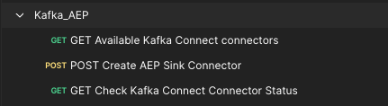
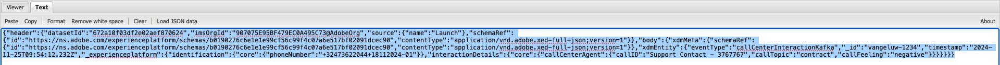

# 2.6.4 Instalar y configurar Kafka Connect y el conector del receptor de Adobe Experience Platform

## Descargar el conector del receptor de Adobe Experience Platform

Vaya a [https://github.com/adobe/experience-platform-streaming-connect/releases](https://github.com/adobe/experience-platform-streaming-connect/releases) y descargue la última versión oficial del conector del receptor de Adobe Experience Platform.


Descargue el archivo **streaming-connect-sink-0.0.27-java-11.jar**.


Coloque el archivo de descarga **streaming-connect-sink-0.0.27-java-11.jar** en el escritorio.


## Configuración de Kafka Connect

Vaya a la carpeta del escritorio **Kafka_AEP** y luego a la carpeta `kafka_2.13-3.9.0/config`.
En esa carpeta, abra el archivo **connect-distributed.properties** con cualquier Editor de texto.


En el Editor de texto, vaya a las líneas 34 y 35 y asegúrese de establecer los campos `key.converter.schemas.enable` y `value.converter.schemas.enable` en `false`

```json
key.converter.schemas.enable=false
value.converter.schemas.enable=false
```

Guarde los cambios en este archivo.


A continuación, vuelva a la carpeta `kafka_2.13-3.1.0`, cree manualmente una nueva carpeta y asígnele el nombre `connectors`.


Haga clic con el botón derecho en la nueva carpeta y haga clic en **Nuevo terminal en la carpeta**.


Entonces verá esto... Escriba el comando `pwd` para recuperar la ruta de acceso completa de esa carpeta. Seleccione la ruta completa y cópiela en el portapapeles.


Vuelva al Editor de texto, al archivo **connect-distributed.properties** y desplácese hacia abajo hasta la última línea (línea 89 de la captura de pantalla). Debe quitar los comentarios de la línea (quitar `#`) que comienza por `# plugin.path=` y pegar la ruta completa en la carpeta denominada `connectors`. El resultado debería ser similar al siguiente:

`plugin.path=/Users/woutervangeluwe/Desktop/Kafka_AEP/kafka_2.13-3.9.0/connectors`

Guarde los cambios en el archivo **connect-distributed.properties** y cierre el Editor de texto.


A continuación, copie la última versión oficial del conector del receptor de Adobe Experience Platform que descargó en la carpeta `connectors`. El archivo que descargó anteriormente se llama **streaming-connect-sink-0.0.27-java-11.jar**, simplemente puede moverlo a la carpeta `connectors`.


A continuación, abre una nueva ventana de terminal al nivel de la carpeta **kafka_2.13-3.9.0**. Haga clic con el botón secundario en esa carpeta y haga clic en **Nuevo terminal en la carpeta**.

En la ventana Terminal, pegue este comando: `bin/connect-distributed.sh config/connect-distributed.properties` y haga clic en **Entrar**. Este comando inicia Kafka Connect y carga la biblioteca del conector del receptor de Adobe Experience Platform.


Después de un par de segundos, verá algo así:


## Creación del conector del receptor de Adobe Experience Platform mediante Postman

Ahora puede interactuar con Kafka Connect mediante Postman. Para ello, descargue [esta colección de Postman](./../../../../assets/postman/postman_kafka.zip) y descomprima la colección en el equipo local del equipo de escritorio. Luego tendrá un archivo que se llama `Kafka_AEP.postman_collection.json`.


Debe importar este archivo en Postman. Para ello, abra Postman, haga clic en **Importar**, arrastre y suelte el archivo `Kafka_AEP.postman_collection.json` en la ventana emergente y haga clic en **Importar**.


A continuación, encontrará esta colección en el menú izquierdo de Postman. Haga clic en la primera solicitud, **Conectores Kafka Connect disponibles para GET** para abrirla.



Entonces verá esto... Haga clic en el botón azul **Enviar**, después del cual debería ver una respuesta vacía `[]`. La respuesta vacía se debe al hecho de que no hay conectores de Kafka Connect definidos actualmente.


Para crear un conector, haga clic para abrir la segunda solicitud en la colección Kafka, **POST Crear conector de receptor de AEP** y vaya a **Cuerpo**. Entonces verá esto... En la línea 11, donde dice **&quot;aep.endpoint&quot;: &quot;&quot;**, debe pegar en la URL del extremo de streaming de la API HTTP que recibió al final de uno de los ejercicios anteriores. La dirección URL del extremo de flujo HTTP API tiene el siguiente aspecto: `https://dcs.adobedc.net/collection/63751d0f299eeb7aa48a2f22acb284ed64de575f8640986d8e5a935741be9067`.


Después de pegarlo, el cuerpo de la solicitud debe tener este aspecto. Haga clic en el botón azul **Enviar** para crear el conector. Obtendrá una respuesta inmediata de la creación del conector.


Haga clic en la primera solicitud, **Conectores Kafka Connect disponibles para GET**, para abrirlo de nuevo y vuelva a hacer clic en el botón azul **Enviar**. ahora verá que existe un conector Kafka Connect.


A continuación, abra la tercera solicitud de la colección Kafka, **GET Check Kafka Connect Connector Status**. Haga clic en el botón azul **Enviar** y obtendrá una respuesta como la que se muestra a continuación, que indica que el conector se está ejecutando.


## Produzca un evento de experiencia

Abra una nueva ventana de **Terminal** haciendo clic con el botón derecho en la carpeta **kafka_2.13-3.9.0** y luego en **Nuevo terminal en la carpeta**.


Introduzca el siguiente comando:

`bin/kafka-console-producer.sh --broker-list 127.0.0.1:9092 --topic aep`

Entonces verá esto... Cada nueva línea seguida de presionar el botón Entrar dará como resultado que se envíe un nuevo mensaje al tema **aep**.


Ahora puede enviar un mensaje, que hará que Adobe Experience Platform Sink Connector lo consuma y que se incorporará a Adobe Experience Platform en tiempo real.

Tome la siguiente carga útil de evento de experiencia de ejemplo y cópiela en un editor de texto.

```json
{
  "header": {
    "datasetId": "61fe23fd242870194a6d779c",
    "imsOrgId": "--aepImsOrgID--",
    "source": {
      "name": "Launch"
    },
    "schemaRef": {
      "id": "https://ns.adobe.com/experienceplatform/schemas/b0190276c6e1e1e99cf56c99f4c07a6e517bf02091dcec90",
      "contentType": "application/vnd.adobe.xed-full+json;version=1"
    }
  },
  "body": {
    "xdmMeta": {
      "schemaRef": {
        "id": "https://ns.adobe.com/experienceplatform/schemas/b0190276c6e1e1e99cf56c99f4c07a6e517bf02091dcec90",
        "contentType": "application/vnd.adobe.xed-full+json;version=1"
      }
    },
    "xdmEntity": {
      "eventType": "callCenterInteractionKafka",
      "_id": "",
      "timestamp": "2024-11-25T09:54:12.232Z",
      "_experienceplatform": {
        "identification": {
          "core": {
            "phoneNumber": ""
          }
        },
        "interactionDetails": {
          "core": {
            "callCenterAgent": {
              "callID": "Support Contact - 3767767",
              "callTopic": "contract",
              "callFeeling": "negative"
            }
          }
        }
      }
    }
  }
}
```

Entonces verá esto... Debe actualizar manualmente dos campos:

- **_id**: configúrelo en un id aleatorio, algo así como `--aepUserLdap--1234`
- **marca de tiempo**: actualice la marca de tiempo a la fecha y hora actuales
- **phoneNumber**: escribe el número de teléfono de la cuenta que se creó anteriormente en el sitio web de demostración. Puede encontrarlo en el panel Visor de perfiles, en **Identidades**.

También debe comprobar y actualizar estos campos:

- **datasetId**: debe copiar el ID del conjunto de datos para el conjunto de datos Sistema de demostración - Conjunto de datos de evento para el centro de llamadas (Global v1.1)


- **imsOrgID**: su ID de organización de IMS es `--aepImsOrgId--`

>[!NOTE]
>
>El campo **_id** debe ser único para cada ingesta de datos. Si genera varios eventos, asegúrese de actualizar el campo **_id** cada vez a un nuevo valor único.

Entonces debería tener algo así:


A continuación, copie el evento de experiencia completo en el portapapeles. El espacio en blanco de su carga útil JSON debe eliminarse y utilizaremos una herramienta en línea para hacerlo. Vaya a [http://jsonviewer.stack.hu/](http://jsonviewer.stack.hu/) para hacerlo.

Pegue el evento de experiencia en el editor y haga clic en **Eliminar espacio en blanco**.


A continuación, seleccione todo el texto de salida y cópielo en el portapapeles.



Vuelva a la ventana de terminal.


Pegue la nueva carga útil sin espacios en blanco en la ventana Terminal y haga clic en **Introducir**.


A continuación, vuelva al sitio web de demostración y actualice la página. Ahora debería ver un evento de experiencia en su perfil, en **Eventos de experiencia**, igual que el de abajo:


>[!NOTE]
>
>Si desea que las interacciones del centro de llamadas aparezcan en el panel Visor de perfiles, debe agregar la siguiente etiqueta y filtro en su proyecto de [https://dsn.adobe.com](https://dsn.adobe.com), yendo a la pestaña **Visor de perfiles** y agregando una nueva línea en **Eventos**, con estas variables:
>- **Etiqueta de tipo de evento**: interacciones del centro de llamadas
>- **Filtro de tipo de evento**: callCenterInteractionKafka
>- **Título**: `--aepTenantId--.interactionDetails.core.callCenterAgent.callID`


Ha terminado este ejercicio.

## Pasos siguientes

Ir a [Resumen y beneficios](./summary.md){target="_blank"}

Volver a [Transmitir datos de Apache Kafka a Adobe Experience Platform](./aep-apache-kafka.md){target="_blank"}

Volver a [Todos los módulos](./../../../../overview.md){target="_blank"}
