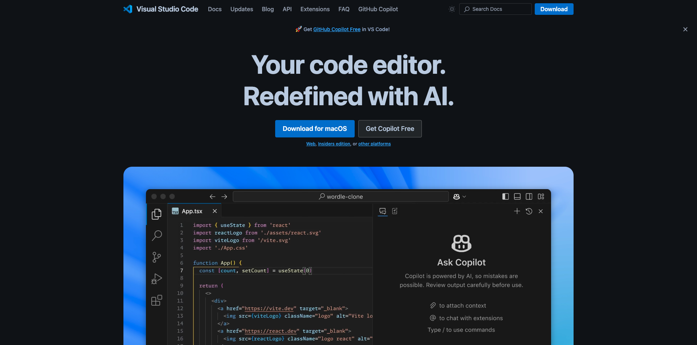

# Aplicaciones para instalar

A continuación se ofrece una descripción general de las aplicaciones que deberá tener instaladas en el equipo antes de iniciar el tutorial.

## Adobe Creative Cloud

Vaya a [https://creativecloud.adobe.com/apps/download/creative-cloud](https://creativecloud.adobe.com/apps/download/creative-cloud){target="_blank"} y haga clic en **Descargar Creative Cloud**.

## Adobe Photoshop

Abra la aplicación **Adobe Creative Cloud** y vaya a **Aplicaciones**. Instale Photoshop en el equipo.

## Código de Visual Studio

Vaya a [https://code.visualstudio.com/](https://code.visualstudio.com/){target="_blank"}, descargue e instale **código de Visual Studio**.

## Editor de texto

Si no tienes una aplicación de Editor de texto, puedes ir a [https://www.sublimetext.com/](https://www.sublimetext.com/){target="_blank"} e descargar e instalar este Editor de texto.

## Cuenta de GitHub

Si todavía no tiene una cuenta de GitHub, vaya a [https://github.com/](https://github.com/){target="_blank"} y haga clic en **Registrarse**. Utilice su dirección de correo electrónico personal y cree su cuenta.

## GitHub Desktop

Vaya a [https://desktop.github.com/download/](https://desktop.github.com/download/){target="_blank"}, descargue e instale **Github Desktop**.

Ahora ha finalizado el módulo Introducción.

## Pasos siguientes

Vaya a [Usar su sitio web de AEM y su zona protegida de AEP](./ex3.md){target="_blank"}

Volver a [Introducción - Inteligencia artificial aplicada a la agencia](./getting-started-agentic-ai.md){target="_blank"}

Volver a [Todos los módulos](./../../../overview.md){target="_blank"}./images
