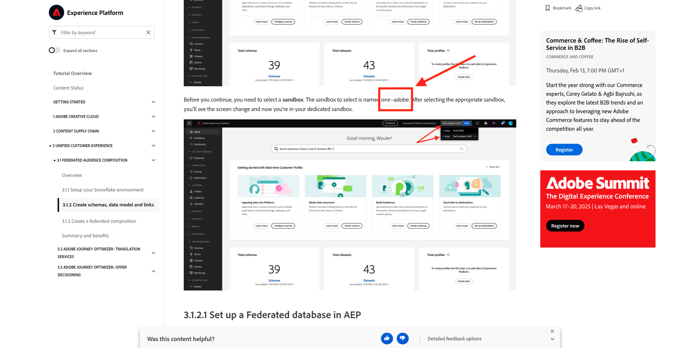
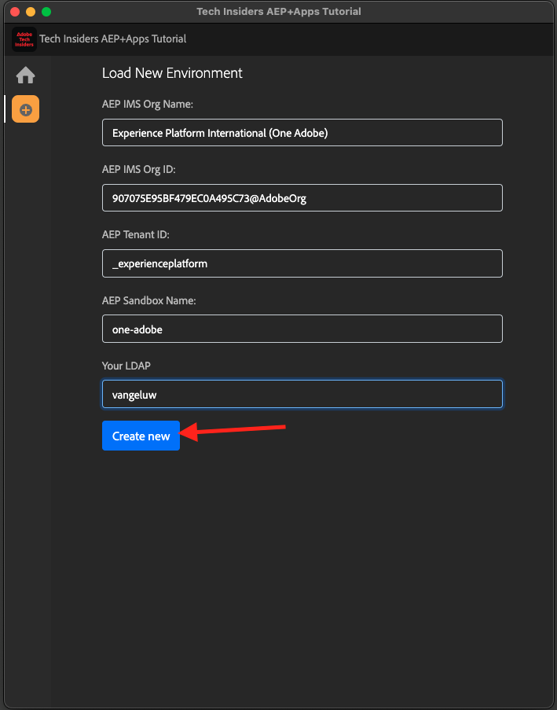
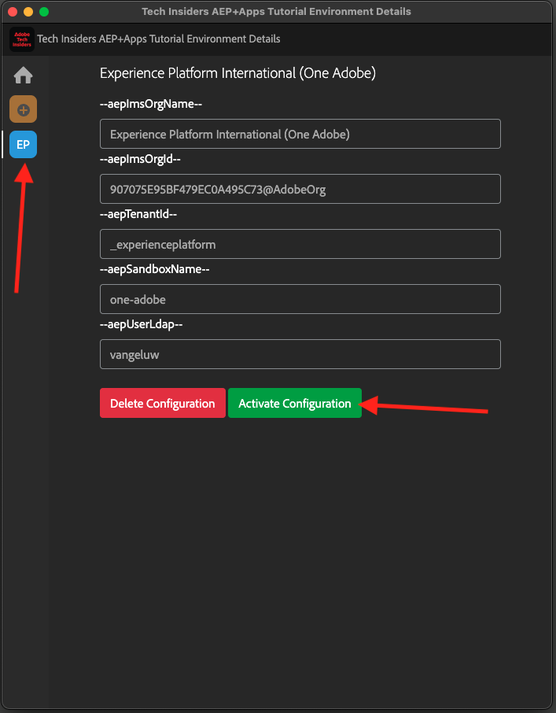

# Instalación de la extensión de Chrome para la documentación de Experience League

## Acerca de la extensión Chrome

Este tutorial se ha convertido en genérico para que cualquier persona pueda reutilizarlo fácilmente, utilizando cualquier instancia de Adobe Experience Cloud.

Para poder reutilizar la documentación, se introdujeron **Variables de entorno** en el tutorial, lo que significa que encontrará los siguientes **marcadores de posición** en la documentación. Cada marcador de posición es una variable específica para un entorno específico y la extensión de Chrome cambiará esa variable para que sea más fácil copiar código y texto de las páginas del tutorial y pegarlo en las distintas interfaces de usuario que utilizará como parte del tutorial.

A continuación se puede encontrar un ejemplo de estos valores. Actualmente, estos valores aún no se pueden usar, pero tan pronto como instale y active la extensión de Chrome, verá que estas variables cambian al texto normal y puede copiarlas y reutilizarlas.

| Nombre | Clave | Ejemplo |
|:-------------:| :---------------:| :---------------:|
| ID de organización IMS | `--aepImsOrgId--` | `907075E95BF479EC0A495C73@AdobeOrg` |
| Nombre de organización IMS | `--aepImsOrgName--` | `Experience Platform International` |
| ID de inquilino de AEP | `--aepTenantId--` | `_experienceplatform` |
| Nombre de zona protegida AEP | `--aepSandboxName--` | `one-adobe` |
| LDAP del perfil del alumno | `--aepUserLdap--` | `vangeluw` |

Por ejemplo, en la siguiente captura de pantalla puede ver una referencia a `aepSandboxName`.

Una vez instalada la extensión, el mismo texto se cambia automáticamente para reflejar los valores específicos de la instancia.

## Instalación de la extensión de Chrome

Para instalar esa extensión de Chrome, abra el explorador Chrome y vaya a: [https://chromewebstore.google.com/detail/tech-insiders-learning-fo/hhnbkfgioecmhimdhooigajdajplinfi](https://chromewebstore.google.com/detail/tech-insiders-learning-fo/hhnbkfgioecmhimdhooigajdajplinfi){target="_blank"}. Entonces verá esto...

Haga clic en **Agregar a Chrome**.

Entonces verá esto... Haga clic en **Agregar extensión**.

A continuación, se instala la extensión y se muestra una notificación similar.

En el menú de **extensiones**, haga clic en el icono de **pieza del rompecabezas** y ancle la extensión **Aprendizaje de plataforma - Configuración** al menú de extensión.

## Configuración de la extensión de Chrome

Vaya a [https://experienceleague.adobe.com/es/docs/platform-learn/tutorial-comprehensive-technical/overview](https://experienceleague.adobe.com/es/docs/platform-learn/tutorial-comprehensive-technical/overview){target="_blank"} y, a continuación, haga clic en el icono de la extensión para abrirla.

Entonces verá esta ventana emergente. Haga clic en el icono **+**.

Introduzca los valores como se indica a continuación, todos ellos relacionados con la instancia de Adobe Experience Platform.

Si no está seguro de qué valores introducir para estos campos, siga las instrucciones siguientes.

**Nombre de organización de IMS de AEP**

Cuando inicies sesión en tu instancia de Adobe Experience Platform en [https://platform.adobe.com/](https://platform.adobe.com/){target="_blank"}, encontrarás el nombre de tu instancia en la esquina superior derecha de la pantalla.

**ID de organización de IMS de AEP**

El ID de organización de IMS es el identificador único de la instancia de Adobe Experience Cloud y se hace referencia a él en varias ubicaciones a lo largo de este tutorial.

La búsqueda del ID de organización de IMS se puede realizar de varias formas. Si no está seguro, consulte con uno de los administradores del sistema de su instancia para encontrar el ID.

Puede encontrarlo en [Admin Console](https://adminconsole.adobe.com/){target="_blank"}, donde puede encontrarlo como parte de la dirección URL.

También puedes encontrarlo yendo a **Administración de datos > Consultas** en tu menú de AEP, donde puedes encontrarlo en **Nombre de usuario**.

Asegúrese de copiar y pegar la parte **@AdobeOrg** junto con el ID.

**ID de inquilino de AEP**

El ID de inquilino es el identificador único de la instancia de AEP de su organización. Cuando inicie sesión en su instancia de Adobe Experience Platform en [https://platform.adobe.com/](https://platform.adobe.com/){target="_blank"}, encontrará el ID de inquilino en la dirección URL.

Cuando lo introduzca en la extensión de Chrome, debe asegurarse de que se agrega un guion bajo como prefijo, de modo que en este ejemplo **experienceplatform** se convierta en **_experienceplatform**.

**Nombre de zona protegida de AEP**

El nombre de la zona protegida es el nombre del entorno que utilizará en la instancia de AEP. Cuando inicie sesión en su instancia de Adobe Experience Platform en [https://platform.adobe.com/](https://platform.adobe.com/){target="_blank"}, encontrará el ID de inquilino en la dirección URL.

Antes de tomar el nombre de la zona protegida de la dirección URL, debe asegurarse de que está en la zona protegida que debe utilizar para este tutorial. Puede cambiar a la zona protegida derecha haciendo clic en el menú del conmutador de zona protegida en la esquina superior derecha de la pantalla.

En este ejemplo, el nombre de la zona protegida de AEP es **one-adobe**.

**Su LDAP**

Este es el nombre de usuario que se utilizará como parte del tutorial. En este ejemplo, el LDAP se basa en la dirección de correo electrónico de este usuario. La dirección de correo electrónico es **vangeluw@adobe.com**, por lo que el LDAP se convierte en **vangeluw**.

El LDAP se utiliza para garantizar que la configuración que va a realizar esté vinculada a usted y no entre en conflicto con otros usuarios que puedan estar utilizando la misma instancia y zona protegida que está utilizando.

Sus valores deben ser similares a los siguientes.
Finalmente, haga clic en **Crear nuevo**.

En el menú de la izquierda de la extensión, ahora verá un nuevo icono con las iniciales de su entorno. Haga clic en ella. Luego verá la asignación entre las **variables de entorno** y los valores de instancia de Adobe Experience Platform específicos. Haga clic en **Activar configuración**.

Después de activar la configuración, verá un punto verde junto a las iniciales de su entorno. Esto significa que su entorno ya está activo.

## Verificar contenido del tutorial

Como prueba, ve a [esta página](https://experienceleague.adobe.com/es/docs/platform-learn/tutorial-one-adobe/activation/dc/dc13/ex2){target="_blank"}.

Ahora debería ver que todas las **variables de entorno** de esta página han sido reemplazadas por sus valores verdaderos, según el entorno activado en la extensión de Chrome.

Ahora debería tener una vista similar a la siguiente, donde la variable de entorno `aepSandboxName` ha sido reemplazada por el nombre real de la zona protegida de AEP, que en este caso es **one-adobe**.

## Pasos siguientes

Vaya a [Usar el sistema de demostración siguiente para configurar la propiedad de cliente de recopilación de datos de Adobe Experience Platform](./ex2.md){target="_blank"}

Volver a [Introducción](./getting-started.md){target="_blank"}

Volver a [Todos los módulos](./../../../overview.md){target="_blank"}
