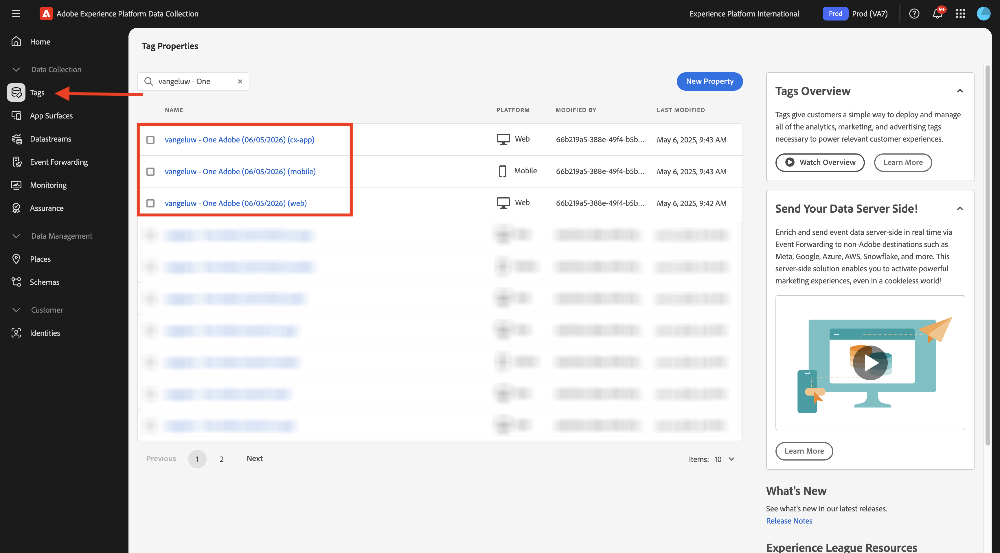

# Crear su secuencia de datos

Vaya a [https://experience.adobe.com/#/data-collection/](https://experience.adobe.com/#/data-collection/).

En el menú de la izquierda, haga clic en **[!UICONTROL Etiquetas]**. Después del ejercicio anterior, ahora tiene 3 propiedades de recopilación de datos: una para la web, otra para el móvil y otra para la aplicación CX.

Estas propiedades están casi listas para utilizarse, pero antes de empezar a recopilar datos con estas propiedades, debe configurar una secuencia de datos. Obtendrá más información sobre el concepto de secuencia de datos y lo que significa en un ejercicio posterior del módulo Recopilación de datos.

Por ahora, siga estos pasos.

## Creación de un flujo de datos para la web

Haga clic en **[!UICONTROL Datastreams]**.

En la esquina superior derecha de la pantalla, seleccione el nombre de la zona protegida, que debe ser `--aepSandboxName--`.

Haga clic en **[!UICONTROL Nueva secuencia de datos]**.

Para **[!UICONTROL Name]** y para la descripción opcional, escriba `--aepUserLdap-- - One Adobe Datastream`. Para **Esquema de asignación**, seleccione **Sistema de demostración - Esquema de evento para el sitio web (Global v1.1)**. Haga clic en **Guardar**.

Entonces verá esto... Haga clic en **Agregar servicio**.

Seleccione el servicio **[!UICONTROL Adobe Experience Platform]**, que mostrará campos adicionales. Entonces verá esto...

Para Conjunto de datos de evento, seleccione **Sistema de demostración - Conjunto de datos de evento para el sitio web (Global v1.1)** y para Conjunto de datos de perfil, seleccione **Sistema de demostración - Conjunto de datos de perfil para el sitio web (Global v1.1)**. Haga clic en **Guardar**.

Ahora va a ver esto.

En el menú de la izquierda, haga clic en **[!UICONTROL Etiquetas]**.

Filtre los resultados de búsqueda para ver las propiedades de recopilación de datos. Abra la propiedad de **Web** al hacer clic en ella.

Entonces verá esto... Haga clic en **Extensiones**.

Primero, haga clic en la extensión Adobe Experience Platform Web SDK y, a continuación, haga clic en **Configurar**.

Entonces verá esto... Eche un vistazo al menú **Datastreams** y compruebe que está seleccionada la zona protegida correcta, que en su caso debería ser `--aepSandboxName--`.

Abra el menú desplegable **Secuencias de datos** y seleccione la secuencia de datos que creó anteriormente.

Asegúrese de haber seleccionado **Flujo de datos** en los tres entornos diferentes. A continuación, haga clic en **Guardar**.

Vaya a **Flujo de publicación**.

Haga clic en **...** para **Principal** y luego haga clic en **Editar**.

Haga clic en **Agregar todos los recursos modificados** y, a continuación, haga clic en **Guardar y generar para desarrollo**.

Los cambios se están publicando y estarán listos en un par de minutos. Después, verá el punto verde junto a **Principal**.

## Crear un flujo de datos para dispositivos móviles

Vaya a [https://experience.adobe.com/#/data-collection/](https://experience.adobe.com/#/data-collection/).

Haga clic en **[!UICONTROL Datastreams]**.

En la esquina superior derecha de la pantalla, seleccione el nombre de la zona protegida, que debe ser `--aepSandboxName--`.

Haga clic en **[!UICONTROL Nueva secuencia de datos]**.

Para **[!UICONTROL Nombre descriptivo]** y para la descripción opcional, escriba `--aepUserLdap-- - One Adobe Datastream (Mobile)`. Para **Esquema de asignación**, seleccione **Sistema de demostración - Esquema de evento para aplicación móvil (Global v1.1)**. Haga clic en **Guardar**.

Haga clic en **[!UICONTROL Guardar]**.

Entonces verá esto... Haga clic en **Agregar servicio**.

Seleccione el servicio **[!UICONTROL Adobe Experience Platform]**, que mostrará campos adicionales. Entonces verá esto...

Para Conjunto de datos de evento, seleccione **Sistema de demostración - Conjunto de datos de evento para aplicación móvil (Global v1.1)** y para Conjunto de datos de perfil, seleccione **Sistema de demostración - Conjunto de datos de perfil para aplicación móvil (Global v1.1)**. Haga clic en **Guardar**.

Entonces verá esto...

El conjunto de datos está listo para utilizarse en la propiedad de cliente de recopilación de datos de Adobe Experience Platform para dispositivos móviles.

Vaya a **Etiquetas** y filtre los resultados de búsqueda para ver sus dos propiedades de recopilación de datos. Abra la propiedad de **Mobile** al hacer clic en ella.

Entonces verá esto... Haga clic en **Extensiones**.

Haga clic en la extensión **Adobe Experience Platform Edge Network** y, a continuación, haga clic en **Configurar**.

Entonces verá esto... Ahora debe seleccionar la zona protegida y la secuencia de datos correctos que acaba de configurar. La zona protegida que se va a usar es `--aepSandboxName--` y el conjunto de datos se llama `--aepUserLdap-- - Demo System Datastream (Mobile)`.

Para el **dominio de Edge Network**, utilice el dominio predeterminado.

Haga clic en **Guardar** para guardar los cambios.

Vaya a **Flujo de publicación**.

Haga clic en **...** junto a **Principal** y, a continuación, haga clic en **Editar**.

Haga clic en **Agregar todos los recursos modificados** y luego haga clic en **Guardar y generar para desarrollo**.

Los cambios se están publicando y estarán listos en un par de minutos. Después, verá el punto verde junto a **Principal**.

## Pasos siguientes

Ir a [Usar el sitio web](./ex4.md)

Volver a [Introducción](./getting-started.md){target="_blank"}

Volver a [Todos los módulos](./../../../overview.md){target="_blank"}