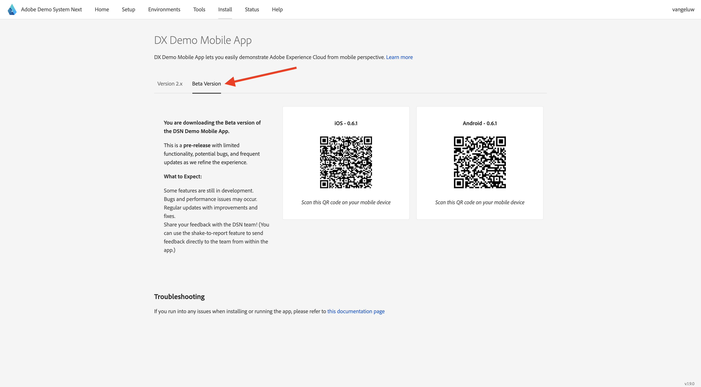

# Uso de la aplicación móvil

## Descargue la aplicación

Ve a [https://dsn.adobe.com/install](https://dsn.adobe.com/install){target="_blank"} en tu equipo y ve a **Beta Version**. Inicie sesión con su Adobe ID y verá lo siguiente.

Usa la aplicación **Camera** de tu smartphone para instalar la aplicación móvil en el sistema operativo de tu dispositivo. Para esta habilitación, debe instalar la versión **0.6.1** (o posterior) que usa Adobe Experience Platform Mobile SDK.

>[!NOTE]
>
>Después de instalar la aplicación por primera vez en un dispositivo iOS, es posible que aparezca un mensaje de error al intentar abrir la aplicación que dice: **Desarrollador empresarial que no es de confianza**. Para solucionarlo, debe ir a **Configuración > General > Administración de VPN y dispositivos > Adobe Systems Inc.** y hacer clic en **Confiar en Adobe Systems Inc.**.

Después de escanear el código QR, selecciona **Instalar**.

Una vez que la aplicación esté instalada, la encontrarás en la pantalla de inicio del dispositivo. Haga clic en el icono para abrir la aplicación.

Después de iniciar sesión, verá una notificación que solicita su permiso para enviar notificaciones. Enviaremos notificaciones como parte del tutorial, así que haz clic en **Permitir**.

A continuación, verá la página principal de la aplicación. Vaya a **Configuración**.

En la configuración, verá que actualmente hay un **Proyecto público** cargado en la aplicación. Haga clic en **Proyecto personalizado**.

Ahora puede cargar un proyecto personalizado. Haga clic en el código QR para cargar fácilmente el proyecto.

Después del ejercicio anterior, obtuvo este resultado. Haga clic para abrir el **proyecto Mobile Edge Telco** que se creó para usted.

En caso de que hayas cerrado accidentalmente la ventana de tu navegador, o para futuras sesiones de demostración o habilitación, también puedes acceder a tu proyecto de sitio web yendo a [https://dsn.adobe.com](https://dsn.adobe.com){target="_blank"}. Después de iniciar sesión con su Adobe ID, verá esto. Haga clic en los tres puntos **...** de su proyecto de aplicación móvil y, a continuación, haga clic en **Editar**.

En la página **Integraciones**, debe seleccionar la propiedad de recopilación de datos que se creó en el ejercicio anterior. Para ello, haga clic en **Seleccionar entorno**.

Haga clic en **Seleccionar** en la propiedad de recopilación de datos creada en el paso anterior, que se llama `--aepUserLdap - One Adobe (DD/MM/YYYY) (mobile)`. A continuación, haga clic en **Guardar**.

Entonces verá esto... A continuación, haga clic en **Ejecutar**.

A continuación, verá esta ventana emergente, que contiene un código QR. Escanee este código QR desde la aplicación móvil.

Verá el identificador de proyecto que está cargando en la aplicación y, después, podrá hacer clic en **Cambiar**.

Debería ver la marca de demostración **CitiSignal** que se está cargando. La aplicación ya está lista para utilizarse.

## Pasos siguientes

Vaya a [Configurar el proyecto de Adobe I/O](./ex6.md){target="_blank"}

Volver a [Introducción](./getting-started.md){target="_blank"}

Volver a [Todos los módulos](./../../../overview.md){target="_blank"}