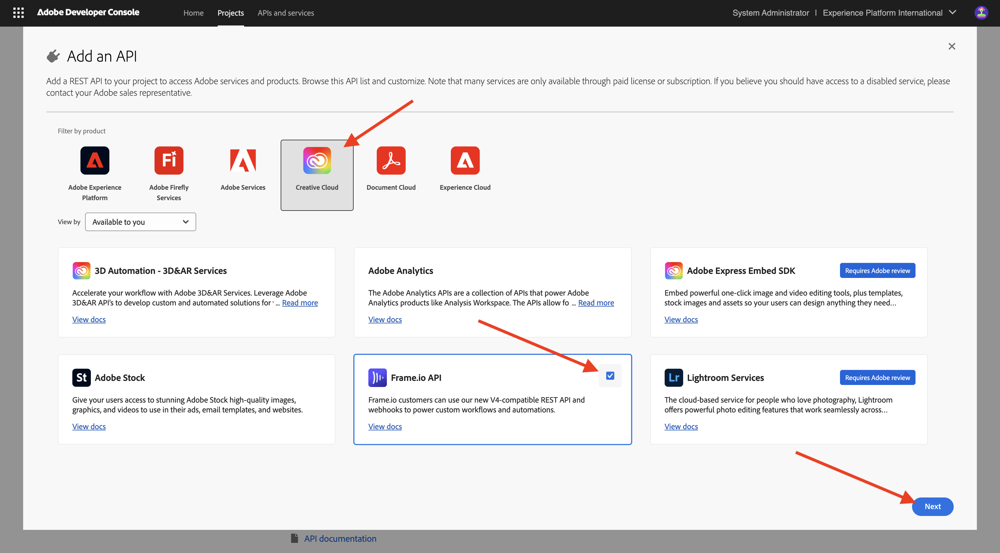
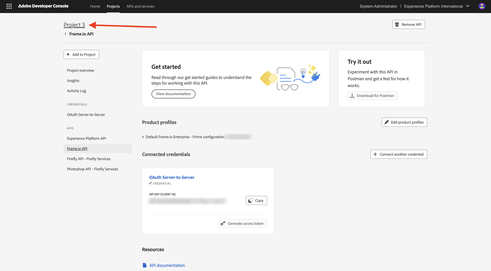

# Configuración del proyecto de Adobe I/O

## Creación de un proyecto de Adobe I/O

En este ejercicio, Adobe I/O se utiliza para consultar varios extremos de Adobe. Siga estos pasos para configurar Adobe I/O.

Vaya a [https://developer.adobe.com/console/home](https://developer.adobe.com/console/home){target="_blank"}.

Asegúrese de seleccionar la instancia correcta en la esquina superior derecha de la pantalla. Su instancia es `--aepImsOrgName--`.

>[!NOTE]
>
> La siguiente captura de pantalla muestra una organización específica seleccionada. Cuando vaya a través de este tutorial, es muy probable que su organización tenga un nombre diferente. Cuando se registró en este tutorial, se le proporcionaron los detalles del entorno que debe utilizar, siga esas instrucciones.

A continuación, seleccione **Crear nuevo proyecto**.

### API de Firefly Services

>[!IMPORTANT]
>
>Según la ruta de aprendizaje seleccionada, es posible que no tenga acceso a la API de Firefly Services. Solo tendrá acceso a la API de Firefly Services si se encuentra en la ruta de aprendizaje **Firefly**, **Workfront Fusion**, **ALL** o si asiste a un **taller presencial en directo**. Puede omitir este paso si no se encuentra en una de estas rutas de aprendizaje.

Entonces debería ver esto. Seleccione **+ Agregar al proyecto** y elija **API**.

La pantalla debería tener un aspecto similar al siguiente.

Seleccione **Creative Cloud**, elija **Firefly - Firefly Services** y luego seleccione **Siguiente**.

Proporcione un nombre para su credencial: `--aepUserLdap-- - One Adobe OAuth credential` y seleccione **Siguiente**.

Seleccione el perfil predeterminado **Configuración predeterminada de Firefly Services** y seleccione **Guardar la API configurada**.

Entonces debería ver esto.

### API de Photoshop Services

>[!IMPORTANT]
>
>Según la ruta de aprendizaje seleccionada, es posible que no tenga acceso a la API de Photoshop Services. Solo tendrá acceso a la API de Photoshop Services si se encuentra en la ruta de aprendizaje **Firefly**, **Workfront Fusion**, **ALL** o si asiste a un **taller presencial en directo**. Puede omitir este paso si no se encuentra en una de estas rutas de aprendizaje.
>
>Seleccione **+ Agregar al proyecto** y luego seleccione **API**.

Seleccione **Creative Cloud** y elija **Photoshop - Firefly Services**. Seleccione **Siguiente**.

Seleccione **Siguiente**.

A continuación, debe seleccionar un perfil de producto que defina qué permisos están disponibles para esta integración.

Seleccione **Configuración predeterminada de Firefly Services** y **Configuración predeterminada de Creative Cloud Automation Services**.

Seleccione **Guardar la API configurada**.

Entonces debería ver esto.

### API de Adobe Experience Platform

>[!IMPORTANT]
>
>Según la ruta de aprendizaje seleccionada, es posible que no tenga acceso a la API de Adobe Experience Platform. Solo tendrá acceso a la API de Adobe Experience Platform si se encuentra en la ruta de aprendizaje **AEP + Aplicaciones**, **TODAS** o si asiste a un **taller presencial en vivo**. Puede omitir este paso si no se encuentra en una de estas rutas de aprendizaje.

Seleccione **+ Agregar al proyecto** y luego seleccione **API**.

Seleccione **Adobe Experience Platform** y elija **API de Experience Platform**. Seleccione **Siguiente**.

Seleccione **Siguiente**.

A continuación, debe seleccionar un perfil de producto que defina qué permisos están disponibles para esta integración.

Seleccione **Adobe Experience Platform - Todos los usuarios - PROD**.

>[!NOTE]
>
>El nombre del perfil de producto para AEP depende de cómo se haya configurado el entorno. Si no ve el perfil de producto mencionado anteriormente, es posible que tenga un perfil de producto denominado **Acceso predeterminado a todos los equipos de producción**. Si no está seguro de cuál elegir, pregunte al administrador del sistema de AEP.

Seleccione **Guardar la API configurada**.

Entonces debería ver esto.

### API de Frame.io

>[!IMPORTANT]
>
>Según la ruta de aprendizaje seleccionada, es posible que no tenga acceso a la API de Frame.io. Solo tendrá acceso a la API de Frame.io si se encuentra en la ruta de aprendizaje **Workfront Fusion**, **ALL** o cuando asista a un **taller presencial en vivo**. Puede omitir este paso si no se encuentra en una de estas rutas de aprendizaje.

Seleccione **+ Agregar al proyecto** y luego seleccione **API**.

Seleccione **Creative Cloud** y elija **Frame.io API**. Seleccione **Siguiente**.

Seleccione **Autenticación de servidor a servidor** y haga clic en **Siguiente**.

Seleccione **Servidor a servidor OAuth** y haga clic en **Siguiente**.

A continuación, debe seleccionar un perfil de producto que defina qué permisos están disponibles para esta integración.

Seleccione **Configuración predeterminada de Frame.io Enterprise - Prime** y haga clic en **Guardar la API configurada**.

Entonces debería ver esto.

### Nombre de proyecto

Haga clic en el nombre del proyecto.

{zoomable="yes"}

Seleccione **Editar proyecto**.

{zoomable="yes"}

Escriba un nombre descriptivo para la integración: `--aepUserLdap-- One Adobe tutorial` y seleccione **Guardar**.

{zoomable="yes"}

La configuración del proyecto de Adobe I/O ha finalizado.

{zoomable="yes"}

## Pasos siguientes

Ir a [Opción 1: configuración de Postman](./ex7.md){target="_blank"}

Ir a [Opción 2: configuración de PostBuster](./ex8.md){target="_blank"}

Volver a [Introducción](./getting-started.md){target="_blank"}

Volver a [Todos los módulos](./../../../overview.md){target="_blank"}
