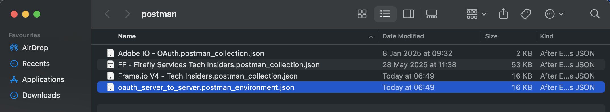

# Opción 1: usar Postman

>[!IMPORTANT]
>
>Si eres empleado de Adobe, sigue las instrucciones para [instalar PostBuster](./ex8.md){target="_blank"}.

## Descarga del entorno de Postman

Vaya a [https://developer.adobe.com/console/home](https://developer.adobe.com/console/home){target="_blank"} y abra el proyecto.

Haga clic en la API **Firefly - Firefly Services**. A continuación, haga clic en **Descargar para Postman** y elija **Servidor a servidor OAuth** para descargar un entorno de Postman.

## Autenticación de Postman en Adobe I/O

Descargue e instale la versión correspondiente de Postman para su sistema operativo en [Descargas de Postman](https://www.postman.com/downloads/){target="_blank"}.

Inicie la aplicación.

En Postman, hay 2 conceptos: entornos y colecciones.

El archivo de entorno contiene todas las variables de entorno que son más o menos coherentes. En el entorno, encontrará cosas como la organización IMS de su entorno de Adobe, junto con credenciales de seguridad como su ID de cliente y otras. El archivo de entorno se descargó anteriormente durante la instalación de Adobe I/O y se llama **`oauth_server_to_server.postman_environment.json`**.

La colección contiene una serie de solicitudes de API que puede utilizar. Utilizará las colecciones siguientes:

- 1 colección para la autenticación en Adobe I/O
- 1 Colección para los ejercicios de Adobe Firefly Services en este módulo
- 1 Colección para los ejercicios de Adobe Frame.io V4 en este módulo

Descargue [postman-ff.zip](./../../../assets/postman/postman-ff.zip){target="_blank"} en su escritorio local.

En el archivo **postman-ff.zip** se encuentran los siguientes archivos:

- `Adobe IO - OAuth.postman_collection.json`
- `FF - Firefly Services Tech Insiders.postman_collection.json`
- `Frame.io V4 - Tech Insiders.postman_collection.json`

Descomprima **postman-ff.zip** y almacene los siguientes archivos en una carpeta de su escritorio:

- `Adobe IO - OAuth.postman_collection.json`
- `FF - Firefly Services Tech Insiders.postman_collection.json`
- `Frame.io V4 - Tech Insiders.postman_collection.json`
- `oauth_server_to_server.postman_environment.json`

En Postman, seleccione **Importar**.

Seleccionar **archivos**.

Elija todos los archivos de la carpeta y, a continuación, seleccione **Abrir** e **Importar**.

Haga clic en **Importar**.

Ahora tiene todo lo que necesita en Postman para empezar a interactuar con Firefly Services a través de las API.

## Solicitar un token de acceso

A continuación, para asegurarse de que está correctamente autenticado, debe solicitar un token de acceso.

Asegúrese de que ha seleccionado el entorno correcto antes de ejecutar cualquier solicitud comprobando la lista desplegable Entorno en la esquina superior derecha. El entorno seleccionado debe tener un nombre similar a este, `--aepUserLdap-- One Adobe OAuth Credential`.

El entorno seleccionado debe tener un nombre similar a este, `--aepUserLdap-- One Adobe OAuth Credential`.

Ahora que el entorno y las colecciones de Postman están configurados y funcionan, puede autenticarse desde Postman a Adobe I/O.

En la colección **Adobe IO - OAuth**, seleccione la solicitud **POST - Obtener token de acceso** y seleccione **Enviar**.

Observe que en **Parámetros de consulta** se hace referencia a dos variables: `API_KEY` y `CLIENT_SECRET`. Estas variables se toman del entorno seleccionado, `--aepUserLdap-- One Adobe OAuth Credential`.

Si se ejecuta correctamente, aparecerá una respuesta que contiene un token de portador, un token de acceso y una ventana de caducidad en la sección **Body** de Postman.

Debería ver una respuesta similar que contenga la siguiente información:

| Clave | Valor |
|:-------------:| :---------------:| 
| token_type | **portador** |
| access_token | **keyJhbGciOiJSUz...** |
| expires_in | **86399** |

El **token de portador** de Adobe I/O tiene un valor específico (el token de acceso muy largo) y un período de caducidad, y ahora es válido durante 24 horas. Esto significa que, después de 24 horas, si desea utilizar Postman para interactuar con las API de Adobe, deberá generar un nuevo token ejecutando esta solicitud de nuevo.

El entorno de Postman ya está configurado y funciona.

## Pasos siguientes

Ir a [Aplicaciones para instalar](./ex9.md){target="_blank"}

Volver a [Introducción](./getting-started.md){target="_blank"}

Volver a [Todos los módulos](./../../../overview.md){target="_blank"}
