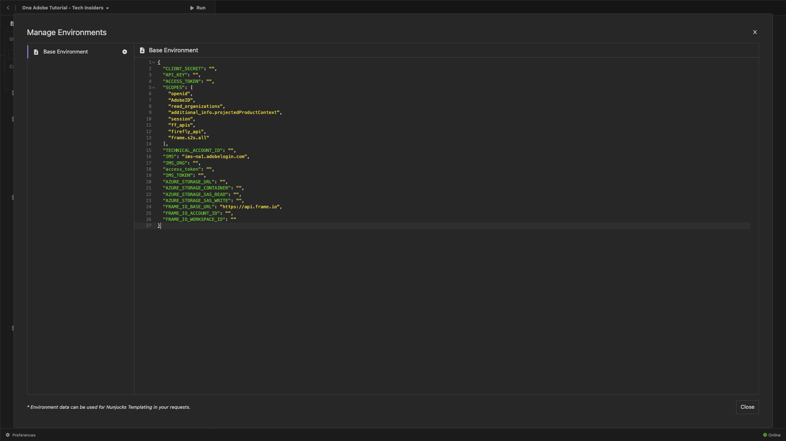
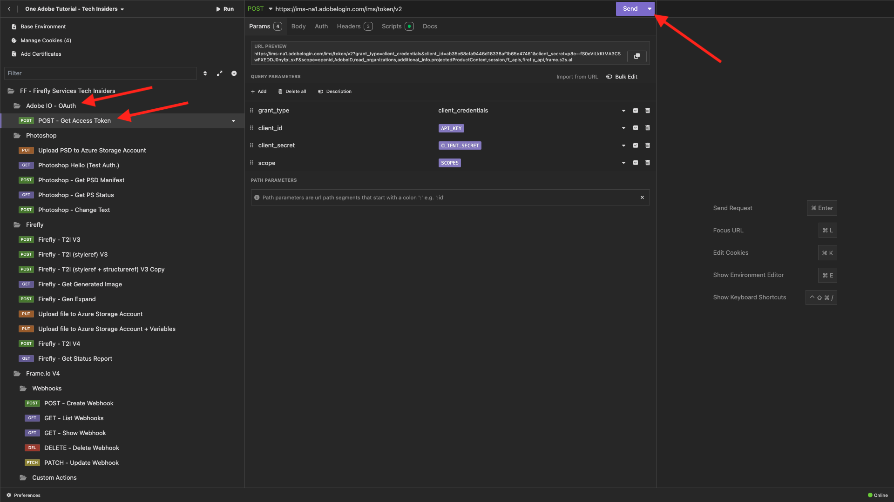
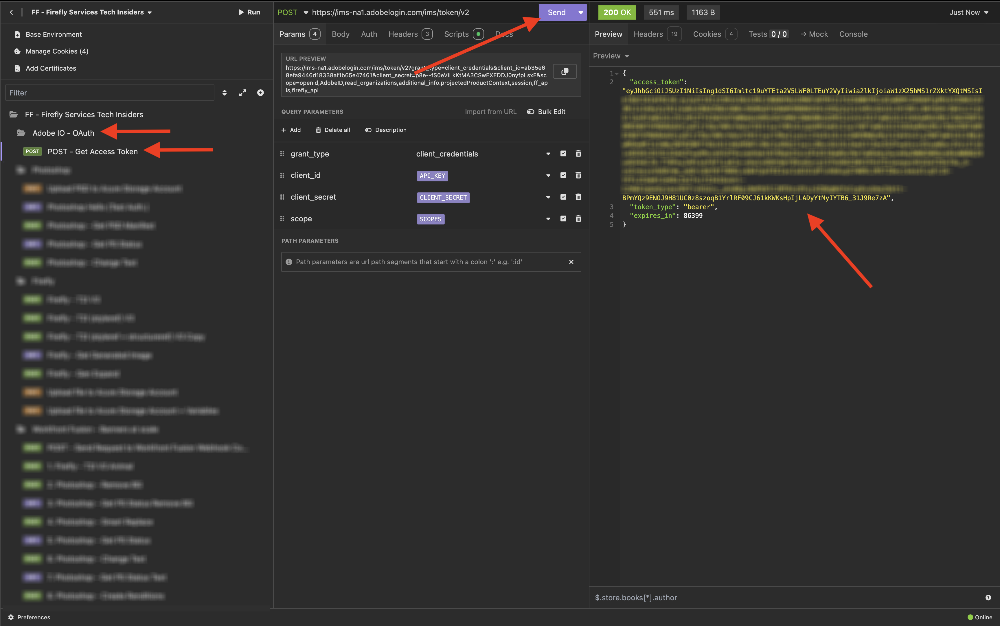

# Opción 2: configuración de PostBuster

>[!IMPORTANT]
>
>Si no eres empleado de Adobe, sigue las instrucciones para [instalar Postman](./ex7.md){target="_blank"}. Las siguientes instrucciones están destinadas únicamente a empleados de Adobe.

## Vídeo

En este vídeo, obtendrá una explicación y una demostración de todos los pasos involucrados en este ejercicio.

>[!VIDEO](https://video.tv.adobe.com/v/3476496?quality=12&learn=on)

## Instalar PostBuster

Vaya a [https://adobe.service-now.com/esc?id=adb_esc_kb_article&sysparm_article=KB0020542](https://adobe.service-now.com/esc?id=adb_esc_kb_article&sysparm_article=KB0020542){target="_blank"}.

Haga clic para descargar la última versión de **PostBuster**.


Descargue la versión correcta para su sistema operativo.


Una vez que la descarga haya finalizado y se haya instalado, abra PostBuster. Entonces debería ver esto. Haga clic en **Importar**.


Descargue [postbuster.json.zip](./../../../assets/postman/postbuster.json.zip){target="_blank"} y extráigalo en su escritorio.


Haga clic en **Elegir un archivo**.


Seleccione el archivo **postbuster.json**. Haga clic en **Abrir**.


Entonces debería ver esto. Haga clic en **Analizar**.


Haga clic en **Importar**.


Entonces debería ver esto. Haga clic en para abrir la colección importada.


Ahora verá su colección. Aún debe configurar un entorno para mantener algunas variables de entorno.


Haga clic en **Entorno base** y luego haga clic en el icono **editar**.


Entonces debería ver esto.


Copie el siguiente marcador de posición de entorno y péguelo en el **Entorno base**; para ello, reemplace lo que se encuentra allí.

```json
{
	"CLIENT_SECRET": "",
	"API_KEY": "",
	"ACCESS_TOKEN": "",
	"SCOPES": [
		"openid",
		"AdobeID",
		"read_organizations", 
		"additional_info.projectedProductContext", 
		"session",
		"ff_apis",
		"firefly_api",
		"frame.s2s.all"
	],
	"TECHNICAL_ACCOUNT_ID": "",
	"IMS": "ims-na1.adobelogin.com",
	"IMS_ORG": "",
	"access_token": "",
	"IMS_TOKEN": "",
	"AZURE_STORAGE_URL": "",
	"AZURE_STORAGE_CONTAINER": "",
	"AZURE_STORAGE_SAS_READ": "",
	"AZURE_STORAGE_SAS_WRITE": "",
	"FRAME_IO_BASE_URL": "https://api.frame.io",
	"FRAME_IO_ACCOUNT_ID": "",
	"FRAME_IO_WORKSPACE_ID": ""
}
```

Entonces deberías tener esto.



## Introduzca las variables de Adobe I/O

Vaya a [https://developer.adobe.com/console/home](https://developer.adobe.com/console/home){target="_blank"} y abra el proyecto.


Vaya a **OAuth Server-to-Server**.


Ahora debe copiar los siguientes valores del proyecto de Adobe I/O y pegarlos en el entorno base de PostBuster.

- ID de cliente
- Secreto de cliente (haga clic en **Recuperar secreto de cliente**)
- ID de cuenta técnica
- ID de organización (desplácese hacia abajo para buscar el ID de su organización)


Copie las variables anteriores una por una y péguelas en su **Entorno base** en PostBuster.

| Nombre de variable en Adobe I/O | Nombre de variable en el entorno base PostBuster |
|:-------------:| :---------------:| 
| ID de cliente | `API_KEY` |
| Secreto del cliente | `CLIENT_SECRET` |
| ID de cuenta técnica | `TECHNICAL_ACCOUNT_ID` |
| ID de organización | `IMS_ORG` |

Después de haber copiado estas variables una por una, su entorno base PostBuster debería tener este aspecto.

Haga clic en **Cerrar**.


En la colección **Adobe IO - OAuth**, seleccione la solicitud **POST - Obtener token de acceso** y seleccione **Enviar**.



Debería ver una respuesta similar que contenga la siguiente información:

| Clave | Valor |
|:-------------:| :---------------:| 
| token_type | **portador** |
| access_token | **KeyJhbGciOiJS...** |
| expires_in | **86399** |

El **token de portador** de Adobe I/O tiene un valor específico (el token de acceso muy largo) y un período de caducidad, y ahora es válido durante 24 horas. Esto significa que, después de 24 horas, si desea utilizar Postman para interactuar con las API de Adobe, deberá generar un nuevo token ejecutando esta solicitud de nuevo.



El entorno PostBuster ya está configurado y funciona. Ahora ha completado este ejercicio.

## Pasos siguientes

Ir a [Aplicaciones para instalar](./ex9.md){target="_blank"}

Volver a [Introducción](./getting-started.md){target="_blank"}

Volver a [Todos los módulos](./../../../overview.md){target="_blank"}
