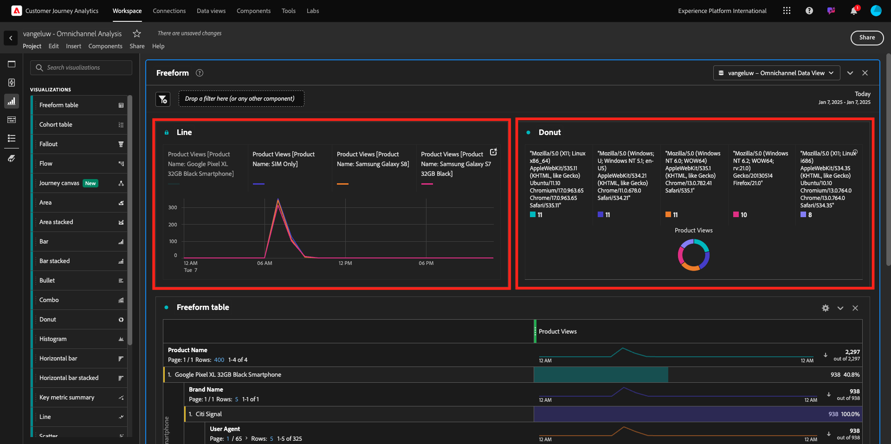
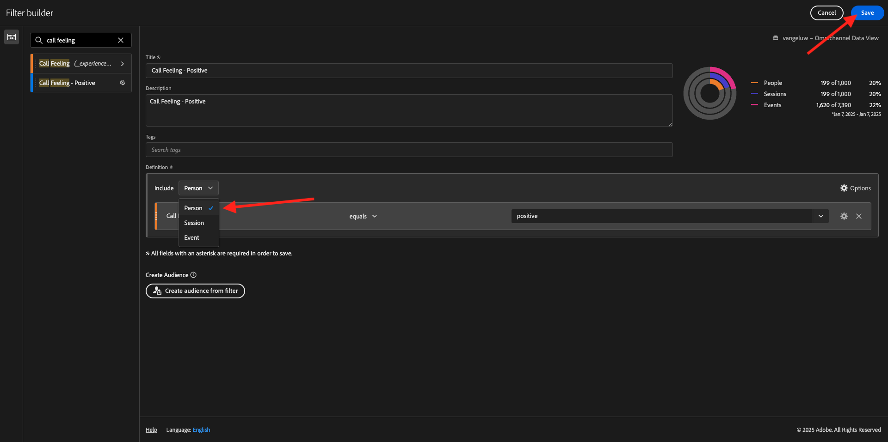

# 1.1.5 Visualización mediante Customer Journey Analytics

## Objetivos

- Explicación de la IU de Analysis Workspace
- Conozca algunas funciones que hacen que Analysis Workspace sea tan diferente.
- Obtenga información sobre cómo analizar en CJA mediante Analysis Workspace

## Contexto

En estos ejercicios utilizará Analysis Workspace dentro de CJA para analizar vistas de productos, canales de productos, pérdidas, etc.

Cubriremos algunas de las consultas realizadas en el Módulo 7: Servicio de consultas para que pueda ver lo fácil que es ejecutar las mismas consultas y más pero sin usar SQL y dependiendo únicamente de la filosofía de arrastrar y soltar de Analysis Workspace.

Usemos el proyecto que creó en la preparación de datos de [1.1.4 en Analysis Workspace](./ex4.md), así que vaya a [https://analytics.adobe.com](https://analytics.adobe.com).

Haga clic para abrir el proyecto `--aepUserLdap-- - Omnichannel Analysis`.

Con el proyecto abierto y la vista de datos `--aepUserLdap-- - Omnichannel Analysis` seleccionada, está listo para empezar a crear sus primeras visualizaciones.

## ¿Cuántas vistas de productos tenemos diariamente?

En primer lugar, debe seleccionar las fechas adecuadas para analizar los datos. Vaya al menú desplegable de calendario en el lado derecho del lienzo. Haga clic en él y seleccione el intervalo de fechas aplicable.

En el menú del lado izquierdo (área de componentes), busque la Métrica calculada **Vistas del producto**. Selecciónelo, arrástrelo y suéltelo en el lienzo, en la parte superior derecha de la tabla de forma libre.

Automáticamente, se agregará la dimensión **Day** para crear su primera tabla. Ahora puedes ver tu pregunta respondida en el vuelo.

A continuación, haga clic con el botón derecho en el resumen de la métrica. Haga clic en **Visualizar**.

Haga clic en **Línea**.

Verá las vistas de sus productos por hora.

Puede cambiar el ámbito de tiempo al día haciendo clic en **Configuración** dentro de la visualización.

Haga clic en el punto al lado de **Línea** para **Administrar el Source de datos**.

A continuación, haga clic en **Bloquear selección** y seleccione **Elementos seleccionados** para bloquear esta visualización y que siempre muestre una cronología de vistas de productos.

## Principales 5 productos vistos

¿Cuáles son los 5 productos más visitados?

Recuerde guardar el proyecto de vez en cuando.

| Sistema operativo | Método abreviado |
| ----------------- |-------------| 
| Windows | Control + S |
| Mac | Comando + S |

Empecemos a encontrar los 5 productos más vistos. En el menú del lado izquierdo, busque **Nombre del producto** - Dimension.

Ahora arrastre y suelte **Nombre de producto** para reemplazar la dimensión **Día**:

Este será el resultado. Seleccione los 4 nombres de productos y verá la actualización de la visualización.

A continuación, intente desglosar uno de los productos por Nombre de marca. Busque **brandName** y arrástrelo bajo el primer nombre de producto.

A continuación, realice un desglose utilizando el agente de usuario. Busque **Agente de usuario** y arrástrelo bajo el nombre de la marca.

A continuación, verá esto:

Por último, puede añadir más visualizaciones. En el lado izquierdo, debajo de visualizaciones, busque `Donut`. Tome `Donut`, arrástrelo y suéltelo en el lienzo bajo la visualización **Línea**.

A continuación, en la tabla, seleccione las primeras 5 **filas del agente de usuario** del desglose que hicimos en **Google Pixel XL Black Smartphone de 32 GB** > **Citi Signal**. Mientras selecciona las 3 filas, mantenga presionado el botón **CTRL** (en Windows) o el botón **Comando** (en Mac). Verá cómo se actualiza el gráfico de anillo.

Incluso puede adaptar el diseño para que sea más legible, haciendo que el gráfico **Línea** y el gráfico **Anillo** sean un poco más pequeños para que puedan encajar uno junto al otro:

Haz clic en el punto al lado de **Anillo** para **administrar el Source de datos**.
A continuación, haga clic en **Bloquear selección** para bloquear esta visualización y que siempre muestre una cronología de vistas de productos.

Obtenga más información acerca de las visualizaciones con Analysis Workspace aquí:

- [https://experienceleague.adobe.com/docs/analytics/analyze/analysis-workspace/visualizations/freeform-analysis-visualizations.html](https://experienceleague.adobe.com/docs/analytics/analyze/analysis-workspace/visualizations/freeform-analysis-visualizations.html)
- [https://experienceleague.adobe.com/docs/analytics/analyze/analysis-workspace/visualizations/t-sync-visualization.html](https://experienceleague.adobe.com/docs/analytics/analyze/analysis-workspace/visualizations/t-sync-visualization.html)

## Canal de interacción de productos, desde la visualización hasta la compra

Hay muchas maneras de resolver esta pregunta. Uno de ellos es utilizar el tipo de interacción de producto y utilizarlo en una tabla de forma libre. Otra forma es usar una **Visualización de abandonos**. Usemos el último ya que queremos visualizar y analizar al mismo tiempo.

Cierre el panel actual haciendo clic aquí:

Ahora agregue un nuevo panel en blanco al hacer clic en **+ Agregar panel en blanco**.

Haga clic en la visualización **Abandonos**.

Seleccione el mismo intervalo de fechas que en el ejercicio anterior.

Entonces verá esto...

Busque la dimensión **Tipo de evento** en los componentes del lado izquierdo. Haga clic en la flecha para abrir la dimensión.

Verá todos los tipos de eventos disponibles.

Seleccione el elemento **commerce.productViews** y arrástrelo y suéltelo en el campo **Agregar punto de contacto** dentro de la **Visualización de visitas en el orden previsto**.

Haz lo mismo con **commerce.productListAdds** y **commerce.purchases** y suéltalos en el campo **Agregar Touchpoint** dentro de la **Visualización de abandonos**. La visualización tendrá este aspecto:

Puedes hacer muchas cosas aquí. Algunos ejemplos: compare con el paso del tiempo, compare cada paso por dispositivo o compare por fidelidad. Sin embargo, si desea analizar cosas interesantes como por qué los clientes no compran después de agregar un artículo al carro de compras, podemos utilizar la mejor herramienta de CJA: hacer clic con el botón derecho.

Haga clic con el botón derecho en el punto de contacto **commerce.productListAdds**. Luego haz clic en **Abandonos por desglose en este punto de contacto**.

Se creará una nueva tabla de forma libre para analizar qué hicieron las personas si no realizaron la compra.

Cambie **Tipo de evento** por **Nombre de página**, en la nueva tabla de forma libre, para ver a qué páginas se dirigen en lugar de la página de confirmación de compra.

## ¿Qué hacen las personas en el sitio antes de llegar a la página Cancelar servicio?

De nuevo, hay muchas maneras de realizar este análisis. Usemos el análisis de flujo para iniciar la parte de descubrimiento.

Cierre el panel actual haciendo clic aquí y, a continuación, agregue un nuevo panel en blanco haciendo clic en **+ Agregar panel en blanco**.

Haga clic en la visualización **Flujo**.

Entonces verá esto... Seleccione el mismo intervalo de fechas que en el ejercicio anterior. Haga clic en **Aplicar**.

Busque la dimensión **Nombre de página** en los componentes del lado izquierdo y haga clic en la flecha para abrir la dimensión.

Encontrará todas las páginas vistas. Buscar el nombre de página: **Cancelar servicio**.
Arrastre y suelte **Cancelar servicio** en la visualización de flujo del campo central. Haga clic en **Generar**.

A continuación, verá esto:

Analicemos ahora si los clientes que visitaron la página **Cancelar servicio** en el sitio web también llamaron al centro de llamadas y cuál fue el resultado.

En las dimensiones, vuelva atrás y luego busque **Tipo de interacción de llamada**.
Arrastre y suelte **Tipo de interacción de llamada** para reemplazar la primera interacción a la derecha en **Visualización de flujo**.

Ahora está viendo el ticket de asistencia de los clientes que llamaron al centro de llamadas después de visitar la página **Cancelar servicio**.

A continuación, en las dimensiones, busca **Sensación de llamada**.  Arrástrela y suéltela para reemplazar la primera interacción a la derecha en **Visualización de flujo**.

A continuación, verá esto:

Como puede ver, hemos ejecutado un análisis omnicanal utilizando la Visualización de flujo. Gracias a eso hemos encontrado que parece que algunos clientes que estaban pensando en cancelar su servicio, tuvieron una sensación positiva después de llamar al centro de llamadas. ¿Tal vez hemos cambiado de opinión con un ascenso?

## ¿Qué rendimiento tienen los clientes con un contacto del centro de llamadas positivo respecto a los KPI principales?

Primero segmentemos los datos para obtener solamente usuarios con llamadas **positivas**. En CJA, los segmentos se denominan Filtros. Vaya a los filtros dentro del área del componente (en el lado izquierdo) y haga clic en **+**.

Dentro del Generador de filtros, asigne un nombre al filtro

| Nombre | Descripción |
| ----------------- |-------------| 
| Sensación de llamada: positiva | Sensación de llamada: positiva |

En los componentes (dentro del Generador de filtros), busque **Sensación de llamada** y arrástrela y suéltela en la definición del Generador de filtros.

Ahora seleccione **positivo** como valor para el filtro.

Cambie el ámbito al nivel **Persona**. Haga clic en **Guardar**.

Entonces volverás a estar aquí. Si aún no lo ha hecho, cierre el panel anterior y agregue un nuevo panel en blanco haciendo clic en **+ Agregar panel en blanco**.

Seleccione el mismo intervalo de fechas que en el ejercicio anterior. Haga clic en **Aplicar**.

Haga clic en **Tabla de forma libre**.

Ahora arrastre y suelte el filtro que acaba de crear.

Tiempo para añadir algunas métricas. Comience con **Vistas del producto**. Arrastre y suelte en la tabla de forma libre. También puede eliminar la métrica **Eventos**.

Haz lo mismo con **Personas**, **Agregar al carro** y **Compras**. Vas a terminar con una mesa como esta.

Gracias al primer análisis de flujo, surgió una nueva pregunta. Por lo tanto, decidimos crear esta tabla y comparar algunos KPI con un segmento para responder esa pregunta. Como puede ver, el tiempo para obtener información es mucho más rápido que usar SQL o usar otras soluciones de BI.

## Resumen de Customer Journey Analytics y Analysis Workspace

Como ha aprendido en este laboratorio, Analysis Workspace vincula los datos de todos los canales para analizar el recorrido completo del cliente. Además, recuerde que puede incluir datos en el mismo espacio de trabajo que no esté vinculado al recorrido.
Puede resultar muy útil incluir datos desconectados en el análisis para dar contexto al recorrido. Algunos ejemplos incluyen datos de NPS, encuestas, eventos de Facebook Ads o interacciones sin conexión (no identificadas).

## Pasos siguientes

Ir a [Resumen y beneficios](./summary.md){target="_blank"}

Volver a [Customer Journey Analytics](./customer-journey-analytics-build-a-dashboard.md){target="_blank"}

Volver a [Todos los módulos](./../../../../overview.md){target="_blank"}
