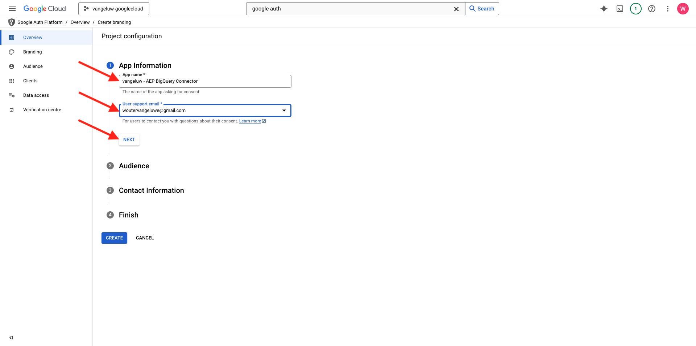
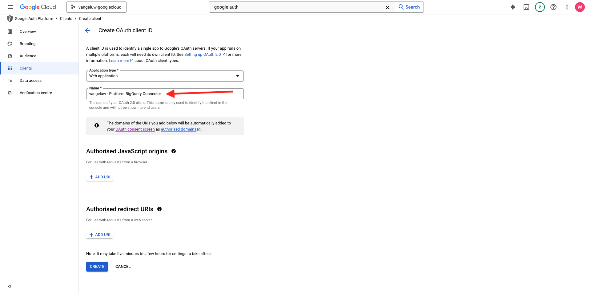

# 1.2.3 Conexión de GCP y BigQuery con Adobe Experience Platform

## Objetivos

- Explore la API y los servicios de Google Cloud Platform
- Familiarícese con OAuth Playground para probar las API de Google
- Creación de la primera conexión de BigQuery en Adobe Experience Platform

## Contexto

Adobe Experience Platform proporciona un conector en **Sources** que le ayudará a incorporar conjuntos de datos de BigQuery a Adobe Experience Platform. Este conector de datos se basa en la API de Google BigQuery. Por lo tanto, es importante preparar correctamente su Google Cloud Platform y su entorno de BigQuery para recibir llamadas de API desde Adobe Experience Platform.

Para configurar el conector de Source de BigQuery en Adobe Experience Platform, necesita estos 4 valores:

- proyecto
- clientId
- clientSecret
- refreshToken

Hasta ahora solo tiene el primero, el **identificador de proyecto**. Este valor de **ID del proyecto** es un ID aleatorio que generó Google cuando creó el proyecto BigQuery durante el ejercicio 12.1.

Copie el ID del proyecto en un archivo de texto separado.

| Credencial | Nombre | Ejemplo |
| ----------------- |-------------| -------------|
| Identificador de proyecto | random | possible-bee-447102-h3 |

Puedes comprobar tu ID de proyecto en cualquier momento haciendo clic en tu **Nombre del proyecto** en la barra de menú superior:

Verá su ID de proyecto a la derecha:

En este ejercicio aprenderá a obtener los otros 3 campos obligatorios:

- clientId
- clientSecret
- refreshToken

## 1.2.3.1 Google Auth Platform

Para empezar, vuelva a la página de inicio de Google Cloud Platform. Para ello, simplemente haga clic en el logotipo en la esquina superior izquierda de la pantalla.

Una vez que esté en la página de inicio, busque **Google Auth Platform** en la barra de búsqueda. Haga clic en el primer resultado para abrirlo.

Ahora verá la página principal de **Google Auth Platform**. Haga clic en **GET INICIADO**.

Para **nombre de aplicación**, use esto:

| Nombre | Ejemplo |
| ----------------- |-------------| 
| `--aepUserLdap-- - AEP BigQuery Connector` | vangeluw: conector BigQuery de AEP |

Seleccione su dirección de correo electrónico para el campo **Correo electrónico de asistencia al usuario**.

Haga clic en **SIGUIENTE**.

Seleccione **External** y haga clic en **NEXT**.

Escriba su dirección de correo electrónico y haga clic en **SIGUIENTE**.

Marque la casilla y haga clic en **CONTINUAR**. A continuación, haga clic en **CREAR**.

## 1.2.3.2 Crear cliente de OAuth

Haga clic en **CREAR CLIENTE DE OAUTH**.

Entonces verá esto...

Seleccione **aplicación web**.

Aparecerán varios campos nuevos. Ahora necesita escribir el **Nombre** del ID de cliente de OAuth y también los **URI de redireccionamiento autorizados**.

Para el campo **Nombre**, use esto:

| Campo | Valor | Ejemplo |
| ----------------- |-------------| -------------| 
| Nombre | ldap: Conector de AEP BigQuery | vangeluw - Conector de Platform BigQuery |

Haga clic en **+ AGREGAR URI** en **URI de redireccionamiento autorizados**. Añada el nuevo URI siguiente.

| Campo | Valor |
| ----------------- |-------------| 
| URI de redireccionamiento autorizados | https://developers.google.com/oauthplayground |

El campo **URI de redireccionamiento autorizados** es muy importante porque lo necesitará más adelante para obtener el RefreshToken que necesita para finalizar la configuración del conector Source de BigQuery en Adobe Experience Platform.

Haga clic en **Crear**.

Se ha creado el ID de cliente de OAuth. Haga clic en él para ver ahora su ID de cliente y su Secreto de cliente.

Verá los valores de ID de cliente y Secreto de cliente.

Copie estos dos campos y péguelos en un archivo de texto en su escritorio. Siempre puede acceder a estas credenciales más adelante, pero es más fácil guardarlas en un archivo de texto junto al ID de proyecto de BigQuery.

Como recapitulación de la configuración del conector de Source de BigQuery en Adobe Experience Platform, ahora tiene estos valores ya disponibles:

| Credenciales del conector de BigQuery | Valor |
| ----------------- |-------------| 
| Identificador de proyecto | su propio ID de proyecto (por ejemplo,: possible-bee-447102-h3) |
| clientid | yourclientid |
| client secret | yourclientsecret |

A continuación, debe publicar la aplicación OAuth. Vaya a **Audience** y haga clic en **PUBLISH APP**.

Haga clic en **CONFIRMAR**.

Todavía le falta **refreshToken**. refreshToken es un requisito por razones de seguridad. En el mundo de las API, los tokens suelen caducar cada 24 horas. Por lo tanto, **refreshToken** es necesario para actualizar el token de seguridad cada 24 horas, para que la configuración del Conector de Source pueda seguir conectándose a Google Cloud Platform y BigQuery.

## 1.2.3.3 API de BigQuery y refreshToken

Existen muchas maneras de obtener un refreshToken para acceder a las API de Google Cloud Platform. Una de estas opciones es, por ejemplo, utilizar Postman.
Sin embargo, Google ha creado algo más fácil de probar y reproducir con sus API, una herramienta llamada **OAuth 2.0 Playground**.

Para acceder al área de reproducción de **OAuth 2.0**, ve a [https://developers.google.com/oauthplayground](https://developers.google.com/oauthplayground).

Luego verá la página principal del **sitio de reproducción de OAuth 2.0**.

Haz clic en el icono **engranaje** en la parte superior derecha de la pantalla. Asegúrese de que la configuración sea la misma que se puede ver en la imagen anterior.

Marque la casilla de verificación: **Use sus propias credenciales de OAuth**

Aparecerán dos campos.

Rellene los campos siguientes a esta tabla:

| Configuración de API de Playground | Sus credenciales de la API de Google |
| ----------------- |-------------| 
| ID de cliente de OAuth | su propio ID de cliente (en el archivo de texto de su escritorio) |
| Secreto de cliente de OAuth | su propio Secreto de cliente (en el archivo de texto de su escritorio) |

Una vez que hayas rellenado tus credenciales, haz clic en **Cerrar**.

En el menú de la izquierda, puede ver todas las API de Google disponibles. Busque la **API de BigQuery v2** y haga clic en ella para abrirla.

A continuación, seleccione el ámbito como se indica en la siguiente imagen. Debe hacer clic en cada una de las API disponibles, y se mostrará una marca de verificación para cada API seleccionada.

A continuación, haga clic en **Autorizar API**.

Haga clic en la dirección de correo electrónico que utilizó para configurar GCP y BigQuery.

Verá una gran advertencia: **Esta aplicación no está verificada**. Esto sucede porque Platform BigQuery Connector aún no se ha revisado formalmente, por lo que Google no sabe si es una aplicación auténtica o no.

Haga clic en **Avanzado**.

A continuación, haga clic en **Ir a —aepUserLdap— - Conector de AEP BigQuery (no seguro)**.

A continuación, verá un mensaje de seguridad para obtener acceso. Haga clic en **Seleccionar todo**.

Desplácese hacia abajo y haga clic en **Continuar**.

A continuación, se le enviará de nuevo al área de reproducción de OAuth 2.0 y verá esto. Haga clic en **Código de autorización de Exchange para tokens**.

Después de un par de segundos, la vista **Paso 2 - Código de autorización de intercambio para tokens** se cerrará automáticamente y verá **Paso 3 - Configurar la solicitud a la API**.

Tiene que volver al **Código de autorización de Exchange del paso 2 para tokens**, así que haga clic en el **Código de autorización de Exchange del paso 2 para tokens** de nuevo para visualizar el **token de actualización**.

Ahora verá **Actualizar token**.

Copie el **token de actualización** y péguelo en el archivo de texto del escritorio junto con las demás credenciales del conector de Source de BigQuery:

| Credenciales del conector de Source de BigQuery | Valor |
| ----------------- |-------------| 
| Identificador de proyecto | su propio ID de proyecto aleatorio (por ejemplo,: apt-Summer-273608) |
| clientid | yourclientid |
| client secret | yourclientsecret |
| refreshToken | yourrefreshtoken |

A continuación, vamos a configurar el conector de Source en Adobe Experience Platform.

## 1.2.3.5: Conexión de Platform con su propia tabla de BigQuery

Inicie sesión en Adobe Experience Platform desde esta dirección URL: [https://experience.adobe.com/platform](https://experience.adobe.com/platform).

Después de iniciar sesión, llegará a la página principal de Adobe Experience Platform.

Antes de continuar, debe seleccionar una **zona protegida**. La zona protegida que se va a seleccionar se denomina ``--aepSandboxName--``. Después de seleccionar la zona protegida adecuada, verá que la pantalla cambia y ahora está en la zona protegida dedicada.

En el menú de la izquierda, vaya a Fuentes. Luego verá la página principal de **Sources**. En el menú **Orígenes**, haga clic en **Bases de datos**. Haz clic en la tarjeta **Google BigQuery**. A continuación, haga clic en **Configurar**.

Ahora debe crear una nueva conexión.

Haga clic en **Nueva cuenta**. Ahora debe completar todos los campos siguientes, según la configuración realizada en GCP y BigQuery.

Empecemos por nombrar la conexión:

Utilice esta convención de nombres:

| Credenciales del conector de BigQuery | Valor | Ejemplo |
| ----------------- |-------------| -------------| 
| Nombre de la cuenta | `--aepUserLdap-- - BigQuery Connection` | vangeluw - Conexión de BigQuery |
| Descripción | `--aepUserLdap-- - BigQuery Connection` | vangeluw - Conexión de BigQuery |

A continuación, tendrá esto:

A continuación, rellene los detalles de la API de GCP y BigQuery **Autenticación de cuenta** que almacenó en un archivo de texto en su escritorio:

| Credenciales del conector de BigQuery | Valor |
| ----------------- |-------------| 
| Identificador de proyecto | su propio ID de proyecto aleatorio (por ejemplo,: possible-bee-447102-h3) |
| clientId | ... |
| clientSecret | ... |
| refreshToken | ... |

Los detalles de la **autenticación de la cuenta** deberían tener este aspecto. Haga clic en **Conectar con el origen**.

Si los detalles de **Autenticación de cuenta** se han completado correctamente, debería ver una confirmación visual de que la conexión funciona correctamente al ver la confirmación de **Conectado**. Haga clic en **Next**.

Ahora verá el conjunto de datos de BigQuery que creó en el ejercicio anterior.

¡Bien hecho! En el siguiente ejercicio, cargará datos de esa tabla y los asignará a un esquema y a un conjunto de datos en Adobe Experience Platform.

## Pasos siguientes

Ir a [1.2.4 Cargar datos de BigQuery en Adobe Experience Platform](./ex4.md){target="_blank"}

Volver a [Ingesta y análisis de datos de Google Analytics en Adobe Experience Platform con el conector Source de BigQuery](./customer-journey-analytics-bigquery-gcp.md){target="_blank"}

Volver a [Todos los módulos](./../../../../overview.md){target="_blank"}
