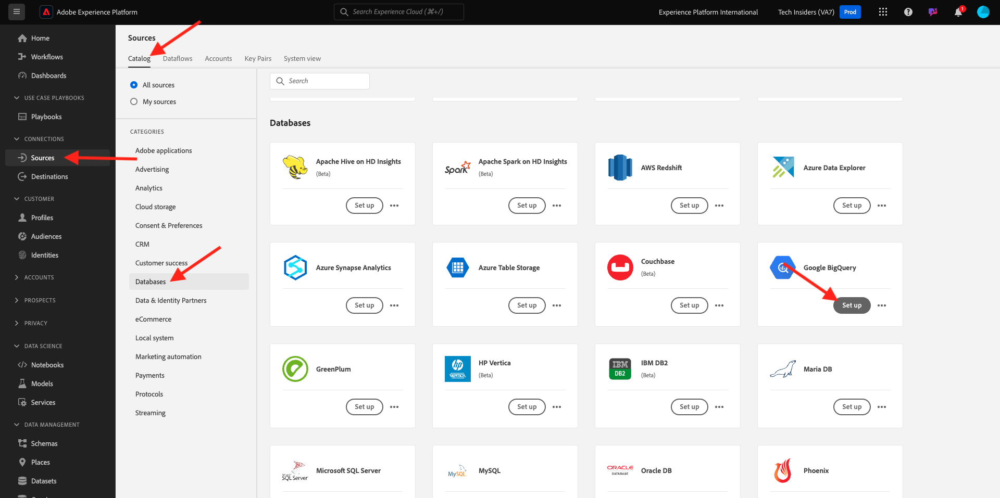
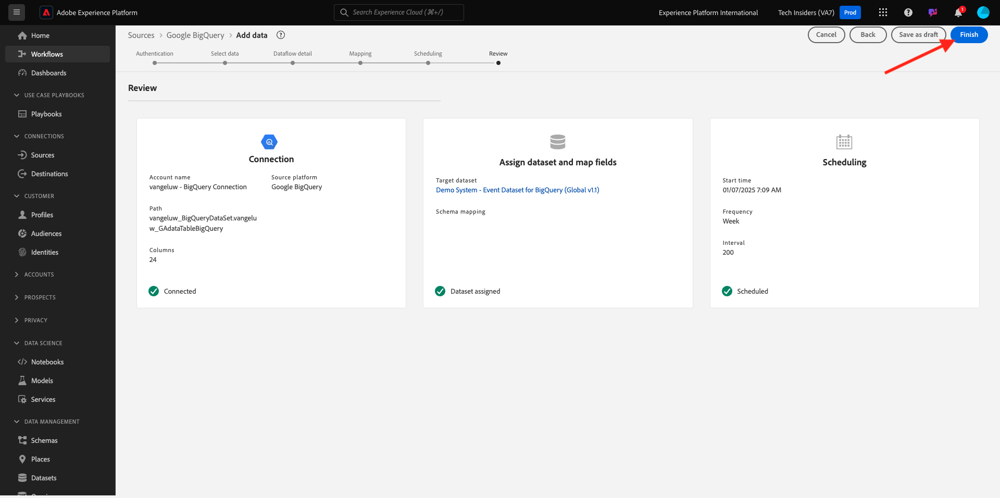

# 1.2.4 Carga de datos de BigQuery en Adobe Experience Platform

## Objetivos

- Asignación de datos de BigQuery a un esquema XDM
- Carga de datos de BigQuery en Adobe Experience Platform
- Familiarícese con la interfaz de usuario del conector de Source de BigQuery

## Antes de comenzar

Después del ejercicio anterior, debería tener esta página abierta en Adobe Experience Platform:

**Si lo tiene abierto, continúe con el siguiente ejercicio.**

**Si no lo tienes abierto, ve a [Adobe Experience Platform](https://experience.adobe.com/platform/home).**

En el menú de la izquierda, vaya a Fuentes. Luego verá la página principal de **Sources**. En el menú **Sources**, vaya al conector de origen de **Google BigQuery** y haga clic en **Configurar**.

A continuación, verá la pantalla de selección de cuenta de Google BigQuery. Seleccione su cuenta y haga clic en **Siguiente**.

Verá la pantalla **Seleccionar datos**.

## 1.2.4.1 Selección de tabla de BigQuery

En la pantalla **Seleccionar datos**, seleccione su conjunto de datos de BigQuery. Ahora puede ver una previsualización de datos de ejemplo de los datos de Google Analytics en BigQuery.

Haga clic en **Next**.

## Asignación XDM 1.2.4.2

Ahora verá lo siguiente:

Ahora debe crear un nuevo conjunto de datos o seleccionar uno existente en el que cargar los datos de Google Analytics. Para este ejercicio, ya se han creado un conjunto de datos y un esquema. No es necesario crear un nuevo esquema o conjunto de datos.

Seleccione **conjunto de datos existente**. Abra el menú desplegable para seleccionar un conjunto de datos. Busque el conjunto de datos denominado `Demo System - Event Dataset for BigQuery (Global v1.1)` y selecciónelo. Haga clic en **Next**.

Desplácese hacia abajo. Ahora necesita asignar cada **campo de Source** desde Google Analytics/BigQuery a un **campo de destino de XDM**, campo por campo. Puede ver una serie de errores que se solucionarán con el siguiente ejercicio de asignación.

Utilice la siguiente tabla de asignación para este ejercicio.

| Campo de origen | Campo de destino |
| ----------------- |-------------| 
| `_id` | `_id` |
| `_id` | canal._id |
| `timeStamp` | timestamp |
| `GA_ID` | ``--aepTenantId--``.identification.core.gaid |
| `customerID` | ``--aepTenantId--``. identification.core.crmId |
| `Page` | web.webPageDetails.name |
| `Device` | device.type |
| `Browser` | environment.browserDetails.vendor |
| `MarketingChannel` | marketing.trackingCode |
| `TrafficSource` | channel.typeAtSource |
| `TrafficMedium` | channel.mediaType |
| `TransactionID` | commerce.order.payments.transactionID |
| `Ecommerce_Action_Type` | eventType |
| `Pageviews` | web.webPageDetails.pageViews.value |

Para algunos campos, debe quitar la asignación original y crear una nueva, para un **Campo calculado**.

| Campo calculado | Campo de destino |
| ----------------- |-------------| 
| `iif(Unique_Purchases == null, 0, Unique_Purchases)` | commerce.purchases.value |
| `iif(Product_Detail_Views == null, 0, Product_Detail_Views)` | commerce.productViews.value |
| `iif(Adds_To_Cart == null, 0, Adds_To_Cart)` | commerce.productListAdds.value |
| `iif(Product_Removes_From_Cart == null, 0, Product_Removes_From_Cart), 1, 0)` | commerce.productListRemovals.value |
| `iif(Product_Checkouts == null, 0, Product_Checkouts)` | commerce.checkouts.value |

Para crear un **campo calculado**, haga clic en **+ Nuevo tipo de campo** y, a continuación, haga clic en **Campo calculado**.

Pegue la regla anterior y haga clic en **Guardar** para cada uno de los campos de la tabla anterior.

Ahora tiene una **asignación** como esta.

Los campos de origen **GA_ID** y **customerID** están asignados a un identificador en este esquema XDM. Esto le permitirá enriquecer los datos de Google Analytics (datos de comportamiento de la aplicación/web) con otros conjuntos de datos, como lealtad o datos del centro de llamadas.

Haga clic en **Next**.

## 1.2.4.3 Programación de la conexión y la ingesta de datos

Ahora verá la ficha **Programación**:

En la ficha **Programación**, puede definir una frecuencia para el proceso de ingesta de datos para esta **asignación** y los datos.

Como está utilizando datos de demostración en Google BigQuery que no se actualizarán, no hay necesidad real de configurar una programación en este ejercicio. Debe seleccionar algo y, para evitar demasiados procesos de ingesta de datos inútiles, debe configurar la frecuencia de esta manera:

- Frecuencia: **Semana**
- Intervalo: **200**
- Hora de inicio: **en cualquier momento de la hora siguiente**

**Importante**: asegúrese de activar el conmutador **Relleno**.

Por último, pero no menos importante, debe definir un campo **delta**.

El campo **delta** se usa para programar la conexión y cargar solo las filas nuevas que llegan al conjunto de datos de BigQuery. Un campo delta suele ser siempre una columna de marca de tiempo. Por lo tanto, para futuras ingestas de datos programadas, solo se incorporarán las filas con una marca de tiempo nueva y más reciente.

Seleccione **timeStamp** como campo delta.
Haga clic en **Next**.

## 1.2.4.4 Revisar e iniciar la conexión

Ahora verá una descripción general detallada de su conexión. Asegúrese de que todo es correcto antes de continuar, ya que algunos ajustes ya no se pueden cambiar posteriormente, como la asignación XDM.

Haga clic en **Finalizar**.

Una vez creada la conexión, verá lo siguiente:

Ya está listo para continuar con el siguiente ejercicio, en el que utilizará Customer Journey Analytics para crear potentes visualizaciones sobre los datos de Google Analytics.

## Pasos siguientes

Ir a [1.2.5 Analizar datos de Google Analytics mediante Customer Journey Analytics](./ex5.md){target="_blank"}

Volver a [Ingesta y análisis de datos de Google Analytics en Adobe Experience Platform con el conector Source de BigQuery](./customer-journey-analytics-bigquery-gcp.md){target="_blank"}

Volver a [Todos los módulos](./../../../../overview.md){target="_blank"}
