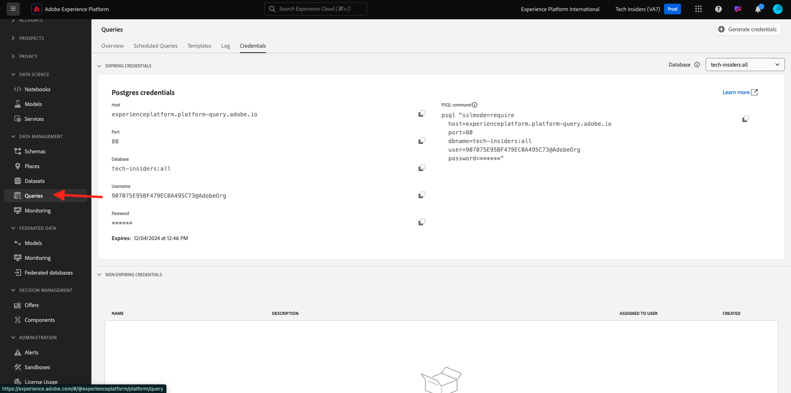
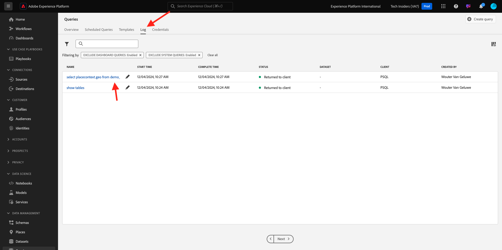
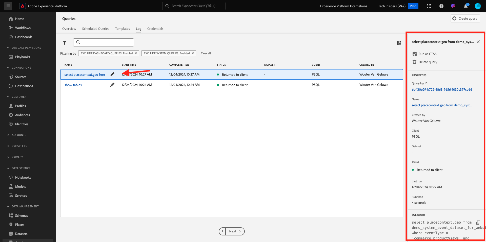

# 2.1.2 Introducción

## Familiarizarse con la IU de Adobe Experience Platform

Ir a [Adobe Experience Platform](https://experience.adobe.com/platform). Después de iniciar sesión, llegará a la página principal de Adobe Experience Platform.

Antes de continuar, debe seleccionar una **zona protegida**. La zona protegida que se va a seleccionar se denomina ``--aepSandboxName--``. Después de seleccionar la [!UICONTROL zona protegida] adecuada, verá el cambio en la pantalla y ahora se encuentra en la [!UICONTROL zona protegida] dedicada.

## Exploración de datos en la plataforma

Traer datos de diferentes canales es una tarea difícil para cualquier marca. Y en este ejercicio, los clientes de Citi Signal se relacionan con Citi Signal en su sitio web, en su aplicación móvil, el sistema de puntos de venta de Citi Signal recopila los datos de compra y tienen datos de CRM y de fidelidad. Citi Signal utiliza Adobe Analytics y Adobe Launch para capturar datos en su sitio web, aplicación móvil y sistema POS, por lo que estos datos ya están fluyendo a Adobe Experience Platform. Empecemos por explorar todos los datos de Citi Signal que ya existen en Adobe Experience Platform.

En el menú de la izquierda, vaya a **Conjuntos de datos**.

Citi Signal está transmitiendo datos a Adobe Experience Platform y estos datos están disponibles en el conjunto de datos `Demo System - Event Dataset for Website (Global v1.1)`. Busque `Demo System - Event Dataset for Website`.

Los datos de interacción del centro de llamadas de Citi Signal se capturan en el conjunto de datos `Demo System - Event Dataset for Call Center (Global v1.1)`. Busque `Demo System - Event Dataset for Call Center` datos en el cuadro de búsqueda. Haga clic en el nombre del conjunto de datos para abrirlo.

Después de hacer clic en el conjunto de datos, obtendrá una descripción general de la actividad del conjunto de datos, como los lotes ingeridos y los fallidos. Haga clic en **Vista previa del conjunto de datos** para ver una muestra de los datos almacenados en el conjunto de datos `Demo System - Event Dataset for Call Center (Global v1.1)`.

El panel izquierdo muestra la estructura de esquema de este conjunto de datos y, en el lado derecho, verá una muestra de los datos introducidos.

Haga clic en **Cerrar** para cerrar la ventana **Vista previa del conjunto de datos**.

## Introducción al servicio de consultas

Se accede al servicio de consultas haciendo clic en **Consultas** en el menú de la izquierda.

Al ir a **Registro**, verá la página Lista de consultas, que le proporciona una lista de todas las consultas que se han ejecutado en esta organización, con las más recientes en la parte superior.

Haga clic en cualquier consulta SQL de la lista y observe los detalles proporcionados en el carril derecho.

Puede desplazarse por la ventana para ver la consulta completa o puede hacer clic en el icono resaltado abajo para copiar toda la consulta en el bloc de notas. No es necesario copiar la consulta en este momento.

No solo puede ver las consultas que se han ejecutado, esta interfaz de usuario le permite crear nuevos conjuntos de datos a partir de consultas. Estos conjuntos de datos se pueden vincular al Perfil del cliente en tiempo real de Adobe Experience Platform o se pueden utilizar como entrada para Adobe Experience Platform Data Science Workspace.

## Conectar el cliente SQL al servicio de consultas

El servicio de consultas admite clientes con un controlador para PostgreSQL. En esto utilizaremos PSQL, una interfaz de línea de comandos, y Power BI o Tableau. Vamos a conectar con PSQL.

Haga clic en **credenciales**.

Verá la siguiente pantalla. La pantalla proporciona información del servidor y credenciales para autenticarse en el servicio de consultas. Por ahora, nos centraremos en el lado derecho de la pantalla que contiene un comando de conexión para PSQL. Haga clic en el botón Copiar para copiar el comando en el portapapeles.

Para Windows: abra la línea de comandos pulsando la tecla de Windows, escribiendo cmd y haciendo clic en el resultado del símbolo del sistema.

Para macOS: Abra terminal.app mediante la búsqueda destacada:

Pegue el comando de conexión que ha copiado desde la interfaz de usuario del servicio de consultas y pulse Enter en la ventana del símbolo del sistema:

Windows:

MacOS:

Ahora está conectado al servicio de consultas mediante PSQL.

En los próximos ejercicios, habrá bastante interacción con esta ventana. Nos referiremos a él como su **interfaz de línea de comandos PSQL**.

Ahora está listo para empezar a enviar consultas.

## Pasos siguientes

Ir a [2.1.3 mediante el servicio de consultas](./ex3.md){target="_blank"}

Volver a [servicio de consultas](./query-service.md){target="_blank"}

Volver a [Todos los módulos](./../../../../overview.md){target="_blank"}
