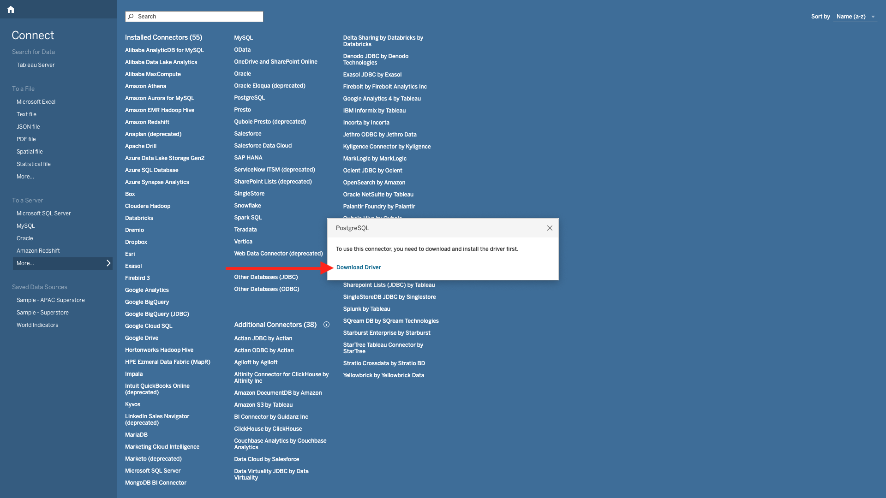

# 2.1.7 Servicio de consultas y Tableau

Abra Tableau.

En **Conectarse a un servidor**, haga clic en **Más** y, a continuación, en **PostgreSQL**.

Si todavía no ha utilizado PostgeSQL con Tableau, es posible que vea esto. Haga clic en **Descargar controlador**.

Siga las instrucciones para descargar e instalar el controlador PostgreSQL.

Una vez que haya terminado de instalar el controlador, salga y reinicie Tableau Desktop. Después del reinicio, ve a **Conectarse a un servidor** de nuevo, haz clic en **Más** y luego haz clic en **PostgreSQL** de nuevo.

Entonces verá esto...

Vaya a Adobe Experience Platform, **Consultas** y **Credenciales**.

En la página **Credentials** de Adobe Experience Platform, copie el **host** y péguelo en el campo **Server**, copie la **Base de datos** y péguela en el campo **Database** en Tableau, copie el **Puerto** y péguelo en el campo **Puerto** en Tableau, haga lo mismo para **Username** y **Contraseña**. A continuación, haga clic en **Iniciar sesión**.

En la lista de tablas disponibles, busque la tabla que creó en el ejercicio anterior, que se llama `--aepUserLdap--_callcenter_interaction_analysis`. Arrástrela al lienzo.

Entonces verá esto... Haga clic en **Actualizar ahora**.

A continuación, verá que los datos de AEP están disponibles en Tableau. Haga clic en **Hoja 1** para comenzar a trabajar con los datos.

Para visualizar los datos en el mapa, debe convertir la longitud y la latitud en dimensiones. En **Medidas**, haga clic con el botón derecho en **Latitud** y seleccione **Convertir a Dimension** en el menú. Haga lo mismo para la medida **Longitude**.

Arrastre la medida **Longitude** a **Columns** y la medida **Latitude** a **Rows**. Automáticamente, el mapa de **Bélgica** aparecerá con pequeños puntos que representan las ciudades dentro del conjunto de datos.

Seleccione **Nombres de medida**, haga clic en **Agregar a hoja**.

Ahora tendrá un mapa, con puntos de varios tamaños. El tamaño indica la cantidad de interacciones del centro de llamadas para esa ciudad específica. Para variar el tamaño de los puntos, vaya al panel derecho y abra **Valores de medida** (usando el icono desplegable). En la lista desplegable, seleccione **Editar tamaños**. Juega con diferentes tamaños.

Para mostrar más los datos por **Tema de llamada**, arrastre la dimensión **Tema de llamada** a **Páginas**. Desplácese por los diferentes **temas de llamada** usando **Tema de llamada** a la derecha de la pantalla:

Ya ha terminado este ejercicio.

## Pasos siguientes

Ir a [2.1.8 API de servicio de consultas](./ex8.md){target="_blank"}

Volver a [servicio de consultas](./query-service.md){target="_blank"}

Volver a [Todos los módulos](./../../../../overview.md){target="_blank"}
