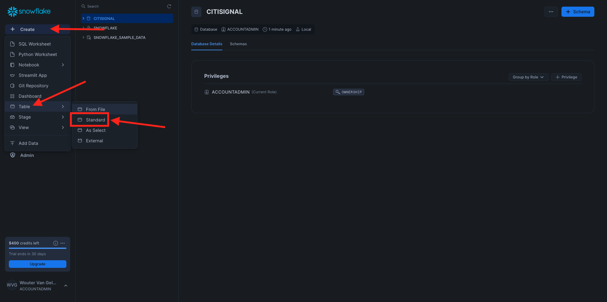
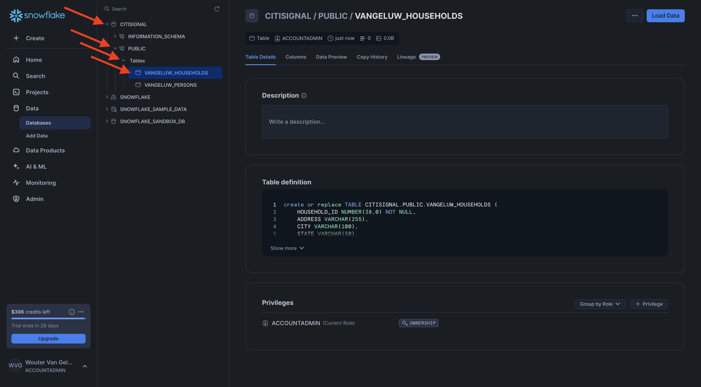
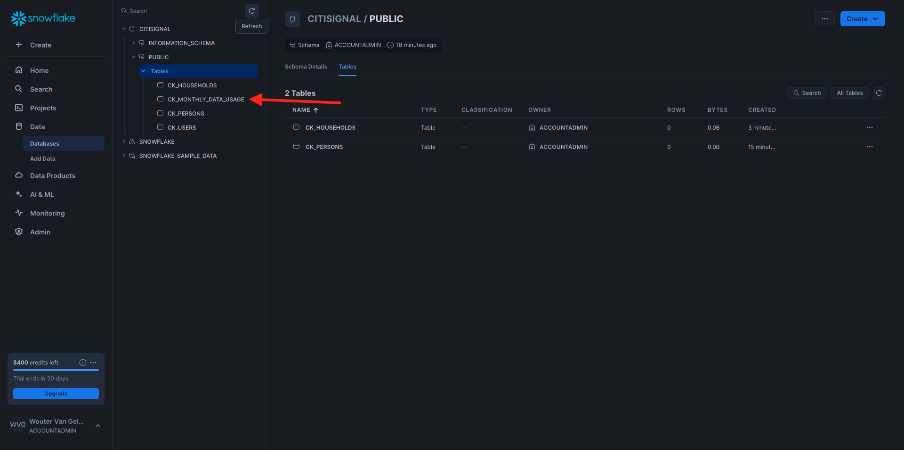

# 3.1.1 Configuración del entorno de Snowflake

## 3.1.1.1 Cree su cuenta

Vaya a [https://snowflake.com](https://snowflake.com). Haz clic en **COMENZAR GRATIS**.


Escribe tus datos y haz clic en **Continuar**.


Escribe tus datos, elige tu proveedor de servicios cloud y haz clic en **Comenzar**.


Escriba sus detalles o haga clic en **Omitir** (x2).


Entonces verá esto... Compruebe su correo electrónico y haga clic en el correo electrónico de confirmación que se le ha enviado.


Haga clic en el vínculo del correo electrónico de confirmación para activar la cuenta y definir el nombre de usuario y la contraseña. Haga clic en **Comenzar**. Deberá utilizar este nombre de usuario y contraseña en el siguiente ejercicio.


Se iniciará sesión en el Snowflake. Haga clic en **Omitir por ahora**.


## 3.1.1.2 Creación de la base de datos

Vaya a **Datos > Bases de datos**. Haga clic en **+ Base de datos**.


Use el nombre **CITISIGNAL** para su base de datos. Haga clic en **CREAR**.


## 3.1.1.3 Creación de tablas

Ahora puede empezar a crear tablas en Snowflake. A continuación encontrará secuencias de comandos para ejecutar la creación de tablas.

### Tabla CK_PERSONS

Haga clic en **+ Crear**, luego en **Tabla** y luego en **Estándar**.



Entonces verá esto... Copie la siguiente consulta y péguela en el Snowflake. Asegúrese de seleccionar la base de datos **CITISIGNAL** en la esquina superior izquierda de la pantalla antes de crear la tabla.

```sql
create or replace TABLE CITISIGNAL.PUBLIC.CK_PERSONS (
	PERSON_ID NUMBER(38,0) NOT NULL,
	NAME VARCHAR(255),
	AGE NUMBER(38,0),
	EMAIL VARCHAR(255),
	PHONE_NUMBER VARCHAR(20),
	GENDER VARCHAR(10),
	OCCUPATION VARCHAR(100),
	ISATTMOBILESUB BOOLEAN,
	primary key (PERSON_ID)
);
```

Haga clic en **Crear tabla**.


Una vez ejecutado el script, encontrará la tabla en **Bases de datos > CITISIGNAL > PUBLIC**.


### Tabla CK_HOUSEHOLDS

Haga clic en **+ Crear**, luego en **Tabla** y luego en **Estándar**.


Entonces verá esto... Copie la siguiente consulta y péguela en el Snowflake. Asegúrese de seleccionar la base de datos **CITISIGNAL** en la esquina superior izquierda de la pantalla antes de crear la tabla.

```sql
create or replace TABLE CITISIGNAL.PUBLIC.CK_HOUSEHOLDS (
	HOUSEHOLD_ID NUMBER(38,0) NOT NULL,
	ADDRESS VARCHAR(255),
	CITY VARCHAR(100),
	STATE VARCHAR(50),
	POSTAL_CODE VARCHAR(20),
	COUNTRY VARCHAR(100),
	ISELIGIBLEFORFIBER BOOLEAN,
	PRIMARY_PERSON_ID NUMBER(38,0),
	ISFIBREENABLED BOOLEAN,
	primary key (HOUSEHOLD_ID)
);
```

Haga clic en **Crear tabla**.


Una vez ejecutado el script, encontrará la tabla en **Bases de datos > CITISIGNAL > PUBLIC**.



### Tabla CK_USERS

Haga clic en **+ Crear**, luego en **Tabla** y luego en **Estándar**.


Entonces verá esto... Copie la siguiente consulta y péguela en el Snowflake. Asegúrese de seleccionar la base de datos **CITISIGNAL** en la esquina superior izquierda de la pantalla antes de crear la tabla.

```sql
create or replace TABLE CITISIGNAL.PUBLIC.CK_USERS (
	USER_ID NUMBER(38,0) NOT NULL,
	PERSON_ID NUMBER(38,0),
	HOUSEHOLD_ID NUMBER(38,0),
	primary key (USER_ID),
	foreign key (PERSON_ID) references CITISIGNAL.PUBLIC.CK_PERSONS(PERSON_ID),
	foreign key (HOUSEHOLD_ID) references CITISIGNAL.PUBLIC.CK_HOUSEHOLDS(HOUSEHOLD_ID)
);
```

Haga clic en **Crear tabla**.


Una vez ejecutado el script, encontrará la tabla en **Bases de datos > CITISIGNAL > PUBLIC**.


### Tabla CK_MONTHLY_DATA_USAGE

Haga clic en **+ Crear**, luego en **Tabla** y luego en **Estándar**.


Entonces verá esto... Copie la siguiente consulta y péguela en el Snowflake. Asegúrese de seleccionar la base de datos **CITISIGNAL** en la esquina superior izquierda de la pantalla antes de crear la tabla.

```sql
create or replace TABLE CITISIGNAL.PUBLIC.CK_MONTHLY_DATA_USAGE (
	USAGE_ID NUMBER(38,0) NOT NULL autoincrement start 1 increment 1 noorder,
	USER_ID NUMBER(38,0),
	MONTH DATE,
	DATA_USAGE_GB NUMBER(10,2),
	primary key (USAGE_ID)
);
```

Haga clic en **Crear tabla**.


Una vez ejecutado el script, encontrará la tabla en **Bases de datos > CITISIGNAL > PUBLIC**.



### Tabla CK_MOBILE_DATA_USAGE

Haga clic en **+ Crear**, luego en **Tabla** y luego en **Estándar**.


Entonces verá esto... Copie la siguiente consulta y péguela en el Snowflake. Asegúrese de seleccionar la base de datos **CITISIGNAL** en la esquina superior izquierda de la pantalla antes de crear la tabla.


```sql
create or replace TABLE CITISIGNAL.PUBLIC.CK_MOBILE_DATA_USAGE (
	USAGE_ID NUMBER(38,0) NOT NULL autoincrement start 1 increment 1 noorder,
	USER_ID NUMBER(38,0),
	DATE DATE,
	TIME TIME(9),
	APP_NAME VARCHAR(255),
	DATA_USAGE_MB NUMBER(10,2),
	NETWORK_TYPE VARCHAR(50),
	DEVICE_TYPE VARCHAR(50),
	COUNTRY_CODE VARCHAR(10),
	primary key (USAGE_ID)
);
```

Haga clic en **Crear tabla**.


Una vez ejecutado el script, encontrará la tabla en **Bases de datos > CITISIGNAL > PUBLIC**.


Todas las tablas se han creado.


## 3.1.1.4 Ingesta de datos de muestra

Ahora puede empezar a cargar datos de ejemplo en la base de datos.

...

Ya ha finalizado la configuración en Snowflake.


Paso siguiente: [3.1.2 Crear esquemas, modelos de datos y vínculos](./ex2.md)

[Volver al módulo 3.1](./fac.md)

[Volver a todos los módulos](../../../overview.md)
