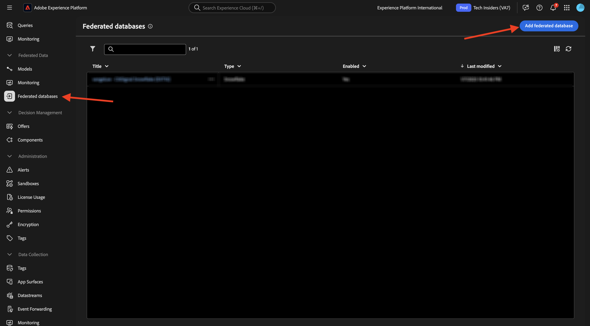
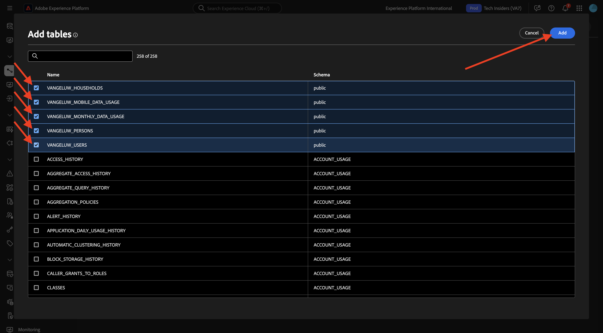
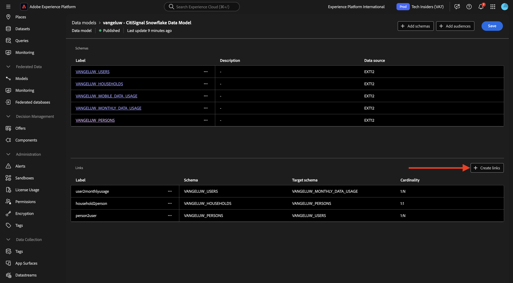

# 3.1.2 Creación de esquemas, modelos de datos y vínculos

Ahora puede configurar la base de datos federada en Adobe Experience Platform.

Inicie sesión en Adobe Experience Platform desde esta dirección URL: [https://experience.adobe.com/platform](https://experience.adobe.com/platform).

Después de iniciar sesión, llegará a la página principal de Adobe Experience Platform.

Antes de continuar, debe seleccionar una **zona protegida**. La zona protegida que se va a seleccionar se denomina ``--aepSandboxName--``. Después de seleccionar la zona protegida adecuada, verá que la pantalla cambia y ahora está en la zona protegida dedicada.

## 3.1.2.1 Configuración de una base de datos federada en AEP

Haga clic en **Bases de datos federadas** en el menú de la izquierda. A continuación, haga clic en **Agregar base de datos federada**.

Como **etiqueta**, use `--aepUserLdap-- - CitiSignal Snowflake` y, para el tipo, elija **Snowflake**.

En Detalles, debe rellenar las credenciales, que lucirán de esta manera:

**Servidor**:

En Snowflake, vaya a **Administración > Cuentas**. Haga clic en 3 **...** junto a su cuenta y luego en **Administrar direcciones URL**.

Entonces verá esto... Copie la **URL actual** y péguela en el campo **Servidor** en AEP.

**Usuario**: el nombre de usuario que creó anteriormente, en el ejercicio 1.3.1.1
**Contraseña**: la contraseña que creó anteriormente, en el ejercicio 1.3.1.1
**Base de datos**: use **CITISIGNAL**

Así que finalmente, deberías tener esto. Haga clic en **Probar conexión**. Si la prueba se realiza correctamente, haga clic en **Implementar funciones**, que creará funciones en el lado del Snowflake que son necesarias para el motor de flujo de trabajo.

Una vez que la conexión se haya probado correctamente y se hayan implementado las funciones, la configuración se almacenará.

Cuando vuelva al menú **Bases de datos federadas**, verá su conexión allí.

## 3.1.2.2 Crear esquemas en AEP

En el menú de la izquierda, haz clic en **Modelos** y luego ve a **Esquemas**. Haga clic en **Crear esquema**.

Seleccione su base de datos federada y haga clic en **+ Agregar tablas**.

Entonces verá esto... Seleccione las 5 tablas que creó en Snowflake anteriormente:

- `CK_HOUSEHOLDS`
- `CK_MOBILE_DATA_USAGE`
- `CK_MONTHLY_DATA_USAGE`
- `CK_PERSONS`
- `CK_USERS`

Haga clic en **Agregar**.

A continuación, AEP cargará la información de cada tabla y la mostrará en la interfaz de usuario.

Para cada tabla, puede:

- cambiar la etiqueta del esquema
- añadir una descripción
- cambie el nombre de todos los campos y establezca su visibilidad
- seleccione la clave principal del esquema

Para este ejercicio, no es necesario realizar cambios.

Haga clic en **Crear**.

Entonces verá esto... Puede hacer clic en cualquier esquema y revisar la información. Por ejemplo, haga clic en **CK_PERSONS**.

A continuación, verá esto, con la capacidad de editar la configuración. Haga clic en **Datos** para ver una muestra de los datos de la base de datos del Snowflake.

A continuación, verá una muestra de los datos.

## 3.1.2.3 Crear un modelo en AEP

En el menú de la izquierda, ve a **Modelos** y luego a **Modelo de datos**. Haga clic en **Crear modelo de datos**.

Para la etiqueta, use `--aepUserLdap-- - CitiSignal Snowflake Data Model`. Haga clic en **Crear**.

Haga clic en **Agregar esquemas**.

Seleccione los esquemas y haga clic en **Agregar**.

Entonces verá esto... Haga clic en **Guardar**.

### `CK_USERS` - `CK_PERSONS`

Ahora puede empezar a definir vínculos entre esquemas. Para empezar a definir un vínculo, debe hacer clic en **Crear vínculos**.

En primer lugar, definamos el vínculo entre la tabla `CK_USERS` y `CK_PERSONS`.

Haga clic en **Agregar**.

### `CK_HOUSEHOLDS` - `CK_PERSONS`

Entonces volverás a estar aquí. Haga clic en **Crear vínculos** para crear otro vínculo.

A continuación, definamos el vínculo entre la tabla `CK_HOUSEHOLDS` y `CK_PERSONS`.

### `CK_USERS` - `CK_MONTHLY_DATA_USAGE`

Entonces volverás a estar aquí. Haga clic en **Crear vínculos** para crear otro vínculo.

A continuación, definamos el vínculo entre la tabla `CK_USERS` y `CK_MONTHLY_DATA_USAGE`.

### `CK_USERS` - `CK_HOUSEHOLDS`

Entonces volverás a estar aquí. Haga clic en **Crear vínculos** para crear otro vínculo.

A continuación, definamos el vínculo entre la tabla `CK_USERS` y `CK_HOUSEHOLDS`.

### `CK_USERS` - `CK_MOBILE_DATA_USAGE`

Entonces volverás a estar aquí. Haga clic en **Crear vínculos** para crear otro vínculo.

A continuación, definamos el vínculo entre la tabla `CK_USERS` y `CK_MOBILE_DATA_USAGE`.

Entonces debería ver esto. Haga clic en **Guardar**.

Ya ha finalizado la configuración en AEP. Ahora puede empezar a utilizar los datos federados en una composición de audiencia federada.

Paso siguiente: [3.1.3 Crear una composición federada](./ex3.md)

[Volver al módulo 3.1](./fac.md)

[Volver a todos los módulos](../../../overview.md)
