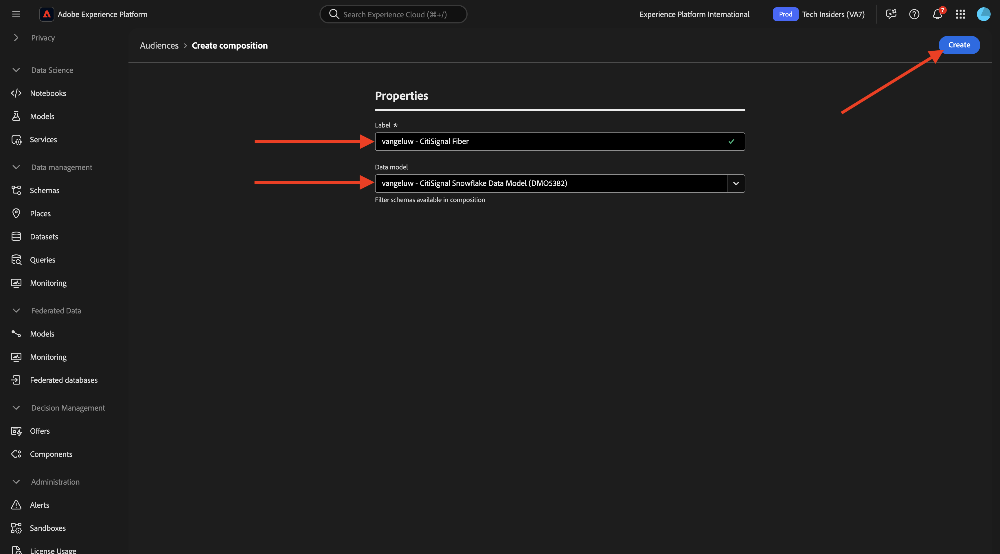
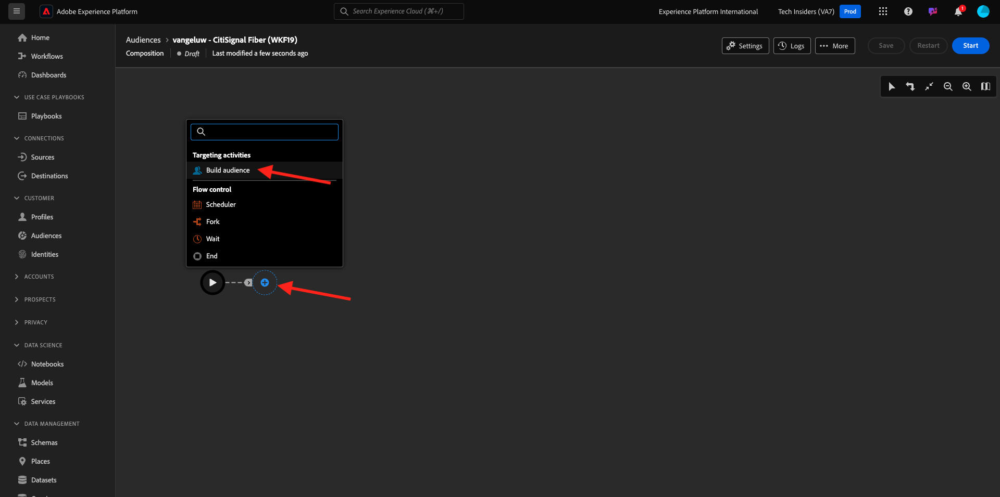
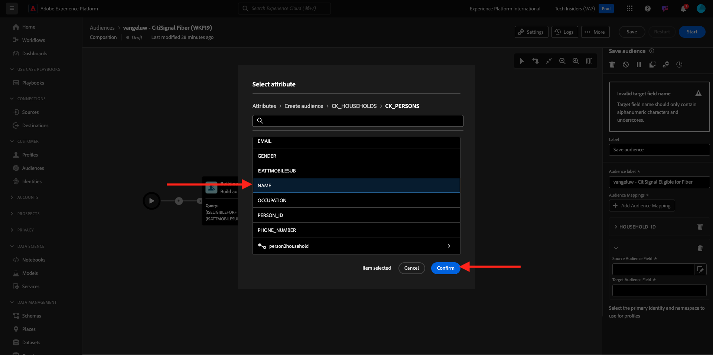

# 3.1.3 Crear una composición federada

Ahora puede configurar la composición de audiencias federadas en AEP.

Inicie sesión en Adobe Experience Platform desde esta dirección URL: [https://experience.adobe.com/platform](https://experience.adobe.com/platform).

Después de iniciar sesión, llegará a la página principal de Adobe Experience Platform.

Antes de continuar, debe seleccionar una **zona protegida**. La zona protegida que se va a seleccionar se denomina ``--aepSandboxName--``. Después de seleccionar la zona protegida adecuada, verá que la pantalla cambia y ahora está en la zona protegida dedicada.

## 3.1.3.1 Crear su audiencia

En el menú de la izquierda, ve a **Audiencias** y luego a **Composiciones federadas**. Haga clic en **Crear composición**.

Para la etiqueta, use esto: `--aepUserLdap-- - CitiSignal Fiber`. Seleccione el modelo de datos que creó en el ejercicio anterior, que se llama `--aepUserLdap-- - CitiSignal Snowflake Data Model`. Haga clic en **Crear**.

Entonces verá esto...

Haga clic en el icono **+** y luego en **Generar audiencia**.

Entonces verá esto... Seleccione **Crear audiencia**. Haga clic en el icono **search** para seleccionar un esquema.

Seleccione el esquema **CK_HOUSEHOLDS**. Haga clic en **Confirmar**.

A continuación, haga clic en **Continuar**.

Ahora puede empezar a crear la consulta que se enviará al Snowflake. Haga clic en el icono **+** y, a continuación, haga clic en **Condición personalizada**.

Seleccione el atributo **ISELIGIBLEFORFIBER** Haga clic en **Confirmar**.

Entonces verá esto... Establezca el campo **Value** en **True**. Haga clic en **Calcular** para insertar la consulta en el Snowflake y obtener una estimación de los perfiles que ahora cumplen los requisitos.

A continuación, haga clic de nuevo en el icono **+** y luego en **Condición personalizada** para agregar otra condición.

La segunda condición que se debe agregar es: `Is the user an existing CitiSignal Mobile subscriber?`. La manera de responder a esa pregunta es usar la relación entre el hogar y el cliente principal del hogar, que se define en otra tabla, **CK_PERSONS**. Puede explorar en profundidad el menú de atributos mediante el vínculo **household2person**.

Seleccione el atributo **ISMOBILESUB** y haga clic en **Confirmar**.

Establezca el campo **Value** en **True**. Vuelva a hacer clic en **Calcular** para actualizar el número de perfiles de destino. Haga clic en **Confirmar**.

Haga clic en el icono **+** y, a continuación, haga clic en **Guardar audiencia**.

Establezca la **etiqueta de audiencia** en `--aepUserLdap-- - CitiSignal Eligible for Fiber`.

Haga clic en **+ Agregar asignación de audiencia**.

Seleccione **HOUSEHOLD_ID** y haga clic en **Confirmar**.

Haga clic en **+ Agregar asignación de audiencia**.

Desglose haciendo clic en **Dimensión de segmentación**.

Desglose haciendo clic en el vínculo **hogar2persona**.

Seleccione el campo **NAME**. Haga clic en **Confirmar**.

Haga clic en **+ Agregar asignación de audiencia**.

Desglose haciendo clic en **Dimensión de segmentación**.

Desglose haciendo clic en el vínculo **hogar2persona**.

Seleccione el campo **CORREO ELECTRÓNICO**. Haga clic en **Confirmar**.

Entonces verá esto... Ahora necesita establecer el **campo de identidad principal**, establézcalo en **Household2person_EMAIL**.

Haga clic en **Guardar**.

Su composición ha finalizado. Haga clic en **Iniciar** para ejecutarlo.

La consulta ahora se inserta en Snowflake, que consultará los datos de origen allí. Los resultados se devolverán a AEP, pero los datos de origen permanecen en Snowflake.

La audiencia ahora se rellena y se puede segmentar desde el ecosistema de AEP.

Siguiente paso: [Resumen y beneficios](./summary.md)

[Volver al módulo 3.1](./fac.md)

[Volver a todos los módulos](../../../overview.md)
