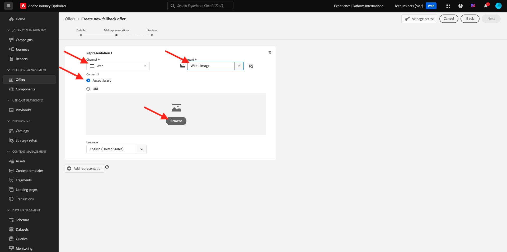
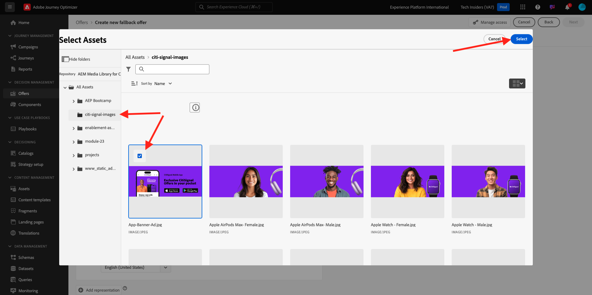
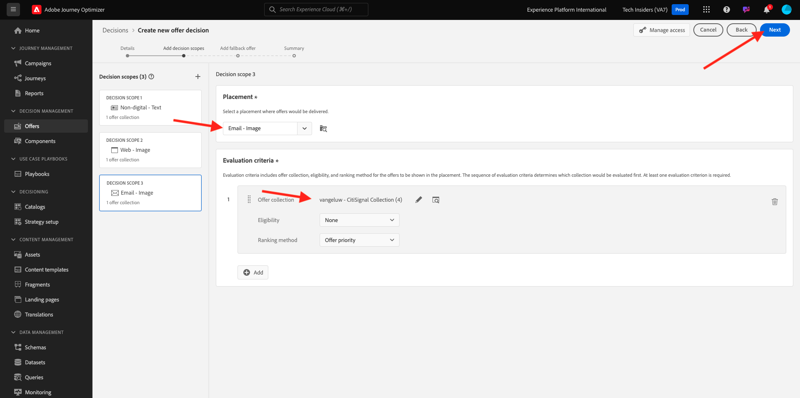

# 3.3.2 Configurar las ofertas y la decisión

## 3.3.2.1 Creación de ofertas personalizadas

En este ejercicio, creará cuatro **Ofertas personalizadas**. Estos son los detalles que se deben tener en cuenta al crear esas ofertas:

| Nombre | Date Range | Vínculo de imagen para correo electrónico | Vínculo de imagen para web | Texto | Prioridad | Idoneidad | Idioma | Frecuencia de límite | Nombre de imagen |
|-----|------------|----------------------|--------------------|------|:--------:|--------------|:-------:|:-------:|:-------:|
| `--aepUserLdap-- - AirPods Max` | hoy - 1 mes después | https://bit.ly/4a9RJ5d | Elija de la biblioteca de Assets | `{{ profile.person.name.firstName }}, 10% discount on AirPods Max` | 25 | todos: mujeres clientes | Inglés (Estados Unidos) | 3 | Apple AirPods Max - Mujer.jpg |
| `--aepUserLdap-- - Galaxy S24` | hoy - 1 mes después | https://bit.ly/3W8yuDv | Elija de la biblioteca de Assets | `{{ profile.person.name.firstName }}, 5% discount on Galaxy S24` | 15 | todos: mujeres clientes | Inglés (Estados Unidos) | 3 | Galaxy S24 - Mujer.jpg |
| `--aepUserLdap-- - Apple Watch` | hoy - 1 mes después | https://bit.ly/4fGwfxX | https://bit.ly/4fGwfxX | `{{ profile.person.name.firstName }}, 10% discount on Apple Watch` | 25 | todos: clientes hombres | Inglés (Estados Unidos) | 3 | Apple Watch - Hombre.jpg |
| `--aepUserLdap-- - Galaxy Watch 7` | hoy - 1 mes después | https://bit.ly/4gTrkeo | Elija de la biblioteca de Assets | `{{ profile.person.name.firstName }}, 5% discount on Galaxy Watch 7` | 15 | todos: clientes hombres | Inglés (Estados Unidos) | 3 | Galaxy Watch7 - Hombre.jpg |

{style="table-layout:auto"}

Inicie sesión en Adobe Journey Optimizer en [Adobe Experience Cloud](https://experience.adobe.com). Haga clic en **Journey Optimizer**.

Se le redirigirá a la vista **Inicio** en Journey Optimizer. Primero, asegúrese de que está usando la zona protegida correcta. La zona protegida que se va a usar se llama `--aepSandboxName--`. Estará en la vista **Inicio** de su zona protegida `--aepSandboxName--`.

En el menú de la izquierda, haz clic en **Ofertas** y luego ve a **Ofertas**. Haga clic en **+ Crear oferta**.

Entonces verá esta ventana emergente. Seleccione **Oferta personalizada** y haga clic en **Siguiente**.

Ahora estás en la vista **Detalles**.

En este caso, debe configurar la oferta `--aepUserLdap-- - AirPods Max`. Utilice la información de la tabla anterior para rellenar los campos. En este ejemplo, el nombre de la oferta personalizada es **vangeluw - AirPods Max**. Además, establezca la **fecha y hora de inicio** en hoy y la **fecha y hora de finalización** en una fecha dentro de un mes a partir de ahora.

Una vez finalizado, debería tener esto. Haga clic en **Next**.

A continuación, verá esto:

Seleccione **By defined decision rule** y haga clic en el icono **+** para agregar la regla **all - Female Customers**.

Complete la **Prioridad** como se indica en la tabla anterior. A continuación, haga clic en **+ Crear límite** para definir el número de veces que esta oferta se puede mostrar a un cliente.

Para el límite, seleccione lo siguiente:

- **Elegir evento de límite**: **Evento de decisión**
- **Tipo de límite**: **Por perfil (aplique un límite para cada perfil)**
- **Recuento de eventos de límite**: **3**
- **Restablecer frecuencia límite**: **Diario**
- **Cada**: **1 día**

Esto garantiza que esta oferta no se muestre más de tres veces al día por cliente.

Haga clic en **Crear**.

Entonces volverás a estar aquí. Haga clic en **Next**.

Ahora necesita crear **Representaciones**. Las representaciones son una combinación de **Placement** y un recurso real.

Para **Representación 1**, seleccione:

- Canal: web
- Ubicación: Web - Imagen
- Contenido: URL
- Ubicación pública: copie la dirección URL de la columna **Vínculo de imagen para la web** en la tabla anterior

También puede seleccionar **Biblioteca de recursos** para el contenido y luego hacer clic en **Examinar**.

Verá una ventana emergente de la biblioteca de Assets, vaya a la carpeta **enablement-assets** y seleccione el archivo de imagen **Apple AirPods Max - Female.jpg**. A continuación, haga clic en **Seleccionar**.

Entonces verá esto... Haga clic en **+ Agregar representación**.

Para **Representación 2**, seleccione:

- Canal: correo electrónico
- Ubicación: correo electrónico, imagen
- Contenido: URL
- Ubicación pública: seleccione **Biblioteca de recursos**. Haga clic en **Examinar**

Verá una ventana emergente de la biblioteca de Assets, vaya a la carpeta **enablement-assets** y seleccione el archivo de imagen **Apple AirPods Max - Female.jpg**. A continuación, haga clic en **Seleccionar**.

Entonces verá esto... A continuación, haga clic en **+ Agregar representación**.

Para **Representación 3**, seleccione:

- Canal: no digital
- Ubicación: no digital, texto

A continuación, debe añadir contenido. En este caso, eso significa añadir el texto que se va a utilizar como llamada a la acción.

Seleccione **Personalizado** y haga clic en **Agregar contenido**.

Entonces verá esta ventana emergente.

Observe el campo **Texto** de la tabla anterior e introduzca ese texto aquí, en este caso: `{{ profile.person.name.firstName }}, 10% discount on AirPods Max`.

También notará que puede seleccionar cualquier atributo de perfil e incluirlo como un campo dinámico en el texto de la oferta. En este ejemplo, el campo `{{ profile.person.name.firstName }}` se asegurará de que el nombre del cliente que recibirá esta oferta se incluya en el texto de la oferta.

Entonces verá esto... Haga clic en **Guardar**.

Ahora tiene esto. Haga clic en **Next**.

Verás una descripción general de tu nueva **oferta personalizada**. Haga clic en **Finalizar**.

Haga clic en **Guardar y aprobar**.

A continuación, verá que la oferta personalizada recién creada está disponible en la Información general de ofertas:

Ahora debe repetir los pasos anteriores para crear las otras tres ofertas personalizadas para los productos que puede encontrar en la tabla anterior.

Cuando termine, la pantalla **Información general de ofertas** para **Ofertas personalizadas** debe mostrar todas las ofertas.

## 3.3.2.2 Crear su oferta de reserva

Después de haber creado cuatro ofertas personalizadas, ahora debes configurar una **Oferta de reserva**.

Asegúrese de que está en la vista **Ofertas**. Haga clic en **+ Crear oferta**.

Entonces verá esta ventana emergente. Seleccione **Oferta de reserva** y haga clic en **Siguiente**.

Entonces verá esto... Escriba este nombre para la oferta de reserva: `--aepUserLdap-- - CitiSignal Fallback Offer`. Haga clic en **Next**.

Ahora necesita crear **Representaciones**. Las representaciones son una combinación de **Placement** y un recurso real.

Para **Representación 1**, seleccione:

- **Canal**: **Web**
- **Ubicación**: **Web - Imagen**
- **Contenido**: **Biblioteca de recursos**

Haz clic en **Examinar** para seleccionar tu imagen.

Verá una ventana emergente de la biblioteca Assets, irá a la carpeta **citi-signal-images** y seleccionará el archivo de imagen **App-Banner-Ad.jpg**. A continuación, haga clic en **Seleccionar**.

Entonces verá esto... Haga clic en **+ Agregar representación**.

Para **Representación 2**, seleccione:

- **Canal**: **Correo electrónico**
- **Ubicación**: **Correo electrónico - Imagen**
- **Contenido**: **Biblioteca de recursos**

Haz clic en **Examinar** para seleccionar tu imagen.

Verá una ventana emergente de la biblioteca Assets, irá a la carpeta **citi-signal-images** y seleccionará el archivo de imagen **App-Banner-Ad.jpg**. A continuación, haga clic en **Seleccionar**.

Entonces verá esto... Haga clic en **+ Agregar representación**.

Para **Representación 3**, seleccione:

- **Canal**: **No digital**
- **Ubicación**: **No digital - Texto**
- **Contenido**: **Personalizado**

Haga clic en **Agregar contenido**.

Entonces verá esta ventana emergente. Escriba el texto `{{ profile.person.name.firstName }}, download the CitiSignal app now!` y haga clic en **Guardar**.

Entonces verá esto... Haga clic en **Next**.

Verá una descripción general de su nueva **oferta de reserva**. Haga clic en **Finalizar**.

Finalmente, haga clic en **Guardar y aprobar**.

En la pantalla **Información general de ofertas**, ahora verá esto:

## 3.3.2.3 Crear su colección

Se usa una colección para **filtrar** un subconjunto de ofertas de la lista de ofertas personalizadas y usarlas como parte de una decisión para acelerar el proceso de decisión.

Ir a **Colecciones**. Haga clic en **+ Crear colección**.

Entonces verá esta ventana emergente. Configure la colección de esta manera. Haga clic en **Next**.

- Nombre de colección: usar `--aepUserLdap-- - CitiSignal Collection`
- Seleccione **Crear colección estática**.

Haga clic en **Next**.

En la pantalla siguiente, seleccione las cuatro **Ofertas personalizadas** que creó en el ejercicio anterior. Haga clic en **Guardar**.

Ahora verá lo siguiente:

## 3.3.2.4 Crear su decisión

Una decisión combina ubicaciones, una colección de ofertas personalizadas y una oferta de reserva que el motor de Offer decisioning utilizará en última instancia para encontrar la mejor oferta para un perfil específico, en función de cada una de las características de oferta personalizadas individuales como prioridad, restricción de elegibilidad y límite total/de usuario.

Para configurar su **decisión**, vaya a **decisiones**. Haga clic en **+ Crear decisión**.

Entonces verá esto... Rellene los campos de esta manera. Haga clic en **Next**.

- Nombre: `--aepUserLdap-- - CitiSignal Decision`
- Fecha y hora de inicio: hoy
- Fecha y hora de finalización: hoy + 1 mes

En la siguiente pantalla, debe agregar ubicaciones en ámbitos de decisión. Deberá crear ámbitos de decisión para las ubicaciones **Web - Imagen**, **Correo electrónico - Imagen** y **No digital - Texto**.

Primero, cree el ámbito de decisión para **No digital - Texto** al seleccionar esa ubicación en la lista desplegable. A continuación, haga clic en el botón **Agregar** para agregar criterios de evaluación.

Seleccione su colección `--aepUserLdap-- - CitiSignal Collection` y haga clic en **Agregar**.

Entonces verá esto... Haga clic en el botón **+** para agregar un nuevo ámbito de decisión.

Seleccione la ubicación **Web - Imagen** y agregue la colección `--aepUserLdap-- - CitiSignal Collection` bajo criterios de evaluación. A continuación, haga clic de nuevo en el botón **+** para agregar un nuevo ámbito de decisión.

Seleccione la ubicación **Correo electrónico - Imagen** y agregue la colección `--aepUserLdap-- - CitiSignal Collection` bajo criterios de evaluación. A continuación, haga clic en **Siguiente**.

Ahora necesita seleccionar su **Oferta de reserva**, que se llama `--aepUserLdap-- - CitiSignal Fallback Offer`. Haga clic en **Next**.

Revise su decisión. Haga clic en **Finalizar**.

En la ventana emergente, haz clic en **Guardar y activar**.

Y, por último, ahora verá su decisión en la descripción general:

Ahora ha configurado correctamente su decisión. Su decisión ya está activa y se puede utilizar para ofrecer ofertas optimizadas y personalizadas a sus clientes, en tiempo real.

Paso siguiente: [3.3.3 Prepare la propiedad de cliente de recopilación de datos y la configuración de Web SDK para el Offer decisioning](./ex3.md)

[Volver al módulo 3.3](./offer-decisioning.md)

[Volver a todos los módulos](./../../../overview.md)
