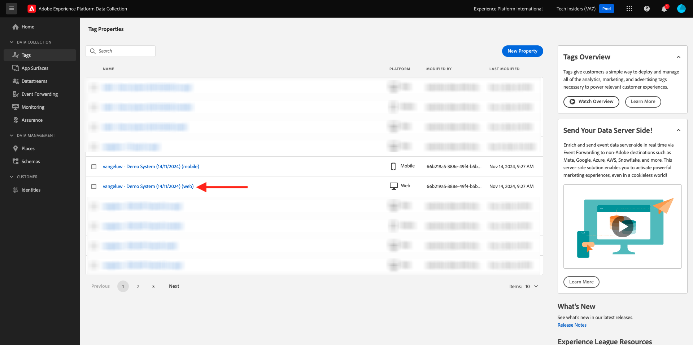

# 3.3.3 Preparar la propiedad del cliente de recopilación de datos de Adobe Experience Platform y la configuración de Web SDK para el Offer decisioning

## 3.3.3.1 Actualizar la secuencia de datos

En [Introducción](./../../../modules/getting-started/gettingstarted/ex2.md), creó su propia **secuencia de datos**. Luego usó el nombre `--aepUserLdap-- - Demo System Datastream`.

En este ejercicio, debe configurar ese **conjunto de datos** para que funcione con el **Offer decisioning**.

Para ello, vaya a [https://experience.adobe.com/#/data-collection/](https://experience.adobe.com/#/data-collection/). Entonces verá esto... Haga clic en **Flujo de datos**.

En la esquina superior derecha de la pantalla, seleccione el nombre de la zona protegida, que debe ser `--aepSandboxName--`.


Busque su **secuencia de datos**, que se llama `--aepUserLdap-- - Demo System Datastream`. Haga clic en **Flujo de datos** para abrirlo.


Entonces verá esto... Haga clic en **...** junto a **Adobe Experience Platform** y, a continuación, haga clic en **Editar**.


Para habilitar **Offer decisioning**, marque la casilla de **Offer decisioning**. Haga clic en **Guardar**.


Su **secuencia de datos** ya está listo para trabajar con **Offer decisioning**.


## 3.3.3.2 Configuración de la propiedad de cliente de recopilación de datos de Adobe Experience Platform para solicitar ofertas personalizadas

Vaya a [https://experience.adobe.com/#/data-collection/](https://experience.adobe.com/#/data-collection/), a **Etiquetas**. Busque las propiedades de recopilación de datos, que se denominan `--aepUserLdap-- - Demo System (DD/MM/YYYY)`. Abra la propiedad de cliente de recopilación de datos para la web.



En su propiedad, vaya a **Reglas** y abra la regla **Vista de página**.


Haga clic para abrir el evento de experiencia de acción **Enviar &quot;Vista de página&quot;**.


Entonces verá esto... En **Personalization**, notará la opción de **ámbitos**.


Por cada solicitud enviada al perímetro de y a Adobe Experience Platform, es posible proporcionar uno o más **ámbitos de decisión**. Un **ámbito de decisión** es una combinación de dos elementos:

- ID de decisión
- ID de ubicación

Primero echemos un vistazo a dónde se pueden encontrar esos dos elementos.

### 3.3.3.2.1 Recuperación del ID de ubicación

El ID de ubicación identifica la ubicación y el tipo de recurso necesario. Por ejemplo, la imagen a pantalla completa de la página de inicio del sitio web de CitiSignal corresponde al ID de colocación Web - Imagen.

>[!NOTE]
>
>Como parte del ejercicio 2.3.5, ya ha configurado una actividad de segmentación de experiencias de Adobe Target que cambiará la imagen de la ubicación a pantalla completa en la página principal, como puede ver en la captura de pantalla. Para este ejercicio, ahora hará que sus ofertas aparezcan en la imagen debajo de la imagen a pantalla completa como se indica en la captura de pantalla.


Para encontrar el ID de ubicación de la imagen en la web, ve a Adobe Journey Optimizer en [Adobe Experience Cloud](https://experience.adobe.com). Haga clic en **Journey Optimizer**.

Se le redirigirá a la vista **Inicio** en Journey Optimizer. Primero, asegúrese de que está usando la zona protegida correcta. La zona protegida que se va a usar se llama `--aepSandboxName--`. Estará en la vista **Inicio** de su zona protegida `--aepSandboxName--`.

A continuación, vaya a Componentes y luego a Ubicaciones. Haga clic en la ubicación **Web - Imagen** para ver sus detalles.


Como puede ver en la imagen anterior, en este ejemplo el ID de ubicación es `dps:offer-placement:1a08a14ccfe533b6`. Escriba el ID de ubicación de la ubicación para Web - Imagen tal como la necesitará en el siguiente ejercicio.

### 3.3.3.2.2 Recuperar el ID de decisión de oferta

El **ID de decisión de oferta** identifica qué combinación de ofertas personalizadas y oferta de reserva desea utilizar. En el ejercicio anterior creó su propia Decisión y le asignó el nombre `--aepUserLdap-- - CitiSignal Decision`.

Para encontrar el ID de decisión de oferta de su `--aepUserLdap-- - CitiSignal Decision`, vaya a Ofertas y luego a Decisiones. Haga clic para seleccionar la decisión, que se denomina `--aepUserLdap-- - CitiSignal Decision`.


Como puede ver en la imagen anterior, en este ejemplo el identificador de decisión es `dps:offer-activity:1a08ba4b529b2fb2`. Anote el ID de decisión de oferta para la decisión `--aepUserLdap-- - CitiSignal Decision`, ya que lo necesitará en el próximo ejercicio.

Ahora que ha recuperado los dos elementos que necesita para crear un **ámbito de decisión**, puede continuar con el siguiente paso, que implica codificar el ámbito de decisión.

### 3.3.3.2.3 Codificación BASE64

El **ámbito de decisión** que debe especificar es una cadena codificada en BASE64. Esta cadena codificada en BASE64 es una combinación del ID de ubicación y el ID de decisión, como puede ver a continuación:

```json
{
  "xdm:activityId": "dps:offer-activity:1a08ba4b529b2fb2",
  "xdm:placementId": "dps:offer-placement:1a08a14ccfe533b6"
}
```

Puede recuperar la cadena codificada en BASE64 desde Adobe Experience Platform. Vaya a Decisiones y haga clic para abrir la Decisión, que se llama `--aepUserLdap-- - CitiSignal Decision`.


Después de abrir `--aepUserLdap-- - CitiSignal Decision`, verá esto. Busque la ubicación Web - Imagen y haga clic en el botón **Copiar**. A continuación, haga clic en **Ámbito de decisión codificado**. **Ámbito de decisión** se ha copiado en el portapapeles.


A continuación, vuelva a Launch, a la acción **AEP Web SDK - Enviar evento**.


Pegue el ámbito de decisión codificado en el campo de entrada. Guarde los cambios en la acción **AEP Web SDK - Enviar evento** haciendo clic en **[!UICONTROL Conservar cambios]**.


A continuación, haga clic en **[!UICONTROL Guardar]**.


En Recopilación de datos de Adobe Experience Platform, vaya a **[!UICONTROL Flujo de publicación]** y abra su **[!UICONTROL Biblioteca de desarrollo]**, que se llama **[!UICONTROL Principal]**. Haga clic en **[!UICONTROL + Agregar todos los recursos modificados]** y luego haga clic en **[!UICONTROL Guardar y generar para desarrollo]**. Los cambios se publicarán en el sitio web de demostración.


Cada vez que esté cargando una **Página general** ahora, como por ejemplo la página principal del sitio web de demostración, el Offer decisioning evaluará cuál es la oferta aplicable y devolverá una respuesta al sitio web con los detalles de la oferta que se va a mostrar. La visualización de la oferta en el sitio web requiere una configuración adicional, que se explica en el siguiente paso.

## 3.3.3.3 Configuración de la propiedad del cliente de recopilación de datos de Adobe Experience Platform para recibir y aplicar ofertas personalizadas

Vaya a [https://experience.adobe.com/#/data-collection/](https://experience.adobe.com/#/data-collection/), para **[!UICONTROL Propiedades]**. Busque las propiedades de recopilación de datos, que se denominan `--aepUserLdap-- - Demo System (DD/MM/YYYY)`. Abra la propiedad de recopilación de datos para la web.


En su propiedad, vaya a **Reglas**. Busque y abra la regla **Mostrar oferta (Offer decisioning)**.


Entonces verá esto... Abra la acción **Mostrar la oferta en la página**.


Haga clic en **[!UICONTROL Abrir editor]**


Sobrescriba el código pegando el siguiente código en el editor.

```javascript
if (!Array.isArray(event.decisions)) {
  console.log("No personalization decisions");
  return;
}

console.log("Received response from Offer Decisioning", event.decisions);

event.decisions.forEach(function (payload) {
  payload.items.forEach(function (item) {
    console.log("Offer", item.data.deliveryURL);

    if (!item.data || item.data?.deliveryURL==null) {
      return;
    }
    console.log("item.data.deliveryURL", item.data.deliveryURL)
    //document.querySelector(".TopRibbon").innerHTML = item.data.content;
    document.querySelector("#SpectrumProvider > div.App > div > div.Page.home > main > div:nth-child(2)").innerHTML = "";
    document.querySelector("#SpectrumProvider > div.App > div > div.Page.home > main > div:nth-child(2) > img").style.backgroundRepeat="no-repeat";
    document.querySelector("#SpectrumProvider > div.App > div > div.Page.home > main > div:nth-child(2) > img").style.backgroundPosition="center center";
    document.querySelector("#SpectrumProvider > div.App > div > div.Page.home > main > div:nth-child(2) > img").style.backgroundSize = "contain";
  });
});
```

Las líneas 17 aplicarán la imagen que devuelve el Offer decisioning al sitio web. Haga clic en **[!UICONTROL Guardar]**.


Haga clic en **[!UICONTROL Conservar cambios]**.


A continuación, haga clic en **[!UICONTROL Guardar]**.


En Recopilación de datos de Adobe Experience Platform, vaya a **[!UICONTROL Flujo de publicación]** y abra su **[!UICONTROL Biblioteca de desarrollo]**, que se llama **[!UICONTROL Principal]**. Haga clic en **[!UICONTROL + Agregar todos los recursos modificados]** y luego haga clic en **[!UICONTROL Guardar y generar para desarrollo]**. Los cambios se publicarán en el sitio web de demostración.


Con este cambio, esta regla de la recopilación de datos de Adobe Experience Platform ahora escucha la respuesta del Offer decisioning que forma parte de la respuesta de Web SDK y, cuando se recibe la respuesta, la imagen de la oferta se muestra en la página principal.

Al ver el sitio web de demostración, verá que esta imagen se reemplazará ahora. En lugar de las imágenes predeterminadas del sitio web de CitiSignal, ahora verá una oferta como esta. En este caso, se muestra la oferta de reserva.


Ahora ha configurado dos tipos de personalización:

- 1 Actividad de segmentación de experiencias con Adobe Target en el ejercicio 2.3.5
- 1 Implementación del Offer decisioning con la propiedad de recopilación de datos

En el siguiente ejercicio verá cómo puede combinar sus ofertas y decisiones creadas en Adobe Journey Optimizer con una actividad de segmentación de experiencias de Adobe Target.

Siguiente paso: [3.3.4 Combinar Adobe Target y el Offer decisioning](./ex4.md)

[Volver al módulo 3.3](./offer-decisioning.md)

[Volver a todos los módulos](./../../../overview.md)
