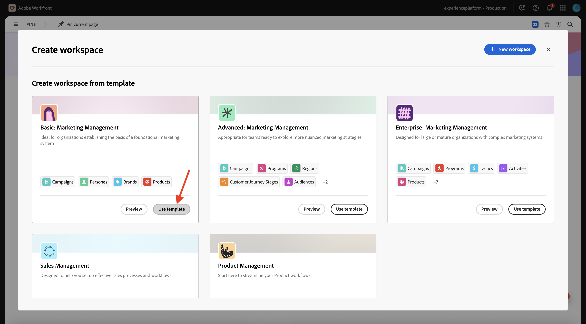
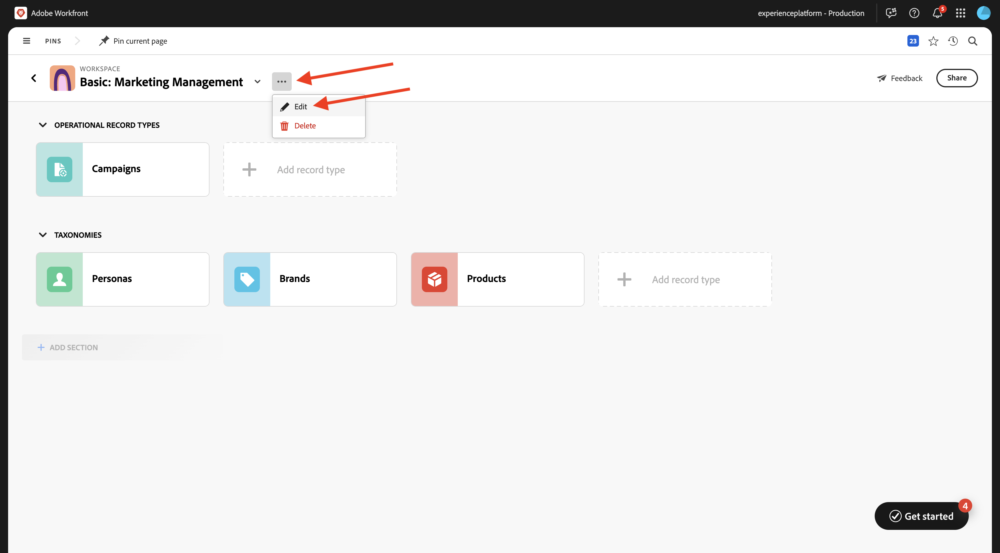
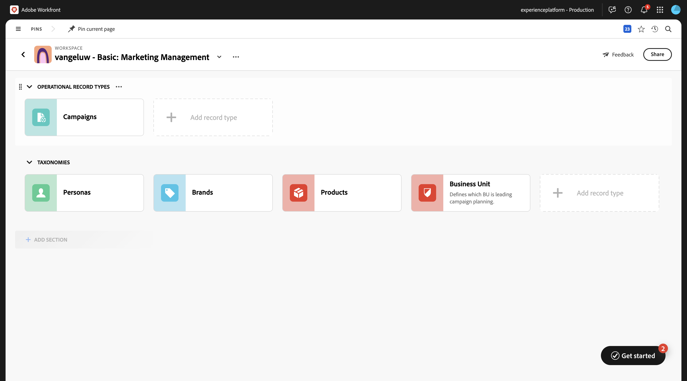
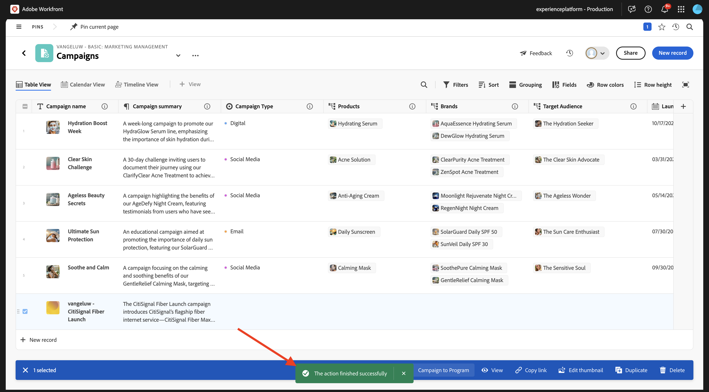

# 1.1.1 Introducción a Workfront Planning

## 1.1.1.1 Terminología de planificación de Workfront

A continuación se muestran los objetos y conceptos principales de Workfront Planning:

| Término | Explicación |
| --- | ---|
| **Workspace** | Colección de tipos de registros que definen el ciclo de vida operativo de una determinada organización. Un espacio de trabajo es el marco de trabajo de una unidad organizativa. |
| **Tipo de registro** | Nombre de los tipos de objeto en Workfront Planning. Los tipos de registro rellenan espacios de trabajo. A diferencia del flujo de trabajo de Workfront, donde los tipos de objeto están predefinidos, en Workfront Planning puede crear sus propios tipos de objeto. |
| **Registro** | Instancia de un tipo de registro. |
| **Plantilla de Workspace** | Puede crear un espacio de trabajo con plantillas predefinidas. Puede utilizar los tipos de registros predefinidos y los campos que se incluyen en una plantilla, o bien puede agregar los suyos propios. |
| **Campos** | Los campos son atributos que se pueden agregar a los tipos de registro. Los campos contienen información sobre el tipo de registro. |

>[!NOTE]
>
>Existen limitaciones en cuanto a la cantidad de objetos de Workfront Planning que se pueden crear. Para obtener más información, consulte Información general sobre las limitaciones de objetos de Adobe Workfront Planning.

Ahora, se pondrán manos a la obra y empezarán a crear algunos de estos objetos.

## 1.1.1.2 Workspace, tipo de registro, campos

Vaya a [https://experience.adobe.com/](https://experience.adobe.com/){target="_blank"}. Haga clic para abrir **Workfront**.


En Workfront, haga clic para abrir el menú y, a continuación, seleccione **Planning**.


Entonces debería ver esto. Haga clic en **Crear Workspace**.


Haga clic en **Usar plantilla** para la plantilla **Administración básica de marketing**.



Ahora se crea un nuevo espacio de trabajo. Antes de continuar, debe cambiar el nombre del espacio de trabajo. Haga clic en los 3 puntos **...** y, a continuación, seleccione **Editar**.



Cambie el nombre a `--aepUserLdap-- - Basic: Marketing Management`. Haga clic en **Guardar**.


Entonces deberías tener esto.


## 1.1.1.3 taxonomías: Tipo de registro y campos

En **Taxonomías**, haga clic en **+ Agregar tipo de registro** y, a continuación, seleccione **Agregar manualmente**.


Debería ver la ventana emergente **Agregar tipo de registro**.


Actualice la siguiente información en la ficha **Apariencia**:

- Reemplazar **tipo de registro sin título** por `Business Unit`.
- Descripción: `Defines which BU is leading campaign planning.`.
- Seleccione un color y una forma para el icono que desee

Haga clic en **Guardar**.


Haga clic para abrir el tipo de registro **Unidad de negocio** recién creado.


Ahora verá una vista de tabla vacía, ya que el tipo de registro recién creado aún no tiene definido ningún registro de unidad de negocio.


Haga clic en el botón desplegable del campo **Fecha de inicio** y, a continuación, seleccione **Eliminar**.


Seleccione **Eliminar**.


Haga clic en el botón desplegable del campo **Fecha de finalización** y, a continuación, seleccione **Eliminar**.


Seleccione **Eliminar**.


A continuación, haga clic en el icono **+** para agregar un nuevo campo. Desplácese hacia abajo en la lista de tipos de campo disponibles y seleccione **Personas**.


Establezca el **Nombre** del campo en `Business Unit Lead` y establezca la descripción del campo en `Business Unit Lead responsible for budget and resources (VP, Head).`

Haga clic en **Guardar**.


Haga clic en los 3 puntos **...** del primer registro y seleccione **Ver**.


Establezca **Name** en `Consumer Services`.

Establezca **Description** en `Handles residential offerings like mobile plans, internet packages, and customer support.`.

Establezca el posible cliente de la unidad de negocio **1&rbrace; en usted mismo.**

Una vez finalizado, haga clic en la flecha para volver a la pantalla anterior.


Haga clic en los 3 puntos **...** del segundo registro y seleccione **Ver**.


Establecer **Name** en `Enterprise & Business Solutions`

Definir **Descripción** en `Provides connectivity, cloud, and managed services to corporate clients and government entities.`

Establezca el posible cliente de la unidad de negocio **1&rbrace; en usted mismo.**

Una vez finalizado, haga clic en la flecha para volver a la pantalla anterior.


Haga clic en los 3 puntos **...** del tercer registro y seleccione **Ver**.


Establecer **Name** en `Sales & Marketing`

Definir **Descripción** en `Drives customer acquisition, brand strategy, advertising, and market segmentation.`

Establezca el posible cliente de la unidad de negocio **1&rbrace; en usted mismo.**

Una vez finalizado, haga clic en la flecha para volver a la pantalla anterior.


Ha creado un nuevo tipo de registro, ha eliminado y creado campos y ha creado 3 unidades de negocio. Vuelva a la pantalla de información general de Workspace haciendo clic en la flecha de la esquina superior izquierda.


Entonces debería ver esto.



## 1.1.1.4 tipos de registros operativos: Campos

Haga clic para abrir **Campañas**.


Haga clic en el icono **+** para crear un nuevo campo. Seleccione **Nueva conexión** y luego seleccione **Unidad de negocio**.


Deje la configuración predeterminada en su lugar. Haga clic en **Crear**.


Seleccione **Omitir**.


El nuevo campo se muestra en la vista de tabla.


## 1.1.1.5 crear un formulario de solicitud

En la pantalla de información general de campañas, haga clic en los 3 puntos **...** y, a continuación, seleccione **Crear formulario de solicitud**.


Cambie el nombre a `Campaign Request Form`. Haga clic en **Crear**.


En este momento no es necesario realizar ningún cambio en el formulario. Lo utilizará sin cambios. Primero, haz clic en **Guardar** y luego haz clic en **Publicar**.


Haga clic en la flecha de la esquina superior izquierda para volver a la pantalla de información general de Solicitar Forms.


Haga clic en la flecha de la esquina superior izquierda para volver a la pantalla de información general de Campañas.


## 1.1.1.6 Enviar un nuevo registro mediante el formulario de solicitud

En la pantalla de información general de Campañas, haga clic en **+ Nuevo registro**.


Seleccione **Enviar una solicitud** y haga clic en **Continuar**.


Establezca el **Asunto** en `--aepUserLdap-- - New Campaign Creation Request`.

Establezca **Campaign name** en `--aepUserLdap-- - CitiSignal Fiber Launch`.

Definir **resumen de campaña** en:

```
The CitiSignal Fiber Launch campaign introduces CitiSignal’s flagship fiber internet service—CitiSignal Fiber Max—to key residential markets. This campaign is designed to build awareness, drive sign-ups, and establish CitiSignal as the go-to provider for ultra-fast, reliable, and future-ready internet. The campaign will highlight the product’s benefits for remote professionals, online gamers, and smart home families, using persona-driven messaging across digital and physical channels.
```

Rellene los demás campos como desee.

Haga clic en **Enviar solicitud**.


Haga clic en **X** para cerrar la ventana emergente.


Luego debería ver la campaña recién creada en la descripción general.


## 1.1.1.7: crear Portfolio y formulario personalizado

En el siguiente paso, creará una automatización que tomará información de la campaña que creó en Workfront Planning y que utilizará esa información en Workfront para crear un programa. Antes de crear la automatización, hay dos cosas que hay que configurar primero en Workfront: un portafolio y un formulario personalizado.

Para crear el portafolio, abra el menú y haga clic en **Portafolios**.


Haga clic en **+ Nuevo Portfolio**.


Establezca el nombre del portafolio en `--aepUserLdap-- - Marketing`.


A continuación, abra el menú y haga clic en **Configurar** para crear el formulario personalizado.


En el menú de la izquierda, ve a **Forms personalizado**, a **Forms** y luego haz clic en **+ Nuevo formulario personalizado**.


Seleccione **Programa** y haga clic en **Continuar**.


Cambie el nombre del formulario a `--aepUserLdap-- - Program Information`.


A continuación, vaya a **Biblioteca de campos** y busque `budget`. Arrastre y suelte el campo existente **Presupuesto** en el formulario.

Haga clic en **Aplicar**.


Se ha guardado la configuración del formulario personalizado.


## 1.1.1.8 crear una automatización

Con el portafolio y el formulario personalizado creados, ahora puede crear la automatización.

Haga clic para abrir el menú y, a continuación, seleccione **Planificación**.


Haga clic para abrir el área de trabajo que creó anteriormente, que se denomina `--aepUserLdap-- - Basic: Marketing Management`.


Haga clic para abrir **Campañas**.


En la pantalla de información general de Campañas, haga clic en los 3 puntos **...** y, a continuación, seleccione **Administrar automatizaciones**.


Haga clic en **Nueva automatización**.


Establezca el nombre de la automatización en `Campaign to Program`.

Definir la descripción en `This automation will convert a Planning Campaign record to a Workfront Program.`

Haga clic en **Guardar**.


Establezca **Action** en **Crear programa**. Haga clic en **+ Agregar campo conectado**.


Seleccione el **portafolio de programas**: `--aepUserLdap-- - Marketing`.

Seleccione este **formulario personalizado**: `--aepUserLdap-- Program information`.

Haga clic en **Guardar**.


Entonces debería ver esto. Haga clic en la flecha para volver a la pantalla de información general de Campañas.


Marque la casilla delante de la campaña que creó anteriormente. A continuación, haga clic en la automatización de **Campaign to Program**.


Después de un par de segundos, debería ver una confirmación de que la automatización ha finalizado correctamente. Esto significa que, según el objeto Campaign de Workfront Planning, se ha creado un programa en Workfront.



Para comprobar el programa en Workfront, desplácese hacia la derecha y haga clic en el programa en la columna **Programa conectado**.


Luego debería ver el programa que acaba de crear la automatización configurada.


Siguiente paso: [Resumen y beneficios](./summary.md){target="_blank"}

Volver a [Introducción a Workfront Planning](./wfplanning.md){target="_blank"}

[Volver a todos los módulos](./../../../overview.md){target="_blank"}
