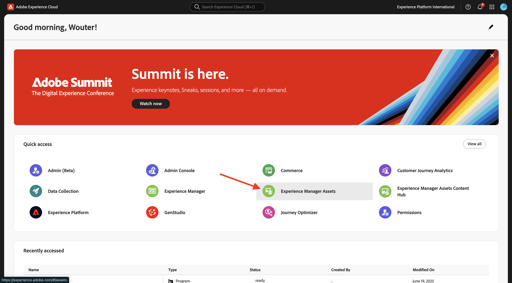

# 1.2.1 Integración de metadatos Workfront + AEM Assets CS

>[!IMPORTANT]
>
>Para completar este ejercicio, debe tener acceso a un entorno de trabajo de AEM Assets y autores de CS.
>
>Hay dos opciones que se deben tener en cuenta:
>
>- Si asiste al taller de habilitación técnica de GenStudio para CSC, sus instructores han creado un entorno de autor de CSC para AEM Assets para usted. Por favor, compruebe con ellos cuál es el nombre y cómo proceder.
>
>- Si está siguiendo la ruta completa del tutorial de One Adobe, vaya al ejercicio [Adobe Experience Manager Cloud Service &amp; Edge Delivery Services](./../../../modules/asset-mgmt/module2.1/aemcs.md){target="_blank"}. Siga las instrucciones allí y tendrá acceso a dicho entorno.

>[!IMPORTANT]
>
>Si ha configurado anteriormente un programa AEM CS con un entorno de AEM Assets CS, es posible que la zona protegida de AEM CS esté en hibernación. Dado que la dehibernación de una zona protegida de este tipo tarda de 10 a 15 minutos, sería aconsejable iniciar el proceso de dehibernación ahora para que no tenga que esperar más adelante.

## 1.2.1.1 terminología de flujo de trabajo de Workfront

A continuación se muestran los objetos y conceptos principales de Workfront:

| Nombre | Última actualización |
| ---------------------- | ------------ | 
| Portafolio | Colección de proyectos que tienen características unificadoras. Estos proyectos suelen competir por los mismos recursos, presupuesto o franja horaria. |
| Programa | Un subconjunto dentro de un portafolio, donde proyectos similares pueden agruparse para lograr un beneficio bien definido. |
| Proyecto | Una gran cantidad de trabajo que debe completarse dentro de un marco de tiempo específico y debe utilizar un presupuesto y un número de recursos específicos. Para hacerlo manejable, se divide el proyecto en una serie de tareas. Completar todas las tareas significa la finalización del proyecto. |
| Plantilla de proyecto | Puede utilizar plantillas de proyecto para capturar la mayoría de los procesos, la información y la configuración repetibles asociados con los proyectos de su organización. Después de crear las plantillas, puede adjuntarlas a proyectos existentes o puede utilizarlas para crear nuevos proyectos. |
| Tarea | Una actividad que debe realizarse como paso hacia el logro de un objetivo final (completar el proyecto). Las tareas nunca pueden existir de forma independiente. Siempre son parte de un proyecto. |
| Asignación | Usuario, rol o equipo asignado a un problema o tarea. Los proyectos, portafolios o programas no pueden tener asignaciones. |
| Documento/versión | Cualquier archivo adjunto a un objeto dentro de Workfront. Cada vez que se carga el mismo documento en el mismo objeto, se le asigna un número de versión. Los usuarios pueden ver y cambiar varias opciones de una versión anterior de un documento. |
| Aprobación | Un elemento de trabajo determinado, como una tarea, un documento o una plantilla de horas, puede requerir que un supervisor u otro usuario firme el elemento de trabajo. Este proceso de desactivación se denomina aprobación. |

Vaya a [https://experience.adobe.com/](https://experience.adobe.com/){target="_blank"}. Haga clic para abrir **Workfront**.

Entonces verá esto...

## 1.2.1.1 Configuración de la integración de AEM Assets

Haga clic en el icono **menu** y, a continuación, seleccione **Configuración**.

En el menú de la izquierda, desplácese hacia abajo hasta **Documentos** y, a continuación, haga clic en **Experience Manager Assets**. Haga clic en **+ Agregar integración de Experience Manager**.

Para el nombre de su integración, use `--aepUserLdap-- - CitiSignal AEM`.

Abra el menú desplegable **Repositorio de Experience Manager** y seleccione su instancia de AEM CS, que debe llamarse `--aepUserLdap-- - CitiSignal`.

En **Metadatos**, configure la siguiente asignación:

| Campo de Workfront | Campo de Experience Manager Assets |
| --------------- | ------------------------------ | 
| **Documento** > **Nombre** | **wm:documentName** |
| **Proyecto** > **Nombre** | **wm:projectName** |
| **Proyecto** > **Descripción** | **wm:projectDescription** |
| **Solicitud de documento** > **Estado** | **wm:wm:documentStatus** |
| **Tarea** > **Nombre** | **wm:taskName** |
| **Tarea** > **Descripción** | **wm:taskDescription** |
| **Proyecto** > **ID** | **wm:projectId** |

Habilite el conmutador para **sincronizar metadatos de objeto**.

Haga clic en **Guardar**.

Ya está configurada la integración de Workfront a AEM Assets CS.

## 1.2.1.2 Configuración de la integración de metadatos con AEM Assets

A continuación, debe configurar AEM Assets CS para que los campos de metadatos del recurso de Workfront se compartan con AEM Assets CS.

Para ello, vaya a [https://experience.adobe.com/](https://experience.adobe.com/). Haga clic en **Experience Manager Assets**.

Haga clic para seleccionar el entorno de AEM Assets, que debería llamarse `--aepUserLdap-- - CitiSignal dev`.

Entonces debería ver esto. En el menú de la izquierda, ve a **Assets**.

A continuación, haga clic en **Crear carpeta**.

Asigne un nombre a la carpeta `--aepUserLdap-- - CitiSignal Fiber Campaign` y haga clic en **Crear**.

A continuación, ve a **Metadata Forms** en el menú de la izquierda y luego haz clic en **Crear**.

Use el nombre `--aepUserLdap-- - Metadata Form` y haga clic en **Crear**.

Agregue 7 nuevos campos **Texto de una sola línea** al formulario y seleccione el primer campo. A continuación, haga clic en el icono **Esquema** junto al campo **Propiedad de metadatos** para el primer campo.

Entonces verá esta ventana emergente. En el campo de búsqueda, escriba `wm:project` y, a continuación, seleccione el campo **Nombre de proyecto**. Haga clic en **Seleccionar**.

Cambie la etiqueta del campo a `Project Name`. Haga clic en **Guardar**.

Vaya al segundo campo y haga clic en el icono **Esquema** junto al campo **Propiedad de metadatos**.

En el campo de búsqueda, escriba `wm:project` y, a continuación, seleccione el campo **Descripción del proyecto**. Haga clic en **Seleccionar**.

Cambie la etiqueta del campo a `Project Description`.

A continuación, seleccione el tercer campo y haga clic en el icono **Esquema** junto al campo **Propiedad de metadatos** de nuevo.

Luego verá esta ventana emergente de nuevo. En el campo de búsqueda, escriba `wm:project` y, a continuación, seleccione el campo **Id. de proyecto**. Haga clic en **Seleccionar**.

Cambie la etiqueta del campo a `Project ID`.

A continuación, seleccione el cuarto campo y haga clic en el icono **Esquema** junto al campo **Propiedad de metadatos** de nuevo.

Luego verá esta ventana emergente de nuevo. En el campo de búsqueda, escriba `wm:document` y, a continuación, seleccione el campo **Estado del documento**. Haga clic en **Seleccionar**.

Cambie la etiqueta del campo a `Document Status`.

A continuación, seleccione el quinto campo y haga clic en el icono **Esquema** junto al campo **Propiedad de metadatos** de nuevo.

Luego verá esta ventana emergente de nuevo. En el campo de búsqueda, escriba `wm:document` y, a continuación, seleccione el campo **Nombre de documento**. Haga clic en **Seleccionar**.

Cambie la etiqueta del campo a `Document Name`.

A continuación, seleccione el sexto campo y haga clic en el icono **Esquema** junto al campo **Propiedad de metadatos** de nuevo.

Luego verá esta ventana emergente de nuevo. En el campo de búsqueda, escriba `wm:task` y, a continuación, seleccione el campo **Nombre de tarea**. Haga clic en **Seleccionar**.

Cambie la etiqueta del campo a `Task Name`.

A continuación, seleccione el séptimo campo y haga clic en el icono **Esquema** junto al campo **Propiedad de metadatos** de nuevo.

Luego verá esta ventana emergente de nuevo. En el campo de búsqueda, escriba `wm:task` y, a continuación, seleccione el campo **Descripción de la tarea**. Haga clic en **Seleccionar**.

Cambie la etiqueta del campo a `Task Description`.

Cambie **Tab name** del formulario a `--aepUserLdap-- - Workfront Metadata`.

Haga clic en **Guardar** y **Cerrar**.

Su **formulario de metadatos** ya está configurado.

A continuación, debe asignar el formulario de metadatos a la carpeta creada anteriormente. Marque la casilla de verificación del formulario de metadatos y haga clic en **Asignar a las carpetas**.

Seleccione su carpeta, que debe tener el nombre `--aepUserLdap-- - CitiSignal Fiber Campaign`. Haga clic en **Asignar**.

El formulario de metadatos se ha asignado correctamente a la carpeta.

Paso siguiente: [1.2.2 Revisión con Workfront](./ex2.md){target="_blank"}

Volver a la administración de [flujos de trabajo con Adobe Workfront](./workfront.md){target="_blank"}

[Volver a todos los módulos](./../../../overview.md){target="_blank"}
