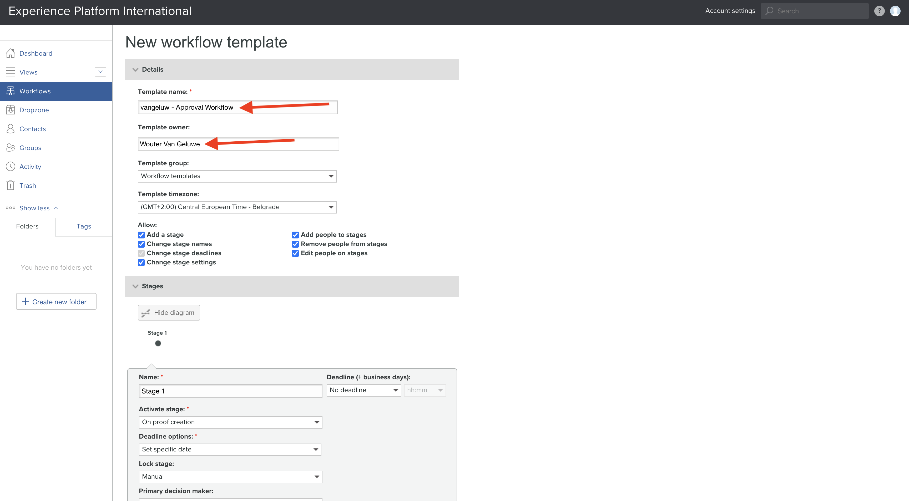
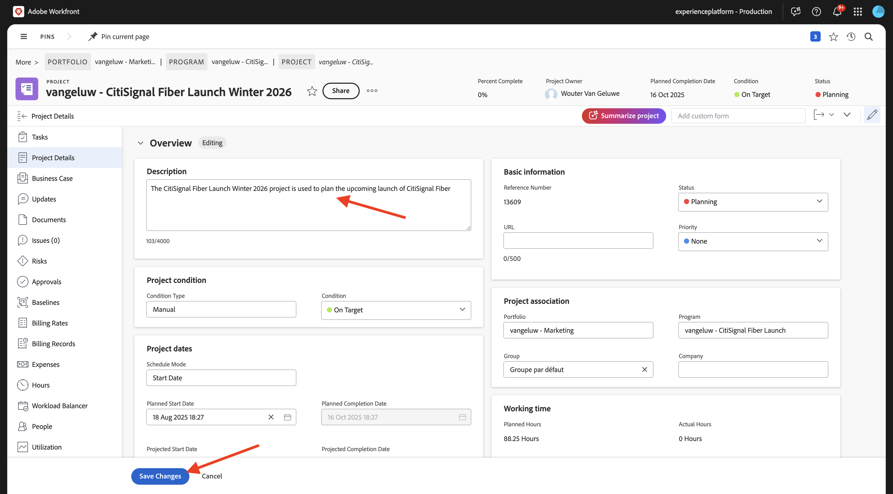
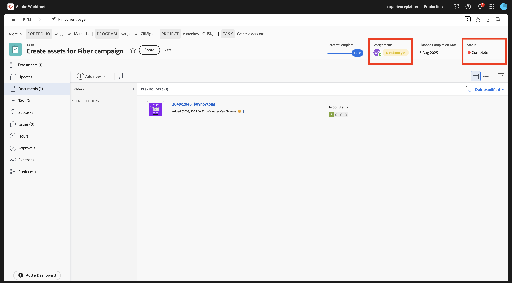

# 1.2.2 Revisión con Workfront

>[!IMPORTANT]
>
>Si ha configurado anteriormente un programa AEM CS con un entorno de AEM Assets CS, es posible que la zona protegida de AEM CS esté en hibernación. Dado que la dehibernación de una zona protegida de este tipo tarda de 10 a 15 minutos, sería aconsejable iniciar el proceso de dehibernación ahora para que no tenga que esperar más adelante.

## 1.2.2.1 Crear un nuevo flujo de aprobación

Volver a **Adobe Workfront**. Haga clic en el icono **menú** y seleccione **Revisión**.

Vaya a **Flujos de trabajo**, haga clic en **+ Nuevo** y, a continuación, seleccione **Nueva plantilla**.

Establezca **Template name** en `--aepUserLdap-- - Approval Workflow` y establezca el **Propietario de la plantilla** en usted mismo.

Desplácese hacia abajo y en **Fases** > **Fase 1**, agréguese con la **Función** de **Revisor y aprobador**.

Haga clic en **Crear**.

El flujo de trabajo básico de aprobación ya está listo para su uso.

## 1.2.2.2 Crear un nuevo proyecto

Abra el **menú** y vaya a **Programas**.

Haga clic en el programa que creó anteriormente, que se denomina `--aepUserLdap-- CitiSignal Fiber Launch`.

>[!NOTE]
>
>Creó un programa como parte del ejercicio en [Workfront Planning](./../module1.1/ex1.md) con la automatización que creó y ejecutó. Si aún no lo ha hecho, puede encontrar las instrucciones allí.

En su programa, vaya a **Proyectos**. Haga clic en **+ Nuevo proyecto** y luego seleccione **Nuevo proyecto**.

Entonces debería ver esto. Cambie el nombre a `--aepUserLdap-- - CitiSignal Fiber Launch`.

Vaya a **Detalles del proyecto**. Haga clic en **+Agregar** en **Descripción**.

Definir la descripción en `The CitiSignal Fiber Launch project is used to plan the upcoming launch of CitiSignal Fiber.`

Haga clic en **Guardar cambios**.

El proyecto se ha creado.

## 1.2.2.3 Crear una nueva tarea

Vaya a **Tareas** y haga clic en **+ Nueva tarea**.

Escriba este nombre para la tarea: `Create assets for Fiber campaign`.

Establecer el campo **Descripción** en: `This task is used to track the progress of the creation of the assets for the CitiSignal Fiber Launch Campaign.`

Haga clic en **Crear tarea**.

Entonces debería ver esto.

En la columna **Asignación**, agregue su propio nombre.

A continuación, se le asignará la tarea.

## 1.2.2.4 Agregar un nuevo documento a su tarea para pasar por el flujo de aprobación

Haz clic en el logotipo de **Workfront** para volver a la página de información general. A continuación, debería ver el proyecto que acaba de crear en la descripción general. Haga clic en el proyecto para abrirlo.

En **Tareas**, haga clic para abrir la tarea.

Ir a **Documentos**. Haga clic en **+ Agregar nuevo** y luego seleccione **Documento**.

Descarga [este archivo](./images/2048x2048.png) en tu escritorio.

{width="50px" align="left"}

Seleccione el archivo **2048x2048.png** y haga clic en **Abrir**.

Entonces deberías tener esto. Pase el ratón sobre el documento cargado. Haga clic en **Crear revisión** y luego elija **Revisión avanzada**.

En la ventana **nueva prueba**, seleccione **Automatizada** y luego seleccione la plantilla de flujo de trabajo que creó anteriormente, que debería llamarse `--aepUserLdap-- - Approval Workflow`. Haga clic en **Crear revisión**.

Haga clic en **Trabajar en ello**.

Haga clic en **Abrir revisión**

Ahora puede revisar la revisión. Seleccione **Agregar comentario** para agregar un comentario que requiera que se cambie el documento.

Escriba su comentario y haga clic en **Publicar**. Haga clic en **Cerrar**.

A continuación, debe cambiar su función de **Revisor** a **Revisor y aprobador**. Para ello, vuelva a su tarea y haga clic en **Flujo de trabajo de revisión**.

Cambia tu rol de **Revisor** a **Revisor y aprobador**.

Vuelva a la tarea y abra la prueba de nuevo. Ahora verá un nuevo botón, **Tomar decisión**. Haga clic en ella.

Seleccione **Cambios necesarios** y haga clic en **tomar decisión**.

Regresa a tu **Tarea** y al **Documento**. Ahora necesita cargar una segunda imagen que tenga en cuenta los comentarios proporcionados.

Descarga [este archivo](./images/2048x2048_buynow.png) en tu escritorio.

{width="50px" align="left"}

En la vista de tareas, seleccione el archivo de imagen anterior que no se aprobó. A continuación, haga clic en **+ Agregar nuevo**, seleccione **Versión** y después seleccione **Documento**.

Seleccione el archivo **2048x2048_buynow.png** y haga clic en **Abrir**.

Entonces deberías tener esto. Haga clic en **Crear revisión** y luego seleccione de nuevo **Revisión avanzada**.

Entonces verá esto... La **plantilla de flujo de trabajo** se preseleccionó ya que Workfront supone que el flujo de trabajo de aprobación anterior sigue siendo válido. Haga clic en **Crear revisión**.

Seleccione **Abrir revisión**.

Ahora puede ver dos versiones del archivo una al lado de la otra.

Haga clic en **Tomar decisión**, seleccione **Aprobado** y haga clic en **Tomar decisión** de nuevo.

Haga clic en **Nombre de tarea** para volver a la descripción general de la tarea.

A continuación, volverá a la vista de tareas con un recurso aprobado. Este recurso ahora debe compartirse con los AEM Assets.

Seleccione el documento aprobado. Haga clic en el icono **Compartir flecha** y seleccione la integración de AEM Assets, que debe llamarse `--aepUserLdap-- - CitiSignal AEM`.

Haga doble clic en la carpeta que creó anteriormente, que debe tener el nombre `--aepUserLdap-- - CitiSignal Fiber Launch Assets`.

Haga clic en **Seleccionar carpeta**.

Después de 1-2 minutos, el documento se publicará en AEM Assets. Verá un icono de AEM junto al nombre del documento.

Haga clic en **Marcar como completado** para finalizar esta tarea.

Entonces debería ver esto.

## 1.2.2.5 Ver el archivo en AEM Assets

Vaya a la carpeta en AEM Assets CS, que se llama `--aepUserLdap-- - CitiSignal Fiber Launch Assets`.

Seleccione la imagen y, a continuación, elija **Detalles**.

A continuación, verá el formulario de metadatos que creó anteriormente, con los valores que se han rellenado automáticamente con la integración entre Workfront y los AEM Assets.

Volver a la administración de [flujos de trabajo con Adobe Workfront](./workfront.md){target="_blank"}

[Volver a todos los módulos](./../../../overview.md){target="_blank"}
