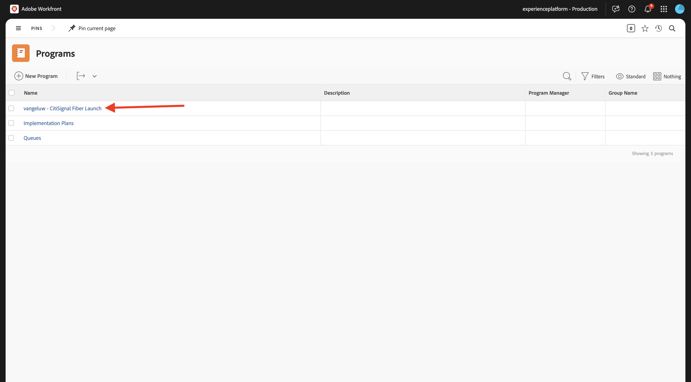
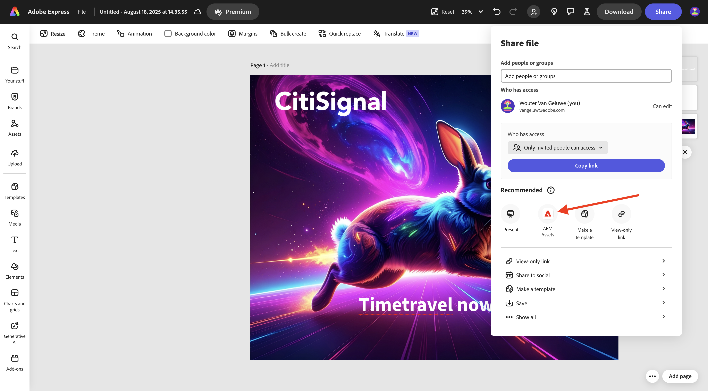
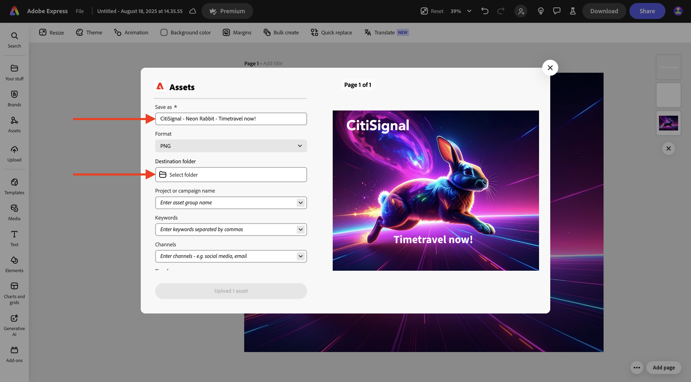
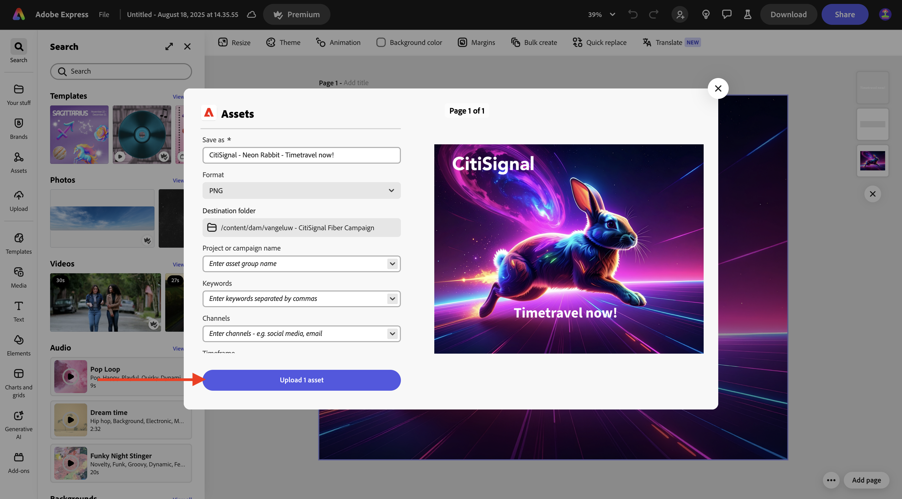
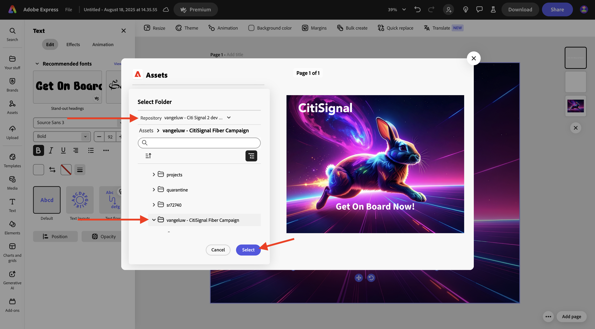
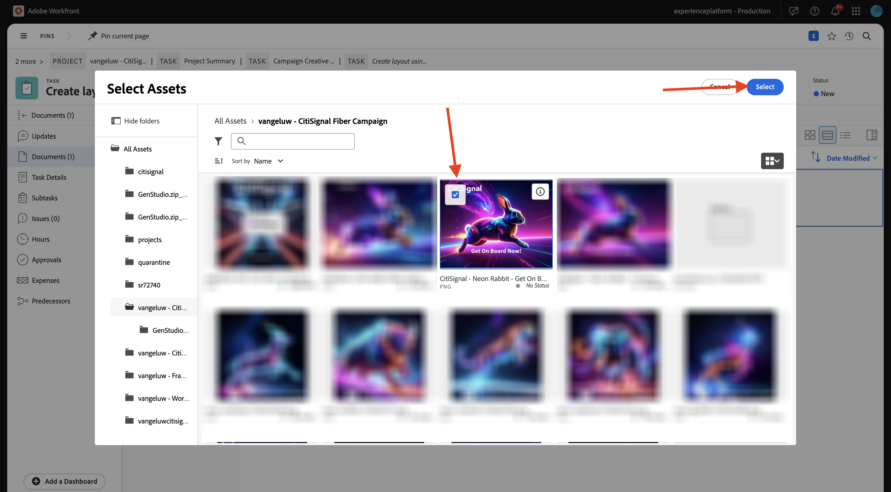

# 1.2.2 Revisión con Workfront

>[!IMPORTANT]
>
>Si ha configurado anteriormente un programa AEM CS con un entorno de AEM Assets CS, es posible que la zona protegida de AEM CS esté en hibernación. Dado que la dehibernación de una zona protegida de este tipo tarda de 10 a 15 minutos, sería aconsejable iniciar el proceso de dehibernación ahora para que no tenga que esperar más adelante.

## 1.2.2.1 Crear un nuevo flujo de aprobación

Volver a **Adobe Workfront**. Haga clic en el icono **menú** y seleccione **Revisión**.

Vaya a **Flujos de trabajo**, haga clic en **+ Nuevo** y, a continuación, seleccione **Nueva plantilla**.

Establezca **Template name** en `--aepUserLdap-- - Approval Workflow` y establezca el **Propietario de la plantilla** en usted mismo.

Desplácese hacia abajo y en **Fases** > **Fase 1**, cambie la función de **Creador de pruebas** a **Revisor y aprobador**. También puede agregar a cualquier otra persona, por ejemplo, agréguese a usted mismo seleccionando su usuario y estableciendo la **Función** de **Revisor y aprobador**.

Haga clic en **Crear**.

El flujo de trabajo básico de aprobación ya está listo para su uso.

## 1.2.2.2 Habilitar modelo de Workfront

En el siguiente paso, creará un nuevo proyecto con una plantilla. Adobe Workfront proporciona una serie de modelos disponibles que solo requieren activarse.

Para el caso de uso de CitiSignal, el modelo **Ejecución de campaña integrada** es el que necesita usar.

Para instalar ese modelo, abra el menú y seleccione **Modelos**.

Seleccione el filtro **Marketing** y desplácese hacia abajo para encontrar el modelo **Ejecución de campaña integrada**. Haga clic en **Instalar**.

Haga clic en **Continuar**.

Haga clic en **Instalar tal cual...**.

Entonces debería ver esto. La instalación puede tardar un par de minutos.

Después de un par de minutos, se instalará el modelo.

## 1.2.2.3 Crear un nuevo proyecto

Abra el **menú** y vaya a **Programas**.

Haga clic en el programa que creó anteriormente, que se denomina `--aepUserLdap-- CitiSignal Fiber Launch`.

>[!NOTE]
>
>Creó un programa como parte del ejercicio en [Workfront Planning](./../module1.1/ex1.md) con la automatización que creó y ejecutó. Si aún no lo ha hecho, puede encontrar las instrucciones allí.

En su programa, vaya a **Proyectos**. Haga clic en **+ Nuevo proyecto** y, a continuación, seleccione **Nuevo proyecto de la plantilla**.

Seleccione la plantilla **Ejecución de campaña integrada** y haga clic en **Usar plantilla**.

Entonces debería ver esto. Cambie el nombre a `--aepUserLdap-- - CitiSignal Fiber Launch Winter 2026` y haga clic en **Crear proyecto**.

El proyecto se ha creado. Vaya a **Detalles del proyecto**.

Vaya a **Detalles del proyecto**. Haga clic para seleccionar el texto actual bajo **Descripción**.

Definir la descripción en `The CitiSignal Fiber Launch project is used to plan the upcoming launch of CitiSignal Fiber.`

Haga clic en **Guardar cambios**.

El proyecto está listo para utilizarse.

Las tareas y dependencias del proyecto se han creado en función de la plantilla elegida y se ha establecido como. propietario del proyecto. El estado del proyecto se ha establecido en **Planificación**. Puede cambiar el estado del proyecto seleccionando otro valor en la lista.

## 1.2.2.4 Crear una nueva tarea

Pase el ratón sobre la tarea **Comenzar a crear plantillas de diseño** y haga clic en los 3 puntos **...**.

Seleccione la opción **Insertar tarea debajo**.

Escriba este nombre para la tarea: `Create layout using approved assets and copy`.

Establezca el campo **Asignaciones** en el rol **Designer**.
Establezca el campo **Duration** en **5 días**.
Establezca el predecesor del campo en **9**.
Escriba una fecha para los campos **Comienza el** y **Vence el**.

Haga clic en otro lugar de la pantalla para guardar la nueva tarea.

Entonces debería ver esto. Haga clic en la tarea para abrirla.

Vaya a **Detalles de la tarea** y establezca el campo **Descripción** en: `This task is used to track the progress of the creation of the assets for the CitiSignal Fiber Launch Campaign.`

Haga clic en **Guardar cambios**.

Entonces debería ver esto. Haga clic en el campo **Proyecto** para regresar al proyecto.

En la vista **Proyecto**, vaya a **Distribuidor de cargas de trabajo**.

Haga clic en **Asignaciones en lotes**.

Seleccione la **asignación de rol** de **Designer** y luego haga clic en el campo **Usuario para asignar**. Se mostrarán todos los usuarios que tengan el rol **Designer** en su instancia de Workfront. En este caso, seleccione al usuario ficticio **Melissa Jenkins**.

Haga clic en **Asignar**. El usuario que has seleccionado ahora se asignará a las tareas del proyecto que están vinculadas al rol **Designer**.

Las tareas ahora están asignadas. Haga clic en **Tareas** para volver a la página de información general de **Tareas**.

Haga clic en la tarea que ha creado, que se denomina
**Crear diseño con recursos aprobados y copiar**.

Ahora empezará a trabajar en esta tarea como parte de este ejercicio. Se puede ver que Melissa Jenkins está asignada a esta tarea en este momento. Para cambiarlo, haga clic en el campo **Asignaciones** y seleccione **Asignármelo**.

Haga clic en **Guardar**.

Haga clic en **Trabajar en ello**.

Entonces debería ver esto.

Como parte de esta tarea, debe crear una nueva imagen y luego cargarla como documento en Workfront. Ahora creará ese recurso usted mismo mediante Adobe Express.

## 1.2.2.5 Crear recurso con Adobe Firely Services y Adobe Express

Vaya a [https://firefly.adobe.com/](https://firefly.adobe.com/){target="_blank"}. Escriba el mensaje `a neon rabbit running very fast through space` y haga clic en **Generar**.

A continuación, verá varias imágenes que se generan. Elige la imagen que más te guste, haz clic en el icono **Compartir** de la imagen y luego selecciona **Abrir en Adobe Express**.

A continuación, verá que la imagen que acaba de generar está disponible en Adobe Express para editarla. Ahora debe añadir el logotipo de CitiSignal en la imagen. Para ello, ve a **Marcas**.

Luego debería ver una plantilla de marca CitiSignal. que se haya creado en GenStudio for Performance Marketing, aparecen en Adobe Express. Haga clic para seleccionar una plantilla de marca que tenga `CitiSignal` en su nombre.

Vaya a **Logotipos** y haga clic en el logotipo **blanco** de Citisignal para colocarlo en la imagen.

Coloque el logotipo de CitiSignal en la parte superior de la imagen, no demasiado lejos del centro.

Ir a **Texto**.

Haz clic en **Agregar tu texto**.

Escriba el texto `Timetravel now!`, cambie el color y el tamaño de fuente, establezca el texto en **Negrita** para que tenga una imagen similar a esta.

A continuación, haga clic en **Compartir**.

Seleccionar **AEM Assets**.

Cambie el nombre de archivo a `CitiSignal - Neon Rabbit - Timetravel now!`.
Haga clic en **Seleccionar carpeta**.

Seleccione el repositorio de AEM Assets CS, que debe tener el nombre `--aepUserLdap-- - CitiSignal` y, a continuación, seleccione la carpeta `--aepUserLdap-- - CitiSignal Fiber Campaign`. Haga clic en **Seleccionar**.

Entonces debería ver esto. Haga clic en **Cargar 1 recurso**. La imagen se cargará en AEM Assets CS.

## 1.2.2.6 Agregar un nuevo documento a su tarea e iniciar el flujo de aprobación

Vuelva a la pantalla **Detalles de la tarea**. Ir a **Documentos**. Haga clic en **+ Agregar nuevo** y, a continuación, seleccione el repositorio de AEM Assets CS, que debe llamarse `--aepUserLdap-- - CitiSignal`.

Haga doble clic para abrir la carpeta `--aepUserLdap-- CitiSignal Fiber Campaign`.

Seleccione el archivo que creó en el paso anterior, que se llama **CitiSignal - Neon rabbit - Timetravel Now!.png**. Haga clic en **Seleccionar**.

{width="50px" align="left"}

Entonces deberías tener esto. Pase el ratón sobre el documento cargado. Haga clic en **Crear revisión** y luego elija **Revisión avanzada**.

En la ventana **nueva prueba**, seleccione **Automatizada** y luego seleccione la plantilla de flujo de trabajo que creó anteriormente, que debería llamarse `--aepUserLdap-- - Approval Workflow`. Haga clic en **Crear revisión**.

Haga clic en **Abrir revisión**

Ahora puede revisar la revisión. Seleccione **Agregar comentario** para agregar un comentario que requiera que se cambie el documento.

Escriba su comentario y haga clic en **Publicar**. A continuación, haga clic en **Tomar una decisión**.

Seleccione **Cambios necesarios** y haga clic en **tomar decisión**.

Regresa a tu **Tarea** y al **Documento**. Verá el texto **Cambios necesarios** que también aparece allí.

Ahora debe realizar cambios de diseño, lo que hará en Adobe Express.

## 1.2.2.7 Realizar cambios de diseño en Adobe Express

Vaya a [https://new.express.adobe.com/your-stuff/files](https://new.express.adobe.com/your-stuff/files) y abra de nuevo la imagen que creó anteriormente.

Cambie el texto de CTA a `Get On Board Now!`.

Haga clic en **Compartir** y, a continuación, seleccione **AEM Assets**.

Escriba el nombre `CitiSignal - Neon Rabbit - Get On Board Now!` y haga clic en **Seleccionar carpeta** para seleccionar una carpeta de destino.

Seleccione el repositorio de AEM Assets CS, que debe tener el nombre `--aepUserLdap-- - CitiSignal` y, a continuación, seleccione la carpeta `--aepUserLdap-- - CitiSignal Fiber Campaign`. Haga clic en **Seleccionar**.

Haga clic en **cargar 1 recurso**.

El nuevo recurso se creará y se almacenará en AEM Assets.

## 1.2.2.8 Agregar una nueva versión del documento a la tarea

En la vista de tareas de Adobe Workfront, seleccione el archivo de imagen antiguo que no se aprobó. A continuación, haga clic en **+ Agregar nuevo**, seleccione **Versión** y, a continuación, seleccione el repositorio de AEM Assets CS, que debería llamarse `--aepUserLdap-- - CitiSignal`.

Vaya a la carpeta `--aepUserLdap-- CitiSignal Fiber Campaign` y seleccione el archivo `CitiSignal - Neon Rabit - Get On Board Now!.png`. Haga clic en **Seleccionar**.

Entonces deberías tener esto. Haga clic en **Crear revisión** y luego seleccione de nuevo **Revisión avanzada**.

Entonces verá esto... La **plantilla de flujo de trabajo** se preseleccionó ya que Workfront supone que el flujo de trabajo de aprobación anterior sigue siendo válido. Haga clic en **Crear revisión**.

Seleccione **Abrir revisión**.

Ahora puede ver dos versiones del archivo una al lado de la otra. Haga clic en el botón **Comparar pruebas**.

Luego debería ver ambas versiones de la imagen una al lado de la otra. Haga clic en **Tomar decisión**.

Seleccione **Aprobado** y haga clic de nuevo en **Tomar decisión**.

Cierre la vista **Comparar revisiones** cerrando la versión izquierda de la imagen. Haga clic en **Nombre de tarea** para volver a la descripción general de la tarea.

A continuación, volverá a la vista de tareas con un recurso aprobado. Este recurso ahora debe compartirse con los AEM Assets.

Seleccione el documento aprobado. Haga clic en el icono **Compartir flecha** y seleccione la integración de AEM Assets, que debe llamarse `--aepUserLdap-- - CitiSignal AEM`.

Haga doble clic en la carpeta que creó anteriormente, que debe tener el nombre `--aepUserLdap-- - CitiSignal Fiber Launch Assets`.

Haga clic en **Seleccionar carpeta**.

Después de 1-2 minutos, el documento se publicará en AEM Assets. Verá un icono de AEM junto al nombre del documento.

Haga clic en **Marcar como completado** para finalizar esta tarea.

Entonces debería ver esto.

## 1.2.2.9 Ver el archivo en AEM Assets

Vaya a la carpeta en AEM Assets CS, que se llama `--aepUserLdap-- - CitiSignal Fiber Launch Assets`.

Seleccione la imagen y, a continuación, elija **Detalles**.

A continuación, verá el formulario de metadatos que creó anteriormente, con los valores que se han rellenado automáticamente con la integración entre Workfront y los AEM Assets.

Volver a la administración de [flujos de trabajo con Adobe Workfront](./workfront.md){target="_blank"}

[Volver a todos los módulos](./../../../overview.md){target="_blank"}
