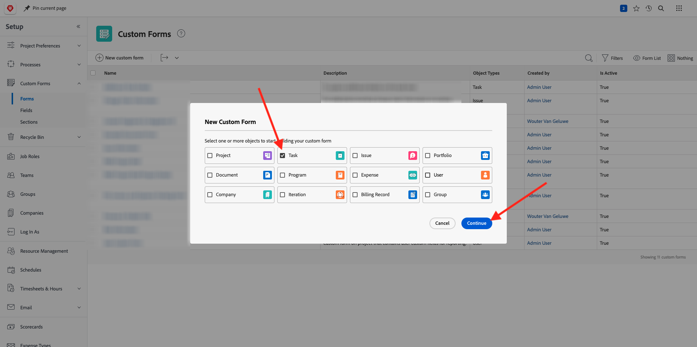

# 1.2.4 Workfront + AEM Sites

Inicie sesión en Adobe Workfront en [https://experienceplatform.my.workfront.com/](https://experienceplatform.my.workfront.com/){target="_blank"}.

Entonces verá esto.

## 1.2.4.1 Configurar su integración con AEM Sites

>[!NOTE]
>
>Este complemento está actualmente en modo **Acceso anticipado** y no está disponible en general todavía.
>
>Es posible que este complemento ya esté instalado en la instancia de Workfront que utiliza. Si ya está instalado, puede revisar las siguientes instrucciones, pero no es necesario cambiar nada en la configuración.

Vaya a [https://experience.adobe.com/#/@experienceplatform/aem/extension-manager/universal-editor](https://experience.adobe.com/#/@experienceplatform/aem/extension-manager/universal-editor){target="_blank"}.

Asegúrese de que **toggle** para este complemento esté establecido en **Enabled**. A continuación, haga clic en el icono **engranaje**.

Verá una ventana emergente de **Configuración de la extensión**. Configure los campos siguientes para utilizar este complemento.

| Clave | Valor |
| --------------- | ------------------------------ | 
| **`IMS_ENV`** | **PROD** |
| **`WORKFRONT_INSTANCE_URL`** | **https://experienceplatform.my.workfront.com** |
| **`SHOW_CUSTOM_FORMS`** | **&#39;{&quot;previewUrl&quot;: true, &quot;publishUrl&quot;: true}&#39;** |

Haga clic en **Guardar**.

Vuelva a la interfaz de usuario de Workfront y haga clic en el icono de 9 puntos **hamburguesa**. Seleccione **Configuración**.

En el menú de la izquierda, ve a **Forms personalizado** y selecciona **Formulario**. Haga clic en **+ Nuevo formulario personalizado**.

Seleccione **Tarea** y haga clic en **Continuar**.

A continuación, verá un formulario personalizado vacío. Escriba el nombre del formulario `Content Fragment & Integration ID`.

Arrastre y suelte un nuevo campo **Texto de una sola línea** en el lienzo.

Configure el nuevo campo de esta manera:

- **Etiqueta**: **Fragmento de contenido**
- **Nombre**: **`aem_workfront_integration_content_fragment`**

Agregue un nuevo campo **Texto de una sola línea** al lienzo y configure el nuevo campo de esta manera:

- **Etiqueta**: **Id. de integración**
- **Nombre**: **`aem_workfront_integration_id`**

Haga clic en **Aplicar**.

Ahora debe configurar un segundo formulario personalizado. Haga clic en **+ Nuevo formulario personalizado**.

Seleccione **Tarea** y haga clic en **Continuar**.

A continuación, verá un formulario personalizado vacío. Escriba el nombre del formulario `Preview & Publish URL`.

Arrastre y suelte un nuevo campo **Texto de una sola línea** en el lienzo.

Configure el nuevo campo de esta manera:

- **Etiqueta**: **URL de vista previa**
- **Nombre**: **`aem_workfront_integration_preview_url`**

Agregue un nuevo campo **Texto de una sola línea** al lienzo y configure el nuevo campo de esta manera:

- **Etiqueta**: **URL de publicación**
- **Nombre**: **`aem_workfront_integration_publish_url`**

Haga clic en **Aplicar**.

A continuación, debe tener disponibles dos formularios personalizados.

Paso siguiente: [1.2.2 Revisión con Workfront](./ex2.md){target="_blank"}

Volver a la administración de [flujos de trabajo con Adobe Workfront](./workfront.md){target="_blank"}

[Volver a todos los módulos](./../../../overview.md){target="_blank"}
