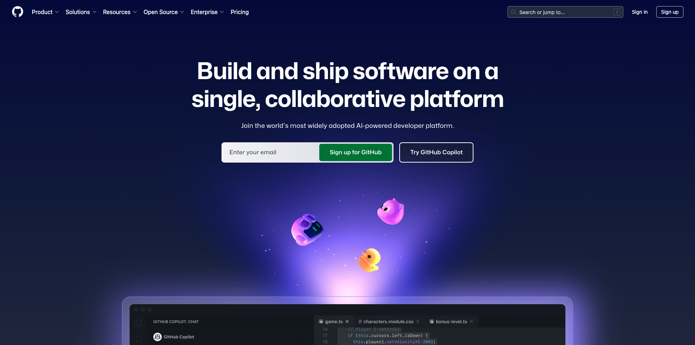

# Trabajo preliminar

A continuación se ofrece una descripción general del trabajo preliminar necesario antes de unirse a un taller en directo.

## 1. Instalar Adobe Creative Cloud

Vaya a [https://creativecloud.adobe.com/apps/download/creative-cloud](https://creativecloud.adobe.com/apps/download/creative-cloud).

## 2. Photoshop

Abra la aplicación **Adobe Creative Cloud** y vaya a **Aplicaciones**. Instale Photoshop en el equipo.

## 3. API

>[!NOTE]
>
>Si eres un empleado de Adobe, sigue las instrucciones aquí para descargar e instalar [PostBuster](./postbuster.md)

Vaya a [https://www.postman.com/downloads/](https://www.postman.com/downloads/).

Descargue e instale la versión correspondiente de Postman para su sistema operativo.

Inicie sesión en Postman con su cuenta personal.

## 4. Código de Visual Studio

Vaya a [https://code.visualstudio.com/](https://code.visualstudio.com/){target="_blank"}, descargue e instale **código de Visual Studio**.

## 5. Un editor de texto de su elección

Si no tienes una aplicación de Editor de texto, puedes ir a [https://www.sublimetext.com/](https://www.sublimetext.com/){target="_blank"} e descargar e instalar este Editor de texto.

## 6. Cuenta de GitHub

Si todavía no tiene una cuenta de GitHub, vaya a [https://github.com/](https://github.com/){target="_blank"} y haga clic en **Registrarse**. Utilice su dirección de correo electrónico personal y cree su cuenta.

## 7. GitHub Desktop

Vaya a [https://desktop.github.com/download/](https://desktop.github.com/download/){target="_blank"}, descargue e instale **Github Desktop**.

>[!NOTE]
>
>{width="50px" align="left"}
>
>Si tiene preguntas, desea compartir comentarios generales o tiene sugerencias sobre contenido futuro, póngase en contacto directamente con Tech Insiders, enviando un correo electrónico a **techinsiders@adobe.com**.

[Volver a todos los módulos](./overview.md)
