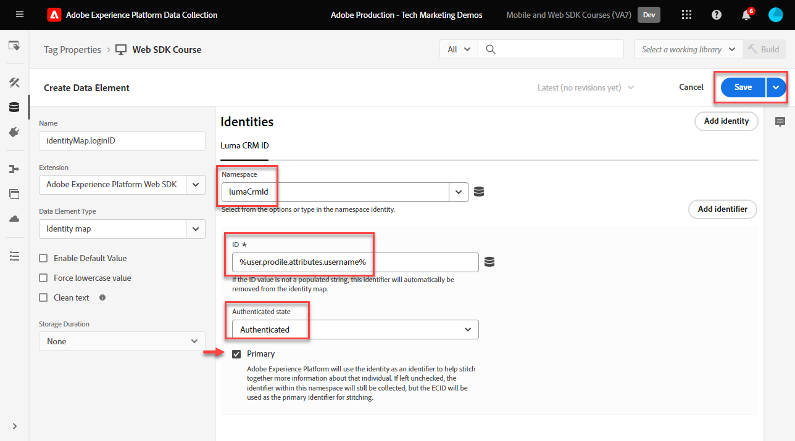

# Creación de identidades

Obtenga información sobre cómo capturar identidades con el SDK web de Experience Platform. Capturar datos de identidad no autenticados y autenticados en [Sitio de demostración de Luma](https://luma.enablementadobe.com/content/luma/us/en.html). Aprenda a utilizar los elementos de datos creados anteriormente para recopilar datos autenticados con un tipo de elemento de datos del SDK web de Platform denominado mapa de identidad.

Esta lección se centra en el elemento de datos del mapa de identidad disponible con la extensión de etiquetas del SDK web de Adobe Experience Platform. Los elementos de datos que contienen un ID de usuario autenticado y un estado de autenticación se asignan al XDM.

## Objetivos de aprendizaje

Al final de esta lección, puede hacer lo siguiente:

* Comprender la diferencia entre el ID del Experience Cloud (ECID) y el ID del dispositivo de origen
* Comprender la diferencia entre ID no autenticados y autenticados
* Creación de un elemento de datos de mapa de identidad

## Requisitos previos

Comprenderá qué es una capa de datos y se familiarizará con el [Sitio de demostración de Luma](https://luma.enablementadobe.com/content/luma/us/en.html){target="_blank"} capa de datos y cómo hacer referencia a elementos de datos en etiquetas. Debe haber completado las siguientes lecciones anteriores en el tutorial:

* [Configuración de un esquema XDM](configure-schemas.md)
* [Configuración de un área de nombres de identidad](configure-identities.md)
* [Configuración de una secuencia de datos](configure-datastream.md)
* [Extensión del SDK web instalada en la propiedad de etiqueta](install-web-sdk.md)
* [Creación de elementos de datos](create-data-elements.md)


## Experience Cloud ID

El [ID DEL Experience Cloud (ECID)](https://experienceleague.adobe.com/docs/experience-platform/identity/ecid.html?lang=en) es un área de nombres de identidad compartida que se utiliza en las aplicaciones de Adobe Experience Platform y Adobe Experience Cloud. ECID proporciona la base para la identidad del cliente y es la identidad predeterminada para las propiedades digitales. Esto hace que ECID sea el identificador ideal para rastrear el comportamiento de usuarios no autenticados, ya que siempre está presente

<!-- FYI I commented this out because it was breaking the build - Jack
>[!TIP]
>
> When you use the Experience Platform Web SDK to set up Adobe applications on your digital properties, the ECID is generated at the Adobe Edge server level. As such, ECID is not viewable on the client-side network request payload. You can view the ECID by seeing the Preview tab of the network request, or by using the [Adobe Experience Platform Debugger Edge Trace](set-up-analytics.md#experience-cloud-id-validation).
>
-->

Obtenga más información sobre cómo [El seguimiento de los ECID se realiza mediante el SDK web de Platform](https://experienceleague.adobe.com/docs/experience-platform/edge/identity/overview.html?lang=en).

Los ECID se configuran con una combinación de cookies de origen y Platform Edge Network. De forma predeterminada, las cookies de origen las establece el SDK web. Para tener en cuenta las restricciones del explorador sobre la duración de las cookies, puede optar por configurar y administrar sus propias cookies de origen en su lugar. Estos se denominan ID de dispositivos de origen (FPID).

>[!IMPORTANT]
>
>El [Extensión del servicio de ID de Experience Cloud](https://exchange.adobe.com/experiencecloud.details.100160.adobe-experience-cloud-id-launch-extension.html) no es necesaria al implementar el SDK web de Adobe Experience Platform, ya que la funcionalidad del servicio de ID está integrada en el SDK web de Platform.

## ID de dispositivo de origen (FPID)

Los FPID son cookies de origen _configura utilizando sus propios servidores web_ qué Adobe utiliza para establecer el ECID, en lugar de utilizar la cookie de origen establecida por el SDK web. Las cookies de origen son más eficaces cuando se establecen con un servidor que aprovecha un registro A de DNS (para IPv4) o un registro AAAA (para IPv6), en contraposición a un CNAME de DNS o código JavaScript.

Una vez establecida una cookie FPID, su valor se puede recuperar y enviar al Adobe a medida que se recopilan los datos del evento. Los FPID recopilados se utilizan como semillas para generar ECID en Platform Edge Network, que siguen siendo los identificadores predeterminados en las aplicaciones de Adobe Experience Cloud.

Más información sobre [ID de dispositivos de origen en el SDK web de Platform](https://experienceleague.adobe.com/docs/experience-platform/edge/identity/first-party-device-ids.html?lang=es)

>[!CAUTION]
>
> FPID es una forma alternativa de generar el ECID mediante una cookie configurada por los servidores web. No se utiliza para identificar usuarios autenticados.

## ID autenticado

Como se ha indicado anteriormente, a todos los visitantes de las propiedades digitales se les asigna un ECID por Adobe al utilizar el SDK web de Platform. Esto hace que ECID sea la identidad predeterminada para rastrear comportamientos digitales no autenticados.

También puede enviar un ID de usuario autenticado para que Platform pueda crear [Gráficos de identidad](https://experienceleague.adobe.com/docs/platform-learn/tutorials/identifies/understanding-identity-and-identity-graphs.html?lang=es), Target puede establecer su cuenta de terceros . Esto se realiza mediante el uso de [!UICONTROL Mapa de identidad] tipo de elemento de datos.

Para crear el [!UICONTROL Mapa de identidad] elemento de datos:

1. Ir a **[!UICONTROL Elementos de datos]** y seleccione **[!UICONTROL Añadir elemento de datos]**

1. **[!UICONTROL Nombre]** el elemento de datos `identityMap.loginID`

1. Como el **[!UICONTROL Extensión]**, seleccione `Adobe Experience Platform Web SDK`

1. Como el **[!UICONTROL Tipo de elemento de datos]**, seleccione `Identity map`

1. Se mostrará un área de pantalla a la derecha dentro de **[!UICONTROL Interfaz de recopilación de datos]** para configurar la identidad:

   

1. Como el  **[!UICONTROL Área de nombres]**, seleccione la `lumaCrmId` área de nombres que creó anteriormente en [Configurar identidades](configure-identities.md) lección.

   >[!NOTE]
   >
   >    Si no ve su `lumaCrmId` , compruebe que también lo creó en su zona protegida de producción predeterminada. Actualmente, solo se muestran en la lista desplegable de áreas de nombres las áreas de nombres creadas en la zona protegida de producción predeterminada.

1. Después del **[!UICONTROL Área de nombres]** se ha seleccionado, se debe establecer un ID. Seleccione el `user.profile.attributes.username` elemento de datos creado anteriormente en [Creación de elementos de datos](create-data-elements.md#create-data-elements-to-capture-the-data-layer) Esta lección captura un ID cuando los usuarios inician sesión en el sitio de Luma.

   <!--  >[!TIP]
    >
    >You can verify the **[!UICONTROL Luma CRM ID]** is collected in a data element on the web property by going to the [Luma Demo site](https://luma.enablementadobe.com/content/luma/us/en.html), logging in, [switching the tag environment](validate-with-debugger.md#use-the-experience-platform-debugger-to-map-to-your-tag-property) to your own, and typing `_satellite.getVar("user.profile.attributes.username")` in the web browser developer console.
    >
    >   
    -->

1. Como el **[!UICONTROL Estado autenticado]**, seleccione **[!UICONTROL Autenticado]**
1. Seleccionar **[!UICONTROL Principal]**

1. Seleccionar **[!UICONTROL Guardar]**

   

>[!TIP]
>
> El Adobe recomienda enviar identidades que representen a una persona, como `Luma CRM Id`, como el [!UICONTROL principal] identidad.
>
> Si el mapa de identidad contiene el identificador de persona (por ejemplo, `Luma CRM Id`), el identificador de persona se convertirá en [!UICONTROL principal] identidad. De lo contrario, `ECID` se convierte en [!UICONTROL principal] identidad.


<!--
1. Once the data element is configured in **[!UICONTROL Data Collection interface]**, it can be tested on the Luma web property like any other Data Element. Enter the following script in the browser developer console
   
   
   ```
   _satellite.getVar('identityMap.loginID')
   ```  

   
   
   >[!NOTE]
   >
   >ECID identifier will NOT populate in the Data Element, as this is configured already with Platform Web SDK.   
-->

Al final de estos pasos, debe tener los siguientes elementos de datos creados:

| Elementos de datos de la extensión CORE | Elementos de datos del SDK web de Platform |
-----------------------------|-------------------------------
| `cart.orderId` | `identityMap.loginID` |
| `page.pageInfo.hierarchie1` | `xdm.variable.content` |
| `page.pageInfo.pageName` | |
| `page.pageInfo.server` | |
| `user.profile.attributes.loggedIn` | |
| `user.profile.attributes.username` | |

Con estos elementos de datos en su lugar, está listo para empezar a enviar datos a Platform Edge Network a través del objeto XDM creando una regla en las etiquetas.

[Siguiente: ](create-tag-rule.md)

>[!NOTE]
>
>Gracias por dedicar su tiempo a conocer el SDK web de Adobe Experience Platform. Si tiene preguntas, desea compartir comentarios generales o tiene sugerencias sobre contenido futuro, compártalas en este [Entrada de discusión de la comunidad Experience League](https://experienceleaguecommunities.adobe.com/t5/adobe-experience-platform-launch/tutorial-discussion-implement-adobe-experience-cloud-with-web/td-p/444996)
