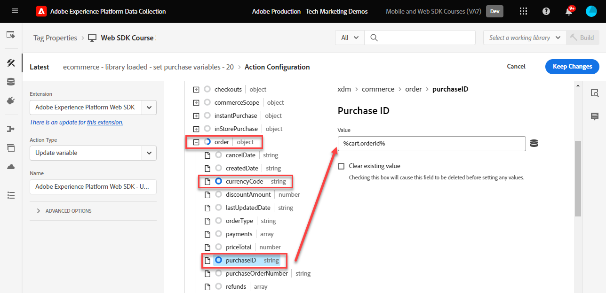
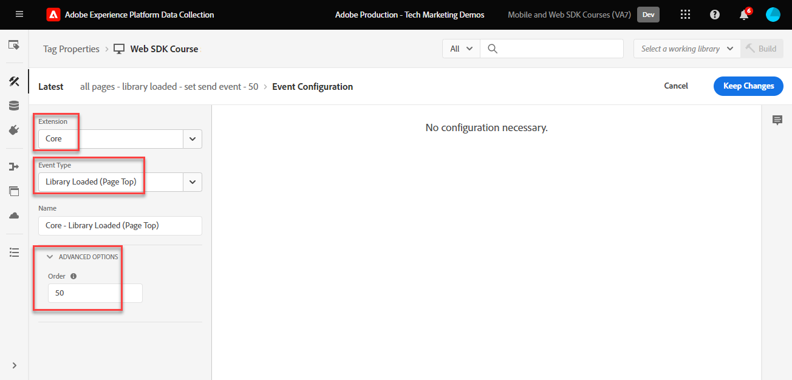

# Creación de reglas de etiquetas

Obtenga información sobre cómo enviar eventos al Edge Network de Platform con el objeto XDM mediante reglas de etiquetas. Una regla de etiqueta es una combinación de eventos, condiciones y acciones que indica a la propiedad de etiqueta que haga algo. Con el SDK web de Platform, las reglas se utilizan para enviar eventos al Edge Network de Platform con los campos XDM adecuados.

>[!NOTE]
>
> Para fines de demostración, los ejercicios de esta lección se basan en las lecciones anteriores para enviar eventos de usuarios en [Sitio de demostración de Luma](https://luma.enablementadobe.com/content/luma/us/en.html){target="_blank"}.

## Objetivos de aprendizaje

Al final de esta lección, puede hacer lo siguiente:

* Utilice una convención de nombres para administrar reglas dentro de las etiquetas
* Envío de un evento con campos XDM mediante las acciones Actualizar variable y Enviar evento
* Apilar varios conjuntos de campos XDM en varias reglas
* Asignar elementos de datos de matriz individuales o completos al objeto XDM
* Publicación de una regla de etiqueta en una biblioteca de desarrollo

## Requisitos previos

Está familiarizado con las etiquetas de recopilación de datos y las [Sitio de demostración de Luma](https://luma.enablementadobe.com/content/luma/us/en.html) y haya completado las lecciones anteriores en el tutorial:

* [Configuración de un esquema XDM](configure-schemas.md)
* [Configuración de un área de nombres de identidad](configure-identities.md)
* [Configuración de una secuencia de datos](configure-datastream.md)
* [Instalar extensión de SDK web](install-web-sdk.md)
* [Creación de elementos de datos](create-data-elements.md)
* [Creación de identidades](create-identities.md)

## Convenciones de nomenclatura

Para administrar mejor las reglas en las etiquetas, se recomienda seguir una convención de nombres estándar. Este tutorial utiliza una convención de nombres de cinco partes:

* [**ubicación**] - [**evento**] - [**propósito**] - [**herramienta**] - [**pedido**]

donde;

1. **ubicación** es la página o páginas del sitio donde se activa la regla
1. **evento** es el déclencheur de la regla
1. **propósito** es la acción principal realizada por la regla
1. **herramienta** es la aplicación o aplicaciones específicas utilizadas en el paso de acción para esa regla, que debería ser poco frecuente con el SDK web
1. **Secuencia** es el orden en que la regla debe activarse en relación con otras reglas
<!-- minor update -->

## Creación de reglas de etiquetas

En las etiquetas, las reglas se utilizan para ejecutar acciones (llamadas de activación) bajo varias condiciones. La extensión de etiquetas del SDK web de Platform incluye dos acciones que se utilizarán en esta lección:

* **[!UICONTROL Actualizar variable]** asigna elementos de datos a campos XDM
* **[!UICONTROL Enviar evento]** envía el objeto XDM a Experience Platform Edge Network

En el resto de esta lección:

1. Cree una regla para definir una &quot;configuración global&quot; de campos XDM (mediante [!UICONTROL Actualizar variable] que deseamos enviar en todas las páginas del sitio web (por ejemplo, el nombre de la página) utilizando **[!UICONTROL Actualizar variable]** acción.

1. Cree reglas adicionales que anulen la &quot;configuración global&quot; o que contribuyan con campos XDM adicionales (mediante [!UICONTROL Actualizar variable] de nuevo) que solo son relevantes bajo ciertas condiciones (por ejemplo, añadir detalles del producto en páginas del producto).

1. Cree otra regla con **[!UICONTROL Enviar evento]** acción que enviará el objeto XDM completo al Edge Network de Adobe Experience Platform.

Todas estas reglas se secuenciarán correctamente usando el complemento &quot;[!UICONTROL pedido]Opción &quot;.

Este vídeo ofrece información general del proceso:

>[!VIDEO](https://video.tv.adobe.com/v/3427710/?learn=on)

### Actualizar reglas de variables

#### Configuración global

Para crear reglas de etiquetas para los campos XDM globales:

1. Abra la propiedad de etiqueta que está utilizando para este tutorial.

1. Ir a **[!UICONTROL Reglas]** en el panel de navegación izquierdo

1. Seleccione el **[!UICONTROL Crear nueva regla]** botón

   

1. Asigne un nombre a la regla `all pages - library loaded - set global variables - 1`.

1. En el **[!UICONTROL Eventos]** , seleccione **[!UICONTROL Añadir]**

   

1. Utilice el **[!UICONTROL Extensión principal]** y seleccione **[!UICONTROL Library Loaded (Page Top)]** como el **[!UICONTROL Tipo de evento]**

1. Seleccionar **[!UICONTROL Avanzadas]** desplegable e introduzca `1` como el **[!UICONTROL Pedido]**

   >[!NOTE]
   >
   > Cuanto más bajo sea el número de pedido, más pronto se ejecutará. Por lo tanto, le damos a nuestra &quot;configuración global&quot; un número de pedido bajo.

1. Seleccionar **[!UICONTROL Conservar cambios]** para volver a la pantalla de regla principal
   

1. En el **[!UICONTROL Acciones]** , seleccione **[!UICONTROL Añadir]**

1. Como el **[!UICONTROL Extensión]**, seleccione **[!UICONTROL SDK web de Adobe Experience Platform]**

1. Como el **[!UICONTROL Tipo de acción]**, seleccione **[!UICONTROL Actualizar variable]**

1. Como el **[!UICONTROL Elemento de datos]**, seleccione la `xdm.variable.content` que creó en la [Creación de elementos de datos](create-data-elements.md) lección

   

Ahora, asigne los [!UICONTROL elementos de datos] a la [!UICONTROL esquema] utilizado por el objeto XDM.

>[!NOTE]
> 
> Puede asignar a propiedades individuales u objetos completos. En este ejemplo, se asigna a propiedades individuales.

1. Busque el campo eventType y selecciónelo

1. Introduzca el valor `web.webpagedetails.pageViews`

   >[!TIP]
   >
   > Para comprender qué valores se rellenan en `eventType` , debe ir a la página de esquema y seleccionar el campo `eventType` para ver los valores sugeridos en el carril derecho. También puede introducir un nuevo valor, si es necesario.
   > 

1. A continuación, busque la `identityMap` en el esquema y selecciónelo

1. Mapa a `identityMap.loginID` elemento de datos

   

   >[!TIP]
   >
   > Los campos XDM no se incluirán en la solicitud de red si el elemento de datos es nulo. Por lo tanto, cuando el usuario no está autenticado y la variable `identityMap.loginID` el elemento de datos es nulo, el `identityMap` no se enviará el objeto. Por eso podemos definirlo en nuestra &quot;configuración global&quot;.

1. Desplácese hacia abajo hasta que llegue al **`web`** objeto

1. Seleccione para abrirlo

1. Asigne los siguientes elementos de datos al correspondiente `web` Variables XDM

   * **`web.webPageDetials.name`** hasta `%page.pageInfo.pageName%`
   * **`web.webPageDetials.server`** hasta `%page.pageInfo.server%`
   * **`web.webPageDetials.siteSection`** hasta `%page.pageInfo.hierarchie1%`

1. Configure `web.webPageDetials.pageViews.value` como `1`.

   

   >[!TIP]
   >
   > Mientras que ninguno `eventType` establezca en `web.webpagedetails.pageViews` ni `web.webPageDetials.pageViews.value` son necesarios para que Adobe Analytics procese una señalización como vista de página, resulta útil disponer de una forma estándar de indicar una vista de página para otras aplicaciones de flujo descendente.

1. Seleccionar **[!UICONTROL Conservar cambios]** y luego **[!UICONTROL Guardar]** la regla de la siguiente pantalla para terminar de crearla

#### Campos de página de producto

Ahora, empiece a usar **[!UICONTROL Actualizar variable]** en reglas adicionales secuenciadas para enriquecer el objeto XDM antes de enviarlo a [!UICONTROL Edge Network de plataforma].

>[!TIP]
>
>El orden de las reglas determina qué regla se ejecuta primero cuando se activa un evento. Si dos reglas tienen el mismo tipo de evento, se ejecuta primero la que tenga el número más bajo.
> 
>

Comience por rastrear las vistas de productos en la página de detalles del producto de Luma:

1. Seleccionar **[!UICONTROL Agregar regla]**
1. Asígnele un nombre  [!UICONTROL `ecommerce - library loaded - set product details variables - 20`]
1. Seleccione el  en Evento para añadir un nuevo déclencheur
1. En **[!UICONTROL Extensión]**, seleccione **[!UICONTROL Núcleo]**
1. En **[!UICONTROL Tipo de evento]**, seleccione **[!UICONTROL Library Loaded (Page Top)]**
1. Seleccionar para abrir **[!UICONTROL Opciones avanzadas]**, escriba `20`. Esto garantiza que la regla se ejecute después de que `all pages - library loaded - set global variables - 1` que establece la configuración global.

   

1. En **[!UICONTROL Condiciones]**, seleccione para **[!UICONTROL Añadir]**
1. Salir **[!UICONTROL Tipo de lógica]** as **[!UICONTROL Normal]**
1. Salir **[!UICONTROL Extensión]** as **[!UICONTROL Núcleo]**
1. Seleccionar **[!UICONTROL Tipo de condición]** as **[!UICONTROL Ruta sin cadena de consulta]**
1. A la derecha, habilite la **[!UICONTROL Regex]** alternar
1. En **[!UICONTROL ruta igual a]** set `/products/`. Para el sitio de demostración de Luma, garantiza que la regla solo incluya déclencheur en las páginas de productos
1. Seleccionar **[!UICONTROL Conservar cambios]**

   

1. En **[!UICONTROL Acciones]** select **[!UICONTROL Añadir]**
1. Seleccionar **[!UICONTROL SDK web de Adobe Experience Platform]** extensión
1. Seleccionar **[!UICONTROL Tipo de acción]** as **[!UICONTROL Actualizar variable]**
1. Desplácese hacia abajo hasta el `commerce` objeto
1. Abra el **[!UICONTROL productViews]** objeto y conjunto **[!UICONTROL valor]** hasta `1`

   

   >[!TIP]
   >
   >La configuración de commerce.productViews.value=1 en XDM se asigna automáticamente al `prodView` evento en Analytics

1. Desplácese hacia abajo hasta `eventType` y configúrelo en `commerce.productViews`

   >[!NOTE]
   >
   >Debido a que esta regla tiene un orden superior, sobrescribirá la variable `eventType` se establece en la regla &quot;configuración global&quot;. `eventType` solo puede contener un valor, y se recomienda configurarlo con el evento de mayor valor.

1. Desplácese hacia abajo hasta y seleccione `productListItems` matriz
1. Seleccionar **[!UICONTROL Proporcionar elementos individuales]**
1. Seleccionar **[!UICONTROL Agregar elemento]**

   

   >[!CAUTION]
   >
   >El **`productListItems`** es un `array` tipo de datos, de modo que espera que los datos se incluyan como una colección de elementos. Debido a la estructura de capas de datos del sitio de demostración de Luma y a que solo es posible ver un producto a la vez en el sitio de Luma, los elementos se agregan de forma individual. Al implementar en su propio sitio web, en función de la estructura de la capa de datos, puede proporcionar una matriz completa.

1. Seleccionar para abrir **[!UICONTROL Elemento 1]**
1. Mapa **`productListItems.item1.SKU`** a `%product.productInfo.sku%`

   

1. Seleccionar **[!UICONTROL Conservar cambios]**

1. Seleccionar **[!UICONTROL Guardar]** para guardar la regla

#### Campos del carro de compras

Puede asignar toda la matriz a un objeto XDM, siempre que la matriz coincida con el formato del esquema XDM. El elemento de datos de código personalizado `cart.productInfo` ha creado bucles anteriores a través de `digitalData.cart.cartEntries` objeto de capa de datos en Luma y lo traduce al formato requerido del `productListItems` del esquema XDM.

Para ilustrarlo, consulte la comparación a continuación de la capa de datos del sitio de Luma (izquierda) con el elemento de datos traducido (derecha):

Comparar el elemento de datos con `productListItems` estructura (sugerencia, debe coincidir).

>[!IMPORTANT]
>
>Observe cómo se traducen las variables numéricas, con valores de cadena en la capa de datos como `price` y `qty` se ha cambiado el formato a números en el elemento de datos. Estos requisitos de formato son importantes para la integridad de los datos en Platform y se determinan durante la [configuración de esquemas](configure-schemas.md) paso. En el ejemplo, **[!UICONTROL cantidad]** utiliza el **[!UICONTROL Entero]** tipo de datos.
> 

Ahora, asignemos la matriz al objeto XDM:

1. Cree una nueva regla con el nombre `ecommerce - library loaded - set shopping cart variables - 20`
1. Seleccione el  en Evento para añadir un nuevo déclencheur
1. En **[!UICONTROL Extensión]**, seleccione **[!UICONTROL Núcleo]**
1. En **[!UICONTROL Tipo de evento]**, seleccione **[!UICONTROL Library Loaded (Page Top)]**
1. Seleccionar para abrir **[!UICONTROL Opciones avanzadas]**, escriba `20`
1. Seleccionar **[!UICONTROL Conservar cambios]**

   

1. En **[!UICONTROL Condiciones]**, seleccione para **[!UICONTROL Añadir]**
1. Salir **[!UICONTROL Tipo de lógica]** as **[!UICONTROL Normal]**
1. Salir **[!UICONTROL Extensiones]** as **[!UICONTROL Núcleo]**
1. Seleccionar **[!UICONTROL Tipo de condición]** as **[!UICONTROL Ruta sin cadena de consulta]**
1. A la derecha, **no** habilite el **[!UICONTROL Regex]** alternar
1. En **[!UICONTROL ruta igual a]** set `/content/luma/us/en/user/cart.html`. Para el sitio de demostración de Luma, garantiza que la regla solo contenga déclencheur en la página del carro de compras
1. Seleccionar **[!UICONTROL Conservar cambios]**

   

1. En **[!UICONTROL Acciones]** select **[!UICONTROL Añadir]**
1. Seleccionar **[!UICONTROL SDK web de Adobe Experience Platform]** extensión
1. Seleccionar **[!UICONTROL Tipo de acción]** as **[!UICONTROL Actualizar variable]**
1. Desplácese hacia abajo hasta el `commerce` y seleccione para abrirlo.
1. Abra el **[!UICONTROL productListViews]** objeto y conjunto **[!UICONTROL valor]** hasta `1`

   

   >[!TIP]
   >
   >La configuración de commerce.productListViews.value=1 en XDM se asigna automáticamente al `scView` evento en Analytics

1. Seleccionar `eventType` y se establece en `commerce.productListViews`

1. Desplácese hacia abajo hasta y seleccione **[!UICONTROL productListItems]** matriz

1. Seleccionar **[!UICONTROL Proporcionar toda la matriz]**

1. Mapa a **`cart.productInfo`** elemento de datos

1. Seleccionar **[!UICONTROL Conservar cambios]**

1. Seleccionar **[!UICONTROL Guardar]** para guardar la regla

Cree otras dos reglas para el cierre de compra y la compra siguiendo el mismo patrón con las siguientes diferencias:

**Nombre de regla**: `ecommerce  - library loaded - set checkout variables - 20`

1. **[!UICONTROL Condición]**: /content/luma/us/en/user/checkout.html
1. Configure `eventType` como `commerce.checkouts`.
1. Configure `commerce.checkout.value` como `1`.

   >[!TIP]
   >
   >Esto equivale a configurar `scCheckout` evento en Analytics

**Nombre de regla**: `ecommerce - library loaded - set purchase variables -  20`

1. **[!UICONTROL Condición]**: /content/luma/us/en/user/checkout/order/thank-you.html
1. Configure `eventType` como `commerce.purchases`.
1. Configure `commerce.purchases.value` como `1`.

   >[!TIP]
   >
   >Esto equivale a configurar `purchase` evento en Analytics

1. Establecer `commerce.order.purchaseID` a la `cart.orderId` elemento de datos
1. Establecer `commerce.order.currencyCode` al valor codificado `USD`

   

   >[!TIP]
   >
   >Esto equivale a configurar `s.purchaseID` y `s.currencyCode` variables en Analytics

1. Desplácese hacia abajo hasta y seleccione **[!UICONTROL productListItems]** matriz
1. Seleccionar **[!UICONTROL Proporcionar toda la matriz]**
1. Mapa a **`cart.productInfo.purchase`** elemento de datos
1. Seleccionar **[!UICONTROL Guardar]**

Cuando haya terminado, debería ver las siguientes reglas creadas.

### Enviar regla de evento

Ahora que ha establecido las variables, puede crear la regla para enviar el objeto XDM completo al Edge Network de Platform con la variable **[!UICONTROL Enviar evento]** acción.

1. A la derecha, seleccione **[!UICONTROL Agregar regla]** para crear otra regla

1. Asigne un nombre a la regla `all pages - library loaded - set send event - 50`.

1. En el **[!UICONTROL Eventos]** , seleccione **[!UICONTROL Añadir]**

1. Utilice el **[!UICONTROL Extensión principal]** y seleccione `Library Loaded (Page Top)` como el **[!UICONTROL Tipo de evento]**

1. Seleccionar **[!UICONTROL Avanzadas]** desplegable e introduzca `50` in **[!UICONTROL Pedido]**. Esto garantizará que el segundo déclencheur de regla sea posterior al primero que configure como déclencheur `1`.

1. Seleccionar **[!UICONTROL Conservar cambios]** para volver a la pantalla de regla principal
   

1. En el **[!UICONTROL Acciones]** , seleccione **[!UICONTROL Añadir]**

1. Como el **[!UICONTROL Extensión]**, seleccione  **[!UICONTROL SDK web de Adobe Experience Platform]**

1. Como el  **[!UICONTROL Tipo de acción]**, seleccione  **[!UICONTROL Enviar evento]**

1. Como el **[!UICONTROL XDM]**, seleccione la `xdm.variable.content` elemento de datos creado en la lección anterior

1. Seleccionar **[!UICONTROL Conservar cambios]** para volver a la pantalla de regla principal

   
1. Seleccionar **[!UICONTROL Guardar]** para guardar la regla

   

## Publicación de la regla en una biblioteca

A continuación, publique la regla en el entorno de desarrollo para poder verificar si funciona.

Para crear una biblioteca:

1. Ir a **[!UICONTROL Flujo de publicación]** en el panel de navegación izquierdo

1. Seleccionar **[!UICONTROL Añadir biblioteca]**

   
1. Para el **[!UICONTROL Nombre]**, introduzca `Luma Web SDK Tutorial`
1. Para el **[!UICONTROL Entorno]**, seleccione `Development`
1. Seleccionar  **[!UICONTROL Añadir todos los recursos modificados]**

   >[!NOTE]
   >
   >    Debería ver todos los componentes de etiquetas creados en lecciones anteriores. La extensión Core contiene el JavaScript base requerido por todas las propiedades de etiquetas web.

1. Seleccionar **[!UICONTROL Guardar y generar para desarrollo]**

   

La biblioteca puede tardar unos minutos en crearse y, cuando se completa, muestra un punto verde a la izquierda del nombre de la biblioteca:

Como puede ver en el [!UICONTROL Flujo de publicación] En la pantalla de, hay mucho más en el proceso de publicación que está fuera del ámbito de este tutorial. Este tutorial solo utiliza una biblioteca en el entorno de desarrollo.

Ahora está listo para validar los datos en la solicitud utilizando el Adobe Experience Platform Debugger.

[Siguiente ](validate-with-debugger.md)

>[!NOTE]
>
>Gracias por dedicar su tiempo a conocer el SDK web de Adobe Experience Platform. Si tiene preguntas, desea compartir comentarios generales o tiene sugerencias sobre contenido futuro, compártalas en este [Entrada de discusión de la comunidad Experience League](https://experienceleaguecommunities.adobe.com/t5/adobe-experience-platform-launch/tutorial-discussion-implement-adobe-experience-cloud-with-web/td-p/444996)
