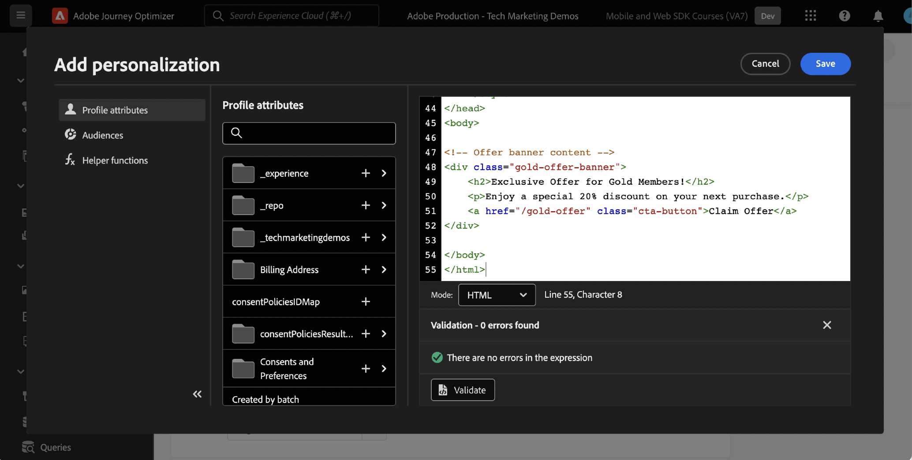

# Configuración de Administración de decisiones con el SDK web de Platform

Obtenga información sobre cómo implementar Administración de decisiones mediante el SDK web de Platform. Esta guía cubre los requisitos previos fundamentales de Administración de decisiones, los pasos detallados para la configuración y una explicación detallada de un caso de uso centrado en el estado de lealtad.

Al seguir este tutorial, los usuarios de Journey Optimizer están equipados para aplicar de forma eficaz las funciones de offer decisioning, lo que mejora la personalización y la relevancia de sus interacciones con los clientes.

## Objetivos de aprendizaje

Al final de esta lección, puede hacer lo siguiente:

* Comprenda los conceptos principales de gestión de decisiones en Adobe Journey Optimizer y su integración con el SDK web de Adobe Experience Platform.

* Conozca el proceso paso a paso para configurar el SDK web para Offer Decisioning, lo que garantiza una integración perfecta con Journey Optimizer.

* Explore un caso de uso detallado centrado en ofertas de estado de lealtad, obteniendo perspectivas sobre la creación y administración de ofertas, decisiones y ubicaciones de forma eficaz.

* Familiarícese con los términos esenciales y sus implicaciones dentro del marco de Gestión de decisiones.

* Comprenda la importancia de las reglas de decisión, los calificadores de recopilación y las ofertas de reserva a la hora de ofrecer la oferta correcta al usuario correcto.

* Explore temas avanzados como simulaciones y recopilación de datos de eventos personalizados, lo que le permite probar, validar y mejorar los mecanismos de envío de ofertas.

## Requisitos previos

Para completar las lecciones de esta sección, primero debe:

* Asegúrese de que su organización tenga acceso a Adobe Journey Optimizer Ultimate (Journey Optimizer y Offer decisioning) o a Adobe Experience Platform y al complemento del servicio de aplicaciones de Offer decisioning.

* Completar todas las lecciones para la configuración inicial del SDK web de Platform.

* Habilite su organización para Edge Decisioning.

* Obtenga información sobre cómo configurar una ubicación e instanciar ID de ubicación y actividad dentro del JSON del ámbito de decisión.

## Limitaciones

Tome nota de la siguiente limitación:

* Actualmente, Adobe Journey Optimizer no admite ofertas basadas en eventos. Si crea una regla de decisión basada en un evento, no puede aplicarla en una oferta.

## Concesión de acceso a Gestión de decisiones

Para conceder acceso a la funcionalidad de Gestión de decisiones, debe crear un **Perfil del producto** y asigne los permisos correspondientes a sus usuarios. [Obtenga más información sobre la administración de usuarios y permisos de Journey Optimizer en esta sección](https://experienceleague.adobe.com/docs/journey-optimizer/using/access-control/privacy/high-low-permissions.html?lang=en#decisions-permissions).

## Configuración de la secuencia de datos

El offer decisioning debe estar habilitado en **secuencia de datos** Configuración de antes de que el SDK web de Platform pueda entregar cualquier actividad de Administración de decisiones.

Para configurar el Offer decisioning en el conjunto de datos:

1. Vaya a la [Recopilación de datos](https://experience.adobe.com/#/data-collection) interfaz.

1. En el panel de navegación izquierdo, seleccione **Datastreams**.

1. Seleccione el conjunto de datos del SDK web de Luma creado anteriormente.

   

1. Seleccionar **Editar** dentro de **Servicio de Adobe Experience Platform**.

   

1. Compruebe la **Offer decisioning** cuadro.

   

1. Seleccione **Guardar**.

Esto garantiza que los eventos entrantes de Journey Optimizer los gestione correctamente **Adobe Experience Platform Edge**.

## Configuración del SDK para la administración de decisiones

Gestión de decisiones requiere pasos adicionales del SDK, según el tipo de implementación del SDK web. Hay dos opciones disponibles para configurar el SDK para gestión de decisiones.

* Instalación independiente del SDK
   1. Configure las variables `sendEvent` acción con su `decisionScopes`.

      ```javascript
      alloy("sendEvent", {
         ...
         "decisionScopes": [
            "[DECISION SCOPE 1]",
            "[DECISION SCOPE 2]"
         ]
      })
      ```

* Instalación de etiquetas SDK
   1. Vaya a la interfaz de recopilación de datos.

   1. En el panel de navegación izquierdo, seleccione **Etiquetas**.

      

   1. Seleccione el **Propiedad de etiqueta**.

   1. Cree su **Reglas**.
      * Agregar un SDK web de Platform **Acción Enviar evento** y añada el correspondiente `decisionScopes` a la configuración de esa acción.

   1. Creación y publicación de un **Biblioteca** que contenga todos los **Reglas**, **Elementos de datos**, y **Extensiones** que ha configurado.

## Terminología

En primer lugar, debe comprender la terminología utilizada en la interfaz de Administración de decisiones.

* **Límite**: Una restricción que dicta la frecuencia con la que aparece una oferta. Dos tipos:
   * Límites totales: Número máximo de veces que se puede mostrar una oferta en la audiencia de destino.
   * Límite de perfil: tiempos en los que se puede mostrar una oferta a un usuario en particular.
* **Colecciones**: subconjuntos de ofertas agrupadas por condiciones específicas establecidas por un experto en marketing, por ejemplo, la categoría de oferta.
* **Decisión**: Lógica que dicta la elección de una oferta.
* **Regla de decisión**: Restricciones en las ofertas para averiguar la elegibilidad de un usuario.
* **Oferta elegible**: una oferta que coincide con las restricciones preestablecidas y que se puede mostrar a un usuario.
* **Gestión de decisiones**: sistema de creación y distribución de ofertas personalizadas mediante la lógica empresarial y las reglas de decisión.
* **Ofertas de reserva**: La oferta predeterminada que se muestra cuando un usuario no cumple los requisitos para ninguna oferta de una colección.
* **Oferta**: un mensaje de marketing con posibles reglas de elegibilidad que determinan sus visualizadores.
* **Biblioteca de ofertas**: Repositorio central que administra ofertas, decisiones y reglas asociadas.
* **Ofertas personalizadas**: mensajes de marketing personalizados adaptados según las restricciones de elegibilidad.
* **Ubicaciones**: Configuración o escenario en el que se muestra una oferta a un usuario.
* **Prioridad**: Métrica de clasificación para ofertas que considera varias restricciones como elegibilidad y límite.
* **Representaciones**: Información específica del canal, por ejemplo, ubicación o idioma, que guía la visualización de una oferta.

## Resumen de caso de uso: recompensas de fidelización

En esta lección, debe implementar un ejemplo de caso de uso de las Recompensas de fidelidad para comprender la Gestión de decisiones mediante el SDK web.

Este caso de uso le permite comprender mejor cómo Journey Optimizer puede ayudar a ofrecer la mejor oferta a sus clientes, utilizando la biblioteca de ofertas centralizada y el motor de decisión de ofertas.

>[!NOTE]
>
> Dado que este tutorial está dirigido a los implementadores, vale la pena señalar que esta lección implica un trabajo sustancial de la interfaz en Journey Optimizer. Aunque estas tareas de interfaz suelen gestionarlas los especialistas en marketing, puede resultar beneficioso para los implementadores obtener información sobre el proceso, incluso si no son responsables de la creación de campañas de administración de decisiones a largo plazo.

## Componentes

Antes de empezar a crear las ofertas, debe definir varios componentes previos.

### Crear una ubicación para ofertas de fidelización

**Ubicaciones** son contenedores que se utilizan para mostrar las ofertas. En este ejemplo, se crea una ubicación en la parte superior del sitio de Luma.

Se puede acceder a la lista de ubicaciones en el **Componentes** menú. Los filtros están disponibles para ayudarle a recuperar ubicaciones según un canal o contenido específico.


Para crear la ubicación, siga estos pasos:

1. Clic **Crear ubicación**.

   

1. Defina las propiedades de la ubicación:
   * **Nombre**: nombre de la ubicación. Llamemos a la ubicación de ejemplo *&#39;Titular de página principal&#39;*.
   * **Tipo de canal**: Canal para el que se utiliza la ubicación. Vamos a usar *&#39;Web&#39;* ya que las ofertas se muestran en el sitio web de Luma.
   * **Tipo de contenido**: Tipo de contenido que la ubicación puede mostrar: texto, HTML, vínculo de imagen o JSON. Puede utilizar *&#39;HTML&#39;* para la oferta.
   * **Descripción**: una descripción de la ubicación (opcional).

   

1. Haga clic en **Guardar**.
1. Una vez creada la ubicación, se muestra en la lista de ubicaciones.
1. Seleccione la fila que contiene la nueva ubicación y tome nota del ID de ubicación, ya que esto puede ser necesario para la configuración dentro del ámbito de decisión.

   

### Reglas de decisión para el estado de fidelización

**Reglas de decisión** especifique las condiciones en las que se presentan las ofertas. En este ejemplo, se crean reglas de decisión para servir diferentes ofertas según el estado de Lealtad de un usuario.

Se puede acceder a la lista de reglas de decisión en la **Componentes** menú.

Para crear las reglas de decisión, siga estos pasos:

1. Vaya a **Reglas** y haga clic en **Crear regla**.

   

1. Pongamos el nombre a la primera regla &#39;*Regla de estado de fidelización de oro*&#39;. Puede utilizar campos XDM para definir la regla. El Adobe Experience Platform **Generador de segmentos** es una interfaz intuitiva que puede utilizar para crear las condiciones de las reglas.

   

1. Clic **Guardar** para confirmar la condición de regla.
1. El recién guardado &#39;*Regla de estado de fidelización de oro*&#39; se mostrará en la **Lista de reglas**. Selecciónelo para mostrar sus propiedades.

   

1. Ahora cree las condiciones de regla de oferta de lealtad restantes para el caso de uso.


### Cualificadores de colección

**Cualificadores de colección** permite organizar y buscar fácilmente ofertas dentro de la biblioteca de ofertas. En este ejemplo, se agregan calificadores de colección a las ofertas de Recompensas de fidelidad para mejorar la organización de la oferta.

Se puede acceder a la lista de calificadores de colección en el **Componentes** menú.

Para crear el calificador de la colección Loyalty Rewards, siga estos pasos:

1. Vaya a **Cualificadores de colección** y haga clic en **Crear calificador de colección**.

   

1. Asignemos un nombre al calificador de la colección &#39;*Recompensas de fidelización*&#39;

   

1. El nuevo calificador de colección ahora debería mostrarse en la **Calificador de colección** pestaña

## Ofertas

Ahora es el momento de crear las ofertas de recompensas de fidelidad.

Se puede acceder a la lista de ofertas en la **Ofertas** menú.


### Creación de ofertas para diferentes niveles de fidelización

Comience creando ofertas personalizadas para los diferentes niveles de fidelidad de Luma.

Para crear la primera **oferta**, siga estos pasos:

1. Clic **Crear oferta**, luego seleccione **Oferta personalizada**.

1. Pongamos el nombre a la primera oferta &#39;*Nivel de fidelidad de Luma: oro*&#39;. Debe especificar una fecha y una hora de inicio/finalización para esta oferta. También debe asociar la variable **calificador de colección** &#39;*Recompensas de fidelización*&quot; a la oferta, lo que le permite organizar mejor dentro de la **Biblioteca de ofertas**. Después, haga clic en **Siguiente**.

   

1. Ahora debe agregar **representaciones** para definir dónde se muestra la oferta. Vamos a elegir el **canal web**. Vamos a elegir también el &#39;*Titular de página principal*&#39; **ubicación** ha configurado anteriormente. El seleccionado **ubicación** es de tipo HTML, por lo que puede añadir contenido de HTML, JSON o TEXT directamente al editor para crear la oferta utilizando **Personalizado** botón de opción.

   

1. Editar el contenido de la oferta directamente con **Editor de expresiones**. Recuerde que puede agregar contenido de HTML, JSON o TEXT a esta ubicación. Asegúrese de seleccionar la **modo** en la parte inferior del editor, según el tipo de contenido. También puede pulsar **validate** para asegurarse de que no haya errores.

   

1. Además, puede utilizar el Editor de expresiones para recuperar atributos almacenados en Adobe Experience Platform. Añadamos el nombre de un perfil al contenido de la oferta para personalizar mejor a los miembros socio en un nivel 1:1.

   

1. Añada restricciones para mostrar únicamente la oferta a perfiles que cumplan los requisitos para la variable &#39;*Regla de estado de fidelización de oro*&#39;.

   

1. Cuando haya terminado de revisar la oferta, haga clic en **Finalizar**. Seleccionar **Guardar y aprobar**.

Ahora cree el resto de las ofertas para los distintos niveles de Fidelidad de Luma

### Ofertas de reserva

Aún desea ofrecer una oferta a los visitantes que no sean fieles a Luma del sitio de Luma. Para ello, puede configurar un **oferta de reserva** para la campaña.

Para crear la oferta de reserva, siga estos pasos:

1. Clic **Crear oferta**, luego seleccione **Oferta de reserva**.
   <!--
      
   -->
1. Asignemos un nombre a la oferta de reserva &#39;*Fidelidad que no es de Luma*&#39;. También puede asociar el creado anteriormente **calificador de colección**, &#39;*Recompensas de fidelización*&quot; a la oferta de reserva para facilitar la organización de la oferta.
   <!--
      
   -->
1. Añada el contenido de la oferta de reserva a **Editor de expresiones**. Recuerde que puede agregar contenido de HTML, JSON o TEXT a esta ubicación. Asegúrese de seleccionar la **modo** en la parte inferior del editor, según el tipo de contenido. También puede pulsar **validate** para asegurarse de que no haya errores.
   <!--
      
   -->
1. Si todo está configurado correctamente, pulse **Finalizar** y luego **Guardar y aprobar**.
<!--
   
-->

## Decisiones

**Decisiones** son contenedores para ofertas que seleccionan la mejor oferta disponible para un cliente, según el destinatario.

La lista de decisiones está disponible en la **Decisiones** de la pestaña **Ofertas** menú.
<!--
   
-->

### Creación de una decisión para ofertas de fidelización

Vamos a crear una decisión para el caso de uso de las Recompensas de fidelidad de Luma.

Para crear la decisión, siga estos pasos:

1. Clic **Crear decisión**.
   <!--
      
   -->
1. Llamemos a la decisión, &#39;*Ofertas de fidelización de Luma de diciembre*&#39;. Las ofertas deben ejecutarse durante 1 mes, por lo que vamos a especificarlo aquí.
   <!--
      
   -->
1. Ahora debe definir la variable **ámbitos de decisión**. Primero seleccione una ubicación. Puede utilizar el creado anteriormente &#39;*Titular de página principal*&#39;.
   <!--
      
   -->
1. A continuación, debe agregar **criterios de evaluación** para el ámbito de decisión. Clic **Añadir** y elija el creado anteriormente &#39;*Recompensas de fidelización*&#39; **colección** que contiene todas las ofertas de lealtad que se deben tener en cuenta.
   <!--
      
   -->
1. Dentro de &#39;*Recompensas de fidelización* En la colección, puede utilizar el campo de idoneidad para restringir la entrega de ofertas a un subconjunto de visitantes de Luma. Sin embargo, en este caso de uso, desea que todos los visitantes reciban una de las ofertas. Recuerde, ha configurado un **oferta de reserva** para todos los visitantes que no sean fieles. Establezca la idoneidad en &quot;Ninguno&quot;.
   <!--
      
   -->
1. Además, puede usar el complemento **método de clasificación** para seleccionar la mejor oferta para cada visitante de Luma si cumplen los requisitos varias ofertas para la combinación de usuario y ubicación. Para este caso de uso, puede utilizar la variable **Prioridad de ofertas** , que utiliza los valores definidos en las ofertas para ofrecer la mejor oferta.
   <!--
      
   -->
1. Ahora añada el **oferta de reserva** a la decisión. Recordatorio de que la oferta de reserva es la oferta predeterminada que se muestra a los visitantes de Luma si no entran en ninguna de las audiencias de Fidelidad de Luma. Seleccionar &#39;*Fidelidad que no es de Luma*&#39; de la lista de ofertas de reserva disponibles para &#39;*Titular de página principal*&#39; ubicación.
   <!--
      
   -->
1. Antes de activar la decisión, vamos a revisar el ámbito de decisión, la oferta de reserva, la vista previa de las ofertas disponibles y estimar los perfiles cualificados. Una vez que todo esté bien, puede hacer clic en **Finalizar** y **Guardar y activar**.
<!--
   
-->

## Simulaciones

Como práctica recomendada, debe validar la lógica de Luma Loyalty Decisioning para garantizar que las ofertas correctas se envíen a las audiencias de fidelidad correctas. Para ello, utilice lo siguiente **perfiles de prueba**. También es aconsejable probar los cambios en las ofertas mediante perfiles de prueba antes de llevar las nuevas versiones de oferta a producción.

Para comenzar la prueba, seleccione la **Simulaciones** de la pestaña **Ofertas** menú.

### Prueba de ofertas de fidelización

1. Seleccione un perfil de prueba para utilizarlo en la simulación. Clic **Administrar perfil**. [Para crear o designar un nuevo perfil de prueba para la prueba de ofertas, siga esta guía](https://experienceleague.adobe.com/docs/journeys/using/building-journeys/about-journey-building/creating-test-profiles.html?lang=en#create-test-profiles-csv).
   <!--
      
   -->
1. Añada uno o más perfiles de prueba a la simulación y guarde la selección. Para la prueba de casos de uso, debe asegurarse de tener perfiles de prueba configurados para cada audiencia de recompensas de fidelidad de Luma.
   <!--
      
   -->
1. Seleccione el ámbito de decisión que desea probar. Seleccionar **Agregar ámbito de decisión**.
   <!--
      
   -->
1. Seleccione el creado anteriormente &#39;*Titular de página principal*&#39; ubicación.
   <!--
      
   -->
1. Se muestran las decisiones disponibles, seleccione la creada anteriormente &#39;*Ofertas de fidelización de Luma de diciembre*&#39; y haga clic en **Añadir**.
   <!--
      
   -->
1. Una vez seleccionado un perfil de prueba, haga clic en **Ver resultados**. La mejor oferta disponible se muestra en el perfil de prueba seleccionado para &#39;*Ofertas de fidelización de Luma de diciembre*&#39; decisión.
   <!--
      
   -->
1. Seleccione un perfil de prueba diferente y haga clic en **Ver resultados**. Lo ideal es que vea una oferta simulada diferente, que se corresponda con el nivel de lealtad del perfil de prueba.

## Validación de gestión de decisiones mediante Adobe Experience Platform Debugger

El **Adobe Experience Platform Debugger** Esta extensión, disponible tanto para Chrome como para Firefox, analiza sus páginas web para identificar problemas en la implementación de las soluciones de Adobe Experience Cloud.

Puede utilizar el depurador del sitio de Luma para validar la lógica de toma de decisiones en producción. Esta es una buena práctica una vez que el caso de uso de las Recompensas de fidelidad está en funcionamiento, para garantizar que todo esté configurado correctamente.

[Obtenga información sobre cómo configurar Debugger en el explorador mediante la guía aquí](https://experienceleague.adobe.com/docs/platform-learn/data-collection/debugger/overview.html?lang=en).

Para iniciar la validación con el depurador:

1. Vaya a la página web de Luma con la ubicación de la oferta.
   <!--
      
   -->
1. En la página web, abra el **Adobe Experience Platform Debugger**.
   <!--
      
   -->
1. Vaya a **Resumen**. Compruebe que la variable **ID de flujo de datos** coincide con el **secuencia de datos** in **Recopilación de datos de Adobe** para el que ha activado el Offer decisioning.
   <!--
      
   -->
1. En **Soluciones** vaya a la **SDK web de Experience Platform**.
   <!--
      
   -->
1. Dentro de **Configuración** pestaña, Activar/desactivar **Habilitar depuración**. Esto habilita el registro de la sesión en un **Adobe Experience Platform Assurance** sesión.
   <!--
      
   -->
1. A continuación, puede iniciar sesión en el sitio con varias cuentas de fidelidad de Luma y utilizar el depurador para validar las solicitudes enviadas a **red de Adobe Experience Platform Edge**. Todas estas solicitudes deben capturarse en **Assurance** para el seguimiento del registro.
<!--
   
-->