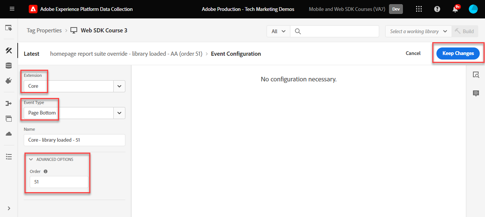
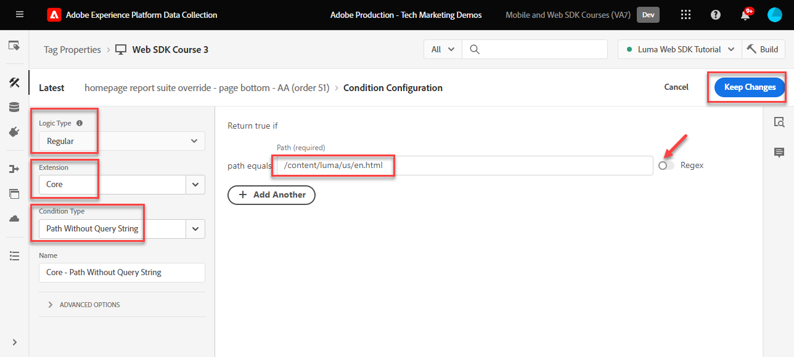
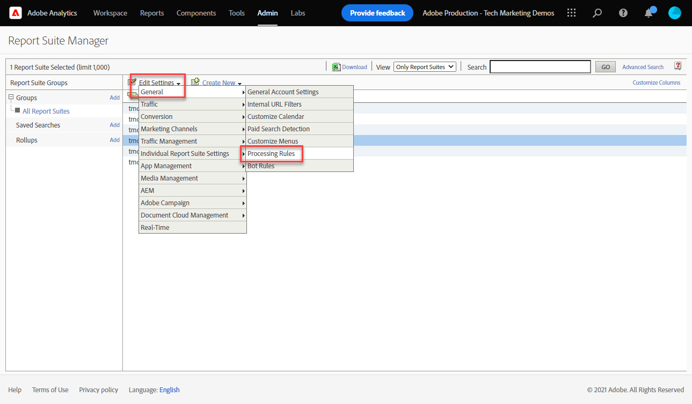
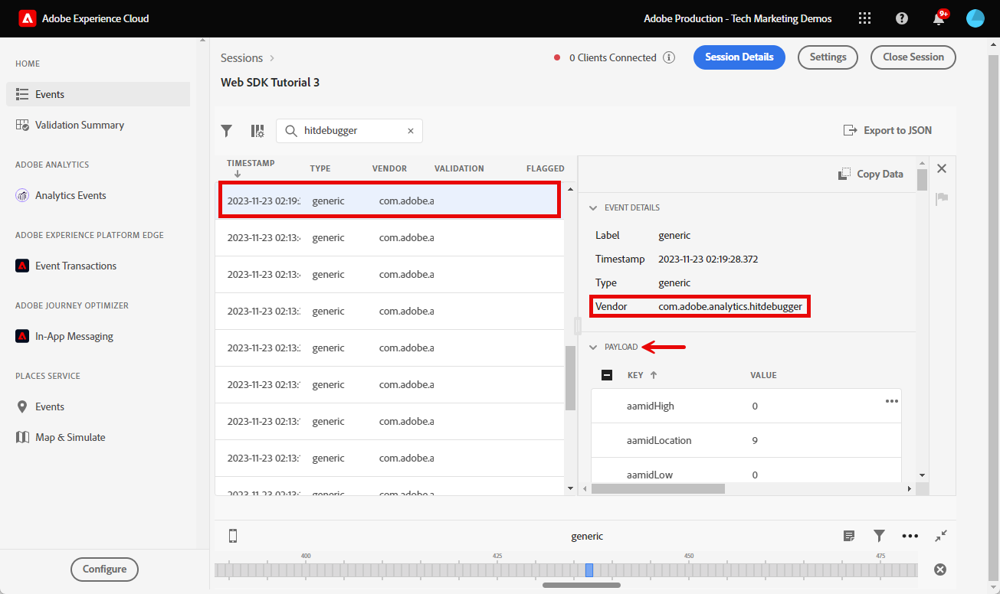
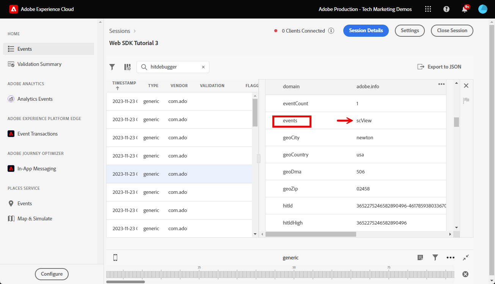

# Configuración de Adobe Analytics con el SDK web de Platform

Obtenga información sobre cómo configurar Adobe Analytics mediante [SDK web de Experience Platform](https://experienceleague.adobe.com/docs/platform-learn/data-collection/web-sdk/overview.html), cree reglas de etiquetas para enviar datos a Adobe Analytics y valide que Analytics está capturando los datos según lo esperado.

[Adobe Analytics](https://experienceleague.adobe.com/docs/analytics.html?lang=es) es una aplicación líder del sector que le permite comprender a sus clientes como personas y dirigir su negocio con inteligencia de clientes.


## Objetivos de aprendizaje

Al final de esta lección, debe poder:

* Configuración de un esquema XDM para Adobe Analytics
* Comprenda la diferencia entre las variables XDM asignadas automáticamente y manualmente para Analytics
* Configuración de una secuencia de datos para habilitar Adobe Analytics
* Anular una secuencia de datos para enviar datos a otro grupo de informes de Adobe Analytics
* Asignar elementos de datos de matriz individuales o completos al objeto XDM
* Utilice el tipo de acción Actualizar regla de variable para apilar varias reglas en un evento XDM
* Captura de vistas de página en Adobe Analytics con el objeto XDM
* Captura de datos de comercio electrónico con el objeto XDM para la cadena de producto de Adobe Analytics
* Definición de un eVar de comercialización de sintaxis de producto mediante XDM
* Validar si las variables de Adobe Analytics se establecen con el objeto XDM mediante Experience Platform Debugger
* Usar reglas de procesamiento de Adobe Analytics para establecer variables personalizadas
* Adobe Analytics captura los datos con Adobe Experience Platform Assurance
* Adobe Analytics captura los datos validados mediante informes en tiempo real

## Requisitos previos

Está familiarizado con las etiquetas, Adobe Analytics y [Sitio de demostración de Luma](https://luma.enablementadobe.com/content/luma/us/en.html){target="_blank"} funcionalidad de inicio de sesión y compras.

Necesita al menos un ID de grupo de informes de prueba o desarrollo. Si no dispone de un grupo de informes de prueba o desarrollo que pueda utilizar para este tutorial, [cree uno](https://experienceleague.adobe.com/docs/analytics/admin/manage-report-suites/new-report-suite/t-create-a-report-suite.html?lang=es).

Debe haber completado todos los pasos de las secciones anteriores del tutorial:

* Configuración inicial
   * [Configuración de un esquema XDM](configure-schemas.md)
   * [Configuración de un área de nombres de identidad](configure-identities.md)
   * [Configuración de una secuencia de datos](configure-datastream.md)
* Configuración de etiquetas
   * [Instalar extensión de SDK web](install-web-sdk.md)
   * [Creación de elementos de datos](create-data-elements.md)
   * [Creación de identidades](create-identities.md)
   * [Creación de una regla de etiqueta](create-tag-rule.md)
   * [Validar con Adobe Experience Platform Debugger](validate-with-debugger.md)

También es necesario [Habilitar el acceso de los usuarios a Adobe Experience Platform Assurance](https://experienceleague.adobe.com/docs/experience-platform/assurance/user-access.html) para que pueda validar los datos de Adobe Analytics con Adobe Experience Platform Assurance. (Si tiene acceso a esquemas, áreas de nombres de identidad y flujos de datos, ya tendrá acceso a Assurance)

## Esquemas XDM y variables de Analytics

¡Felicidades! Ya ha configurado un esquema compatible con Adobe Analytics en la [Configuración de un esquema](configure-schemas.md) ¡lección! Sin embargo, para Adobe Analytics existen dos enfoques generales para definir el XDM para Adobe Analytics.

<!-- Implementing Platform Web SDK should be as product-agnostic as possible. For Adobe Analytics, mapping eVars, props, and events doesn't occur during schema creation, nor during the tag rules configuration as it has been done traditionally. Instead, every XDM key-value pair becomes a Context Data Variable that maps to an Analytics variable in one of two ways: 

1. Automatically mapped variables using reserved XDM fields
1. Manually mapped variables using Analytics Processing Rules

To understand what XDM variables are auto-mapped to Adobe Analytics, please see [Variables automatically mapped in Analytics](https://experienceleague.adobe.com/docs/experience-platform/edge/data-collection/adobe-analytics/automatically-mapped-vars.html?lang=en). Any variable that is not auto-mapped must be manually mapped. -->

1. **XDM independiente del producto**: mantenga un esquema XDM de par clave-valor semántico y utilice [Reglas de procesamiento de Adobe Analytics](https://experienceleague.adobe.com/docs/analytics/admin/admin-tools/manage-report-suites/edit-report-suite/report-suite-general/c-processing-rules/processing-rules.html) para asignar los campos XDM a eVars, props, etc. Con un esquema XDM semántico, queremos decir que los propios nombres de campo tienen significado. Por ejemplo, el nombre del campo `web.webPageDetails.pageName` tiene más significado que decir `prop1` o `evar3`.

   >[!IMPORTANT]
   >
   > Todos los campos del esquema XDM pasan a estar disponibles para Adobe Analytics como variables de datos de contexto con el siguiente prefijo `a.x.`. Por ejemplo, `a.x.web.webinteraction.region`

1. **XDM específico de Analytics**: utilice un grupo de campos de Adobe Analytics creado específicamente en el esquema XDM llamado `Adobe Analytics ExperienceEvent Template`

El Adobe de enfoque que han visto preferir los clientes es el **XDM específico de Analytics**, porque omite el paso de asignación en la interfaz de reglas de procesamiento de Adobe Analytics. Los pasos de esta lección utilizan el **XDM específico de Analytics** enfoque.

## Asignación de XDM a Adobe Analytics

Muchos campos XDM se asignan automáticamente a variables de Analytics.

El esquema creado en [Configuración de un esquema](configure-schemas.md) Esta lección contiene algunas variables asignadas automáticamente a Analytics, como se describe en esta tabla:

| Variables asignadas automáticamente de XDM a Analytics | variable de Adobe Analytics |
|-------|---------|
| `identitymap.ecid.[0].id` | mid |
| `web.webPageDetails.name` | s.pageName |
| `web.webPageDetails.server` | s.server |
| `web.webPageDetails.siteSection` | s.channel |
| `commerce.productViews.value` | prodView |
| `commerce.productListViews.value` | scView |
| `commerce.checkouts.value` | scCheckout |
| `commerce.purchases.value` | compra |
| `commerce.order.currencyCode` | s.currencyCode |
| `commerce.order.purchaseID` | s.purchaseID |
| `productListItems[].SKU` | s.products=;product name;;;; (primary; consulte la nota más abajo) |
| `productListItems[].name` | s.products=;product name;;;; (reserva: consulte la nota más abajo) |
| `productListItems[].quantity` | s.products=;;product quantity;;; |
| `productListItems[].priceTotal` | s.product=;;;product price;; |

>[!NOTE]
>
>Las secciones individuales de la cadena de producto de Analytics se configuran mediante diferentes variables XDM en la variable `productListItems` objeto.
>El 18 de agosto de 2022, `productListItems[].SKU` tiene prioridad para la asignación al nombre del producto en la variable s.products.
>El valor establecido en `productListItems[].name` se asigna al nombre del producto solo si `productListItems[].SKU` no existe. De lo contrario, no está asignado y disponible en los datos de contexto.
>No establezca una cadena vacía o nulo como  `productListItems[].SKU`. Esto tiene el efecto no deseado de asignar al nombre del producto en la variable s.products.

Para obtener la lista más actualizada de asignaciones, consulte [Asignación de variables de Analytics en Adobe Experience Edge](https://experienceleague.adobe.com/docs/experience-platform/edge/data-collection/adobe-analytics/automatically-mapped-vars.html?lang=es).

Para variables XDM que no se asignan automáticamente, utilice el `Adobe Analytics ExperienceEvent Template` grupo de campos como se detalla en la siguiente sección.


## Configuración de la secuencia de datos

El SDK web de Platform envía datos del sitio web a Platform Edge Network. A continuación, la secuencia de datos indica a Platform Edge Network a cuál de los grupos de informes de Adobe Analytics debe reenviar esos datos.

1. Ir a [Recopilación de datos](https://experience.adobe.com/#/data-collection){target="blank"} interfaz
1. En el panel de navegación izquierdo, seleccione **[!UICONTROL Datastreams]**
1. Seleccione el creado anteriormente `Luma Web SDK: Development Environment` secuencia de datos

   

1. Seleccionar **[!UICONTROL Añadir servicio]**
   
1. Seleccionar **[!UICONTROL Adobe Analytics]** como el **[!UICONTROL Servicio]**
1. Introduzca el  **[!UICONTROL ID del grupo de informes]** del grupo de informes de desarrollo
1. Seleccionar **[!UICONTROL Guardar]**

   

   >[!TIP]
   >
   >Agregar más grupos de informes seleccionando **[!UICONTROL Agregar grupo de informes]** es equivalente al etiquetado de grupos múltiples.

>[!WARNING]
>
>En este tutorial, solo puede configurar el grupo de informes de Adobe Analytics para su entorno de desarrollo. Al crear flujos de datos para su propio sitio web, crearía flujos de datos y grupos de informes adicionales para los entornos de ensayo y producción.

### Configurar una anulación del grupo de informes de secuencia de datos

Es posible que desee cambiar a qué grupos de informes de Adobe Analytics se envían los datos cuando los visitantes se encuentran en determinadas páginas. Para configurar una configuración de anulación de secuencia de datos para Adobe Analytics:

1. Edite el **[!UICONTROL Adobe Analytics]** mediante la apertura de la  y, a continuación, seleccione **[!UICONTROL Editar]**

   

1. Seleccione el **[!UICONTROL Opciones avanzadas]** para abrir **[!UICONTROL Anulaciones de grupos de informes]**

1. Seleccione los grupos de informes que desee anular. En este caso, `Web SDK Course Dev` y `Web SDK Course Stg`

1. Seleccione Guardar

   

Más adelante en esta lección [cree una regla para enviar una vista de página a otro grupo de informes con anulación de secuencia de datos](setup-analytics.md###send-a-page-view-to-a-different-report-suite-with-datastream-override).

## Creación de elementos de datos de comercio electrónico adicionales

A continuación, capture datos adicionales de la capa de datos de Luma y envíelos a Platform Edge Network. Aunque la lección se centra en los requisitos comunes de Adobe Analytics, todos los datos capturados se pueden enviar fácilmente a otros destinos en función de la configuración del flujo de datos. Por ejemplo, si completa la lección de Adobe Experience Platform, los datos adicionales que capture en esta lección también se enviarán a Platform.

Durante la lección Crear elementos de datos, debe [elementos de datos de JavaScript creados](create-data-elements.md#create-data-elements-to-capture-the-data-layer) que capturó contenido y detalles de identidad. Ahora puede crear elementos de datos adicionales para capturar datos de comercio electrónico. Debido a que el [Sitio de demostración de Luma](https://luma.enablementadobe.com/content/luma/us/en.html){target="_blank"} utiliza diferentes estructuras de capa de datos para las páginas de detalles del producto y los productos del carro de compras. Debe crear elementos de datos independientes para cada escenario. Utilice elementos de datos de código personalizado para obtener lo que necesita de la capa de datos de Luma, que puede ser necesaria o no al implementar en su propio sitio. En este caso, debe recorrer una matriz de artículos del carro de compras para obtener detalles específicos de cada producto. Utilice los siguientes fragmentos de código proporcionados:

1. Abra la propiedad de etiqueta que está utilizando para el tutorial.

1. Ir a **[!UICONTROL Elementos de datos]**

1. Seleccionar **[!UICONTROL Añadir elemento de datos]**

1. Asígnele un nombre **`product.productInfo.sku`**

1. Utilice el **[!UICONTROL Código personalizado]** **[!UICONTROL Tipo de elemento de datos]**

1. Deje las casillas de verificación para **[!UICONTROL Forzar valor de minúsculas]** y **[!UICONTROL Limpiar texto]** desenfrenado

1. Salir `None` como el **[!UICONTROL Duración del almacenamiento]** ya que este valor es diferente en cada página

1. Seleccionar **[!UICONTROL Abrir editor]**

   

1. Copie y pegue el siguiente código


   ```javascript
   var cart = digitalData.product;
   var cartItem;
   cart.forEach(function(item){
   cartItem = item.productInfo.sku;
   });
   return cartItem;
   ```

1. Seleccionar **[!UICONTROL Guardar]** para guardar el código personalizado

1. Seleccionar **[!UICONTROL Guardar]** para guardar el elemento de datos

Siga los mismos pasos para crear estos elementos de datos adicionales:

* **`product.productInfo.title`**

  ```javascript
  var cart = digitalData.product;
  var cartItem;
  cart.forEach(function(item){
  cartItem = item.productInfo.title;
  });
  return cartItem;
  ```

<!--* **`product.productInfo.name`**

    ```javascript
    var cart = digitalData.product;
    var cartItem;
    cart.forEach(function(item){
    cartItem = item.productInfo.name;
    });
    return cartItem;
    ```-->

<!--* **`cart.productInfo`**

    ```javascript
    var cart = digitalData.cart.cartEntries; 
    var cartItem = [];
    cart.forEach(function(item, index, array){
    var qty;
    if(window.location.pathname.includes("thank-you.html")){
    qty = parseInt(item.qty);
    }else{
    qty = "";
    }
    var price = parseInt(item.price);
    cartItem.push({
    "SKU": item.sku,
    "quantity": qty,
    "priceTotal": price
    });
    });
    return cartItem; 
    ```-->

* **`cart.productInfo`**

  ```javascript
  var cart = digitalData.cart.cartEntries; 
  var cartItem = [];
  cart.forEach(function(item, index, array){
  cartItem.push({
  "SKU": item.sku
  });
  });
  return cartItem; 
  ```

* **`cart.productInfo.purchase`**

  ```javascript
  var cart = digitalData.cart.cartEntries; 
  var cartItem = [];
  cart.forEach(function(item, index, array){
  var qty = parseInt(item.qty);
  var price = parseInt(item.price);
  cartItem.push({
  "SKU": item.sku,
  "quantity": qty,
  "priceTotal": price
  });
  });
  return cartItem; 
  ```

  >[!TIP]
  >
  > Este fragmento de código contiene una configuración personalizada de eVar1 que se utiliza durante la lección eVars de comercialización de productos

Después de añadir estos elementos de datos y de haber creado los anteriores en el [Crear elementos de datos](create-data-elements.md) En esta lección, debe tener los siguientes elementos de datos:

| Elementos de datos |
-----------------------------|
| `cart.orderId` |
| `cart.productInfo` |
| `cart.productInfo.purchase` |
| `identityMap.loginID` |
| `page.pageInfo.hierarchie1` |
| `page.pageInfo.pageName` |
| `page.pageInfo.server` |
| `product.productInfo.sku` |
| `product.productInfo.title` |
| `user.profile.attributes.loggedIn` |
| `user.profile.attributes.username` |
| `xdm.variable.content` |

<!-- 
>[!IMPORTANT]
>
>In this tutorial, you will create a different XDM object for each event. That means you must remap variables that would be considered to be "globally" available on every hit, such as page name and identityMap. However, you may [Merge Objects](https://experienceleague.adobe.com/docs/experience-platform/tags/extensions/adobe/core/overview.html#merged-objects) or use [Mapping Tables](https://exchange.adobe.com/experiencecloud.details.103136.mapping-table.html) to manage your XDM objects more efficiently in a real-life situation. For this lesson, the global variables are considered as:
>
>* **[!UICONTROL identityMap]** to capture the authenticated ID as per the [Create Identity Map Data Element](create-data-elements.md#create-identity-map-data-element) exercise in the [Create Data Elements](create-data-elements.md) lesson.
>* **[!UICONTROL web]** object to capture content as per the [content XDM object](create-data-elements.md#map-content-data-elements-to-XDM-Schema-individually) exercise in the [Create Data Elements](create-data-elements.md) lesson on every data element above. 
-->

## Creación de reglas adicionales

En el [Creación de una regla de etiqueta](create-tag-rule.md) lección, ha configurado un `all pages global content variables - library loaded - AA (order 1)` dictaminar que [se ha creado un objeto XDM de instantánea utilizando **[!UICONTROL Actualizar variable]** **[!UICONTROL tipos de acción]**](create-tag-rule.md#create-tag-rule). Los siguientes ejercicios enriquecen ese objeto XDM para capturar datos adicionales específicos de determinadas páginas.

### Incremento de vistas de página

Dado que ahora envía datos a Adobe Analytics, le recomendamos que asigne un campo XDM adicional para indicar una vista de página. Aunque técnicamente no es necesario para que Analytics procese una señalización como vista de página, resulta útil tener una forma estándar de indicar una vista de página para otras aplicaciones de flujo descendente.

1. Abra el `all pages global content variables - library loaded - AA (order 1)` regla
1. Abra el **[!UICONTROL Actualizar variable]** acción
1. Desplácese hacia abajo y seleccione para abrir hasta `web.webPageDetails`
1. Seleccione para abrir **[!UICONTROL pageViews]** objeto
1. Establecer **[!UICONTROL valor]** hasta `1`
1. Seleccionar **[!UICONTROL Conservar cambios]**

   


### Envíe una vista de página a otro grupo de informes con anulación de secuencia de datos

Cree una regla para enviar una llamada de vista de página adicional a un grupo de informes diferente. Utilice la función de anulación de la secuencia de datos para cambiar el grupo de informes de una página mediante **[!UICONTROL Enviar evento]** Acción.

1. Cree una nueva regla y asígnele el nombre `homepage report suite override - library loaded - AA (order 51)`

1. Seleccione el signo más debajo de **[!UICONTROL Evento]** para añadir un nuevo déclencheur

1. En **[!UICONTROL Extensión]**, seleccione **[!UICONTROL Núcleo]**

1. En **[!UICONTROL Tipo de evento]**, seleccione **[!UICONTROL biblioteca cargada]**

1. Asígnele un nombre `Core - library loaded - order 51`

1. Seleccionar para abrir **[!UICONTROL Opciones avanzadas]**, escriba `51`. Esto garantiza que la regla se ejecute después de que `all pages global content variables - library loaded - AA (order 50)` que establece el XDM de línea base con el **[!UICONTROL Actualizar variable]** tipo de acción.

   

1. En **[!UICONTROL Condiciones]**, seleccione para **[!UICONTROL Añadir]**

1. Salir **[!UICONTROL Tipo de lógica]** as **[!UICONTROL Normal]**

1. Salir **[!UICONTROL Extensiones]** as **[!UICONTROL Núcleo]**

1. Seleccionar **[!UICONTROL Tipo de condición]** as **[!UICONTROL Ruta sin cadena de consulta]**

1. A la derecha, deje el **[!UICONTROL Regex]** alternancia deshabilitada

1. En **[!UICONTROL ruta igual a]** set `/content/luma/us/en.html`. Para el sitio de demostración de Luma, garantiza que la regla solo contenga déclencheur en la página de inicio

1. Seleccionar **[!UICONTROL Conservar cambios]**

   

1. En **[!UICONTROL Acciones]** select **[!UICONTROL Añadir]**

1. Como el **[!UICONTROL Extensión]**, seleccione **[!UICONTROL SDK web de Adobe Experience Platform]**

1. Como el **[!UICONTROL Tipo de acción]**, seleccione **[!UICONTROL Enviar evento]**

1. Como el **[!UICONTROL Tipo]**, seleccione `web.webpagedetails.pageViews`

1. Como el **[!UICONTROL Datos XDM]**, seleccione la `xdm.variable.content` que creó en la [Creación de elementos de datos](create-data-elements.md) lección

   

1. Desplácese hacia abajo hasta el **[!UICONTROL Anulaciones de configuraciones de flujo de datos]** sección

1. Deje el **[!UICONTROL Desarrollo]** pestaña seleccionada.

   >[!TIP]
   >
   >    Esta pestaña determina en qué entorno de etiquetas se produce la anulación. Para este ejercicio, solo debe especificar el entorno de desarrollo, pero cuando implemente esto en producción, recuerde hacerlo también en **[!UICONTROL Producción]** entorno.


1. Seleccione el **[!UICONTROL Datastream]**, en este caso `Luma Web SDK: Development Environment`

1. En **[!UICONTROL Grupos de informes]**, seleccione el grupo de informes para el que desee anular la selección. En este caso, `tmd-websdk-course-stg`.


   >[!TIP]
   >
   >La lista de grupos de informes que se muestra aquí está determinada por la variable [configurar la anulación de un grupo de informes de secuencia de datos](configure-datastream.md###configure-a-datastream-report-suite-override) paso. Añadir grupo de informes equivaldría al etiquetado de grupos múltiples.

1. Seleccionar **[!UICONTROL Conservar cambios]**

1. Y **[!UICONTROL Guardar]** su regla

   

### Enriquecimiento del objeto XDM mediante la variable Update

Uso del **[!UICONTROL Actualizar variable]** Tipo de acción: puede crear reglas adicionales para enriquecer el &quot;XDM de contenido global&quot; antes de enviarlo al [!UICONTROL Red perimetral de plataforma]. Para ello, secuencie las nuevas reglas antes que el `all pages send event - library loaded - AA (order 50)` que envía el evento [!UICONTROL Red perimetral de plataforma].

>[!TIP]
>
>El orden de las reglas determina qué regla se ejecuta primero cuando se activa un evento. Si dos reglas tienen el mismo tipo de evento, se ejecuta primero la que tenga el número más bajo.
> 
>

## Configuración de la cadena de producto

Antes de asignar a la cadena de producto, es importante comprender que hay dos objetos principales dentro del esquema XDM que se utilizan para capturar datos de comercio electrónico que tienen relaciones especiales con Adobe Analytics:

1. El `commerce` conjuntos de objetos eventos de Analytics como `prodView`, `scView`, y `purchase`
1. El `productListItems` conjuntos de objetos dimensiones de Analytics como `productID`.

Consulte [Recopilación de datos de Commerce y productos](https://experienceleague.adobe.com/docs/experience-platform/edge/data-collection/collect-commerce-data.html?lang=en) para obtener más información.


Comience por rastrear las vistas de productos en la página de detalles del producto de Luma.

1. En el panel de navegación izquierdo, seleccione **[!UICONTROL Reglas]** y luego seleccione **[!UICONTROL Agregar regla]**
1. Asígnele un nombre  [!UICONTROL `ecommerce - pdp library loaded - AA (order 20)`]
1. Seleccione el  en Evento para añadir un nuevo déclencheur
1. En **[!UICONTROL Extensión]**, seleccione **[!UICONTROL Núcleo]**
1. En **[!UICONTROL Tipo de evento]**, seleccione **[!UICONTROL biblioteca cargada]**
1. Asígnele un nombre `Core - library loaded - order 20`
1. Seleccionar para abrir **[!UICONTROL Opciones avanzadas]**, escriba `20`. Esto garantiza que la regla se ejecute después de que `all pages global content variables - library loaded - AA (order 1)` que establece las variables de contenido global, pero antes de la variable `all pages send event - library loaded - AA (order 50)` que envía el evento XDM.

   

1. En **[!UICONTROL Condiciones]**, seleccione para **[!UICONTROL Añadir]**
1. Salir **[!UICONTROL Tipo de lógica]** as **[!UICONTROL Normal]**
1. Salir **[!UICONTROL Extensiones]** as **[!UICONTROL Núcleo]**
1. Seleccionar **[!UICONTROL Tipo de condición]** as **[!UICONTROL Ruta sin cadena de consulta]**
1. A la derecha, habilite la **[!UICONTROL Regex]** alternar
1. En **[!UICONTROL ruta igual a]** set `/products/`. Para el sitio de demostración de Luma, garantiza que la regla solo incluya déclencheur en las páginas de productos
1. Seleccionar **[!UICONTROL Conservar cambios]**

   

1. En **[!UICONTROL Acciones]** select **[!UICONTROL Añadir]**
1. Seleccionar **[!UICONTROL SDK web de Adobe Experience Platform]** extensión
1. Seleccionar **[!UICONTROL Tipo de acción]** as **[!UICONTROL Actualizar variable]**
1. Desplácese hacia abajo hasta el `commerce` y seleccione para abrirlo.
1. Abra el **[!UICONTROL productViews]** objeto y conjunto **[!UICONTROL valor]** hasta `1`

   

   >[!TIP]
   >
   >La configuración de commerce.productViews.value=1 en XDM se asigna automáticamente al `prodView` evento en Analytics

También es importante comprender que puede hacer lo siguiente **[!UICONTROL proporcionar atributos individuales]** a campos XDM individuales o **[!UICONTROL proporcionar una matriz completa]** a un objeto XDM.


### Asignación de atributos individuales a un objeto XDM

Debido a la estructura de las capas de datos de Luma, puede asignarlas a variables individuales para capturar datos en la página de detalles del producto del sitio de demostración de Luma.

1. Desplácese hacia abajo hasta y seleccione `productListItems` matriz
1. Seleccionar **[!UICONTROL Proporcionar elementos individuales]**
1. Seleccionar **[!UICONTROL Agregar elemento]**

   

   >[!CAUTION]
   >
   >El **`productListItems`** es un `array` tipo de datos, de modo que espera que los datos se incluyan como una colección de elementos. Debido a la estructura de capas de datos del sitio de demostración de Luma y a que solo es posible ver un producto a la vez en el sitio de Luma, los elementos se agregan de forma individual. Al implementar en su propio sitio web, en función de la estructura de la capa de datos, puede proporcionar una matriz completa.

1. Seleccionar para abrir **[!UICONTROL Elemento 1]**
1. Mapa **`productListItems.item1.SKU`** a `%product.productInfo.sku%`

   

1. Buscar `eventType` y configúrelo en `commerce.productViews`

1. No seleccione Conservar cambios aún

### Establecer un eVar de comercialización en la cadena de producto

Mediante el uso de `Adobe Analytics ExperienceEvent Template` grupo de campos Para definir el esquema XDM, puede asignar variables a eVars de comercialización o eventos dentro de la cadena de producto. Esto también se conoce como configuración **Comercialización de sintaxis del producto**. Observe el `_experience` objeto bajo `productListItems` > `Item 1`. Configuración de cualquier variable en esto [!UICONTROL objeto] establece eVars o eventos de sintaxis del producto.

1. Seleccionar para abrir `_experience > analytics > customDimensions > eVars > eVar1`

1. Configure las variables **[!UICONTROL Valor]** hasta `%product.productInfo.title%`

1. Seleccionar **[!UICONTROL Conservar cambios]**

   

1. Seleccionar **[!UICONTROL Guardar]** para guardar la regla

<!--
1. The **[!UICONTROL Type]** field has a drop-down list of values to choose from. Select `[!UICONTROL commerce.productViews]`

    [!TIP]
    >
    >The value selected here has no effect on how data is mapped to Analytics, however it is recommended to thoughtfully apply this variable, as it is used in Adobe Experience Platform's segment builder interface. The value selected is available to use in the `[!UICONTROL c.a.x.eventtype]` context data variable downstream.

1. Under **[!UICONTROL XDM Data]**, select the `[!UICONTROL xdm.commerce.prodView]` XDM object data element
1. Select **[!UICONTROL Keep Changes]**

    

1. Your rule should look similar to the below. Select **[!UICONTROL Save]**

     -->


### Asignar una matriz completa a un objeto XDM

Como se ha indicado anteriormente, el sitio de demostración de Luma utiliza una estructura de capas de datos diferente para los productos del carro de compras. El elemento de datos de código personalizado `cart.productInfo` ha creado bucles anteriores a través de `digitalData.cart.cartEntries` objeto de capa de datos y lo traduce al esquema de objeto XDM requerido. El nuevo formato **debe coincidir exactamente** el esquema definido por el `productListItems` del esquema XDM.

Para ilustrarlo, consulte la comparación a continuación de la capa de datos del sitio de Luma (izquierda) con el elemento de datos traducido (derecha):


Comparar el elemento de datos con `productListItems` estructura (sugerencia, debe coincidir).

>[!IMPORTANT]
>
>Observe cómo se traducen las variables numéricas, con valores de cadena en la capa de datos como `price` y `qty` se ha cambiado el formato a números en el elemento de datos. Estos requisitos de formato son importantes para la integridad de los datos en Platform y se determinan durante la [configuración de esquemas](configure-schemas.md) paso. En el ejemplo, **[!UICONTROL cantidad]** utiliza el **[!UICONTROL Entero]** tipo de datos.
> 

Ahora, vuelva a asignar el objeto XDM a una matriz completa. Repita los mismos pasos que al crear el `ecommerce - pdp library loaded - AA (order 20)` regla:

1. Asígnele un nombre  [!UICONTROL `ecommerce - cart library loaded - AA (order 20)`]
1. Seleccione el  en Evento para añadir un nuevo déclencheur
1. En **[!UICONTROL Extensión]**, seleccione **[!UICONTROL Núcleo]**
1. En **[!UICONTROL Tipo de evento]**, seleccione **[!UICONTROL biblioteca cargada]**
1. Asígnele un nombre `Core - library loaded - order 20`
1. Seleccionar para abrir **[!UICONTROL Opciones avanzadas]**, escriba `20`
1. Seleccionar **[!UICONTROL Conservar cambios]**

   

1. En **[!UICONTROL Condiciones]**, seleccione para **[!UICONTROL Añadir]**
1. Salir **[!UICONTROL Tipo de lógica]** as **[!UICONTROL Normal]**
1. Salir **[!UICONTROL Extensiones]** as **[!UICONTROL Núcleo]**
1. Seleccionar **[!UICONTROL Tipo de condición]** as **[!UICONTROL Ruta sin cadena de consulta]**
1. A la derecha, **no** habilite el **[!UICONTROL Regex]** alternar
1. En **[!UICONTROL ruta igual a]** set `/content/luma/us/en/user/cart.html`. Para el sitio de demostración de Luma, garantiza que la regla solo contenga déclencheur en la página del carro de compras
1. Seleccionar **[!UICONTROL Conservar cambios]**

   

1. En **[!UICONTROL Acciones]** select **[!UICONTROL Añadir]**
1. Seleccionar **[!UICONTROL SDK web de Adobe Experience Platform]** extensión
1. Seleccionar **[!UICONTROL Tipo de acción]** as **[!UICONTROL Actualizar variable]**
1. Desplácese hacia abajo hasta el `commerce` y seleccione para abrirlo.
1. Abra el **[!UICONTROL productListViews]** objeto y conjunto **[!UICONTROL valor]** hasta `1`

   

   >[!TIP]
   >
   >La configuración de commerce.productListViews.value=1 en XDM se asigna automáticamente al `scView` evento en Analytics

<!--1. Create an **[!UICONTROL XDM object]** **[!UICONTROL Data Element Type]** named **`xdm.commerce.cartView`**
1. Select the same Platform sandbox and XDM schema you are using for this tutorial
1. Open the **[!UICONTROL commerce]** object
1. Open the **[!UICONTROL productListViews]** object and set `value` to `1`

    >[!TIP]
    >
    >This step is equivalent to setting `scView` event in Analytics -->

1. Desplácese hacia abajo hasta y seleccione **[!UICONTROL productListItems]** matriz

1. Seleccionar **[!UICONTROL Proporcionar toda la matriz]**

1. Mapa a **`cart.productInfo`** elemento de datos

1. Seleccionar `eventType` y se establece en `commerce.productListViews`

1. Seleccionar **[!UICONTROL Conservar cambios]**

1. Seleccionar **[!UICONTROL Guardar]** para guardar la regla

Cree otras dos reglas para el cierre de compra y la compra siguiendo el mismo patrón con las siguientes diferencias:

**Nombre de regla**: `ecommerce - checkout library loaded - AA (order 20)`

* **[!UICONTROL Condición]**: /content/luma/us/en/user/checkout.html
* Configure `eventType` como `commerce.checkouts`.
* Establecer **Evento de comercio de XDM**: commerce.checkout.value a `1`

  >[!TIP]
  >
  >Esto equivale a configurar `scCheckout` evento en Analytics

**Nombre de regla**: `ecommerce - purchase library loaded - AA (order 20)`

* **[!UICONTROL Condición]**: /content/luma/us/en/user/checkout/order/thank-you.html
* Configure `eventType` como `commerce.purchases`.
* Establecer **Evento de comercio de XDM**: commerce.purchases.value a `1`

  >[!TIP]
  >
  >Esto equivale a configurar `purchase` evento en Analytics

Hay pasos adicionales para capturar todos los datos necesarios `purchase` variables de evento:

1. Abrir **[!UICONTROL comercio]** objeto
1. Abra el **[!UICONTROL pedido]** objeto
1. Mapa **[!UICONTROL purchaseID]** a la `cart.orderId` elemento de datos
1. Establecer **[!UICONTROL currencyCode]** al valor codificado `USD`

   

   >[!TIP]
   >
   >Esto equivale a configurar `s.purchaseID` y `s.currencyCode` variables en Analytics


1. Desplácese hacia abajo hasta y seleccione **[!UICONTROL productListItems]** matriz
1. Seleccionar **[!UICONTROL Proporcionar toda la matriz]**
1. Mapa a **`cart.productInfo.purchase`** elemento de datos
1. Seleccionar **[!UICONTROL Guardar]**

Cuando haya terminado, debería ver las siguientes reglas creadas.


<!--
## Create additional rules for Platform Web SDK

With the **[!UICONTROL Update variabl]**e and **[!UICONTROL Send Event]** Action Types of Platform Web SDK, its possible to sequence the **[!UICONTROL Send Event]** action to trigger after all **[!UICONTROL Update variable]** action types run. This is called Rule Stacking, and you use it to customize the baseline XDM created depending on the type of page you are on.  

In this exercise, you create individual rules per e-commerce event and use conditions so the rules fire on the right pages. 

Repeat the same for all other e-commerce events using the following parameters:

**Rule name**: cart view - library load - AA

* **[!UICONTROL Event Type]**: Library Loaded (Page Top)
* **[!UICONTROL Condition]**: /content/luma/us/en/user/cart.html
* **Type value under Web SDK - Send Action**: commerce.productListViews
* **XDM data for Web SDK - Send Action:** `%xdm.commerce.cartView%`

**Rule name**: checkout - library load - AA

* **[!UICONTROL Event Type]**: Library Loaded (Page Top)
* **[!UICONTROL Condition]** /content/luma/us/en/user/checkout.html
* **Type for Web SDK - Send Action**: commerce.checkouts
* **XDM data for Web SDK - Send Action:** `%xdm.commerce.checkout%`

**Rule name**: purchase - library load - AA

* **[!UICONTROL Event Type]**: Library Loaded (Page Top)
* **[!UICONTROL Condition]** /content/luma/us/en/user/checkout/order/thank-you.html
* **Type for Web SDK - Send Action**: commerce.purchases
* **XDM data for Web SDK - Send Action:** `%xdm.commerce.purchase%`
-->


## Cree su entorno de desarrollo

Añada los nuevos elementos de datos y reglas a su `Luma Web SDK Tutorial` y reconstruya su entorno de desarrollo.

¡Felicidades! El siguiente paso es validar la implementación de Adobe Analytics mediante el SDK web de Experience Platform.

## Validar Adobe Analytics para el SDK web de Platform

En el [Depurador](validate-with-debugger.md) En esta lección, ha aprendido a inspeccionar la solicitud XDM del lado del cliente con Platform Debugger y la consola de desarrollador del explorador, que es similar a cómo depurar un `AppMeasurement.js` Implementación de Analytics. También ha aprendido a validar las solicitudes del lado del servidor de Platform Edge Network enviadas a aplicaciones de Adobe y a ver una carga útil completamente procesada mediante Assurance.

Para validar que Analytics captura correctamente los datos mediante el SDK web de Experience Platform, debe ir dos pasos más allá para:

1. Valide cómo procesa los datos el objeto XDM en la red perimetral de Platform, utilizando la función de seguimiento de Edge de Experience Platform Debugger
1. Validar cómo Analytics procesa los datos mediante reglas de procesamiento e informes en tiempo real
1. Validar cómo Analytics procesa completamente los datos mediante Adobe Experience Platform Assurance

### Usar seguimiento de borde

Obtenga información sobre cómo validar que Adobe Analytics está capturando el ECID, las vistas de página, la cadena de producto y los eventos de comercio electrónico con la función Edge Trace de Experience Platform Debugger.

### Validación de ID de Experience Cloud

1. Vaya a la [Sitio de demostración de Luma](https://luma.enablementadobe.com/content/luma/us/en.html){target="_blank"}
1. Seleccione el botón de inicio de sesión en la parte superior derecha y utilice las credenciales u: test@adobe.com p: test para autenticarse
1. Abra Experience Platform Debugger y [cambie la propiedad de etiquetas del sitio a su propia propiedad de desarrollo](validate-with-debugger.md#use-the-experience-platform-debugger-to-map-to-your-tags-property)


1. Para habilitar el seguimiento de Edge, vaya a Experience Platform Debugger, en el panel de navegación izquierdo, seleccione **[!UICONTROL Registros]**, luego seleccione la **[!UICONTROL Edge]** y seleccione. **[!UICONTROL Connect]**

   

1. Estará vacío por ahora

   

1. Actualice la página de Luma y vuelva a comprobar Experience Platform Debugger. Debería ver los datos que llegan. La fila que empieza por **[!UICONTROL Asignación automática de Analytics]** es la señalización de Adobe Analytics
1. Seleccione para abrir ambos `[!UICONTROL mappedQueryParams]` y la segunda lista desplegable para ver las variables de Analytics

   

   >[!TIP]
   >
   >La segunda lista desplegable corresponde al ID del grupo de informes de Analytics al que está enviando los datos. Debe coincidir con su propio grupo de informes, no con el de la captura de pantalla.

1. Desplazarse hacia abajo para buscar `[!UICONTROL c.a.x.identitymap.ecid.[0].id]`. Es una variable de datos de contexto que captura el ECID
1. Desplácese hacia abajo hasta que vea el informe de Analytics. `[!UICONTROL mid]` variable. Ambos ID coinciden con el ID de Experience Cloud del dispositivo.
1. En el sitio de Luma,

   

   >[!NOTE]
   >
   >Como ha iniciado sesión, dedique un momento a validar el ID autenticado `112ca06ed53d3db37e4cea49cc45b71e` para el usuario **`test@adobe.com`** también se captura en el `[!UICONTROL c.a.x.identitymap.lumacrmid.[0].id]`

### Anulaciones de grupos de informes

Arriba configuró una anulación de secuencia de datos para el [Página principal de Luma](https://luma.enablementadobe.com/content/luma/us/en.html).  Para validar esta configuración

1. Busque una fila con **[!UICONTROL Configuración de flujo de datos después de aplicar el reemplazo]**. Aquí encontrará el grupo de informes principal y los grupos de informes adicionales que se configuraron para las anulaciones del grupo de informes.

   

1. Desplácese hacia abajo hasta la fila que comience por **[!UICONTROL Asignación automática de Analytics]**  y compruebe que la variable `[!UICONTROL reportSuiteIds]` muestra el grupo de informes que especificó en las configuraciones de anulación

   

### Vistas de página de contenido

Vaya a una página de producto como la [Página de productos de Didi Sport Watch](https://luma.enablementadobe.com/content/luma/us/en/products/gear/watches/didi-sport-watch.html#24-WG02).  Compruebe que Analytics captura las vistas de páginas de contenido.

1. Buscar: `[!UICONTROL c.a.x.web.webpagedetails.pageviews.value]=1`.
1. Desplácese hacia abajo para ver el `[!UICONTROL gn]` variable. Es la sintaxis dinámica de Analytics para `[!UICONTROL s.pageName]` variable. Captura el nombre de página de la capa de datos.

   

### Eventos de cadena de producto y comercio electrónico

Dado que ya se encuentra en una página de producto, este ejercicio sigue utilizando el mismo seguimiento de Edge para validar que Analytics capture los datos del producto. Tanto la cadena de producto como los eventos de comercio electrónico se asignan automáticamente a variables XDM de Analytics. Siempre y cuando haya asignado a la aplicación adecuada `productListItem` Variable XDM al [configuración de un esquema XDM para Adobe Analytics](setup-analytics.md#configure-an-xdm-schema-for-adobe-analytics), la red perimetral de plataforma se encarga de asignar los datos a las variables de análisis adecuadas.

**En primer lugar, valide que la variable `Product String` se ha establecido**

1. Buscar: `[!UICONTROL c.a.x.productlistitems.][0].[!UICONTROL sku]`. La variable captura el valor del elemento de datos asignado al `productListItems.item1.sku` anteriormente en esta lección
1. Busque también. `[!UICONTROL c.a.x.productlistitems.][0].[!UICONTROL _experience.analytics.customdimensions.evars.evar1]`. La variable captura el valor del elemento de datos asignado `productListItems.item1._experience.analytics.customdimensions.evars.evar1`
1. Desplácese hacia abajo para ver el `[!UICONTROL pl]` variable. Es la sintaxis dinámica de la variable de cadena de producto de Analytics
1. Tenga en cuenta que el nombre del producto de la capa de datos está asignado tanto a la variable `[!UICONTROL c.a.x.productlistitems.][0].[!UICONTROL sku]` y el `[!UICONTROL product]` parámetro de la cadena de products.  Además, el título de producto de la capa de datos se asigna a la evar1 de comercialización en la cadena de productos.

   

   El seguimiento de Edge trata `commerce` eventos de forma ligeramente diferente a `productList` dimensiones. No ve una variable de datos de contexto asignada de la misma manera que ve el nombre del producto asignado a `[!UICONTROL c.a.x.productlistitem.[0].name]` arriba. En su lugar, el seguimiento de Edge muestra la asignación automática del evento final en Analytics `event` variable. Platform Edge Network lo asigna en consecuencia, siempre y cuando se asigne al XDM adecuado `commerce` mientras que [configuración del esquema para Adobe Analytics](setup-analytics.md#configure-an-xdm-schema-for-adobe-analytics); en este caso, la variable `commerce.productViews.value=1`.

1. Vuelva a la ventana de Experience Platform Debugger y desplácese hacia abajo hasta el `[!UICONTROL events]` se establece en. `[!UICONTROL prodView]`

1. Tenga en cuenta también `[!UICONTROL c.a.x.eventType]` se establece en `commerce.productViews` ya que se encuentra en una página de producto.

   >[!TIP]
   >
   > El `ecommerce - pdp library loaded - AA (order 20)` La regla de sobrescribe el valor de `eventType` configurado por el `all pages global content variables - library loaded - AA (order 1)` regla tal como se establece en déclencheur más adelante en la secuencia


   

**Validar el resto de los eventos de comercio electrónico y las cadenas de producto establecidas para Analytics.**

1. Añadir [Reloj Didi Sport](https://luma.enablementadobe.com/content/luma/us/en/products/gear/watches/didi-sport-watch.html#24-WG02) al carro
1. Vaya a la [Página de carrito](https://luma.enablementadobe.com/content/luma/us/en/user/cart.html), compruebe el seguimiento de Edge para

   * `eventType` establezca en `commerce.productListViews`
   * `[!UICONTROL events: "scView"]`, y
   * se establece la cadena de producto

   

1. Continúe con el cierre de compra, compruebe el seguimiento de Edge para

   * `eventType` establezca en `commerce.checkouts`
   * `[!UICONTROL events: "scCheckout"]`, y
   * se establece la cadena de producto

   

1. Rellene solo el **Nombre** y **Apellidos** en el formulario de envío y seleccione **Continuar**. En la página siguiente, seleccione **Realizar pedido**
1. En la página de confirmación, marque Rastro de Edge para

   * `eventType` establezca en `commerce.purchases`
   * Evento de compra configurado `[!UICONTROL events: "purchase"]`
   * Variable de código de moneda establecida `[!UICONTROL cc: "USD"]`
   * ID de compra configurado en `[!UICONTROL pi]`
   * Cadena de producto `[!UICONTROL pl]` definición del nombre, cantidad y precio del producto

   

## Reglas de procesamiento e informes en tiempo real

Ahora que ha validado las señalizaciones de Analytics con el seguimiento de Edge, también puede validar que Analytics procese los datos mediante los informes en tiempo real. Antes de comprobar los informes en tiempo real, debe configurar Reglas de procesamiento para Analytics `props` según sea necesario.

### Reglas de procesamiento para asignaciones de Analytics personalizadas

En este ejercicio, se asigna una variable XDM a una propiedad para poder verla en los informes en tiempo real. Siga estos mismos pasos para cualquier asignación personalizada que deba realizar para cualquier `eVar`, `prop`, `event`, o variable accesible a través de Reglas de procesamiento.

1. En la IU de Analytics, vaya a [!UICONTROL Administrador] > [!UICONTROL Herramientas de administración] > [!UICONTROL Grupos de informes]
1. Seleccione el grupo de informes de desarrollo/prueba que está utilizando para el tutorial > [!UICONTROL Editar configuración] > [!UICONTROL General] > [!UICONTROL Reglas de procesamiento]

   

1. Cree una regla para **[!UICONTROL Sobrescribir el valor de]** `[!UICONTROL Product SKU (prop1)]` hasta `a.x.productlistitems.0.sku`. Recuerde añadir la nota sobre por qué crea la regla y asignar un nombre al título de la misma. Seleccionar **[!UICONTROL Guardar]**

   

   >[!IMPORTANT]
   >
   >La primera vez que se asigna a una regla de procesamiento, la interfaz de usuario no muestra las variables de datos de contexto del objeto XDM. Para corregir que, seleccione cualquier valor, haga clic en Guardar y vuelva a editar. Ahora deberían aparecer todas las variables XDM.

1. Ir a [!UICONTROL Editar configuración] >  [!UICONTROL Tiempo real]. Configure las tres con los siguientes parámetros, que se muestran a continuación, para poder validar las vistas de página de contenido, las vistas de producto y las compras

   

1. Repita los pasos de validación y verá que los informes en tiempo real rellenan los datos según corresponda.

   **Vistas de páginas**
   

   **Vistas del producto**
   

   **Compras**
   

1. En la interfaz de usuario del espacio de trabajo, cree una tabla para ver el flujo de comercio electrónico completo del producto que ha adquirido

   

Para obtener más información sobre la asignación de campos XDM a variables de Analytics, consulte el vídeo [Asignación de variables de SDK web a Adobe Analytics](https://experienceleague.adobe.com/docs/analytics-learn/tutorials/analysis-use-cases/internal-site-search/map-web-sdk-variables-into-adobe-analytics.html).

## Validar Adobe Analytics con Adobe Experience Platform Assurance

Adobe Experience Platform Assurance es un producto de Adobe Experience Cloud que le ayuda a inspeccionar, probar, simular y validar la forma en que recopila datos o sirve experiencias con su sitio web y aplicación móvil.

Arriba ha validado que Adobe Analytics está capturando el ECID, las vistas de página, la cadena de producto y los eventos de comercio electrónico con la función Edge Trace de Experience Platform Debugger.  También ha validado esa asignación de prop1 mediante reglas de procesamiento e informes en tiempo real.  A continuación, valide esos mismos eventos con Adobe Experience Platform Assurance.

>[!NOTE]
>
>Para validar los datos de Adobe Analytics con Adobe Experience Platform Assurance, debe [Habilitar el acceso de los usuarios a Adobe Experience Platform Assurance](https://experienceleague.adobe.com/docs/experience-platform/assurance/user-access.html)

### Acceso a Adobe Experience Platform Assurance

Hay varias formas de acceder a Assurance:

1. A través de la interfaz Adobe Experience Platform
1. A través de la interfaz de recopilación de datos Adobe Experience Platform
1. Mediante registros dentro del Adobe Experience Platform Debugger (recomendado)

Para acceder a Assurance a través de Adobe Experience Platform, desplácese hacia abajo y seleccione **[!UICONTROL Assurance]** en la navegación del carril izquierdo debajo de **[!UICONTROL RECOPILACIÓN DE DATOS]**.  Seleccione el **[!UICONTROL &quot;Tutorial 3 de SDK web&quot;]** sesión para acceder a los eventos generados en la sección anterior.


Para acceder a Assurance a través de la recopilación de datos de Adobe Experience Platform, seleccione **[!UICONTROL Assurance]** en la navegación del carril izquierdo debajo de **[!UICONTROL RECOPILACIÓN DE DATOS]**.  Seleccione el **[!UICONTROL &quot;Tutorial 3 de SDK web&quot;]** sesión para acceder a los eventos generados en la sección anterior.\


Para acceder a Assurance a través del Adobe Experience Platform Debugger, vaya a Experience Platform Debugger, en el panel de navegación izquierdo, seleccione **[!UICONTROL Registros]**, luego seleccione la **[!UICONTROL Edge]** y seleccione. **[!UICONTROL Connect]**.  Una vez establecida la conexión a la red perimetral, seleccione el icono de vínculo externo. Se recomienda acceder a Assurance a través de Debugger, ya que las sesiones web se deben iniciar desde Debugger.


Dentro de **[!UICONTROL &quot;Tutorial 3 de SDK web&quot;]** Centro de sesión de Assurance **[!UICONTROL &quot;hitdebugger&quot;]** en la barra de búsqueda de eventos para filtrar los resultados a los datos posteriores al procesamiento de Adobe Analytics.


### Validación de ID de Experience Cloud con Assurance

Para validar que Adobe Analytics está capturando el ECID, seleccione una señalización y abra la carga útil.  El proveedor de esta señalización debe ser **[!UICONTROL com.adobe.analytics.hitdebugger]**


Luego desplácese hacia abajo hasta **[!UICONTROL mcvisId]** para validar que el ECID se captura correctamente


### Validación de vistas de página de contenido con Assurance

Con la misma señalización, compruebe que las vistas de página de contenido estén asignadas a la variable de Adobe Analytics correcta.
Desplácese hacia abajo hasta **[!UICONTROL pageName]** para validar que la variable `Page Name` se captura correctamente


### Validación de eventos de cadena de producto y comercio electrónico con Assurance

Siguiendo los mismos casos de uso de validación utilizados al validar con Experience Platform Debugger anteriormente, siga utilizando la misma señalización para validar el `Ecommerce Events` y el `Product String`.

1. Busque la carga útil en la que **[!UICONTROL eventos]** contain `prodView`
   
1. Desplácese hacia abajo hasta **[!UICONTROL product-string]** para validar el `Product String`.
   * Tenga en cuenta `Product SKU` y `Merchandizing eVar1`.
1. Desplácese hacia abajo y valide que `prop1`, que configuró con reglas de procesamiento en la sección anterior, contiene el `Product SKU`\
   

Siga validando la implementación revisando el carro de compras, el cierre de compra y los eventos de compra.

1. Busque la carga útil en la que **[!UICONTROL eventos]** contain `scView` y valide la cadena de producto.
   
1. Busque la carga útil en la que **[!UICONTROL eventos]** contain `scCheckout` y valide la cadena de producto.
   
1. Busque la carga útil en la que **[!UICONTROL eventos]** contain `purchase`
   
1. Al validar el `purchase` evento, tenga en cuenta que la variable `Product String` debe contener el `Product SKU`, `Product Quantity` , y `Product Total Price`.
1. Además, para el `purchase` validar que la variable `purchase-id` y/o `purchaseId` están configuradas


¡Felicidades! ¡Tú lo hiciste! Este es el final de la lección y ahora está listo para implementar Adobe Analytics con el SDK web de Platform para su propio sitio web.

[Siguiente: ](setup-audience-manager.md)

>[!NOTE]
>
>Gracias por dedicar su tiempo a conocer el SDK web de Adobe Experience Platform. Si tiene preguntas, desea compartir comentarios generales o tiene sugerencias sobre contenido futuro, compártalas en este [Entrada de discusión de la comunidad Experience League](https://experienceleaguecommunities.adobe.com/t5/adobe-experience-platform-launch/tutorial-discussion-implement-adobe-experience-cloud-with-web/td-p/444996)
