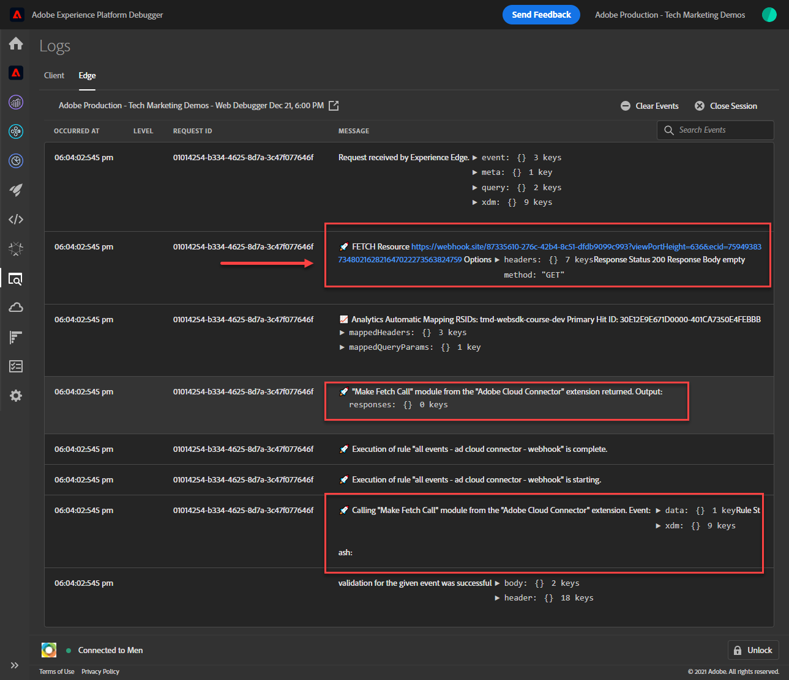

# Configuración de una propiedad de reenvío de eventos

Obtenga información sobre cómo utilizar la propiedad de reenvío de eventos mediante datos del SDK web de Experience Platform.

El reenvío de eventos es un nuevo tipo de propiedad disponible en la recopilación de datos. El reenvío de eventos le permite enviar datos a proveedores de terceros que no sean de Adobe directamente desde Adobe Experience Platform Edge Network, en lugar del explorador tradicional del lado del cliente. Descubra las ventajas del reenvío de eventos en la [Resumen del reenvío de eventos](https://experienceleague.adobe.com/docs/experience-platform/tags/event-forwarding/overview.html?lang=en).

Para utilizar el reenvío de eventos en Adobe Experience Platform, los datos deben enviarse primero a Adobe Experience Platform Edge Network mediante una o varias de las tres opciones siguientes:

* [SDK web de Adobe Experience Platform](overview.md)
* [SDK móvil de Adobe Experience Platform](https://developer.adobe.com/client-sdks/documentation/)
  <!--* [Server-to-Server API](https://experienceleague.adobe.com/docs/audience-manager/user-guide/api-and-sdk-code/dcs/dcs-apis/dcs-s2s.html?lang=en)-->

>[!NOTE]
>El SDK web de Platform y el SDK móvil de Platform no requieren implementación mediante etiquetas; sin embargo, se recomienda utilizar etiquetas para implementar estos SDK.

Después de completar las lecciones anteriores de este tutorial, debe enviar datos a Platform Edge Network mediante el SDK web. Una vez que los datos se encuentran en Platform Edge Network, puede habilitar el reenvío de eventos y utilizar una propiedad de reenvío de eventos para enviar datos a soluciones que no sean de Adobe.

## Objetivos de aprendizaje

Al final de esta lección, debe ser capaz de:

* Creación de una propiedad de reenvío de eventos
* Vinculación de una propiedad de reenvío de eventos a un conjunto de datos del SDK web de Platform
* Comprender las diferencias entre los elementos de datos de propiedades de etiquetas y las reglas y los elementos y reglas de datos de propiedades de reenvío de eventos
* Creación de un elemento de datos de reenvío de eventos
* Configuración de una regla de reenvío de eventos
* Validar que una propiedad de reenvío de eventos esté enviando datos correctamente

## Requisitos previos

* Licencia de software que incluye el reenvío de eventos. El reenvío de eventos es una función de pago de la recopilación de datos. Póngase en contacto con el equipo de su cuenta de Adobe para obtener más información.
* Reenvío de eventos activado en su organización de Experience Cloud.
* Permiso de usuario para el reenvío de eventos. (Entrada [Admin Console](https://adminconsole.adobe.com/), en el producto de Adobe Experience Platform Launch, elementos de permiso para[!UICONTROL Plataformas] > [!UICONTROL Edge] y todo [!UICONTROL Derechos de propiedad]). Una vez concedida, debería ver [!UICONTROL Reenvío de eventos] en la navegación izquierda de la interfaz de recopilación de datos:
  

* SDK web o móvil de Adobe Experience Platform configurado para enviar datos a Edge Network. Debe haber completado las siguientes lecciones de este tutorial:

   * Configuración inicial

      * [Configuración de un esquema XDM](configure-schemas.md)
      * [Configuración de un área de nombres de identidad](configure-identities.md)
      * [Configuración de una secuencia de datos](configure-datastream.md)

   * Configuración de etiquetas

      * [Instalar extensión de SDK web](install-web-sdk.md)
      * [Creación de elementos de datos](create-data-elements.md)
      * [Creación de identidades](create-identities.md)
      * [Creación de una regla de etiqueta](create-tag-rule.md)
      * [Validar con Adobe Experience Platform Debugger](validate-with-debugger.md)

## Creación de una propiedad de reenvío de eventos

Para empezar, cree una propiedad de reenvío de eventos:

1. Abra el [Interfaz de recopilación de datos](https://experience.adobe.com/#/data-collection)
1. Seleccionar **[!UICONTROL Reenvío de eventos]** desde la navegación izquierda
1. Seleccione **[!UICONTROL Nueva propiedad]**.
   

1. Asigne un nombre a la propiedad. En este caso `Server-Side - Web SDK Course`

1. Seleccione **[!UICONTROL Guardar]**.
   

## Configuración de la secuencia de datos

Para que el reenvío de eventos utilice los datos que envía a la red perimetral, debe vincular la propiedad de reenvío de eventos recién creada al mismo conjunto de datos utilizado para enviar datos a las soluciones de Adobe.

Para configurar Target en el conjunto de datos:

1. Ir a [Recopilación de datos](https://experience.adobe.com/#/data-collection){target="blank"} interfaz
1. En el panel de navegación izquierdo, seleccione **[!UICONTROL Datastreams]**
1. Seleccione el creado anteriormente `Luma Web SDK: Development Environment` secuencia de datos

   

1. Seleccionar **[!UICONTROL Añadir servicio]**
   
1. Seleccionar **[!UICONTROL Reenvío de eventos]** como el **[!UICONTROL Servicio]**

1. En el **[!UICONTROL ID de propiedad]** , seleccione el nombre que dio a su propiedad de reenvío de eventos, en este caso `Server-Side - Web SDK Course`

1. En el **[!UICONTROL ID de entorno]** , seleccione el entorno de etiquetas al que está vinculando el entorno de reenvío de eventos, en este caso `Development`

   >[!TIP]
   >
   >    Para enviar datos a un entorno fuera de la organización de Adobe, seleccione **[!UICONTROL Introducir ID manualmente]** y pegar en un ID. El ID se proporciona al crear una propiedad de reenvío de eventos.

1. Seleccione **[!UICONTROL Guardar]**.

   

Repita estos pasos para los flujos de datos de ensayo y producción cuando esté listo para promocionar los cambios a través del flujo de publicación.

## Reenviar datos de Platform Edge Network a una solución que no sea de Adobe

En este ejercicio aprenderá a configurar un elemento de datos de reenvío de eventos, configurar una regla de reenvío de eventos y validar mediante una herramienta de terceros llamada [Webhook.site](https://webhook.site/).

>[!NOTE]
>
>Un webhook es una forma de integrar diferentes sistemas en tiempo semirreal. [Webhook.site](https://webhook.site/) es una herramienta de terceros que le permite inspeccionar, probar y automatizar fácilmente (con el generador de acciones personalizadas visual o WebhookScript) cualquier solicitud HTTP o correo electrónico entrante.

>[!IMPORTANT]
>
>Ya debe haber creado y asignado elementos de datos a un objeto XDM, así como haber configurado reglas de etiquetas y haber creado esos cambios dentro de una biblioteca en un entorno de etiquetas para continuar. Si no lo ha hecho, consulte la **Configuración de etiquetas** pasos en la [requisitos previos](setup-event-forwarding.md#prerequisites) sección. Estos pasos garantizan el envío de datos a Platform Edge Network y, desde allí, se puede configurar una propiedad de reenvío de eventos para reenviar datos a una solución que no sea de Adobe.

### Creación de un elemento de datos de reenvío de eventos

El objeto XDM configurado anteriormente con la extensión de etiqueta del SDK web de Platform se convierte en la fuente de datos para los elementos de datos en una propiedad de reenvío de eventos. Los mismos datos que ya se han configurado en la propiedad de etiquetas se utilizan como fuente de datos para el reenvío de eventos.

>[!IMPORTANT]
>
>Hay una diferencia de sintaxis clave al hacer referencia a campos XDM en el reenvío de eventos en comparación con otros contextos. Para hacer referencia a datos en una propiedad de reenvío de eventos, la ruta del elemento de datos debe incluir el `arc.event` prefijo:
>
> * `arc` significa contexto de respuesta de Adobe.
> * Por ejemplo: `arc.event.xdm.web.webPageDetails.URL`
>
>Si esta ruta de acceso no se especifica correctamente, no se recopilarán datos.

En este ejercicio, reenviará la altura de la ventanilla del explorador y el ID del Experience Cloud del objeto XDM a un webhook. La ruta del campo XDM está determinada por el esquema XDM creado durante la [Configuración de un esquema XDM](configure-schemas.md) lección.

>[!TIP]
>
>También puede encontrar la ruta del objeto XDM utilizando las herramientas de red del explorador web, filtrando por `/ee` solicitudes, abrir la señalización [!UICONTROL **Carga útil**] y profundizando en la variable que está buscando. A continuación, haga clic con el botón derecho del ratón y seleccione &quot;Copiar ruta de propiedad&quot;. Este es un ejemplo de la altura de la ventanilla del explorador:
> 

1. Vaya a la **[!UICONTROL Reenvío de eventos]** propiedad creada recientemente

1. En el panel de navegación izquierdo, seleccione **[!UICONTROL Elementos de datos]**

1. Seleccionar para **[!UICONTROL Crear nuevo elemento de datos]**

   

1. **[!UICONTROL Nombre]** el elemento de datos `environment.browserDetails.viewportHeight`

1. En **[!UICONTROL Extensión]**, dejar `CORE`

1. En **[!UICONTROL Tipo de elemento de datos]**, seleccione `Path`

1. Escriba la ruta del objeto XDM que contiene la altura de la ventanilla del explorador `arc.event.xdm.environment.browserDetails.viewportHeight`

1. Seleccionar **[!UICONTROL Guardar]**

   

1. Crear otro elemento de datos

1. **[!UICONTROL Nombre]** it `ecid`

1. En **[!UICONTROL Extensión]**, dejar `CORE`

1. En **[!UICONTROL Tipo de elemento de datos]**, seleccione `Path`

1. Escriba la ruta del objeto XDM que contiene el ID del Experience Cloud `arc.event.xdm.identityMap.ECID.0.id`

1. Seleccionar **[!UICONTROL Guardar]**

   

   >[!CAUTION]
   >
   > Asegúrese de incluir el `arc.event.` prefijo en la ruta. Además, asegúrese de seguir exactamente las mayúsculas y minúsculas como el nombre del campo Objeto XDM; el área de nombres ECID debe estar en mayúsculas.

   >[!TIP]
   >
   Al trabajar con su propio sitio web, puede encontrar la ruta del objeto XDM con las herramientas de red del explorador web, filtrando por `/ee` solicitudes, abrir la señalización [!UICONTROL **Carga útil**] y profundizando en la variable que está buscando. A continuación, haga clic con el botón derecho del ratón y seleccione &quot;Copiar ruta de propiedad&quot;. Este es un ejemplo de la altura de la ventanilla del explorador:
   

### Instalación de la extensión de conector de Adobe Cloud

Para enviar datos a ubicaciones de terceros, primero debe instalar el [!UICONTROL Conector de Adobe Cloud] extensión.

1. Seleccionar **[!UICONTROL Extensiones]** en el panel de navegación izquierdo

1. Seleccione el **[!UICONTROL Catálogo]** pestaña

1. Busque la variable **[!UICONTROL Conector de Adobe Cloud]**, seleccione **[!UICONTROL Instalar]**

   

No se necesita ninguna configuración de extensión. Con esta extensión, ahora puede reenviar datos a una solución que no sea de Adobe.

### Creación de una regla de reenvío de eventos

Existen algunas diferencias principales entre la configuración de reglas en una propiedad de etiqueta y una regla en una propiedad de reenvío de eventos:

* **[!UICONTROL Eventos] &amp; [!UICONTROL Condiciones]**:

   * **Etiquetas**: todas las reglas se activan mediante un Evento que debe especificarse en la regla, por ejemplo, `Library Loaded - Page Top`. Las condiciones son opcionales.
   * **Reenvío de eventos**: Se da por hecho que cada evento enviado a Platform Edge Network es un déclencheur para reenviar datos. Por lo tanto, no hay [!UICONTROL Eventos] que se deben seleccionar en las reglas de reenvío de eventos. Para administrar qué eventos almacenan en déclencheur una regla de reenvío de eventos, debe configurar las condiciones.

* **Tokenización de elemento de datos**:

   * **Etiquetas**: Los nombres de los elementos de datos se identifican mediante token con un `%` al principio y al final del nombre del elemento de datos cuando se utiliza en una regla. Por ejemplo, `%viewportHeight%`.

   * **Reenvío de eventos**: los nombres de los elementos de datos llevan un token `{{` al principio y `}}` al final del nombre del elemento de datos cuando se utiliza en una regla. Por ejemplo, `{{viewportHeight}}`.

* **Secuencia de acciones de regla**:

   * La sección Acciones de una regla de reenvío de eventos siempre se ejecuta secuencialmente. Asegúrese de que el orden de las acciones es correcto al guardar una regla. Esta secuencia de ejecución no se puede ejecutar de forma asíncrona como con las etiquetas.

<!--
  * **Tags**: Rule actions can easily be reordered using drag-and-drop functionality.
  * **Event forwarding**: Rule actions are always executed sequentially. Make sure the order of actions is correct when you save a rule.
-->

Para configurar una regla para reenviar datos a su webhook, primero debe obtener su webhook personal:

1. Ir a [Webhook.site](https://webhook.site)

1. Buscar **Su URL única**, lo utilizará como solicitud de URL en la regla del reenvío de eventos

1. Seleccionar **[!UICONTROL Copiar al portapapeles]**

1. Deje esta ventana abierta, ya que podrá validar los datos del reenvío de eventos en tiempo real que captura Webhook

   

1. Volver atrás **[!UICONTROL Recopilación de datos]** > **[!UICONTROL Reenvío de eventos]** > **[!UICONTROL Reglas]** desde la navegación izquierda

1. Seleccionar **[!UICONTROL Crear nueva regla]**

   

1. Asígnele un nombre `all events - ad cloud connector - webhook`

1. Añadir una acción

1. En **[!UICONTROL Extensión]**, seleccione **[!UICONTROL Conector de Adobe Cloud]**

1. En **[!UICONTROL Tipo de acción]**, seleccione **[!UICONTROL Hacer llamada de recuperación]**

1. Pegue la dirección URL del webhook en **[!UICONTROL URL]** campo

   

1. En **[Parámetros de consulta]**, agregará ambos elementos de datos creados anteriormente.

1. En el **[!UICONTROL Clave]** tipo de columna en `viewPortHeight`. En el **[!UICONTROL Valor]** , introduzca la columna `{{environment.browserDetails.viewportHeight}}` elemento de datos escribiéndolo o seleccionándolo en el icono del selector de elementos de datos

1. Seleccionar [!UICONTROL **+ Agregar otro**] para agregar otro parámetro de consulta

1. En el **[!UICONTROL Clave]** tipo de columna en `ecid`. En la columna Value, introduzca la variable `{{ecid}}` elemento de datos

1. Seleccionar **[!UICONTROL Conservar cambios]**

   

1. La regla debe ser similar a la siguiente

1. Seleccionar **[!UICONTROL Guardar]**

   

### Crear y crear la biblioteca

Cree una biblioteca y todos los cambios en el entorno de desarrollo del reenvío de eventos como lo haría normalmente en una propiedad de etiquetas.

>[!NOTE]
>
Si no ha vinculado las propiedades de reenvío de eventos de ensayo y producción a su conjunto de datos, verá el entorno de desarrollo como la única opción para crear una biblioteca en.

## Validar regla de reenvío de eventos

Ahora puede validar la propiedad de reenvío de eventos mediante Platform Debugger y Webhook.site:

1. Siga los pasos para [cambiar la biblioteca de etiquetas](validate-with-debugger.md#use-the-experience-platform-debugger-to-map-to-your-tag-property) en el [Sitio de demostración de Luma](https://luma.enablementadobe.com/content/luma/us/en/men.html) a la propiedad de etiquetas del SDK web a la que asignó la propiedad de reenvío de eventos en el conjunto de datos.

1. Antes de volver a cargar la página, abra en Experience Platform Debugger. **[!UICONTROL Registros]** desde la navegación izquierda

1. Seleccione el **[!UICONTROL Edge]** pestaña, luego seleccione **[!UICONTROL Connect]** para ver las solicitudes de Platform Edge Network

   

1. Volver a cargar la página

1. Verá solicitudes adicionales que le proporcionan visibilidad de las solicitudes del lado del servidor que envía Platform Edge Network al WebHook

1. La solicitud en la que se debe centrar la validación es la que muestra la dirección URL completamente construida que envía la red de Edge

   

1. Observe los parámetros de cadena de consulta viewPortHeight y ecid

   

1. Coinciden con los datos que se ven en el objeto XDM

   

1. Por último, valide las coincidencias de datos en [Webhook.site](https://webhook.site) así como al ver su ventana de webhook abierta

   

¡Felicidades! Ha configurado el reenvío de eventos.

[Siguiente: ](conclusion.md)

>[!NOTE]
>
Gracias por dedicar su tiempo a conocer el SDK web de Adobe Experience Platform. Si tiene preguntas, desea compartir comentarios generales o tiene sugerencias sobre contenido futuro, compártalas en este [Entrada de discusión de la comunidad Experience League](https://experienceleaguecommunities.adobe.com/t5/adobe-experience-platform-launch/tutorial-discussion-implement-adobe-experience-cloud-with-web/td-p/444996)