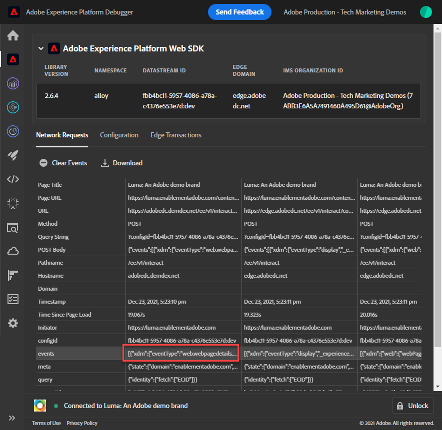
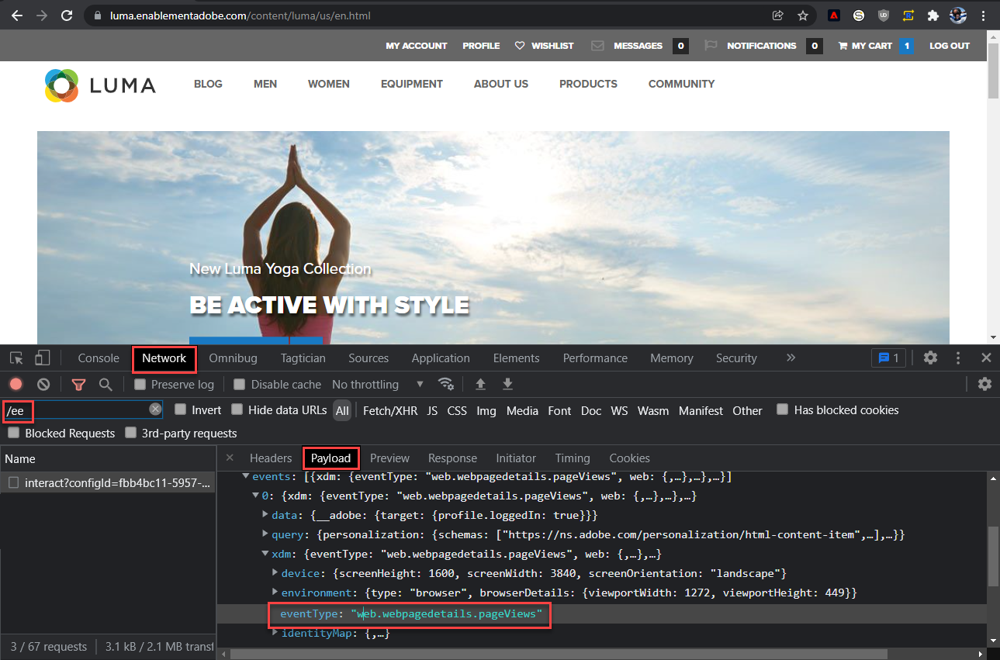

# Validación de implementaciones de SDK web con Experience Platform Debugger

Obtenga información sobre cómo validar la implementación del SDK web de Platform con Adobe Experience Platform Debugger.

Experience Platform Debugger es una extensión disponible para los navegadores Chrome y Firefox que permite ver la tecnología de Adobe implementada en las páginas web. Descargue la versión para su navegador preferido:

* [Extensión de Firefox](https://addons.mozilla.org/es/firefox/addon/adobe-experience-platform-dbg/)
* [Extensión de Chrome](https://chrome.google.com/webstore/detail/adobe-experience-platform/bfnnokhpnncpkdmbokanobigaccjkpob)

Si nunca antes ha utilizado Debugger (y este es diferente del antiguo Adobe Experience Cloud Debugger), puede que desee ver este vídeo de información general de cinco minutos:

>[!VIDEO](https://video.tv.adobe.com/v/32156?learn=on)

En esta lección, debe usar el [extensión de Adobe Experience Platform Debugger](https://chromewebstore.google.com/detail/adobe-experience-platform/bfnnokhpnncpkdmbokanobigaccjkpob) para reemplazar la propiedad de etiqueta codificada en la variable [Sitio de demostración de Luma](https://luma.enablementadobe.com/content/luma/us/en.html) con su propia propiedad.

Esta técnica se denomina cambio de entorno y será útil más adelante, cuando trabaje con etiquetas en su propio sitio web. Puede cargar el sitio web de producción en su explorador, pero con su *desarrollo* entorno de etiquetas. Esta capacidad permite realizar y validar cambios de etiquetas con seguridad en de forma independiente de las revisiones de código normales. Después de todo, esta separación de las versiones de etiquetas de marketing de las versiones de código normal es una de las principales razones por las que los clientes utilizan etiquetas.

## Objetivos de aprendizaje

Al final de esta lección, podrá utilizar Debugger para lo siguiente:

* Cargar una biblioteca de etiquetas alternativa
* Valide que el objeto XDM capture y envíe datos como se espera de Edge Network

## Requisitos previos

Está familiarizado con las etiquetas de recopilación de datos y las [Sitio de demostración de Luma](https://luma.enablementadobe.com/content/luma/us/en.html){target="_blank"} y haya completado las siguientes lecciones anteriores en el tutorial:

* [Configure los permisos](configure-permissions.md)
* [Configuración de un esquema XDM](configure-schemas.md)
* [Configuración de un área de nombres de identidad](configure-identities.md)
* [Configuración de una secuencia de datos](configure-datastream.md)
* [Extensión del SDK web instalada en la propiedad de etiqueta](install-web-sdk.md)
* [Creación de elementos de datos](create-data-elements.md)
* [Creación de una regla de etiqueta](create-tag-rule.md)

## Carga de bibliotecas de etiquetas alternativas con Debugger

Este tutorial utiliza una versión alojada públicamente de [Sitio web de demostración de Luma](https://luma.enablementadobe.com/content/luma/us/en.html). Abra la página principal y márquela como favorito.

Experience Platform Debugger tiene una característica interesante que le permite reemplazar una biblioteca de etiquetas existente por otra diferente. Esta técnica es útil para la validación y nos permite omitir muchos pasos de implementación en este tutorial.

1. Asegúrese de tener el sitio de Luma abierto y seleccionar el icono de extensión de Experience Platform Debugger.
1. Debugger se abrirá y mostrará algunos detalles de la implementación codificada, que no están relacionados con este tutorial (puede que tenga que volver a cargar el sitio de Luma después de abrir Debugger).
1. Confirme que Debugger es &quot;**[!UICONTROL Conectado a Luma]**&quot; como se muestra a continuación y, a continuación, seleccione el &quot;**[!UICONTROL bloquear]**&quot; para bloquear Debugger en el sitio de Luma.
1. Seleccione el **[!UICONTROL Iniciar sesión]** e inicie sesión en Adobe Experience Cloud con su ID de Adobe.
1. Ahora, vaya a **[!UICONTROL Etiquetas de Experience Platform]** en el panel de navegación izquierdo

   

1. Seleccione el **[!UICONTROL Configuración]** pestaña
1. A la derecha de donde muestra el **[!UICONTROL Códigos incrustados de página]**, abra el **[!UICONTROL Acciones]** y seleccione. **[!UICONTROL Reemplazar]**

   

1. Dado que se ha autenticado, Debugger va a extraer las propiedades y entornos de etiquetas disponibles. Seleccione su `Web SDK Course` propiedad
1. Seleccione su `Development` entorno
1. Seleccione el **[!UICONTROL Aplicar]** botón

   

1. El sitio web de Luma se volverá a cargar _con la propiedad de etiquetas_.

   

A medida que continúe con el tutorial, utilizará esta técnica de asignación del sitio de Luma a su propia propiedad de etiquetas para validar la implementación del SDK web de Platform. Cuando empiece a utilizar etiquetas en el sitio web de producción, puede utilizar esta misma técnica para validar los cambios.

## Valide la implementación en Experience Platform Debugger.

Puede utilizar Debugger para validar la implementación del SDK web de Platform y ver los datos enviados a Platform Edge Network:

1. Ir a **[!UICONTROL Resumen]** en el panel de navegación izquierdo, para ver los detalles de la propiedad de etiquetas

   

1. Ahora, vaya a **[!UICONTROL SDK web de Experience Platform]** en el panel de navegación izquierdo para ver la **[!UICONTROL Solicitudes de red]**
1. Abra el **[!UICONTROL eventos]** fila (no se preocupe si esta captura de pantalla muestra más solicitudes que la suya, incluye solicitudes de futuras lecciones y puede ignorarlas por ahora)

   

1. Observe cómo podemos ver el `web.webpagedetails.pageView` tipo de evento especificado en nuestra [!UICONTROL Enviar evento] acción y otras variables listas para usar que se ajustan a la variable `AEP Web SDK ExperienceEvent Mixin` formato

   

1. Desplácese hacia abajo hasta el `web` objeto, seleccione para abrirlo e inspeccionar el `webPageDetails.name`, `webPageDetails.server`, y `webPageDetails.siteSection`. Deben coincidir con las variables de la capa de datos digital correspondiente en la página de inicio

   

También puede validar los detalles del mapa de identidad:

1. Inicie sesión en el sitio de Luma con las credenciales `test@adobe.com`/`test`

1. Vuelva a la [página principal de Luma](https://luma.enablementadobe.com/content/luma/us/en.html)

1. Abra el **[!UICONTROL SDK web de Experience Platform]** en el panel de navegación izquierdo

   

1. Seleccione el **[!UICONTROL eventos]** fila para abrir los detalles en una ventana emergente

   

1. Busque la variable **identityMap** en la ventana emergente. Aquí debería ver `lumaCrmId` con tres claves authenticatedState, id y primary:
   

## Validar con las herramientas de desarrollo del explorador

Estos tipos de detalles de solicitud también están visibles en las herramientas para desarrolladores web del explorador **Red** (suponiendo que el sitio web esté cargando la biblioteca de etiquetas).

1. Abra las herramientas para desarrolladores web del explorador **Red** y vuelva a cargar la página. Filtrar por llamadas con `/ee` para localizar la llamada, selecciónela y, a continuación, busque en **Encabezados** pestaña, y **Carga útil** pestaña

   

1. Vaya a la **Respuesta** y observe cómo se incluye el valor de ECID en la respuesta. Copie este valor tal como lo utilizará para validar la información de perfil en el siguiente ejercicio

   

   >[!NOTE]
   >
   >    Es posible que no vea la misma cantidad de solicitudes de carga útil que en la captura de pantalla anterior. Esta disparidad se debe a que las lecciones futuras para [configuración de Target](setup-target.md) se completaron en el momento de la captura de pantalla que se está realizando. Puede ignorar esta diferencia por ahora.

Ahora que un objeto XDM se activa en una página y con los conocimientos necesarios para validar la recopilación de datos, ya puede configurar las aplicaciones de Adobe individuales mediante el SDK web de Platform.

[Siguiente: ](setup-experience-platform.md)

>[!NOTE]
>
>Gracias por dedicar su tiempo a conocer el SDK web de Adobe Experience Platform. Si tiene preguntas, desea compartir comentarios generales o tiene sugerencias sobre contenido futuro, compártalas en este [Entrada de discusión de la comunidad Experience League](https://experienceleaguecommunities.adobe.com/t5/adobe-experience-platform-launch/tutorial-discussion-implement-adobe-experience-cloud-with-web/td-p/444996)
