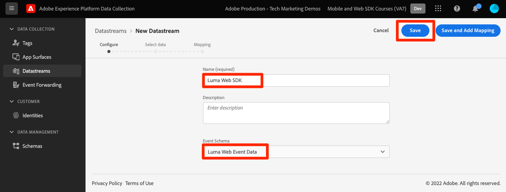

# Configurar un conjunto de datos

Obtenga información sobre cómo habilitar un conjunto de datos y configurar soluciones de Experience Cloud.

Los conjuntos de datos indican a Adobe Experience Platform Edge Network dónde enviar los datos recopilados por Platform Web SDK. En la configuración de conjuntos de datos, se habilitan las aplicaciones de Experience Cloud, la cuenta de Experience Platform y el reenvío de eventos. Consulte la [Aspectos básicos de la configuración de un conjunto de datos](https://experienceleague.adobe.com/docs/experience-platform/edge/fundamentals/datastreams.html?lang=en) para obtener información más detallada.

## Objetivos de aprendizaje

Al final de esta lección, debe poder:

* Crear un flujo de datos
* Habilitar las aplicaciones de Experience Cloud
* Habilitar Experience Platform

## Requisitos previos

Antes de configurar el conjunto de datos, ya debe haber completado las siguientes lecciones:

* [Configure los permisos](configure-permissions.md)
* [Configuración de un esquema](configure-schemas.md)
* [Configuración de un área de nombres de identidad](configure-identities.md)

## Crear un flujo de datos

Ahora puede crear un conjunto de datos para indicar a Platform Edge Network dónde enviar los datos recopilados por el SDK web.

**Para crear un conjunto de datos:**

1. Abra el [Interfaz de recopilación de datos](https://launch.adobe.com/){target=&quot;_blank&quot;}
1. Asegúrese de que está en el simulador de pruebas correcto

   >[!NOTE]
   >
   >Si es cliente de una aplicación basada en Platform como CDP en tiempo real, recomendamos utilizar un entorno limitado de desarrollo para este tutorial. Si no lo está, use el **[!UICONTROL Prod]** simulador de pruebas.

1. Vaya a **[!UICONTROL Datastreams]** en la navegación izquierda
1. Select **[!UICONTROL Nuevo conjunto de datos]** a la derecha de la pantalla.
1. Escriba `Luma Web SDK` como **[!UICONTROL nombre]**. Se hace referencia a este nombre más adelante cuando se configura la extensión del SDK web en la propiedad tag .
1. Seleccione su `Luma Web Event Data` como el **[!UICONTROL Esquema de evento]**
1. Seleccione **[!UICONTROL Guardar]**

   

   >[!AVAILABILITY]
   >
   >La función de asignación se incorporará a este tutorial en una fecha posterior.

En la siguiente pantalla, puede añadir servicios como aplicaciones de Adobe al conjunto de datos, pero no agregará ningún servicio en este punto del tutorial. Lo hará más adelante en las lecciones [Configuración del Experience Platform](setup-experience-platform.md), [Configuración de Analytics](setup-analytics.md), [Configuración del Audience Manager](setup-audience-manager.md), [Configuración de Target](setup-target.md)o [Reenvío de eventos](setup-event-forwarding.md).

>[!NOTE]
>
>Al implementar el SDK web de Platform en su propio sitio web, debe crear tres conjuntos de datos para asignarlos a los tres entornos de etiquetas (desarrollo, fase y producción). Si utiliza el SDK web de la plataforma con aplicaciones basadas en la plataforma, como Adobe Real-time Customer Data Platform o Adobe Journey Optimizer, debe asegurarse de crear esos conjuntos de datos en los entornos limitados de la plataforma correspondientes.

Ya está listo para instalar la extensión web SDK de Platform en su propiedad tag .

[Siguiente: ](install-web-sdk.md)

>[!NOTE]
>
>Gracias por invertir su tiempo en obtener información sobre el SDK web de Adobe Experience Platform. Si tiene alguna pregunta, desea compartir comentarios generales o tiene sugerencias sobre contenido futuro, compártalas en este [Experience League de debate de la comunidad](https://experienceleaguecommunities.adobe.com/t5/adobe-experience-platform-launch/tutorial-discussion-implement-adobe-experience-cloud-with-web/td-p/444996)
