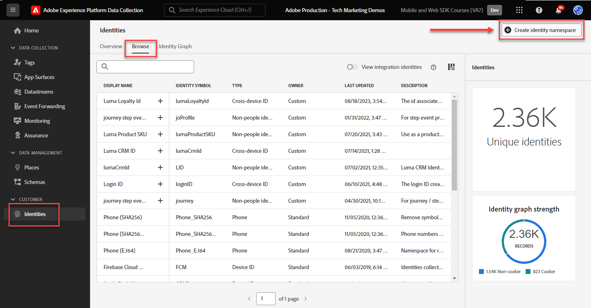

# Configuración de un área de nombres de identidad

Obtenga información sobre cómo configurar espacios de nombres de identidad para utilizarlos con el SDK web de Adobe Experience Platform.

El [servicio de identidad de Adobe Experience Cloud](https://experienceleague.adobe.com/es/docs/id-service/using/home) establece un ID de visitante común (el ECID) en todas las aplicaciones de Adobe basadas en SDK para potenciar las funciones de Experience Cloud, como el uso compartido de audiencias entre aplicaciones. También puede enviar sus propios ID de cliente al servicio para permitir integraciones y segmentaciones en todos los dispositivos con otros sistemas, como el sistema de administración de la relación con los clientes (CRM).

El [servicio de identidad de Adobe Experience Platform](https://experienceleague.adobe.com/es/docs/experience-platform/identity/home) (sí, hay dos) usa los ECID y los ID de cliente para generar gráficos de identidad, lo que le permite combinar atributos y comportamientos en los perfiles de cliente en tiempo real.

>[!NOTE]
>
>Un área de nombres de identidad personalizada es _no se requiere_ para implementar Adobe Analytics, Adobe Target o Adobe Audience Manager con Web SDK (las identidades autenticadas se pueden pasar en el objeto `data` en lugar del objeto `xdm`, como verá más adelante). Las áreas de nombres de identidad son necesarias para aplicaciones nativas de Platform como Journey Optimizer, Real-Time Customer Data Platform y Customer Journey Analytics. Aunque puede decidir no utilizar un área de nombres de identidad en su propia implementación, se espera que lo haga como parte de este tutorial.

>[!NOTE]
>
> Para fines de demostración, los ejercicios de esta lección le permiten capturar los detalles de identidad de un cliente ficticio que inició sesión en el [sitio de demostración de Luma](https://luma.enablementadobe.com/content/luma/us/en.html) con las credenciales **usuario: `test@adobe.com` / contraseña: test**.

## Objetivos de aprendizaje

Al final de esta lección, debe poder:

* Comprender las áreas de nombres de identidad
* Cree un área de nombres de identidad personalizada para capturar un ID de CRM interno

## Requisitos previos

Ya debe haber completado las lecciones anteriores:

* [Configuración de esquemas](configure-schemas.md)

>[!IMPORTANT]
>
>La [extensión de Experience Cloud ID](https://exchange.adobe.com/apps/ec/100160/adobe-experience-cloud-id-launch-extension) no es necesaria al implementar Adobe Experience Platform Web SDK, ya que la biblioteca de Web SDK JavaScript contiene la funcionalidad del servicio de ID de visitante.
>
> Si su sitio web ya está utilizando el servicio de Experience Cloud ID en su sitio web (a través de la API de visitante o la extensión de etiqueta del servicio de Experience Cloud ID) y desea seguir utilizándolo durante la migración a Adobe Experience Platform Web SDK, debe utilizar la versión más reciente de la API de visitante o la extensión de etiqueta del servicio de Experience Cloud ID. Consulte [Migración de ID](https://experienceleague.adobe.com/es/docs/experience-platform/edge/identity/overview) para obtener más información.

## Crear un área de nombres de identidad

En este ejercicio, crea un área de nombres de identidad para el campo de identidad personalizado de Luma, `lumaCrmId`. Las áreas de nombres de identidad desempeñan un papel esencial en la creación de perfiles de clientes en tiempo real, ya que dos valores coincidentes en la misma área de nombres permiten que dos fuentes de datos formen un gráfico de identidad.

Antes de comenzar los ejercicios, vea este breve vídeo para obtener más información sobre la identidad en Adobe Experience Platform:

>[!VIDEO](https://video.tv.adobe.com/v/3422777?learn=on&enablevpops&captions=spa)

Ahora, cree un área de nombres para el ID de Luma CRM:

1. Abrir la [interfaz de recopilación de datos](https://experience.adobe.com/data-collection/){target="_blank"}
1. Seleccione la zona protegida que está utilizando para el tutorial.

   >[!NOTE]
   >
   >Si es cliente de una aplicación basada en Platform como Real-Time CDP o Journey Optimizer, le recomendamos que utilice una zona protegida de desarrollo para este tutorial. Si no lo está, use la zona protegida **[!UICONTROL Prod]**.

1. Seleccione **[!UICONTROL Identidades]** en el panel de navegación izquierdo
1. Seleccionar **[!UICONTROL Examinar]**

   Aparece una lista de áreas de nombres de identidad en la interfaz principal de la página, con sus nombres, símbolos de identidad, fecha de última actualización y si son áreas de nombres estándar o personalizadas. El carril derecho contiene información sobre [!UICONTROL intensidad del gráfico de identidad].

1. Seleccione **[!UICONTROL Crear área de nombres de identidad]**

   

1. Proporcione los siguientes detalles y seleccione **[!UICONTROL Crear]**.

   | Campo | Valor |
   |---------------|-----------|
   | Nombre para mostrar | ID de Luma CRM |
   | Símbolo de identidad | lumaCrmId |
   | Tipo | ID individual entre dispositivos |

   

   El área de nombres de identidad se rellena en la pantalla **[!UICONTROL Identidades]**.

   

>[!NOTE]
>
> En la lección [Crear identidades](create-identities.md), aprenderá a utilizar este área de nombres al enviar identidades a Platform Edge Network.

Ahora que las identidades están configuradas, se puede configurar el conjunto de datos.

[Siguiente: ](configure-datastream.md)

>[!NOTE]
>
>Gracias por dedicar su tiempo a conocer Adobe Experience Platform Web SDK. Si tiene preguntas, desea compartir comentarios generales o tiene sugerencias sobre contenido futuro, compártalas en esta [publicación de debate de la comunidad de Experience League](https://experienceleaguecommunities.adobe.com/t5/adobe-experience-platform-data/tutorial-discussion-implement-adobe-experience-cloud-with-web/td-p/444996?profile.language=es)
