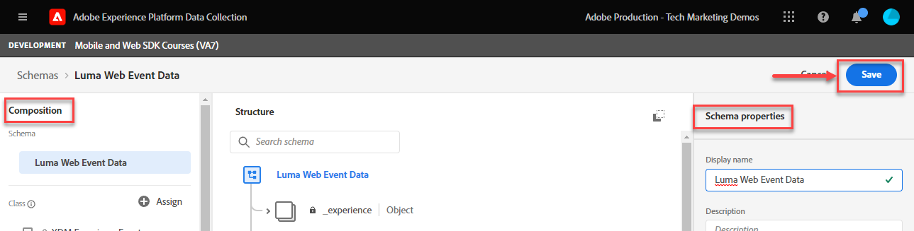

# Creación de un esquema XDM para datos web

>[!CAUTION]
>
>Esperamos publicar cambios importantes en este tutorial el viernes 15 de marzo de 2024. Después de ese punto, muchos ejercicios cambiarán y es posible que tenga que reiniciar el tutorial desde el principio para completar todas las lecciones.

Obtenga información sobre cómo crear un esquema XDM para datos web en la interfaz de recopilación de datos.

Los esquemas del Modelo de datos de experiencia (XDM) son los componentes básicos, los principios y las prácticas recomendadas para componer esquemas en Adobe Experience Platform.

El SDK web de Platform utiliza su esquema para estandarizar los datos de evento web, enviarlos a Platform Edge Network y, finalmente, reenviar los datos a cualquier aplicación Experience Cloud configurada en el conjunto de datos. Este paso es fundamental, ya que define un modelo de datos estándar necesario para la ingesta de datos de experiencia del cliente en Experience Platform y permite la prestación de servicios y aplicaciones descendentes basados en estos estándares.

>[!NOTE]
>
> Con fines de demostración, los ejercicios de esta lección crean un esquema de ejemplo para capturar el contenido visualizado y los productos comprados por los clientes en [Sitio de demostración de Luma](https://luma.enablementadobe.com/content/luma/us/en.html). Aunque puede utilizar estos pasos para crear un esquema diferente para sus propios fines, se recomienda seguir primero junto con la creación del esquema de ejemplo para conocer las capacidades del editor de esquemas.

Para obtener más información sobre los esquemas XDM, siga el curso &quot;[Modelar los datos de la experiencia del cliente con XDM](https://experienceleague.adobe.com/?recommended=ExperiencePlatform-D-1-2021.1.xdm&amp;lang=es)&quot; o consulte la [Información general del sistema XDM](https://experienceleague.adobe.com/docs/experience-platform/xdm/home.html?lang=es).

## Objetivos de aprendizaje

Al final de esta lección, debe poder:

* Creación de un esquema XDM desde la interfaz de recopilación de datos
* Adición de grupos de campos al esquema XDM
* Creación de esquemas XDM para datos de eventos web mediante prácticas recomendadas

## Requisitos previos

Todos los permisos de usuario y aprovisionamiento necesarios para la recopilación de datos y Adobe Experience Platform se describen en la [Configuración de permisos](configure-permissions.md) lección.

## Creación de un esquema XDM

Los esquemas XDM son la forma estándar de describir los datos en Experience Platform, lo que permite reutilizar todos los datos que se ajustan a los esquemas en una organización sin conflictos o incluso compartirlos entre varias organizaciones. Para obtener más información, consulte la [conceptos básicos de composición de esquemas](https://experienceleague.adobe.com/docs/experience-platform/xdm/schema/composition.html?lang=es).

En este ejercicio, creará un esquema XDM utilizando los grupos de campos de línea de base recomendados para capturar datos de evento web en el [Sitio de demostración de Luma](https://luma.enablementadobe.com/content/luma/us/en.html){target="_blank"}:

1. Abra el [Interfaz de recopilación de datos](https://launch.adobe.com/){target="_blank"}
1. Asegúrese de que está en la zona protegida correcta

   >[!NOTE]
   >
   >Si es cliente de una aplicación basada en Platform como Real-Time CDP, le recomendamos que utilice una zona protegida de desarrollo para este tutorial. Si no lo está, use el **[!UICONTROL Prod]** zona protegida.

1. Ir a **[!UICONTROL Esquemas]** en el panel de navegación izquierdo
1. Seleccione el **[!UICONTROL Crear esquema]** botón en la parte superior derecha
1. En el menú desplegable, seleccione **[!UICONTROL ExperienceEvent de XDM]**

## Adición de grupos de campos

Como se ha indicado anteriormente, XDM es el marco principal que estandariza los datos de experiencia del cliente al proporcionar estructuras y definiciones comunes para su uso en servicios de Adobe Experience Platform descendentes. Al cumplir con los estándares XDM, _todos los datos de experiencia del cliente_ pueden incorporarse en una representación común. Este método le permite obtener información valiosa de las acciones de los clientes, definir las audiencias de los clientes mediante segmentos y expresar los atributos del cliente con fines de personalización mediante datos de varias fuentes. Consulte [Prácticas recomendadas para el modelado de datos](https://experienceleague.adobe.com/docs/experience-platform/xdm/schema/best-practices.html?lang=en) para obtener más información.

Cuando sea posible, se recomienda utilizar grupos de campos existentes y adherirse a un modelo independiente del producto y a las convenciones de nomenclatura. Puede crear un grupo de campos personalizado para cualquier dato específico de su organización que no se ajuste a los grupos de campos predefinidos anteriores. Consulte [Creación de un esquema con el Editor de esquemas](https://experienceleague.adobe.com/docs/experience-platform/xdm/tutorials/create-schema-ui.html?lang=en#create) para ver pasos más detallados sobre esquemas personalizados.

>[!TIP]
> 
>En este ejercicio, se agregan los grupos de campos predefinidos recomendados para la recopilación de datos web: _**[!UICONTROL ExperienceEvent del SDK web de AEP]**_, y _**[!UICONTROL Evento de experiencia del consumidor]**_.

1. En el **[!UICONTROL Grupos de campos]** , seleccione **[!UICONTROL Añadir]**
1. Buscar por [!UICONTROL `AEP Web SDK ExperienceEvent`]
1. Marque la casilla
1. Buscar por [!UICONTROL `Consumer Experience Event`]
1. Marque la casilla
1. Seleccionar **[!UICONTROL Adición de grupos de campos]**

   

Con los grupos de campos seleccionados, está listo para asignar un nombre al esquema. Una convención de nombres común para los esquemas XDM es asignar un nombre al esquema después del origen de los datos:

1. En el **[!UICONTROL Composición**] , seleccione el `Untitled schema name`
1. En el **[!UICONTROL Propiedades del esquema]** , introduzca la variable **[!UICONTROL Nombre para mostrar]** `Luma Web Event Data`
1. Seleccione cualquier elemento fuera de **[!UICONTROL Nombre para mostrar]** para activar el **[!UICONTROL Guardar]** opción
1. Seleccionar **[!UICONTROL Guardar]**

Con ambos grupos de campos, observe que tiene acceso a los pares de clave-valor más utilizados y necesarios para la recopilación de datos en la web. El [!UICONTROL nombre para mostrar] Cada uno de los campos aparece a los especialistas en marketing en la interfaz del generador de segmentos de las aplicaciones basadas en Platform y puede cambiar el nombre para mostrar de los campos estándar para adaptarlos a sus necesidades. También puede quitar los campos que no desee. Al hacer clic en cualquier nombre de grupo de campos, la interfaz resalta qué agrupaciones de pares clave-valor pertenecen a él. En el siguiente ejemplo, verá a qué grupos pertenecen **[!UICONTROL Evento de experiencia del consumidor]**.

Esta lección es solo un punto de partida. Al crear su propio esquema de eventos web, debe explorar y documentar los requisitos empresariales. Este proceso es similar a la creación de un [Documento de requisitos empresariales](https://experienceleague.adobe.com/docs/analytics-learn/tutorials/implementation/implementation-basics/creating-a-business-requirements-document.html?lang=es) y [Referencia de diseño de solución](https://experienceleague.adobe.com/docs/analytics-learn/tutorials/implementation/implementation-basics/creating-and-maintaining-an-sdr.html) para una implementación de Adobe Analytics, pero debe incluir requisitos para _todos los destinatarios de datos descendentes_ como destinos de plataforma, Target y reenvío de eventos.

### El objeto identityMap

Se necesita un conjunto especial de datos para identificar a los usuarios web llamado `[!UICONTROL identityMap]`.

Es un objeto que se debe tener para cualquier recopilación de datos relacionados con la web, ya que aloja el ID de Experience Cloud necesario para identificar a los usuarios en la web. También es la clave para configurar los ID de cliente internos para los usuarios autenticados. `[!UICONTROL identityMap]` se analiza más en la [Configurar identidades](configure-identities.md) lección. Se incluye automáticamente en todos los esquemas utilizando **[!UICONTROL ExperienceEvent de XDM]** clase.

>[!IMPORTANT]
>
> Es posible activar **[!UICONTROL Perfil]** para un esquema antes de guardar el esquema. **No hacer** habilitarlo en este punto. Una vez que un esquema está habilitado para el perfil, no se puede deshabilitar ni eliminar. Además, los campos no se pueden eliminar del esquema después de este punto. Estas implicaciones son importantes que se deben tener en cuenta más adelante cuando trabaje con sus propios datos en el entorno de producción.
>
>Esta configuración se analiza más en la [Experience Platform de instalación](setup-experience-platform.md) lección.
>

Ahora puede hacer referencia a este esquema al agregar la extensión del SDK web a la propiedad de etiqueta.

[Siguiente: ](configure-identities.md)

>[!NOTE]
>
>Gracias por dedicar su tiempo a conocer el SDK web de Adobe Experience Platform. Si tiene preguntas, desea compartir comentarios generales o tiene sugerencias sobre contenido futuro, compártalas en este [Entrada de discusión de la comunidad Experience League](https://experienceleaguecommunities.adobe.com/t5/adobe-experience-platform-launch/tutorial-discussion-implement-adobe-experience-cloud-with-web/td-p/444996)
