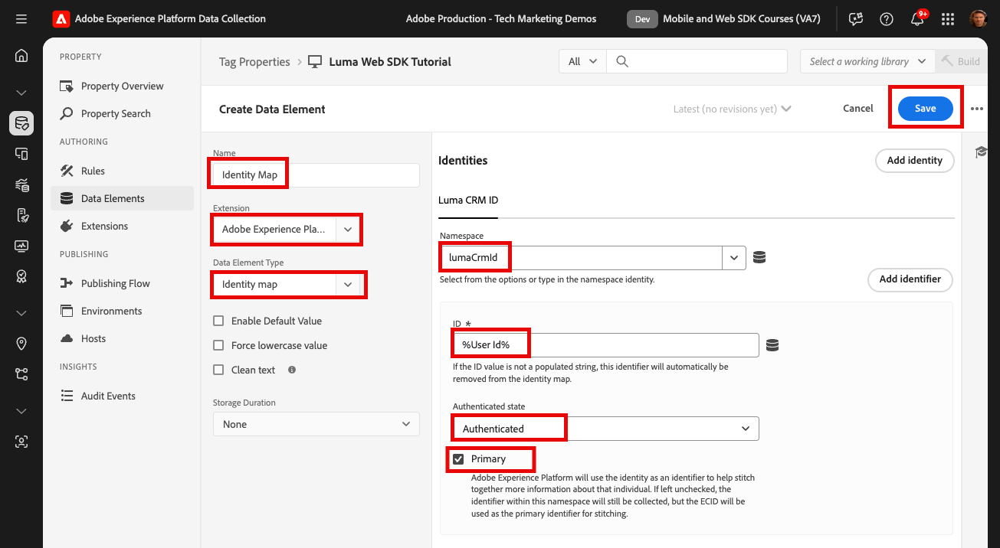

# Captura de identidades

Obtenga información sobre cómo capturar identidades con el SDK web de Adobe Experience Platform. Capture datos de identidad no autenticados y autenticados en el [sitio web de demostración de Luma](https://luma.enablementadobe.com). Aprenda a utilizar los elementos de datos creados anteriormente para recopilar datos autenticados con un tipo de elemento de datos de Platform Web SDK denominado mapa de identidad.

Esta lección se centra en el elemento de datos del mapa de identidad disponible con la extensión de etiquetas Adobe Experience Platform Web SDK. Los elementos de datos que contienen un ID de usuario autenticado y un estado de autenticación se asignan al XDM.

## Objetivos de aprendizaje

Al final de esta lección, puede hacer lo siguiente:

* Comprenda la relación entre Experience Cloud ID (ECID) y el ID de dispositivo de origen (FPID)
* Comprender la diferencia entre ID no autenticados y autenticados
* Creación de un elemento de datos de mapa de identidad

## Requisitos previos

Ya conoce la capa de datos, se ha familiarizado con la capa de datos del sitio web de demostración de [Luma](https://luma.enablementadobe.com){target="_blank"} y sabe cómo hacer referencia a elementos de datos en las etiquetas. Debe haber completado las lecciones anteriores en el tutorial:

* [Configuración de un esquema XDM](configure-schemas.md)
* [Configuración de un área de nombres de identidad](configure-identities.md)
* [Configuración de una secuencia de datos](configure-datastream.md)
* [Extensión web SDK instalada en la propiedad tag](install-web-sdk.md)
* [Creación de elementos de datos](create-data-elements.md)

## Experience Cloud ID

El [Experience Cloud ID (ECID)](https://experienceleague.adobe.com/es/docs/experience-platform/identity/features/ecid) es un área de nombres de identidad compartida que se usa en las aplicaciones de Adobe Experience Platform y Adobe Experience Cloud. ECID proporciona la base para la identidad del cliente y es la identidad predeterminada para las propiedades digitales. ECID es el identificador ideal para rastrear el comportamiento de usuarios no autenticados, ya que siempre está presente.

<!-- 
FYI I commented this out because it was breaking the build - Jack
>[!TIP]
>
> When you use the Experience Platform Web SDK to set up Adobe applications on your digital properties, the ECID is generated at the Adobe Edge server level. As such, ECID is not viewable on the client-side network request payload. You can view the ECID by seeing the Preview tab of the network request, or by using the [Adobe Experience Platform Debugger Edge Trace](set-up-analytics.md#experience-cloud-id-validation).
>
-->

Obtenga más información sobre cómo se realiza el seguimiento de [ECID mediante Platform Web SDK](https://experienceleague.adobe.com/es/docs/experience-platform/edge/identity/overview).

Los ECID se configuran con una combinación de cookies de origen y Platform Edge Network. De forma predeterminada, Web SDK establece las cookies de identidad de origen en el lado del cliente. Para tener en cuenta las restricciones del explorador sobre la duración de las cookies, puede optar por establecer sus propias cookies de identidad de origen del lado del servidor en su lugar. Estas cookies de identidad se denominan ID de dispositivos de origen (FPID).

>[!IMPORTANT]
>
>La [extensión del servicio Experience Cloud ID](https://exchange.adobe.com/apps/ec/100160/adobe-experience-cloud-id-launch-extension) no es necesaria al implementar Adobe Experience Platform Web SDK, ya que la funcionalidad del servicio de ID está integrada en Platform Web SDK.

## ID de dispositivo de origen (FPID)

Los FPID son cookies de origen _configuradas por el usuario con sus propios servidores web_ que Adobe utiliza para crear el ECID, en lugar de utilizar la cookie de origen establecida por Web SDK. Aunque la compatibilidad con el explorador puede variar, las cookies de origen tienden a ser más duraderas cuando las establece un servidor que aprovecha un registro A de DNS (para IPv4) o un registro AAAA (para IPv6), en lugar de cuando las establece un CNAME o un código JavaScript de DNS.

Una vez establecida una cookie FPID, su valor se puede recuperar y enviar a Adobe a medida que se recopilan datos de evento. Los FPID recopilados se utilizan como semillas para generar ECID en Platform Edge Network, que siguen siendo los identificadores predeterminados en las aplicaciones de Adobe Experience Cloud.

Aunque los FPID no se utilizan en este tutorial, se le recomienda utilizar FPID en su propia implementación de Web SDK. Obtenga más información sobre [ID de dispositivos de origen en Platform Web SDK](https://experienceleague.adobe.com/es/docs/experience-platform/edge/identity/first-party-device-ids)

>[!CAUTION]
>
> FPID es una forma alternativa de generar el ECID mediante una cookie configurada por los servidores web. No se utiliza para identificar usuarios autenticados.

## ID autenticado

Como se ha indicado anteriormente, Adobe asigna un ECID a todos los visitantes de las propiedades digitales al utilizar Platform Web SDK. ECID es la identidad predeterminada para rastrear comportamientos digitales no autenticados.

También puede enviar un ID de usuario autenticado para que Platform pueda crear [gráficos de identidad](https://experienceleague.adobe.com/es/docs/platform-learn/tutorials/identities/understanding-identity-and-identity-graphs) y Target pueda establecer su [ID de terceros](https://experienceleague.adobe.com/es/docs/target/using/audiences/visitor-profiles/3rd-party-id). La configuración del identificador autenticado se realiza mediante el tipo de elemento de datos [!UICONTROL Mapa de identidad].

Para crear el elemento de datos [!UICONTROL Identity Map]:

1. Vaya a **[!UICONTROL Elementos de datos]** y seleccione **[!UICONTROL Agregar elemento de datos]**

1. **[!UICONTROL Nombre]** el elemento de datos `Identity Map`

1. Como la **[!UICONTROL extensión]**, seleccione `Adobe Experience Platform Web SDK`

1. Como **[!UICONTROL Tipo de elemento de datos]**, seleccione `Identity map`

1. Como **[!UICONTROL Área de nombres]**, seleccione el área de nombres `lumaCrmId` creado en la lección [Configurar identidades](configure-identities.md). Si no aparece en la lista desplegable, escríbalo en.

1. Como **[!UICONTROL ID]**, seleccione el elemento de datos `User Id` creado en la lección [Crear elementos de datos](create-data-elements.md#create-data-elements-to-capture-the-data-layer).

1. Como **[!UICONTROL estado autenticado]**, seleccione **[!UICONTROL Autenticado]**
1. Seleccionar **[!UICONTROL principal]**

1. Seleccionar **[!UICONTROL Guardar]**

   

>[!IMPORTANT]
>
> Adobe recomienda enviar identidades que representen a una persona, como `Luma CRM Id`, como la identidad [!UICONTROL principal].
>
> Si el mapa de identidad contiene el identificador de persona (por ejemplo, `Luma CRM Id`), entonces el identificador de persona se convierte en la identidad [!UICONTROL principal]. De lo contrario, `ECID` se convierte en la identidad [!UICONTROL principal].
>
> Además, para los clientes de aplicaciones de Platform, Adobe recomienda implementar [reglas de vinculación de gráficos de identidad](https://experienceleague.adobe.com/es/docs/platform-learn/tutorials/identities/graph-linking-rules/overview) para evitar el colapso del gráfico.

>[!NOTE]
>
> No es necesario realizar ninguna acción para capturar el ECID en una implementación de Web SDK. Se captura automáticamente.

Al final de estos pasos, debe tener los siguientes elementos de datos creados:

| Elementos de datos de la extensión principal | Elementos de datos de la extensión Platform Web SDK |
|-----------------------------|-------------------------------|
| `Ecommerce Cart Products` | `Data Variable` |
| `Ecommerce Product Category` | `Identity Map` |
| `Ecommerce Product Id` | `XDM Variable` |
| `Ecommerce Product Name` | |
| `Ecommerce Purchase Id` | |
| `Ecommerce Purchase Products` |  |
| `Page Name` | |
| `User Id` | |
| `User Logged In` | |

Con estos elementos de datos en su lugar, está listo para empezar a enviar datos a Platform Edge Network creando una regla en las etiquetas.

>[!NOTE]
>
>Gracias por dedicar su tiempo a conocer Adobe Experience Platform Web SDK. Si tiene preguntas, desea compartir comentarios generales o tiene sugerencias sobre contenido futuro, compártalas en esta [publicación de debate de la comunidad de Experience League](https://experienceleaguecommunities.adobe.com/adobe-experience-platform-18/tutorial-discussion-implement-adobe-experience-cloud-with-web-sdk-tutorial-248848?profile.language=es)
