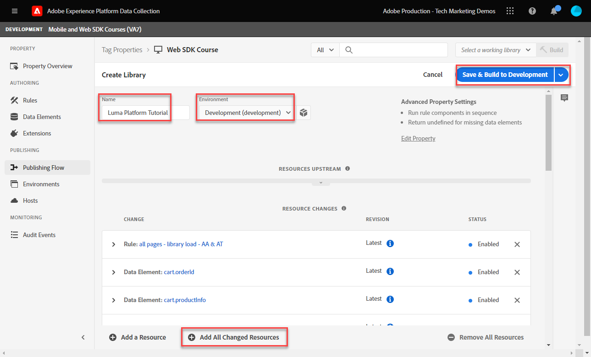

# Creación de una regla de etiqueta

>[!CAUTION]
>
>Esperamos publicar cambios importantes en este tutorial el martes 23 de abril de 2024. Después de ese punto, muchos ejercicios cambiarán y es posible que tenga que reiniciar el tutorial desde el principio para completar todas las lecciones.

Obtenga información sobre cómo enviar un evento al Edge Network de Platform con el objeto XDM mediante una regla de etiquetas. Una regla de etiqueta es una combinación de eventos, condiciones y acciones que indica a la propiedad de etiqueta que haga algo.

>[!NOTE]
>
> Para fines de demostración, los ejercicios de esta lección se basan en el ejemplo utilizado durante la [Creación de elementos de datos](create-data-elements.md) paso; envío de una acción de evento de XDM para capturar contenido e identidades de usuarios en [Sitio de demostración de Luma](https://luma.enablementadobe.com/content/luma/us/en.html).

## Objetivos de aprendizaje

Al final de esta lección, debe poder:

* Utilice una convención de nombres para administrar reglas dentro de las etiquetas
* Creación de una regla de etiqueta para enviar un evento XDM
* Publicación de una regla de etiqueta en una biblioteca de desarrollo

## Requisitos previos

Está familiarizado con las etiquetas de recopilación de datos y las [Sitio de demostración de Luma](https://luma.enablementadobe.com/content/luma/us/en.html)y debe haber completado las siguientes lecciones anteriores en el tutorial:

* [Configure los permisos](configure-permissions.md)
* [Configuración de un esquema XDM](configure-schemas.md)
* [Configuración de un área de nombres de identidad](configure-identities.md)
* [Configuración de una secuencia de datos](configure-datastream.md)
* [Extensión del SDK web instalada en la propiedad de etiqueta](install-web-sdk.md)
* [Creación de elementos de datos](create-data-elements.md)

## Convenciones de nomenclatura

Para administrar mejor las reglas en las etiquetas, se recomienda seguir una convención de nombres estándar. Este tutorial utiliza una convención de nombres de tres partes:

* [ubicación] - [evento] - [herramienta]

donde;

1. ubicación es la página o páginas del sitio donde se activa la regla
1. event es el déclencheur que activa la señalización de
1. herramienta es la aplicación o aplicaciones específicas utilizadas en el paso de acción para esa regla

## Crear regla de etiqueta

En las etiquetas, las reglas se utilizan para ejecutar acciones (llamadas de activación) bajo varias condiciones. Utilizará esta primera regla para enviar el objeto XDM al Edge Network mediante SDK web [!UICONTROL Enviar evento] acción. Más adelante en este tutorial, enviará diferentes versiones del objeto XDM en función del tipo de página en la que se encuentra el visitante. Por ese motivo, utilizará condiciones de regla para excluir esos otros tipos de páginas.

Para crear una regla de etiqueta:

1. Abra la propiedad de etiqueta que está utilizando para este tutorial.
1. Ir a **[!UICONTROL Reglas]** en el panel de navegación izquierdo
1. Seleccione el **[!UICONTROL Crear nueva regla]** botón
   
1. Asigne un nombre a la regla `all pages - library load - AA & AT`.

   >[!NOTE]
   >
   > Adobe Analytics y Target utilizarán esta regla de una manera específica en una lección futura, por este motivo `AA & AT` se utiliza al final del nombre.

1. En el **[!UICONTROL Eventos]** , seleccione **[!UICONTROL Añadir]**
   
1. Utilice el **[!UICONTROL Extensión principal]** y seleccione `Library Loaded (Page Top)` como el **[!UICONTROL Tipo de evento]**.

   Esta configuración significa que la regla se activa cada vez que la biblioteca de etiquetas se carga en una página.
1. Seleccionar **[!UICONTROL Conservar cambios]** para volver a la pantalla de regla principal
   
1. En el **[!UICONTROL Condiciones]** , seleccione la **[!UICONTROL Añadir]** botón
   
1. Seleccionar **[!UICONTROL Tipo de lógica]** `Exception`, **[!UICONTROL Extensión]** `Core`, y **[!UICONTROL Tipo de condición]** `Path Without Query String`
1. Introduzca la ruta de la URL `/content/luma/us/en/user/cart.html` en el **[!UICONTROL ruta igual a]** , y **[!UICONTROL name]** it `Core - cart page`
1. Seleccionar **[!UICONTROL Conservar cambios]**
   
1. Añada tres excepciones más para las siguientes rutas URL

   * **`Core - checkout page`** for `/content/luma/us/en/user/checkout.html`
   * **`Core - thank you page`** for `/content/luma/us/en/user/checkout/order/thank-you.html`
   * **`Core - product page`** para `/products/` con el interruptor Regex encendido

   

1. En el **[!UICONTROL Acciones]** , seleccione **[!UICONTROL Añadir]**
1. Seleccionar **[!UICONTROL SDK web de Adobe Experience Platform]** como el **[!UICONTROL Extensión]**
1. Seleccionar **[!UICONTROL Enviar evento]** como el **[!UICONTROL Tipo de acción]**
1. Seleccionar **[!UICONTROL web.webpagedetails.pageViews]** como el **[!UICONTROL Tipo]**.

   >[!WARNING]
   >
   > Este menú desplegable rellena el **`xdm.eventType`** en el objeto XDM. Aunque también puede escribir etiquetas de forma libre en este campo, es muy recomendable que **no** ya que tendrá efectos adversos con Platform.

1. Como el **[!UICONTROL Datos XDM]**, seleccione la `xdm.content` elemento de datos creado en la lección anterior
1. Seleccionar **[!UICONTROL Conservar cambios]** para volver a la pantalla de regla principal

   
1. Seleccionar **[!UICONTROL Guardar]** para guardar la regla

   

## Publicación de la regla en una biblioteca

A continuación, publique la regla en el entorno de desarrollo para que podamos verificar que funciona.

Para crear una biblioteca:

1. Ir a **[!UICONTROL Flujo de publicación]** en el panel de navegación izquierdo
1. Seleccionar **[!UICONTROL Añadir biblioteca]**

   
1. Para el **[!UICONTROL Nombre]**, introduzca `Luma Web SDK Tutorial`
1. Para el **[!UICONTROL Entorno]**, seleccione `Development`
1. Seleccionar  **[!UICONTROL Añadir todos los recursos modificados]**

   >[!NOTE]
   >
   >    Además de la extensión SDK para web de Adobe Experience Platform y la `all pages - library load - AA & AT` , verá los componentes de etiqueta creados en lecciones anteriores. La extensión Core contiene el JavaScript base requerido por todas las propiedades de etiquetas web.

1. Seleccionar **[!UICONTROL Guardar y generar para desarrollo]**

   

La biblioteca puede tardar unos minutos en crearse y, cuando se completa, muestra un punto verde a la izquierda del nombre de la biblioteca:

Como puede ver en el [!UICONTROL Flujo de publicación] En la pantalla de, hay mucho más en el proceso de publicación que está fuera del ámbito de este tutorial. Este tutorial solo utiliza una biblioteca en el entorno de desarrollo.

Ahora está listo para validar los datos en la solicitud utilizando el Adobe Experience Platform Debugger.

[Siguiente ](validate-with-debugger.md)

>[!NOTE]
>
>Gracias por dedicar su tiempo a conocer el SDK web de Adobe Experience Platform. Si tiene preguntas, desea compartir comentarios generales o tiene sugerencias sobre contenido futuro, compártalas en este [Entrada de discusión de la comunidad Experience League](https://experienceleaguecommunities.adobe.com/t5/adobe-experience-platform-launch/tutorial-discussion-implement-adobe-experience-cloud-with-web/td-p/444996)
